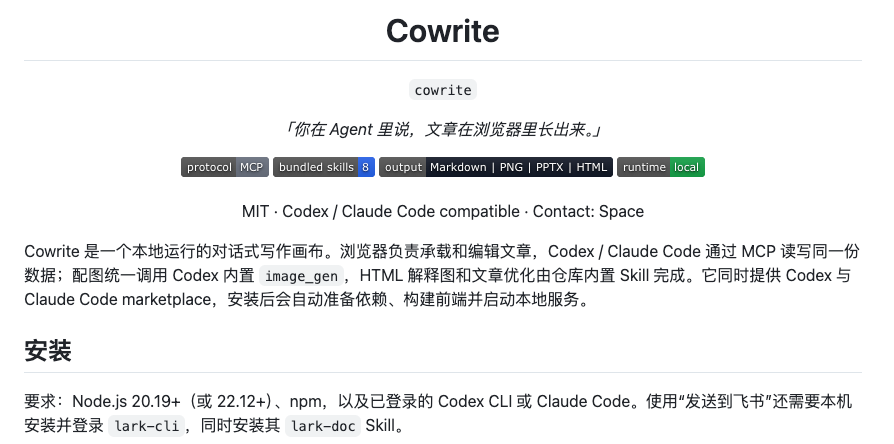
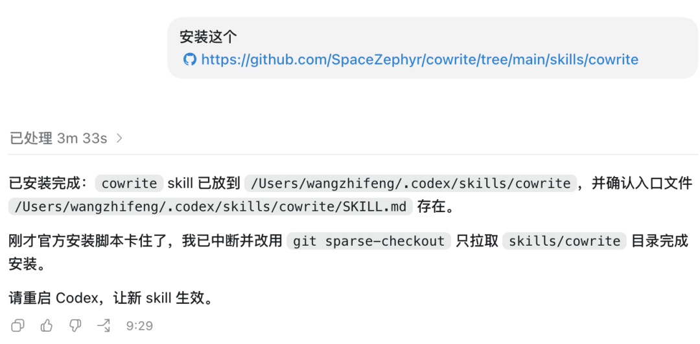
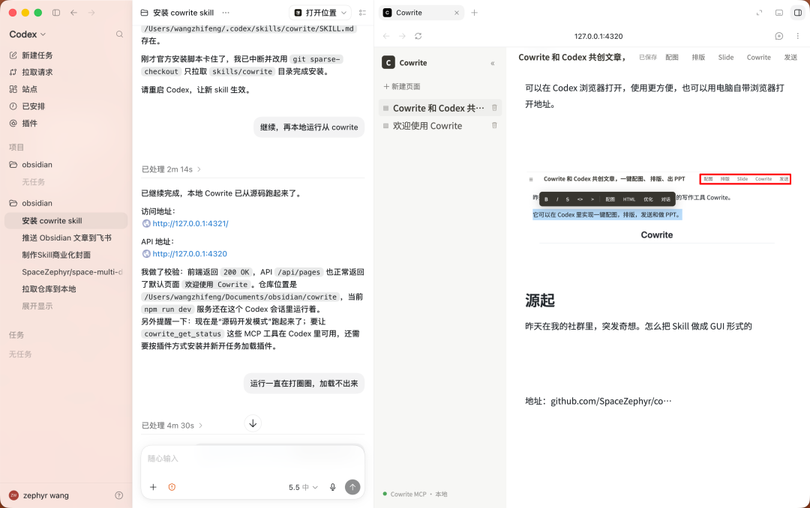
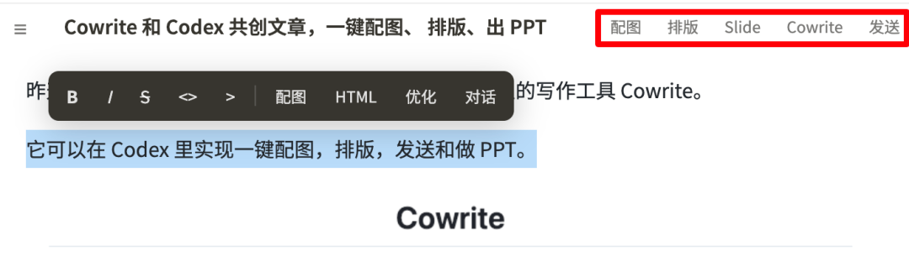
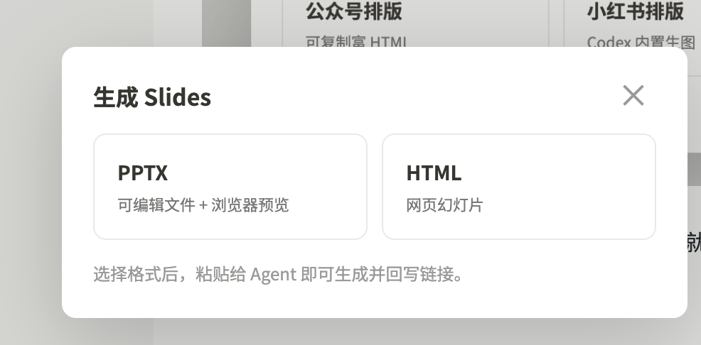
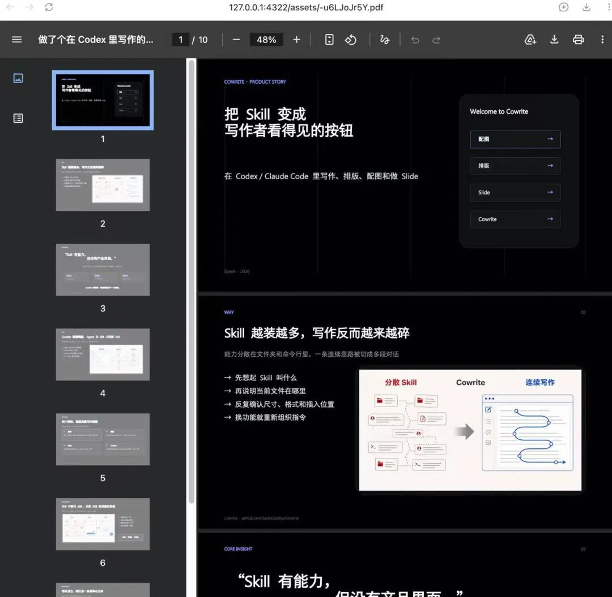
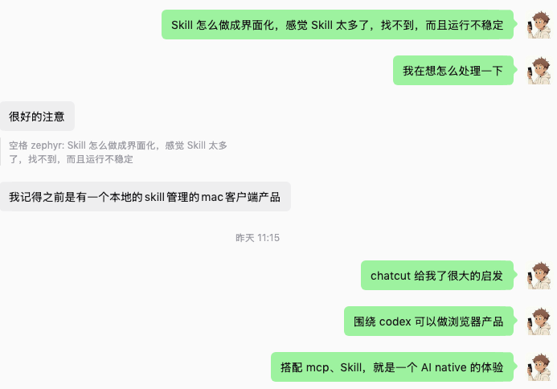

# Cowrite 上线，给 Codex 装上可视化创作工作台

昨天爆肝一晚，终于把我构思的这个内置的 Codex 里的写作工具 Cowrite。它可以在 Codex 里实现一键配图，排版，发送社媒和做 PPT。不需要折腾乱七八糟的 Skill 和文件夹。

选中文字后就能配图，直接插入原文，好用到爆。

## 使用步骤

### 安装

在 Codex 里安装项目（命令略），安装成功后直接运行 Cowrite，Codex 会返回两个地址。

复制访问地址，可以在 Codex 浏览器打开，也可以用电脑自带浏览器打开。此时 Codex 页面右侧加载了 Cowrite。

### 导入文章

可以新建页面自己输入想法，也可以把本地 markdown 导入进来。导入后和常用编辑器一样。

### 选中内容创作

导入成功后，可以选中内容进行优化、配图（调用 Codex 内置的 image2 配图）、转 HTML 配图。所有和 Agent 的行为都在 Codex 内发生，并把结果（文字、图片、代码）回写到文章中。

## 核心功能

### 全文配图

让 Codex 根据整篇文章内容来输出配图，并插入原文。

### 全文排版

输出公众号或小红书格式的排版，生成结果直接在 Cowrite 内预览并复制。

### 生成 Slide

含 PPTX、HTML 两种格式，可以应用文章中的图片作为 PPT 内容。

### 发送到飞书

文章完成后可以直接发到飞书、公众号（待完善）。调用了飞书 CLI，需要自己配置 Key。

## 源起

这个想法源于突发奇想——Skill 太多，文件夹太乱，怎么把 Skill 做成 GUI 的形式？

ChatCut 给了很大启发，结合 Codex 生态来实现。从自己最擅长的写作流程入手，封装了快 10 个 Skill，使用 MCP 拆了 10 多个编辑器的功能点，实现了文章的配图、排版、PPT 制作、和选中内容共同创作和优化。

把零散 Skill 变成一个可点击的创作工作台 Cowrite。

## 配图

