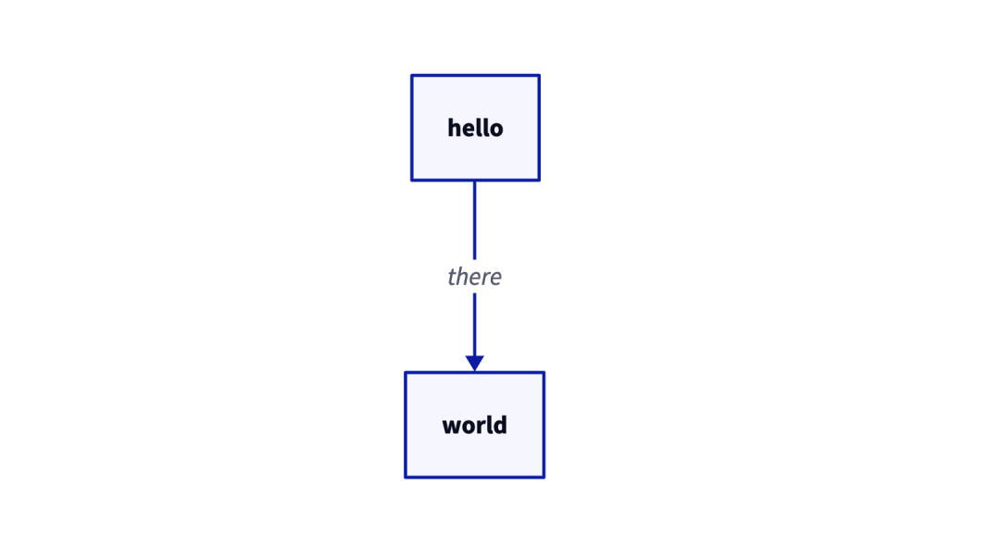
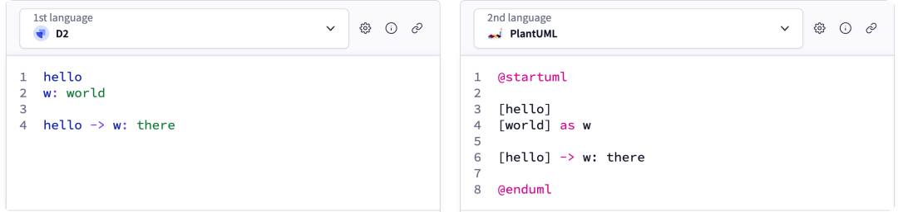
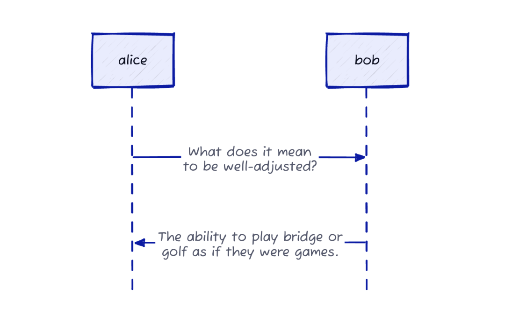
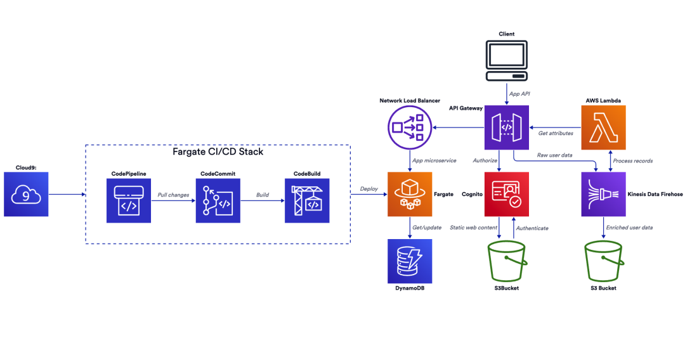
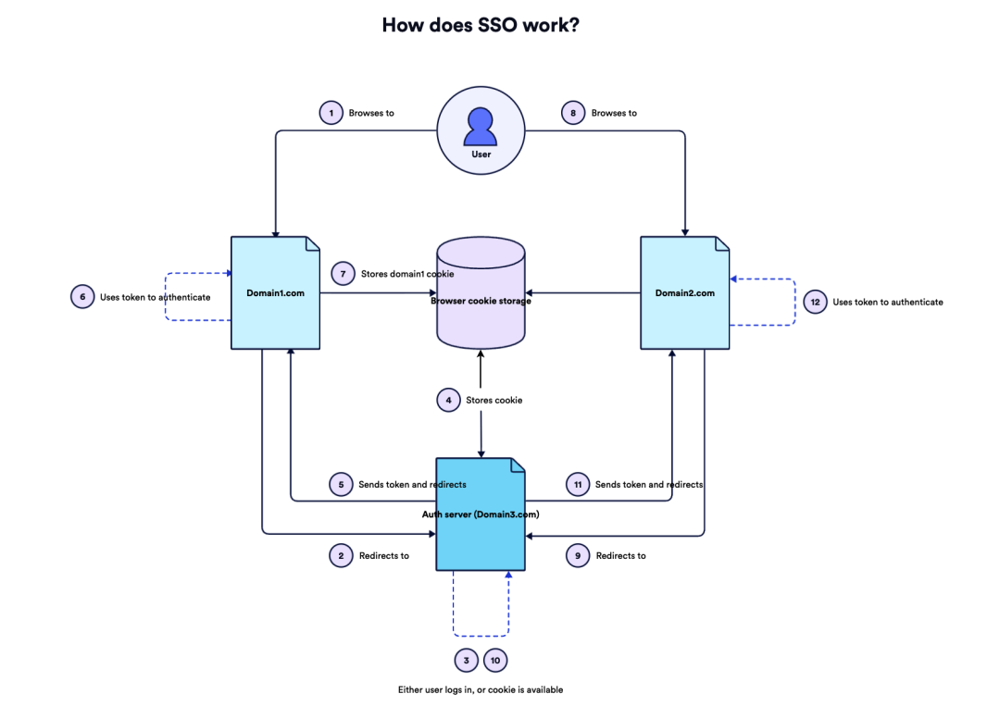

# 专为程序员打造的画图神器，斩获 24k Star

2018 年，工程师 Alexander Wang 在写文档画架构图时被市面工具折磨。他认为 Visio、draw.io 更像是给做 PPT 的人设计的，程序员应该用开发者的方式画架构图，而不是以设计师的方式去画。

他决定打造一个声明式图表工具，满足以下要求：
- 无需拖拖拽拽，直接用代码声明
- 良好的可读性

这就是 D2（terrastruct/d2）。

## D2 vs 其他方案

**vs Mermaid**：D2 明确不支持思维导图、饼图、柱状图、甘特图、桑基图，只支持流程图、时序图、ER 图等贴合开发者场景的图。

**vs PlantUML**：D2 语法更简洁，没有花括号，也不用写 XML，三行代码即可描述两个节点的关系。

## 核心特性

- **声明式语法**：类似代码，比拖拽式更符合程序员习惯
- **AI 友好**：语法简单，AI 生成 DSL 容易，AI 读取也省 token
- **19 种内置主题**：默认主题 + 草图风格选项
- **可自定义样式**：语法类似 CSS
- **多端支持**：在线渲染器 / CLI 生成 SVG / VSCode 插件

## 项目信息

- **GitHub**：terrastruct/d2，**24.7k Stars**
- **开源时间**：2022 年（GUI 工具成功后开源声明式图表部分）

## 配图

*D2 语法示例*

*复杂图表示例*

*草图风格时序图*

*自定义样式*

*流程图*
