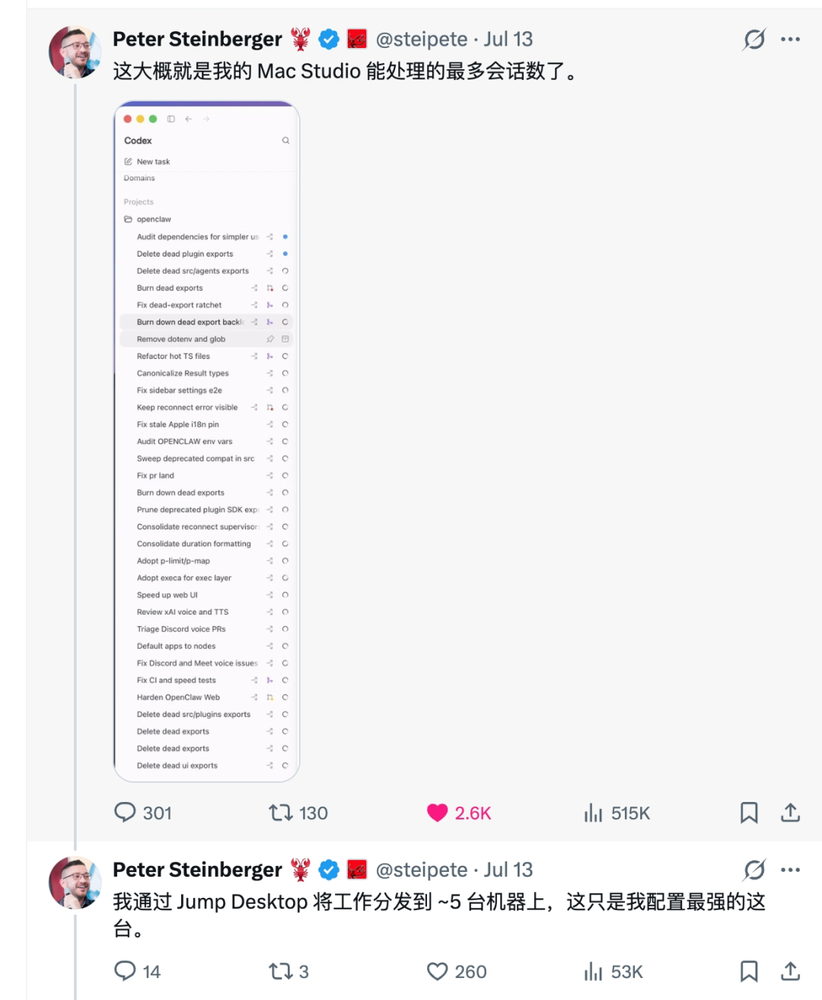
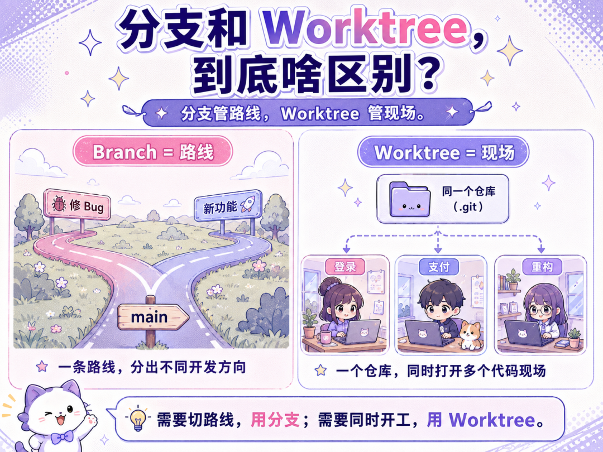
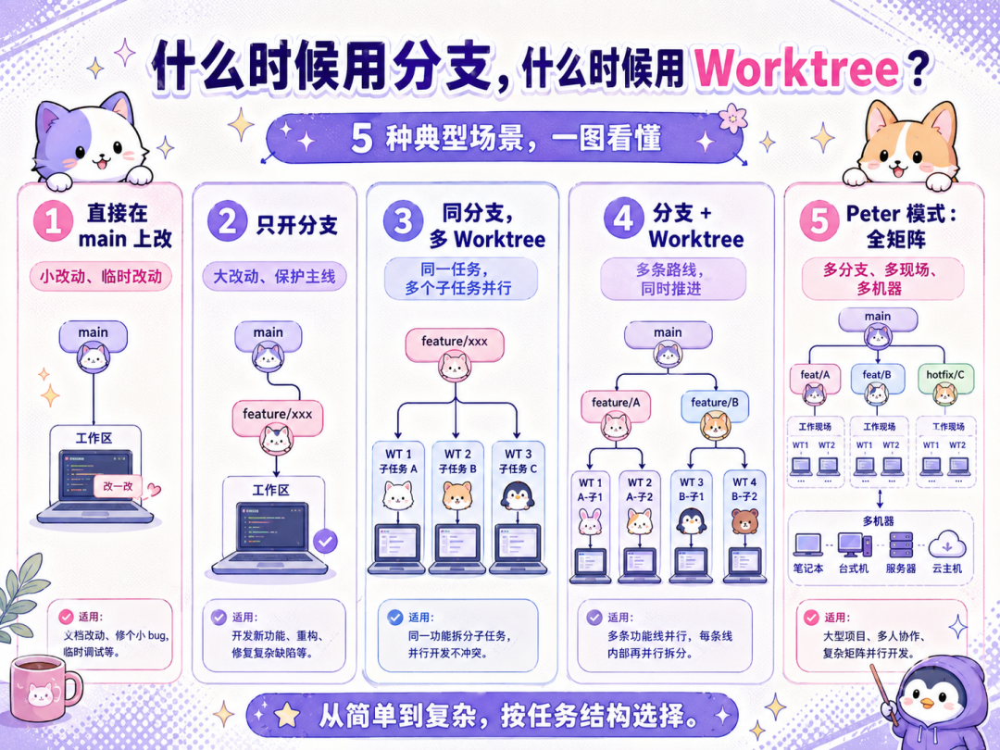

# 一个人如何管理几十个AI程序员？

## 核心问题

一个人如何管理几十个 AI 程序员并行工作而不打架？答案是：每个任务有自己独立的一份代码，靠 Git Worktree 实现。

## 分支 vs Worktree

- **分支**：管「路线」——代码往哪个方向走（修 Bug 用一条岔路，做新功能用另一条岔路）
- **Worktree**：管「现场」——同时打开几个代码现场（同一个项目在硬盘上铺开成好几个独立目录）

一句话总结：**分支是排班的，Worktree 是发工位的。**

## 五种情况

1. **直接 main 上改**：改 Landing Page 文案、调定价、修 typo、换 OG 图。五分钟的事，开分支都是浪费生命

2. **只开分支**：重构鉴权系统、数据库迁移、加订阅体系。改动大、周期长、可能推倒重来，必须开分支

3. **同一分支开多个 Worktree**：同一分支下要同时接五个 provider（Stripe、Lemon Squeezy、Paddle、Creem、PayPal）。一个 Worktree 接一个，五个 Agent 并行，做完一起合回

4. **分支 + Worktree 一起上**：多条路线同时进行（重做落地页/修 Bug/接 Claude Sonnet），各开分支各配 Worktree，三路并行互不干扰

5. **全矩阵拉满（Peter 模式）**：多条分支，每条再开多个 Worktree，分布到多台机器。十几二十个现场同时开工

## 独立开发者三条建议

1. **练拆任务**：从「这个需求我怎么实现」变成「怎么拆成五个互不干扰的任务同时派给五个 Agent」。拆得好一晚上顶一周，拆不好一晚上收拾残局

2. **基础设施先于功能**：AI 并行开发的红利依赖稳定地基（测试、CI、代码规范）。Peter 截图里大半任务是删死代码、修测试、修 CI、加固依赖——顶级开发者派给 AI 的大头是维护地基

3. **当产品经理，别当码农**：产出不再取决于打字速度，而取决于能同时管理多少并行 AI 任务。产品感觉和决策质量才是核心竞争力

## 配图

*Peter Steinberger 的 Codex 界面：三十多个任务同时在跑*

*分支管「路线」，Worktree 管「现场」*

*全矩阵模式：多条分支 × 多个 Worktree*

*任务拆解能力是第一道分水岭*

*基础设施越稳，敢同时派的 Agent 越多*

*以前一个程序员一个工位（碳基工位），现在带着几十个 AI，每个都得配一个工位（硅基工位）*
