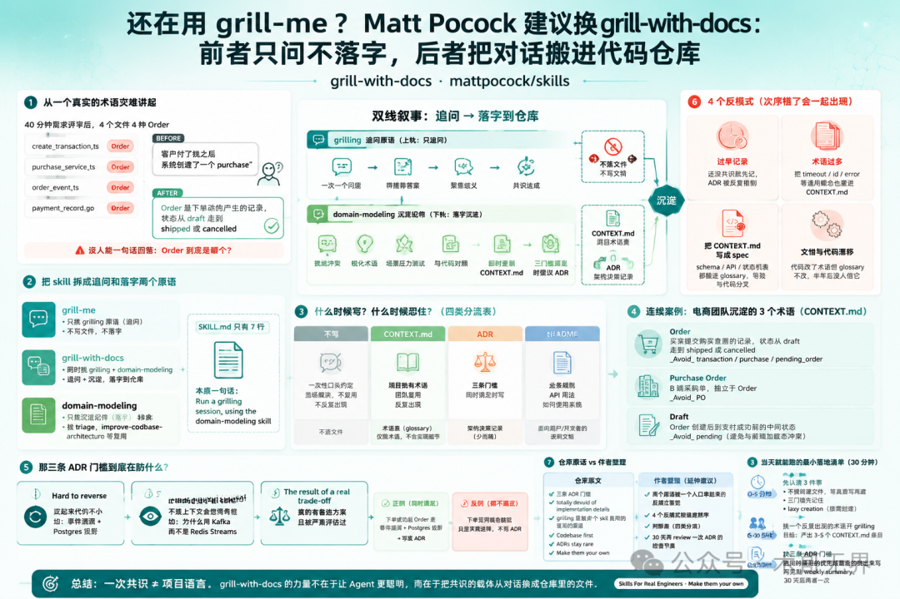
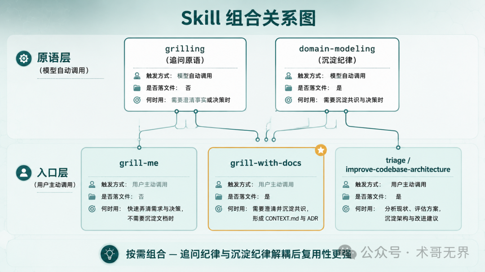
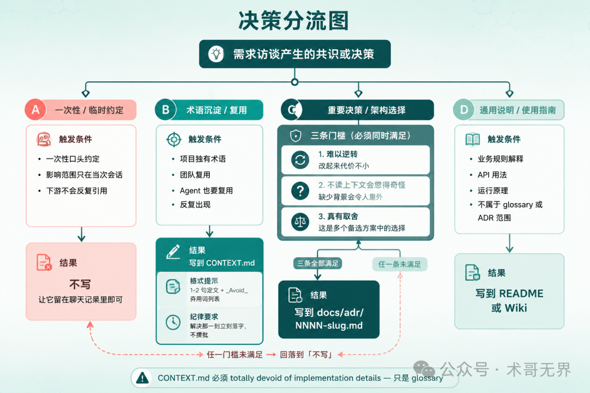
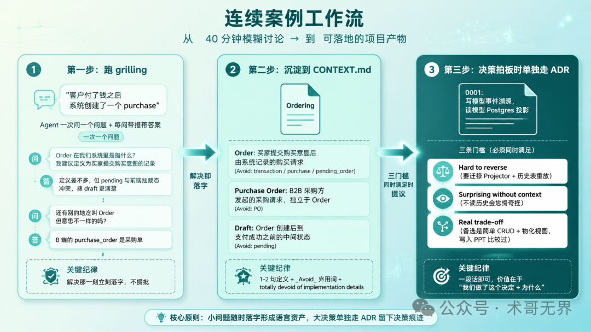
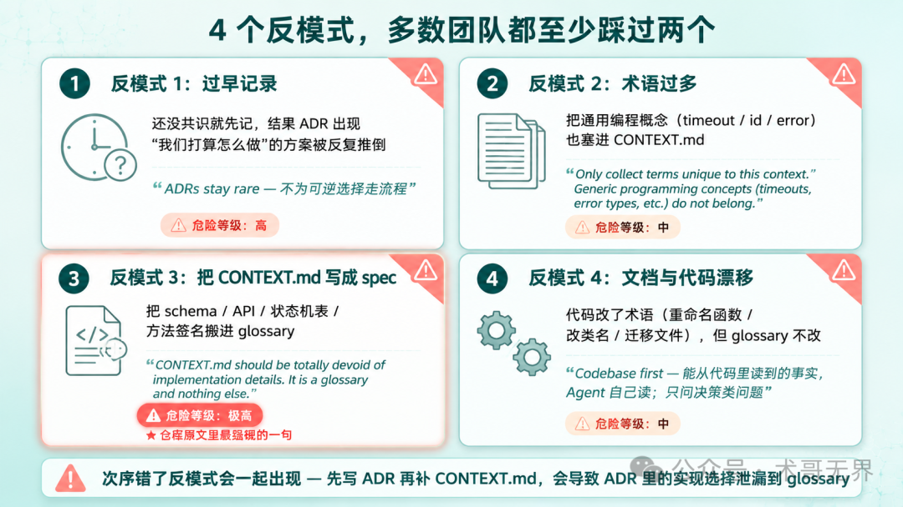

# 还在用 grill-me？Matt Pocock 建议换 grill-with-docs

## 核心问题

团队需求评审聊清楚了，但第二天新 Agent 进仓库，看见四个名字都说得通的文件，没人能回答"Order 到底是哪一个"。

## 两个原语

**grill-with-docs** 的设计核心只有两个原语：

1. **grilling**（追问）：纯访谈，一次一个问题，每问必带推荐答案，不写任何文件
2. **domain-modeling**（落字）：术语立刻写 CONTEXT.md，决策触发 ADR

## 三个 Skill 的职责边界

| Skill | 触发方式 | 是否落文件 | 何时用 |
|-------|----------|------------|--------|
| grilling | 模型自动调（被其他skill复用） | 否 | 需要一次次追问澄清的场景 |
| grill-me | 用户主动调 | 否 | 没代码库的纯讨论/写文前置 |
| grill-with-docs | 用户主动调 | 是（CONTEXT.md/ADR） | 有代码库的真实工程 |
| domain-modeling | 模型自动调（被其他skill驱动） | 是 | 维护 glossary + 提议 ADR |

## CONTEXT.md vs ADR

**CONTEXT.md**：术语表（glossary），只记项目独有的术语，不含实现细节

**ADR**（Architecture Decision Record）：满足三条门槛才写
1. **Hard to reverse**——改起来代价不小
2. **Surprising without context**——不读上下文会觉得奇怪
3. **The result of a real trade-off**——真有备选方案且被严肃评估过

## 四类共识产物分流

| 类型 | 落在哪 | 触发条件 |
|------|--------|----------|
| 一次性口头约定 | 不写 | 下游不会反复引用 |
| 团队需要复用的术语 | CONTEXT.md | 项目独有 + 不是通用编程概念 + 一次解决就落字 |
| 影响未来代码走向的决策 | ADR | 三条门槛同时满足 |
| 业务规则解释/运行原理 | README/Wiki | 不属于 glossary/ADR 范围 |

## 4 个反模式

1. **过早记录**：还没共识就先记 ADR，方案被反复推倒
2. **术语过多**：把通用编程概念（timeout、error）也塞进 CONTEXT.md
3. **把 CONTEXT.md 写成 spec**：放 schema、API、状态机表进去——它是 glossary only
4. **文档与代码漂移**：代码改了术语但 glossary 没改，grill-with-docs 会读出不一致

## 最小落地清单（30分钟）

1. **0-5分钟**：确认是否有 CONTEXT.md、团队最近对齐了哪些词、有无满足 ADR 三条门槛的决定
2. **5-20分钟**：挑一个反复出现的术语，开 grilling，产出 3-5 个 CONTEXT.md 条目
3. **20-30分钟**：把候选决定过 ADR 三条门槛，照格式写出来

**30天后review**：ADR 是被 supersede 还是被代码遗忘但仍有效

## 核心观点

一次共识 ≠ 项目语言。grill-with-docs 的力量在于把共识的载体从对话换成仓库里的文件——下一个 Agent 进仓库就能直接吸收。

## 配图

*grill-with-docs 文章信息图*

*两个原语 + 三个入口的组合关系*

*四类共识产物分流判断*

*电商术语混乱案例的完整沉淀流程*

*4个最常见的文档化反模式*
