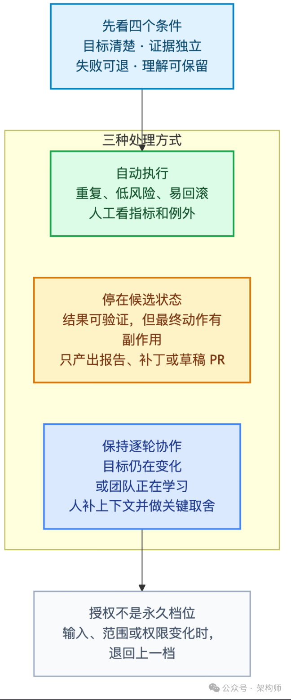
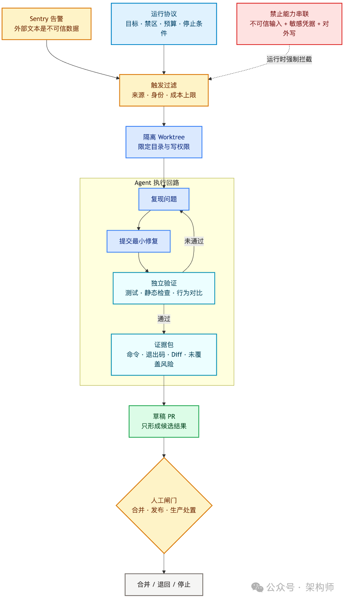
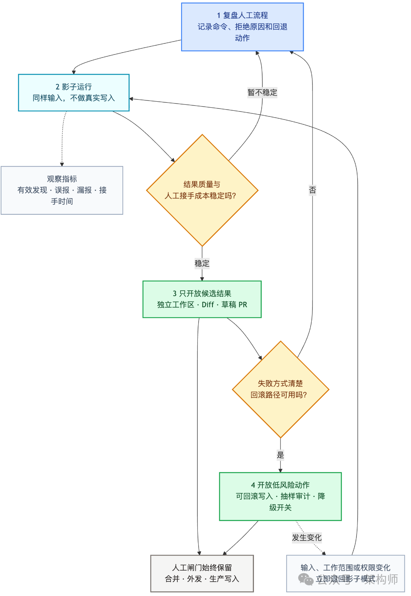

# Loop Engineering，应该赞成还是反对？

架构师（JiaGouX）——我们都是架构师！

凌晨两点，一条 Sentry 告警触发了 Routine。Agent 读取错误日志和最近提交，在隔离分支里复现问题，修改代码，运行测试，最后开出一张草稿 PR。早上工程师接手时，告警原文、复现步骤、Diff、测试结果和回退方式都在。

如果它处理的是一处低风险回归，这条 Loop 很有价值。可一旦改动碰到数据库结构、认证策略或生产配置，问题就变了。

**核心立场：有条件地赞成**。低风险、可验证、容易回滚的工作，可以尽量交给 Loop；目标、证据、权限和规则晋升，不能由同一个闭环自行决定。

## 赞成者看效率，反对者看责任

支持 Loop Engineering 的工程师，看到的是工作方式的变化：过去人要不断补 Prompt、读结果、推动下一轮；现在可以把触发、状态、验证和重试写进系统，让 Agent 自己消化重复工作。

反对者担心的是：触发和验证都自动化以后，人会不会慢慢失去独立看法，最后只剩下一次形式上的批准？

Addy Osmani 把后一种状态称为 **Cognitive Surrender（认知投降）**：人没有形成自己的看法，AI 给出的答案直接成了他的答案。

Wharton 的三项预注册实验（1,372 名参与者、9,593 个试次）：在 AI 已经介入并给出错误建议的试次里，**73.2% 的参与者跟随了错误答案**，只有 19.7% 成功推翻 AI 并答对。AI 还提高了参与者的信心，包括他们答错的时候。

Anthropic 另一项随机对照实验（52 名初级软件工程师学 Python Trio 库）：AI 组测验平均得分 50%，手写组是 67%。把编码、排错逐步交出去的人测验成绩普遍偏低；先生成代码、再追问原理，或者只问概念后自行实现的人，理解得更好。

**结论**：保留一个人工确认按钮，并不足以保证独立思考仍然存在。

## 哪些任务适合进入 Loop

Anthropic 案例：Jarred Sumner 用 Claude Code 把 Bun 从 Zig 迁移到 Rust，不到两周生成约一百万行代码，合并前测试全部通过，上线后仍然发现了 19 个回归。

代码迁移适合 Loop 的工程条件：旧系统提供行为规格、文件可以拆开并行处理、编译器和测试负责判错、失败记录可以进入下一轮队列、Agent 中断后进度能从文件和任务状态中恢复。

Judge 验证机制：让同一套验证同时检查新旧系统，再拿故意破坏的实现确认它确实能判错。

**判断任务是否适合 Loop 的四个条件**：
1. **目标是否清楚**——系统要能从外部信号判断结果（编译错误是否消失、新旧输出是否一致）
2. **结果能否独立验证**——不能由 Agent 自己解释"效果更好"
3. **做错后能否低成本撤回**——代码提交可以撤销，但发出的消息、写入的生产数据、触发的部署和泄露的凭据未必能
4. **团队以后是否还要长期维护这部分知识**

## 控制面要写进运行协议

把检查、继续、触发和最终处置拆开，团队才有空间逐步放权。

Anthropic 最近对 Routines 和 Dynamic Workflows 的两处调整：外部系统传给 Routine 的文本被包在 `routine-fire-payload` 中并标记为不可信数据；定时任务、Webhook、PR 评论，以及没有标记为人类输入的 SDK 消息，都不能因为包含关键词就启动大规模 Agent 工作流。

**运行协议应包含**：
- **目标**：复现同一错误，提交最小修复
- **禁区**：不改数据库结构、认证策略、公共 API 和生产配置
- **通过条件**：修复前能稳定复现，修复后用例通过
- **停止条件**：连续两轮没有新增证据，失败范围没有缩小，或者预算达到上限
- **交接内容**：告警原文、根因假设、Diff、验证结果、未覆盖风险和回退方式

## 执行循环可以快，规则变更要慢

让执行 Agent 自己改规则，它就可以修改评估标准，再用新标准证明自己完成，闭环会越来越容易通过。

**规则修改最好按普通软件变更来管**：Agent 可以提交候选版本并说明解决了哪些失败样本；候选规则要跑固定回归集；涉及权限和预算的变化，再由人单独批准；新版本上线后保留旧版本，出现漂移时能快速退回。

执行 Loop 和改进 Loop 被分开管理。前者可以高频运行，后者经过证据、回归和版本管理再晋升。

## 上线时，先少放一点权

四步上线流程：
1. **复盘人工流程**：记录工程师先查什么、跑哪些命令、为什么拒绝某个修改
2. **跑影子模式**：Agent 读取同样输入并给出结果，但不产生真实写入
3. **只开放候选结果**：Agent 可以开草稿 PR，合并、发布、外发消息和生产写入继续由人批准
4. **再开放低风险动作**：等任务边界稳定后，再让它自动完成可回滚的操作

**关键指标**：不是 Agent 一晚上开了多少张 PR，而是人接手一份结果要花多久。同一类问题如果反复升级给人，就修规则、补测试或收窄工作域。

## 写在最后

> Build the loop. Stay the engineer.

"Stay the engineer"，不是守在屏幕前确认每一步。工程师要知道系统为什么继续，也要能在几分钟内看清它做了什么、哪些地方没有验证、出了问题怎样退回去。

如果一条 Loop 还做不到这些，让它停在草稿 PR，并不丢人。

## 配图

*图1：四个条件对应三种 Loop 处理方式*

*图2：Sentry Loop 的控制面与人工闸门*

*图3：从人工复盘到有限自动化的上线流程*
