# 用完全网最火的 PM Skills，我决定把 163 个 Skill 推倒重做

最近在 GitHub 上扒到一个项目，叫 pm-skills，作者是 phuryn ，目前已经有 18k+ star，可以说是产品经理领域最火的一套 Skill。装上用了几天，非常好用。

地址：github.com/phuryn/pm-skills

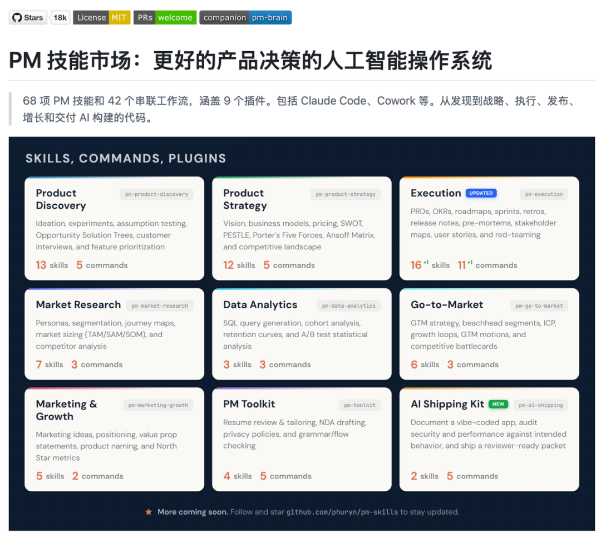

但真正让我兴奋的不是它能干什么，是它的制作 skill 的方法。

它跟我之前理解的 Skill 完全不一样。除了 SKILL.md，它里面还有command、plugin、hooks三个概念。

这些概念才让我认识了，什么是真正的 skill。

很多人可能见过 Claude Cowork 那个插件市场，琳琅满目的，被 anthropic 或者第三方平台封装好的。

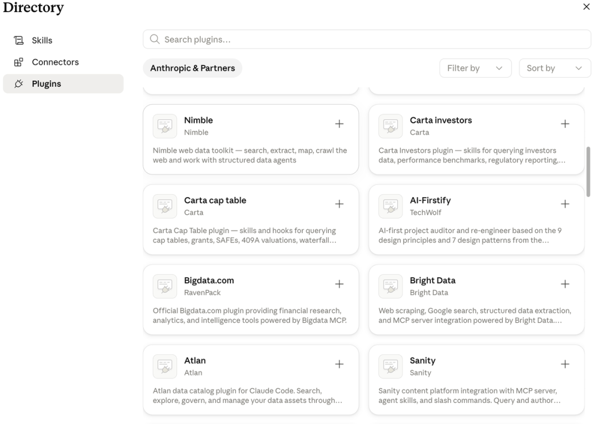

但搞不清楚Plugin 插件跟 Skill 到底什么关系。

也有不少朋友在讨论Skill 的上一层是什么，散落在各处的几十个 Skill 该怎么组织。

其实答案早就被 Anthropic 定义好了。

Skill 的上一层就是插件。插件包含了 skill、 command、hooks 这些概念，

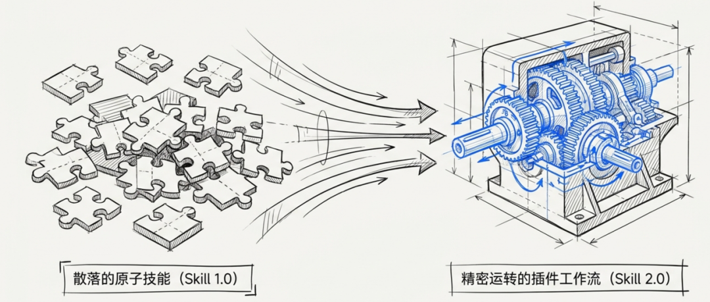

这篇文章借 pm-skills 这个项目，把插件、命令、Hooks、Skill 这四样东西一次性讲清楚。

01

插件的文件夹构成长什么样？

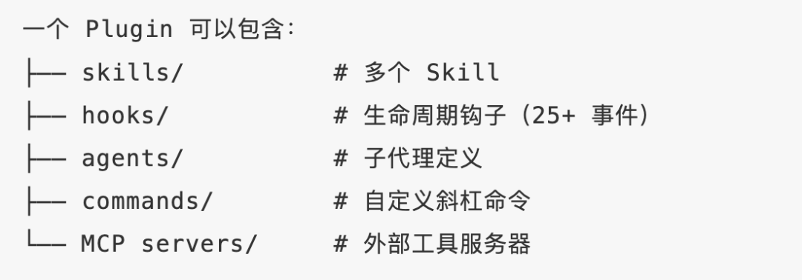

把 pm-skills 仓库拉下来打开，第一感受是它跟我们熟悉的 Skill 仓库不一样。

熟悉的 Skill 仓库通常是这样：根目录下一堆文件夹，每个文件夹一个 SKILL.md，配几个参考资料和脚本。一字排开，平铺。

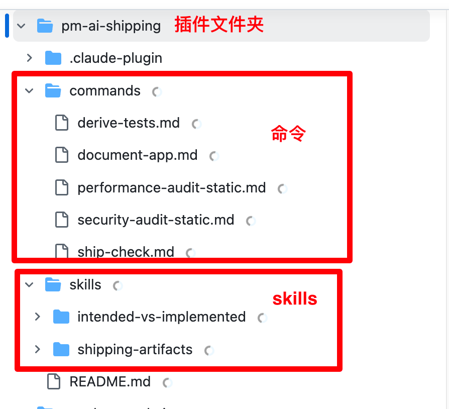

pm-skills 是分层的。根目录下是 9 个文件夹，对应 9 个插件，

pm-product-discovery 管产品发现

pm-product-strategy 管战略

pm-execution 管交付

pm-marketing-growth 管增长

诸如此类。每个插件文件夹内部又有一个固定结构：一个 plugin.json 描述这个插件叫什么、版本号、作者；一个 commands 文件夹，里面放命令剧本；一个 skills 文件夹，里面才是熟悉的原子 Skill。

也就是说，根目录是插件层，插件内部是命令和 Skill 两个并列的子系统，Skill 仍然保持原子单位的形态。

02

插件使用方式跟skill 不一样

以前用 Skill，是 AI 自己挑。我输入一句话，Claude 看哪个 Skill 的描述最匹配就加载哪个。这种用法的问题是 Skill 一多就乱，几十个 Skill 摆在那，AI 经常挑错，或者干脆挑不出来。我自己也老忘记某个 Skill 叫什么名字。

pm-skills 插件里多了一种用法：command。

command 用一条斜杠命令触发。在 Claude 里输入 /discover，它会自动跑一连串 Skill。

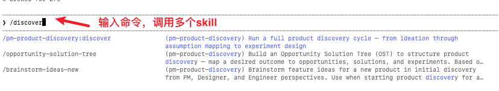

先 brainstorm-ideas 帮我发散想法，再 identify-assumptions 拆出每个想法背后的假设（价值、可用性、可行性、生命力四类），再 prioritize-assumptions 给假设排优先级，最后 brainstorm-experiments 设计验证实验。

四个 Skill 自动接力，前一个的输出是后一个的输入。

我只需要回答它的问题，整条产品发现的流程它自己跑完。

command 解决了两个老问题：Skill 太多不知道用哪个，多个 Skill 该按什么顺序串起来。

pm-skills 里常用的命令还有

/write-prd 写 PRD、/pre-mortem 上线前的事前尸检

/red-team-prd 让 AI 化身死对头疯狂挑你 PRD 的刺、

/ship-check 把 vibe coding 出来的烂仓库整理成可上线的包

/north-star 定北极星指标。

每一条命令背后都是 3-8 个 Skill 在协作。

03

插件还有一个常被忽略的能力：Hooks

讲到这忍不住补一个东西，叫 Hooks。它跟 Skill 是相反的。

Skill 是建议性的，AI 觉得相关才加载，不相关就跳过。

Hooks 是强制性的，挂在 Claude Code 的生命周期事件上，到点就触发，AI 想不想都没得选。

打开一个插件里的 hooks 文件夹，通常是这几样东西：一个 hooks.json 是入口，声明"在什么时机，跑哪个脚本"。

.sh 是被调起来跑的脚本，名字一看就知道干啥的，比如 session-start.sh、sdd-cache-pre.sh、simplify-ignore.sh。

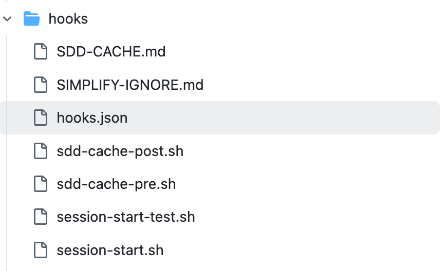

可能还有几个 .md 是给脚本看的参考资料或缓存。

举几个我打算给自己挂的 Hook。

写作场景：session 开启时跑一个脚本把写作风格.md 的内容 cat 出来塞进上下文，AI 写啥都自带我的调性。

索引同步：AI 每次写完文章自动跑一个脚本把元数据追加进 articles_index.jsonl，不用我手动维护。

Skill 是 AI 的工具箱，command 是工作流，Hooks 是兜底和强制约束。三者一起，才是完整的能力。

04

把skill、command、hooks 打包的容器：Plugin

讲完 command 和 Hooks，再回头看 plugin 这一层。

plugin 就是 command、skills、hooks 这几样东西的上级目录。

一个 plugin 文件夹里面有四样东西：plugin.json 是自我介绍（名字、版本、作者、依赖、属于什么领域）；commands 文件夹放所有命令剧本；skills 文件夹放原子 Skill；hooks 文件夹放生命周期钩子。

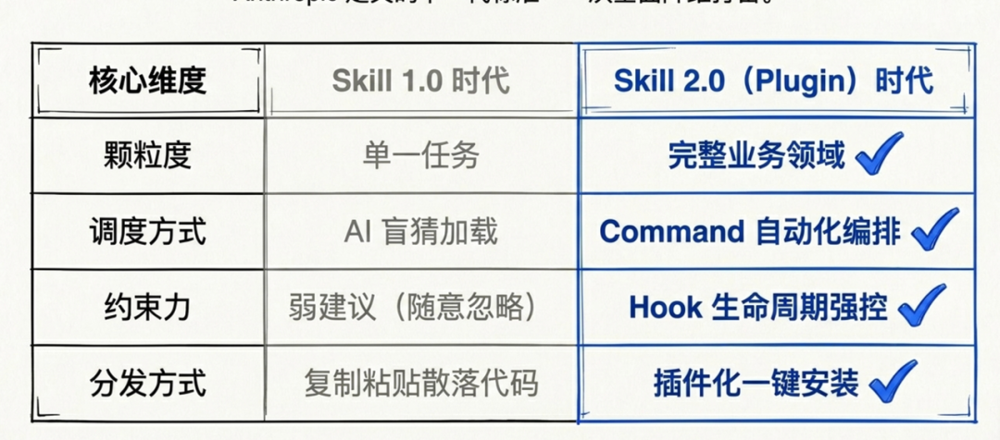

Claude Cowork 那个插件市场展示的就是这个，每一项都是一个 plugin。

你点一下安装，整套 command + skill + hook 就进了你的 Claude。

Anthropic 自己也建了官方仓库 anthropics/claude-plugins-official 统一管插件。第三方市场已经爆炸，tonsofskills 网站， 一个站索引了 425 个 plugin、2810 个 skill。

到这里整个体系就清楚了。Skill 是原子，command 是工作流，Hooks 是强制约束，plugin 是发行单位。Anthropic 在 2026 年正式把这套定义成了 Skill 2.0。我们这两年熟悉的"单 md 文件 Skill"是 1.0。

05

对我们做 Skill 的四个参考

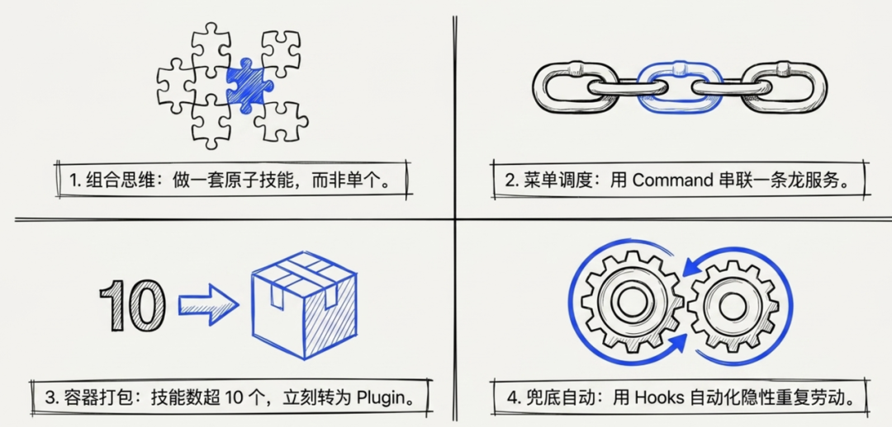

我手头有几十个 Skill 散在几个仓库里，看完 pm-skills 我准备做四件事。

1，不要只做一个 Skill，做一套。

把一个需求拆成 3-5 个原子 Skill，单独看无聊，凑成套就能被无数工作流复用。

2，不要一次只调一个 Skill，用 command 串起来。

Skill 是后厨，command 是菜单。我准备做几条高频命令：/new-article 一条龙写文章、/review-draft 过审稿、/weekly-retro 周复盘。

3，Skill 多于 10 个就改成插件。

按领域分组、补上 plugin.json，朋友一条命令就能装，不用复制 SKILL.md。

4，用 Hooks 自动化那些"每次都得做"的事。

给自己挂三个 hook：session 开启自动加载写作风格、写完文章自动追加 articlesindex.jsonl、session 关闭自动写 dailylog.jsonl。

身边做 AI 工作流的朋友，手里几十个 Skill 散落在各个项目里的，差不多都到了升级的时候。

07

顺手做了一个 Skill 帮你一键制作 plugin

写到这意识到，我自己手里 163 个 Skill 可以重新制作成插件。

它们散在 ~/.claude/skills/，每次调用我都忘记 skill 名字，把它们做成插件，我可以让 skill 之间做分类并且互相关联执行。

我根据上面对 plugin 的理解。 顺手做了一个 Skill，叫 skill-plugin-architect。

地址：github.com/zephyrwang6/allSkills/tree/main/skill-plugin-architect

它可以扫描你本地所有的 Skill，按领域聚类，自动推荐 Plugin 结构、Command 工作流、Hooks 自动化，全部确认后一键搬迁。

它的工作流分三段。

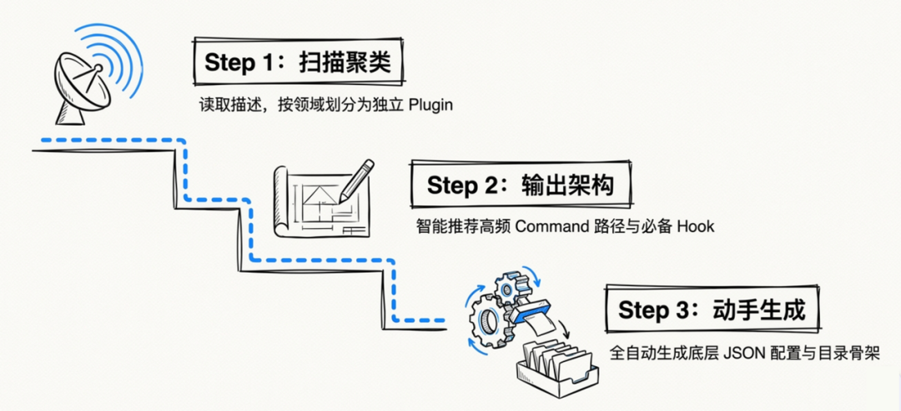

第一段先扫描。

安装好这个 Skill，你只要说：整理我的 skill，就可以

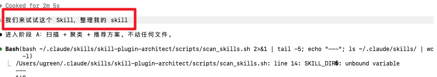

读 ~/.claude/skills/ 下所有 Skill 的 description，按规则聚类成 8-12 个 Plugin

第二段出方案。

给每个 Plugin 推荐 3-5 条高频 Command（比如写作类的 /new-article 把选题、起草、审稿、配图串起来），再根据 skill 来推荐 制作 Hook（比如 session-start 自动加载写作风格.md、session-end 自动追加 daily_log.jsonl）。

最后输出一张完整的目录树，标好每个 Plugin 装多少 Skill、几条 Command、几个 Hook。

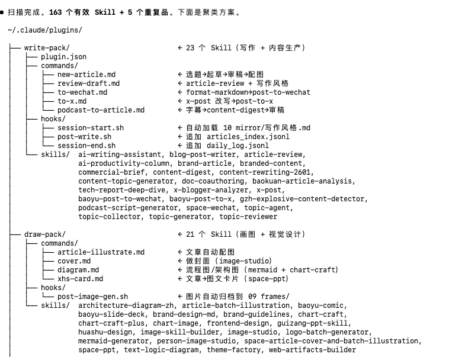

第三段动手

确认后，这个 skill 就开始动手制作 plugin.json、Command 骨架、Hook 骨架。

以后你就可以使用 command 来调用一系列的 skill 了。

最后

Skill 已经进化成了 plugin。

跟前端组件化、后端微服务化是一个套路。每一次架构升级都是把单一巨型工具拆成最小可复用单元，再用编排层串起来。只是这一次被编排的换成了 AI 的执行能力本身。

全球几百万个 plugin 沉淀下来，每一个都是"任务怎么拆、调什么工具、按什么顺序、出什么结果"的高质量结构化样本。

这些会成为下一代模型最精准的训练数据。

我们今天搭的每一个 plugin，都在为下一代模型写训练教材。

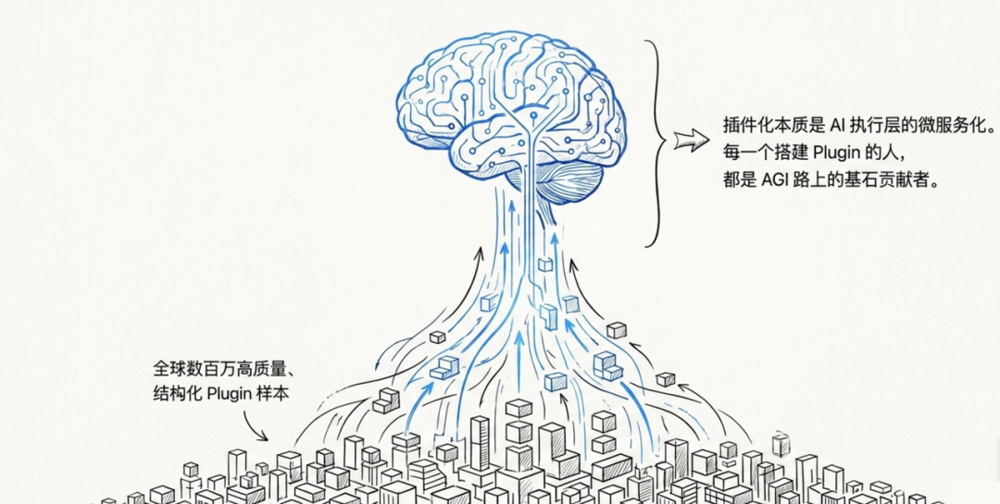

每一个在用 AI 的人都是 AGI 路上的贡献者。

感谢阅读。 如果觉得有用，欢迎点赞、分享、转发。我们下期见。

✍️：空格

📮：PM_Planets
