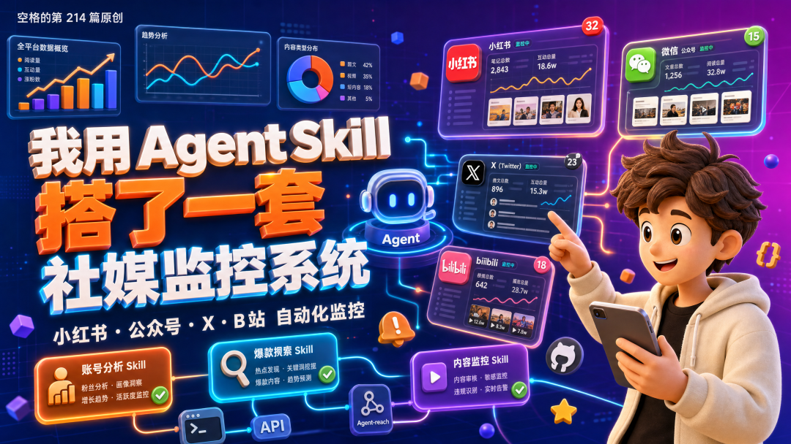
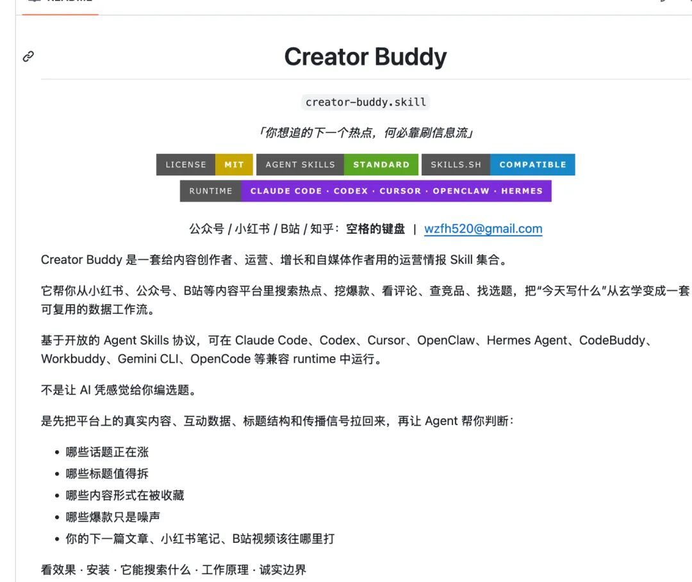
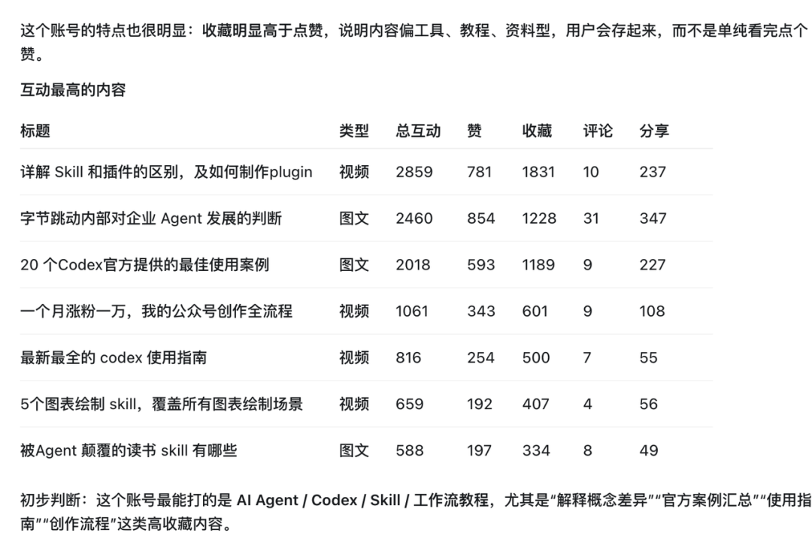
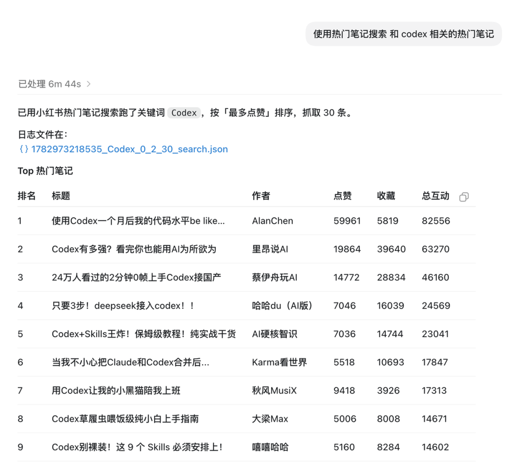
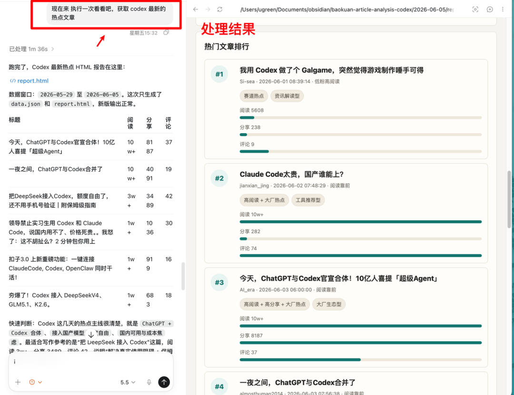

# 我用 Agent Skill 搭了一套社媒监控系统

昨天看到 X 官方出了 MCP，授权以后，Agent 就能帮你搜推文、查账号、拉时间线、看互动数据，甚至管理书签和起草文章。我自己也做了一套 skill 叫做 creator buddy，帮你运营全域平台，这篇文章就挑几个场景介绍一下。

说实话，我第一反应是挺震惊的。竟然真的有社交平台愿意把自己最重要的资产开放出来，让 Agent 直接访问。

你可以让 Agent 自动处理很多原来必须手动刷的信息。

比如我关注的博主最近更新了什么，我做内容对标的账号有哪些新爆款，他们有哪些值得学的选题、标题和表达方式，甚至我自己的主页最近哪些内容表现更好、哪些方向应该继续发。

相比 X，我想你和我一样，更想在小红书、公众号、抖音、B 站这些平台上用 Agent 访问数据。毕竟我们真正做内容、看对标、找选题，很多时候都发生在这些平台。

但这些平台目前还没开放 MCP，而且短期内也很难开放。也能理解，国内平台对数据开放一直比较谨慎，反爬也做得很重。内容、用户关系、推荐分发、广告转化，本来就是平台的核心资产。

但这也不是完全没办法。

我就在 GitHub、SkillHub 这些地方翻了一堆项目，包括 Agent-reach、红狐 API 相关的 Skill，还有一些小红书、公众号、社媒分析方向的工具。

研究下来我发现，它们大部分都是用搜索、数据接口、浏览器登录态或者第三方数据服务，把 Agent 和平台数据之间隔了一层。

比如 Agent-reach 的思路就很典型。它是是一个“互联网能力路由器”。你要搜网页，它会走 Exa；你要搜 GitHub，它会走 gh；你要查小红书、X、B 站、Reddit，它会根据当前可用后端，把请求分发给 OpenCLI、平台 CLI 或者对应 API。

基于这套思路，也做了几个自己的社媒分析 Skill。先直接看效果，看完再拆实现逻辑。

1、小红书账号分析 Skill

第一个是账号分析 Skill。可以用于小红书和抖音。

只需要把一个小红书主页链接丢进去，它会拉账号最近一批内容，然后按点赞、收藏、评论、发布时间做分析。最后输出一张表，告诉我这个账号最近哪些内容表现最好，哪些选题更容易被收藏，发布频率大概是什么样。

比如我可以把自己的主页丢进去，让它看最近 30 篇内容里，哪些主题收藏率最高，哪些标题点击感更强，哪些发布时间更容易有反馈。

也可以把我关注的博主、同领域账号丢进去，定期看他们最近在发什么，哪些内容跑出来了，哪些选题开始变热。

2、爆款笔记搜索 Skill

第二个是小红书爆款笔记搜索 Skill。

我输入一个关键词，比如Codex，它会去搜索相关笔记，按互动量排序，再帮我提炼标题规律、封面规律、开头钩子和用户关注点。

拿到这组数据以后，选题就不再是拍脑袋。它至少会给我几个明确方向：这个角度值得写，那个角度已经卷了，另一个角度没人讲透。

3、爆款公众号文章搜索 Skill

第三个是爆款公众号文章搜索 Skill。

逻辑类似，只不过换成公众号文章。它可以帮我看最近一段时间，哪些号在密集写某个话题，切入角度有什么不同。

我现在不知道创作什么，就看最近 30 天有没有相关爆款，哪些号在写，它们分别从什么角度切，哪些标题更像观点文，哪些更像教程文。

这样做的好处是，你不会一上来就闷头写。你会先知道这个话题在内容市场里已经长成什么样了。

4、有了基础 Skill，可以继续拓展

比如你搜到Codex这个关键词，可以让 Agent 固定做一个 Skill，每天去抓取 Codex 相关的爆款小红书和公众号文章，然后输出一份日报。

你也可以针对自己长期关注的领域关键词做监控，比如AI Agent、Claude Code、MCP、AI 工作流。每天不需要你手动刷，Agent 先帮你把相关内容捞上来，再做第一轮筛选。

再比如，你可以监控一些你特别想学习的博主。他们发了什么内容，标题怎么写，开头怎么进入，哪些选题连续跑出来，哪些风格更容易被收藏。时间长了，你甚至可以沉淀出一套“博主风格分析 Skill”。

也可以监控你自己的社媒主页。点赞、收藏、评论、内容主题、发布时间、标题表达、写作风格，都可以定期分析。它不一定能替你判断，但它能把你平时懒得整理的数据摆到你面前。

这几个 Skill 串起来之后，做内容会轻松很多。

我把上面这些 Skill 放到这个仓库了，有的还在更新，涉及到密钥。

地址 SpaceZephyr/creator-buddy

有些需要配置 API key 的可以自行探索查找。

建议大家拿过去可以修修改改，用最适合自己的 Skill。

5、最后

Skill 本身不是最难的，真正难的是获取数据源。

这些 Skill 需要有后端的服务不断调度账号权限和 IP 网络来模拟正常访问

平台并没有普遍开放给 Agent 的接口。

我很期待有平台开放数据能力。这样创作者就不用靠各种不稳定的方法去拿数据，平台也能用更可控的方式管理权限、频率和边界。

想想要是微信有一天开放了面向 Agent 的接口，那就不只是公众号文章分析这么简单。聊天记录、小程序、视频号、公众号、搜索、收藏、支付后的服务，都有可能变成 Agent 可以调用的上下文。

那时候，个人 Agent 才真的有机会理解你的生活和工作流。
