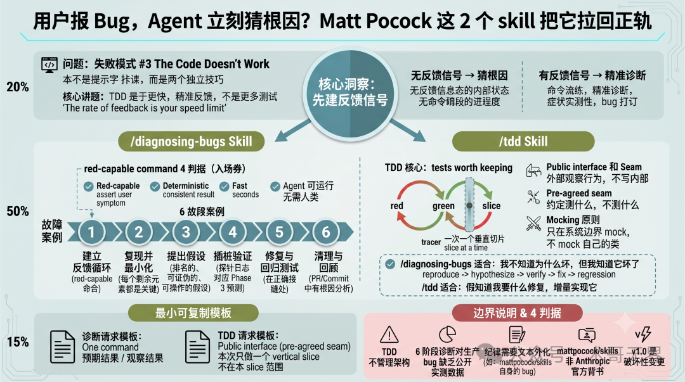
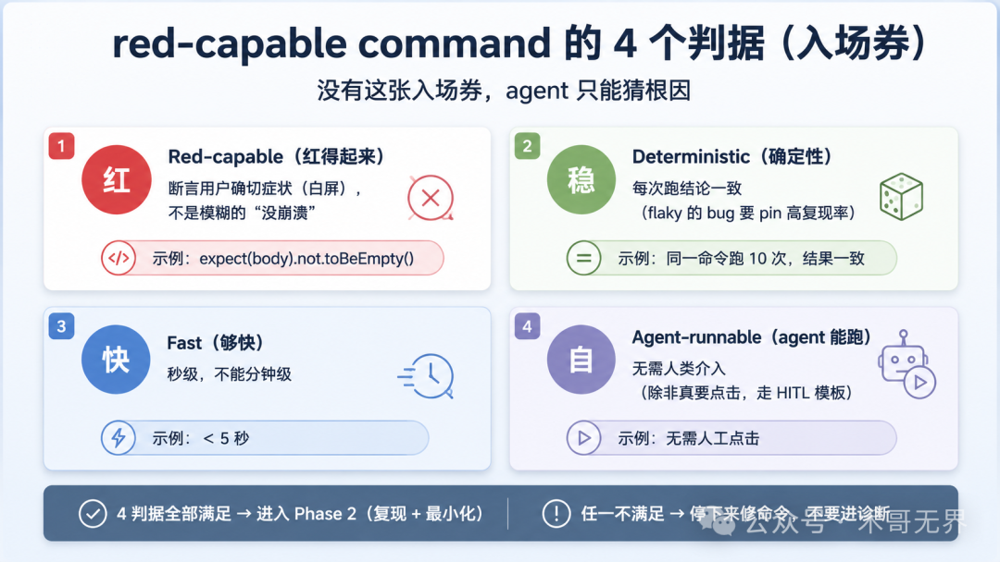

# 用户报Bug，Agent立刻猜根因？Matt Pocock这2个skill把它拉回正轨

## 核心问题

Agent 失败模式第三类：The Code Doesn't Work——没有反馈信号，Agent 会在黑屏里飞。

**The rate of feedback is your speed limit**（《Pragmatic Programmer》）

## /diagnosing-bugs：6阶段调试流程

把调试拆成6个强制阶段，跳阶段必须显式说明理由：

| Phase | 名称 | 关键产出 |
|-------|------|----------|
| 1 | Build a feedback loop | 一个已运行过的 red-capable command |
| 2 | Reproduce + minimise | 复现 + 最小化 |
| 3 | Hypothesise | 3-5个 ranked、falsifiable 假设 |
| 4 | Instrument | 每个探针对应 Phase 3 的一个预测 |
| 5 | Fix + regression test | 在 correct seam 写回归测试 |
| 6 | Cleanup + post-mortem | 清理 debug log，commit/PR 写明真正根因 |

### Phase 1 的 red-capable command 是入场券

判据4条：
- **Red-capable**：断言用户确切症状（白屏），不是没崩溃
- **Deterministic**：每次跑结论一致
- **Fast**：秒级，不能分钟级
- **Agent-runnable**：无需人类介入

**核心原则**：在你没有一个能复现bug的命令之前，停下来。先复现，再假设。

### Phase 3 假设必须 falsifiable

必须能陈述：如果X是原因，那么改Y会让bug消失。

### Phase 5 的 correct seam

找不到合适的 seam 写回归测试，说明这块代码的测试边界划得不对，得重构。

## /tdd：让agent知道往哪走

**核心论点**：TDD不是为了写更多测试，而是为了让agent有一个够快、够准、能真实失败的反馈信号。

### 关键概念

**Seam（缝合线）**：从外部观察行为的接缝点。

| Seam类型 | 例子 |
|----------|------|
| HTTP API端点 | POST /api/login 的 request/response |
| CLI命令stdout | git status 的输出 |
| Public class方法 | UserService.login() 的返回值 |
| 事件/消息订阅 | bus.on('login:success', handler) 收到的 payload |

**Pre-agreed seam**：测试前先和用户约定的 seam。不在公共接口上的测试会悄悄变成实现细节的测试。

### 红绿循环

Red before green——先写一个失败的测试，只写让这个测试通过的最少代码，不要预判未来测试。

## 核心观点

1. **red-capable command 不是结果，是入场券**——没有它就没有资格进入 Phase 2
2. **反馈信号不是常识**——要写进 skill 文本里变成强制流程约束
3. **TDD 能让代码能跑，但管不了架构好**——这是 TDD 的边界
4. **Build the right feedback loop, and the bug is 90% fixed**——反馈循环建立后，bug就已经解决了90%

## 配图

*Matt Pocock 两个 skill 修复 Agent 失败模式*

*red-capable command 不是结果，是入场券*
