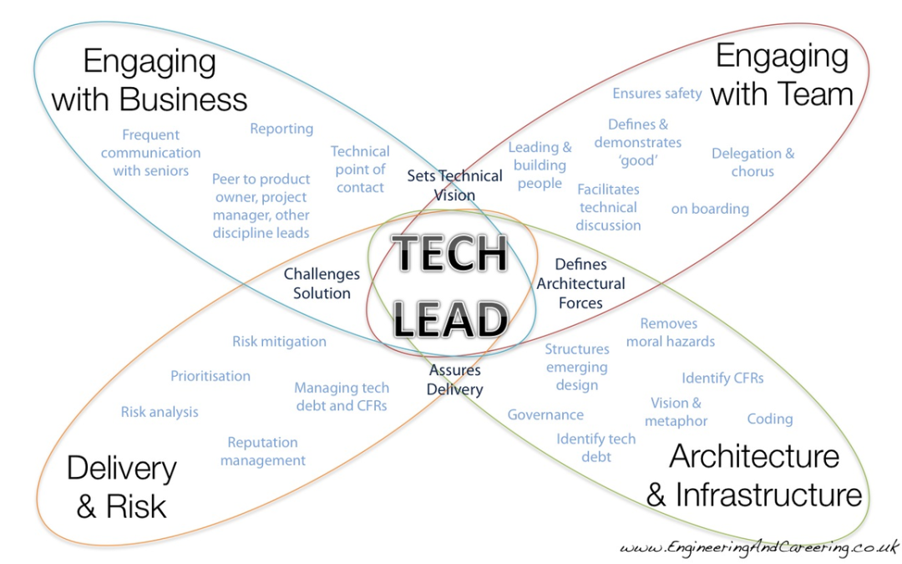

# AI 编程 ｜ 未来只需要 Tech Lead 级别的开发人员

最近我一直在想一个事情，AI 写代码越来越快了，那以后的团队还需要那么多人吗？

尤其是现在用 Cursor、Trae 这些工具，随便说两句话 AI 就能生成几百行代码。以前一个需求要前后端两个人搞一周，现在可能一个人两天就干完了。那是不是意味着，以后团队里只需要最厉害的那几个人就够了？

我觉得这个趋势挺明显的，未来可能真的只需要 Tech Lead 级别的开发人员。

## 01 AI 正在吃掉初级开发的工作

先说说初级开发这个群体。以前一个团队里可能 70% 都是初中级开发，他们负责写业务代码、修 Bug，做简单的 CRUD。但现在这些工作 AI 干得比人还快，还不出错。

你让 AI 写一个用户管理的增删改查，它几秒钟就给你写好了。你让 AI 写个表单验证逻辑，它能考虑各种边界情况。而且 AI 不会写错变量名，不会漏掉异常处理，不会写出那种只有自己看得懂的代码。

那初级开发还能干什么？有人说可以 review AI 的代码，但问题是，连代码都写不好的人，怎么 review AI 写的代码？这本身就是一个悖论。

所以未来初级开发的数量肯定会大幅减少，甚至可能直接消失。

## 02 Tech Lead 的价值不可替代

那 Tech Lead 为什么不可替代？因为 Tech Lead 干的事情 AI 现在还干不了。

**架构设计**：AI 能写代码，但它不懂你的业务，不懂你的产品未来会怎么发展，不懂技术债的积累规律。架构设计需要的是经验、判断力和对业务的深刻理解，这些 AI 短期内不可能具备。

**需求拆解**：同样一个需求，交给 AI 它会直接开始写代码。但 Tech Lead 会先想这个需求是否合理，有没有更好的实现方式，会不会影响现有架构，跟其它模块怎么交互。这种全局性的思考 AI 做不到。

**跨团队沟通**：Tech Lead 要跟产品、设计、测试、运维各种人打交道，把技术方案翻译成大家都能听懂的语言。AI 现在连开会都参加不了，更别说理解办公室政治了。

所以 Tech Lead 的核心价值不在于写代码有多快，而在于决策能力和沟通能力，这些恰恰是 AI 最弱的环节。

## 03 团队结构会变成什么样

如果未来真的只需要 Tech Lead，那团队结构会变成什么样？

我觉得会从现在的金字塔结构变成扁平结构。以前一个 Tech Lead 带五六个初中级开发，现在可能一个 Tech Lead 带一两个 AI 助手，就能完成同样的工作量。

而且 Tech Lead 的角色也会进化。以前 Tech Lead 还要花很多时间 review 代码、指导 junior，以后这些时间都省了。他们可以花更多时间在架构设计、技术选型、业务理解上。

换句话说，Tech Lead 会从半管理半技术的角色，变成纯粹的技术决策者。团队里不再需要专门的管理层，因为管理的人少了，管理本身也变简单了。

## 04 给现在开发者的建议

我知道很多人看到这个趋势会焦虑，担心自己以后找不到工作。

其实也没必要那么悲观。虽然初级开发的岗位会减少，但对高级人才的需求反而会增加。关键是你要有意识的往 Tech Lead 的方向去进化。

不要只会写代码，要学会思考架构。不要只懂技术，要理解业务。不要只会埋头干活，要学会沟通表达。这些能力才是未来的核心竞争力。

而且这个过程可能比我们想象的更快。也许三五年后，你再看一个技术团队，发现里面全是 Tech Lead，没有 junior，没有 senior 的区分，因为中间那层已经被 AI 填平了。

未来团队里最值钱的人，不是代码写得最快的人，而是那个最会跟 AI 协作，最会做技术决策的人。

## 关于作者

少个分号，知名外企十年 Tech Lead（技术经理）和企业咨询师，技术书作者，精通敏捷软件交付团队的工作方式，关注 AI 对软件工程的重塑，搞了一个在线研讨会。

提供 1V1 技术管理和职场咨询服务，已帮助 100+ 位朋友解决管理和职场的问题。

网站 shaogefenhao.com，微信同号

