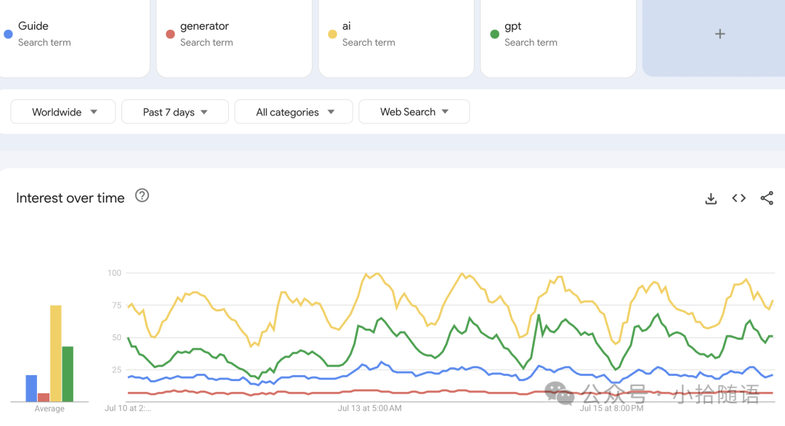
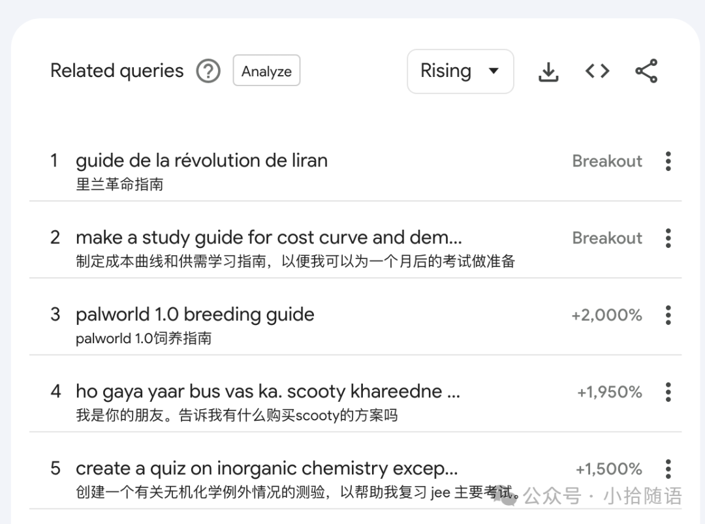
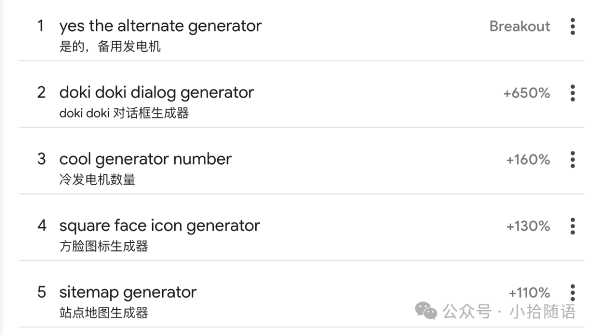

# 两个流量暴涨的词

前几天在 Google Trends 时，发现有两个流量暴涨的词：**palworld 1.0 breeding guide**、**doki doki dialog generator**。对这类内容不感兴趣，没深入研究分析，有兴趣的可以做下，稍微搜索下，GitHub 有开源的，可以研究开源的再包装下做网站。

许多人都是多做站，快速上线推广，抓概率，有点像外贸群发客户。这种方法不适合我，一是执行力低，二是做多了厌倦了，还是喜欢精开发，不然做了那么多网站，推广维护也很费力的。

