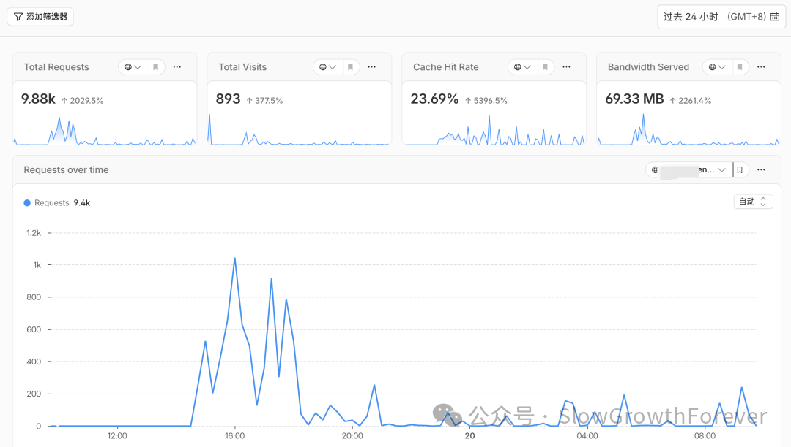
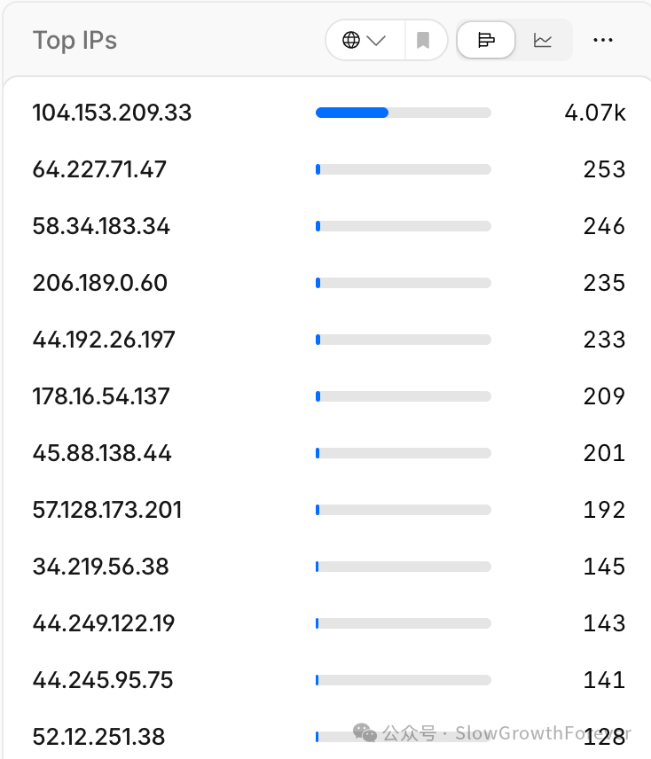
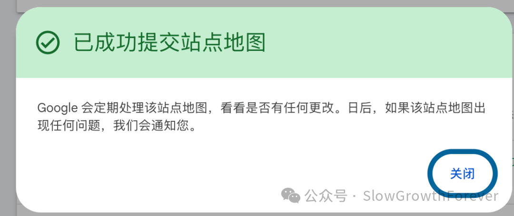
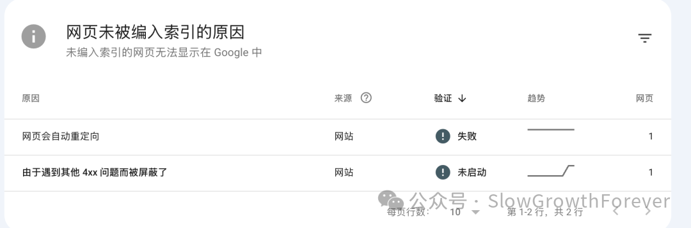
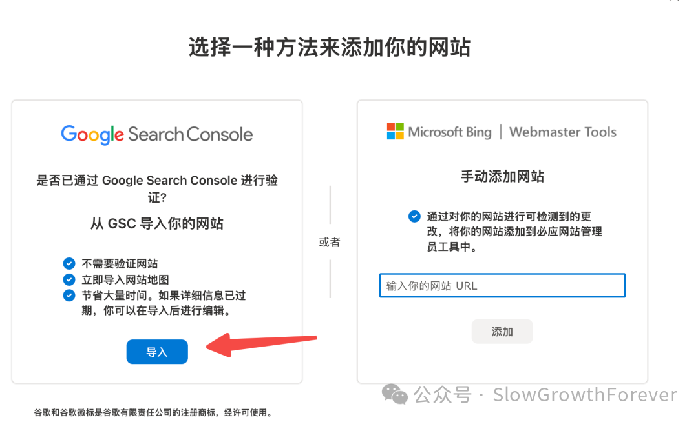
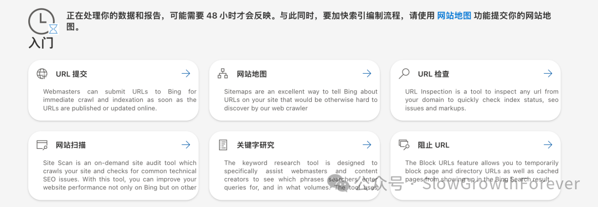
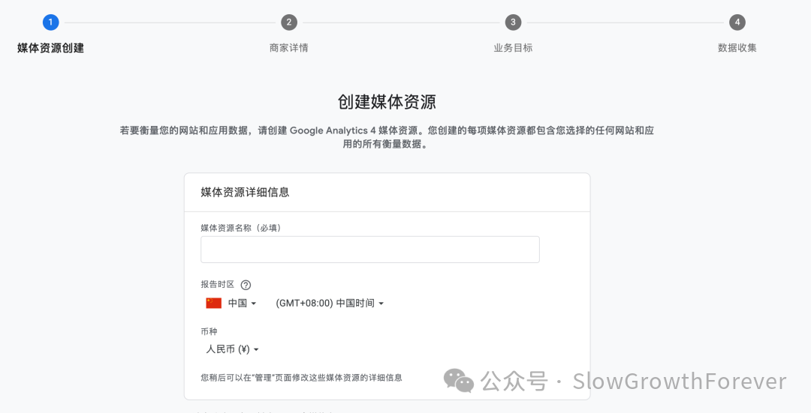
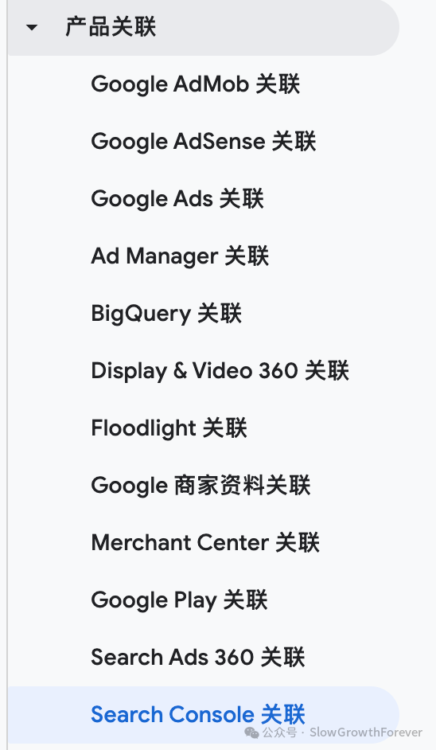

# 网站上线后24小时之内马上要做的事情是什么？

## 核心框架

上线按钮按下去，只完成了发布。接下来的24小时之内，要把**可访问、可统计、可发现、可追踪**四条链路接起来。

## 1. 先证明站点从外部可以完整访问

不要先去提交搜索引擎。先用无痕窗口、手机网络和命令行检查线上站点。

**第一轮检查清单**：
- 首页和核心功能页返回200
- http能跳转到https
- www和裸域名只保留一个规范版本
- CSS、JavaScript、字体和图片没有404
- /robots.txt可以直接打开
- /sitemap.xml返回有效XML
- 页面源码里有唯一的canonical
- 手机端没有横向滚动、遮挡和无法点击的控件

**三个最简单的请求**：
```bash
curl -I https://{域名}/
curl -I https://{域名}/robots.txt
curl -I https://{域名}/sitemap.xml
```

**Cloudflare 优化**：把robots.txt、sitemap.xml、RSS和静态资源从高成本的Worker路径中分离，给静态页面增加缓存。

## 2. 在 GSC 完成域名验证

Google Search Console 里有两种常见资源：
- **网址前缀资源**：只覆盖指定协议和前缀
- **网域资源**：覆盖该域名下的不同协议和子域名，新站更适合

所有权验证只说明有权查看数据，不会自动让页面进入索引。验证后还要继续提交sitemap。

## 3. 提交 sitemap，再检查核心 URL

sitemap里只放规范URL，每个URL返回200，不要混入跳转页、404、后台路径、参数重复页和被noindex的页面。

Google明确说明，请求编入索引不能保证页面一定进入索引。大量URL应通过sitemap告知，重点页面才适合用URL检查工具单独检查。

## 4. 把站点接入 Bing Webmaster

- Bing Webmaster Tools 支持从 GSC 导入已验证站点，一次配置处处生效
- Bing 还支持 **IndexNow**，在页面新增、更新或删除时主动发送URL，缩短搜索引擎发现变化的时间
- IndexNow 不能替代 sitemap，二者承担任务不同

## 5. 重新建立 GA4 数据流

登录 analytics.google，重新建立 GA4 媒体资源和 Web 数据流，把 Google tag 放到全站公共布局中。

**配置完成后三次验证**：
1. 用 Tag Assistant 确认页面识别到正确的 Google tag
2. 在 Network 面板中搜索 collect，确认请求已经发出
3. 打开 GA4 Realtime，用无痕窗口访问核心页面，确认实时数据出现

**注意**：广告拦截、Cookie同意工具、错误的Consent Mode和脚本加载顺序都可能让GA4没有数据。

## 核心观点

网站上线后的第一个24小时，目标和"获得多少流量"无关。这一天能控制的结果：
- 页面可以稳定访问
- 真实访问能被统计
- Google和Bing已经拿到发现入口
- 抓取异常有人能看到
- 线上故障发生后可以定位

如果网站出海是一场长跑，本文以上内容是起步前刚把鞋带系好。

## 配图


*爬虫验证：网站能被爬虫爬到*



*可访问、可统计、可发现、可追踪四条链路*



*外部完整性检查清单*



*GSC 站点地图提交*



*索引状态检查*



*Bing Webmaster Tools*



*IndexNow 主动 URL 提交*



*GA4 数据流配置*



*GA4 + GSC + MCP 打通*
