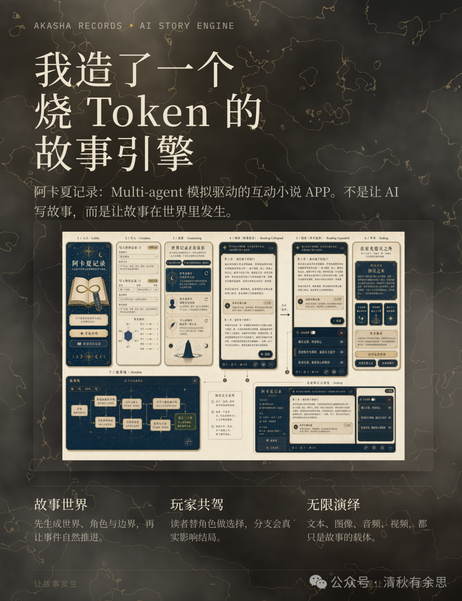
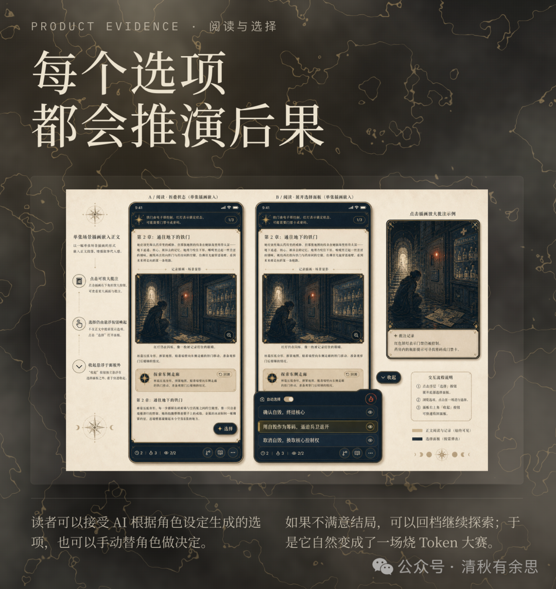
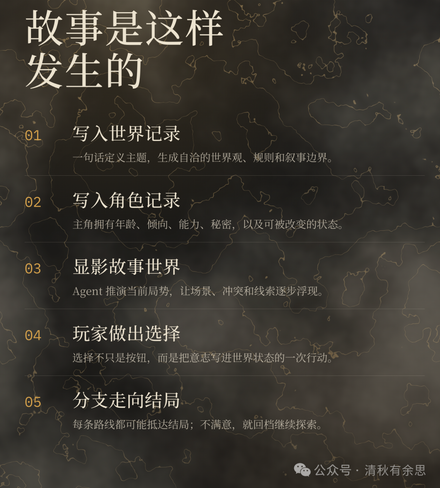
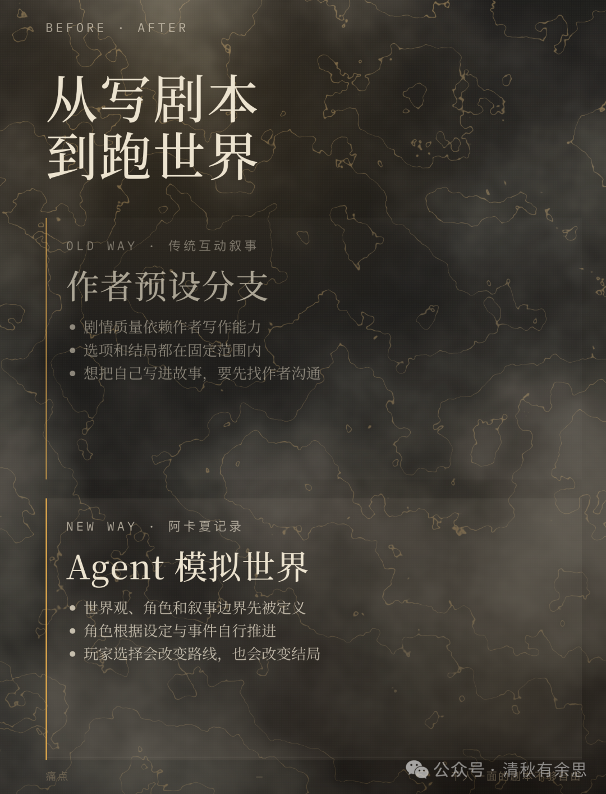
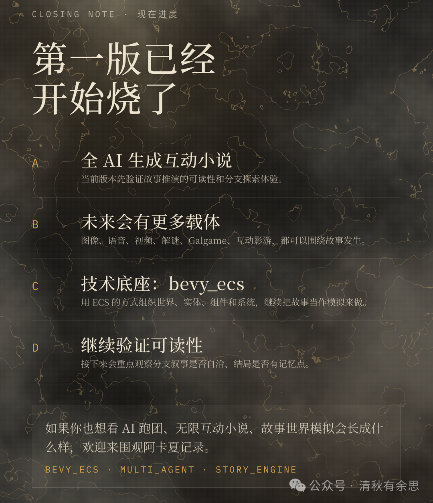

# 我造了一台全自动烧 Token 的无限故事引擎

下岗再就业已经过去一个半月，终于对外发了第一个产品，还有一个无限画布的 Agent 编排产品，还没发布已经过时了，说不定以后来能换壳重生，下面回到正题吧。

「风带来了故事的种子，时间使之发芽。」

最近沉迷烧 Token 无法自拔，于是我造了台全自动烧 Token 的玩意儿，叫《阿卡夏记录》，一晚上能烧掉几亿 Token。多亏了 D 老师强大的缓存命中率把成本压了下来，不然钱包真遭不住。

简单来说，它现在是一个全 AI 生成的互动小说 APP。但其实我想做的并不只是"让 AI 更会写故事"，而是要搭建一个Multi-agent 模拟驱动的无限故事引擎，让故事在一个自洽的世界里自然发生，而不是靠 AI 去写。我希望世界、角色、记忆、冲突和选择都能在引擎里自主运转，像一局永远不会重复的跑团。

先聊聊最根本的问题：这玩意儿到底解决什么需求？

Just for fun！如果非要说解决什么问题，那就是让所有心里藏着故事创意的人，能沉浸式地探索自己的故事世界，从中获得纯粹的乐趣。写作者灵感枯竭时，可以跳进这个世界里呼吸灵感；小朋友可以和家长一起读互动故事书，寓教于乐的同时获得情感陪伴；甚至可以成为线下聚会时，一群朋友围着共同编织故事的社交引擎。说到底，就是让大家因为故事聚在一起，玩起来。

最初冒出这个念头时，我想做的是一个 AI 故事绘本。在家长陪伴孩子的场景里，由家长的一句话描述，驱动 AI 生成一个逻辑自洽的故事世界和故事主角——不光有文字，还有图像、语音甚至视频。家长和孩子共驾主角，替主角做选择，故事世界就会明确地因这个选择而改变走向与结局。这个过程里，家长可以把教育理念悄悄种进去，让孩子体会到不同选择带来的后果。

当我把这个场景拓展开，发现它其实就是典型的AIGC + 互动范式。在这个范式下能长出的应用太多了：AI 模拟器、AI 酒馆、AI 跑团、AI 互动小说、AI 互动影游，甚至 AI Galgame……而在所有这些形态里，我认为故事才是最根本、最核心的东西。有了好故事，自然能衍生出漫画、影视、游戏等各种内容演绎。

我也看到市面上很多应用，他们都在让 AI 努力写故事，通过各种工程手段——记忆模块、RAG 检索——拓展模型上下文边界，提高逻辑性和一致性，降低幻觉。现在 1M 上下文的模型已经普及成标配，这样的上下文长度对讲好一个故事完全足够了。

那为什么还要让 AI 来"写"故事呢？我们能不能换一条路：让多个 Agent 去模拟一个完整的故事世界，让故事在模拟中自然发生？这正是我目前正在尝试的事——一个无限的 AI 故事引擎，去驱动我前面提到的所有故事类应用场景。

那么这个引擎会落到哪些人手里？我设想中的用户，有小说爱好者、跑团玩家、小说作者，也有家长和孩子组成的亲子互动群体，甚至包含线下的真人社交场景。使用场景也随性得很：娱乐、社交、陪伴……只要你想进入故事里待一会儿，它就为你展开。

目前传统的故事或叙事类应用，普遍存在几个挺让人难受的痛点。一是太依赖作者写剧本（具体的台词、具体的场景），体验的好坏完全取决于作者一个人的写作功力，注定做不到千人千面。有故事的人不会写，会写的人不一定想写你想要的题材。如果你想在小说里用自己名字跑个龙套，还得跑去跟作者商量。二是分支选择本身就是预设的，你依然在别人圈定的规则和范围内叙事，本质还是不够自由。

初版《阿卡夏记录》就在试图打破这些限制，它依靠多 Agent 推演世界、生成叙事。你既能选 AI 给出的选项，也能手动替角色做决定，每一次选择都会改变剧情路线和结局。不满意了，随时回档重新探索，理论上可以延伸出无限条分支、无限种结局——只要你顶得住 Token 的消耗。（笑哭）

从更长远来看，这件事的价值，或许在于它会催生 AI 时代的一种新故事内容形态。未来的小说可能不再是按照章节线性展开的阅读体验，而是一种更沉浸的模式：你融入故事世界，参与它的构建和角色决策。内容也不会局限于纯文本，而是由 AI 驱动生成的多模态内容——图像、音视频，都自然而然地生长出来。传统的小说作者，角色也会跟着转变：他们不再死磕每一句对白和细节，而是变成故事世界的架构师，去定义世界观和角色设定，去设计叙事的边界与故事大纲。这有点像程序员在 AI 冲击下，正变得更少参与具体写代码，更多参与架构设计与关键决策。

后续的玩法拓展其实已经排得满满当当的了：可以做成 AI 跑团，接入图像生成做故事绘本，也可以开发成 AI Galgame 或互动影游。小说作者完全能拿它来当灵感工具。技术底层我用了bevy_ecs，是以做游戏的思路在开发这款应用，每天快乐烧 Token，接下来就要把生图接上去啦。

我想听听你的想法——你觉得怎样做才好玩？

（点击阅读原文可以体验）
