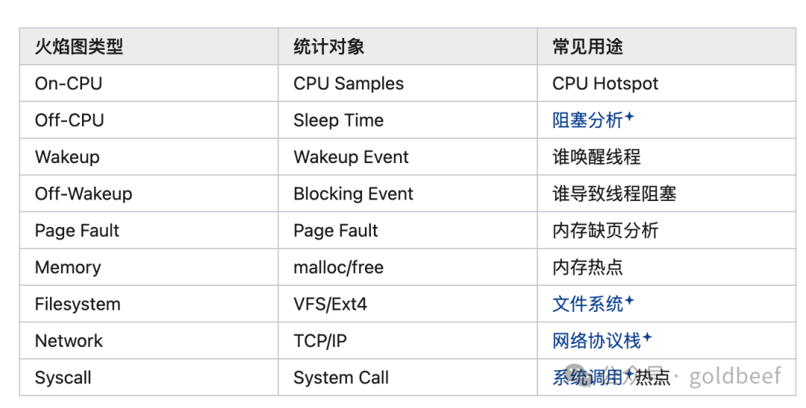

# Linux CPU 性能分析（3）：火焰图（Flame Graph）——从 CPU 到万物皆可火焰图

> 作者：goldbeef。火焰图本质上是一种可视化方式，而不是一种采样方法。任何能够采集到调用栈（Stack Trace）的事件，都可以生成对应的火焰图。

## 什么是火焰图？

火焰图由 Brendan Gregg 提出，它将大量调用栈按照相同路径进行聚合，并以矩形的形式展示。

**横轴（Width）**：表示资源消耗。矩形越宽，表示 CPU 时间越多。注意：横轴不是时间轴。

**纵轴（Height）**：表示调用关系。最底层是入口函数，越往上调用越深。

## 六种火焰图类型

### On-CPU Flame Graph（CPU 火焰图）

最经典的火焰图。通过 perf/profile 生成，采样 CPU 正在执行的函数。

适用于：CPU 使用率高、查找热点函数、性能 Profiling。

### Off-CPU Flame Graph（阻塞火焰图）

当 CPU 利用率很低但程序却很慢时使用。通过 bcc 工具 offcputime 采样线程什么时候睡眠（read、futex、poll、epoll_wait）。

典型问题：IO 等待、锁竞争、数据库等待、网络等待。

### Wakeup Flame Graph（唤醒火焰图）

通过 bcc 工具 wakeuptime 统计是谁唤醒了别人。适用于调度分析、锁竞争、Producer/Consumer 场景（Java、Kafka、Redis、数据库）。

### Off-Wakeup Flame Graph

通过 bcc 工具 offwaketime 看谁让别人睡觉。可以分析阻塞是谁造成的，非常适合分析锁竞争。

### Page Fault Flame Graph

通过 perf 指定 page-faults 事件生成。统计哪些函数最容易触发 Minor Fault 和 Major Fault。

适用于数据库、Redis、JVM、内存映射文件等场景。

### Memory Flame Graph

通过 bpftrace 关联 uprobe 统计 malloc/free/new/delete 的调用栈，找到内存分配热点。

## 为什么说万物皆可火焰图？

火焰图不是 CPU 专属工具，而是一种调用栈聚合与可视化技术。只要能够获取事件发生时的调用栈，就可以生成火焰图：

- CPU Samples → On-CPU Flame Graph
- Sleep Event → Off-CPU Flame Graph
- Wakeup Event → Wakeup Flame Graph
- Page Fault Event → Page Fault Flame Graph

## 总结

火焰图的核心思想是：把海量事件按照调用路径进行聚合，并用矩形宽度表示资源消耗或事件发生频率。随着 eBPF、perf、BCC、bpftrace 等技术的发展，几乎所有能够获取调用栈的事件都可以生成火焰图，这就是「万物皆可火焰图（Anything can be a Flame Graph）」。