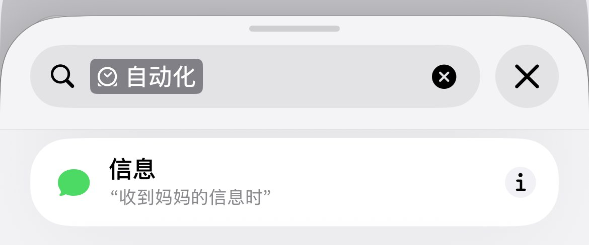
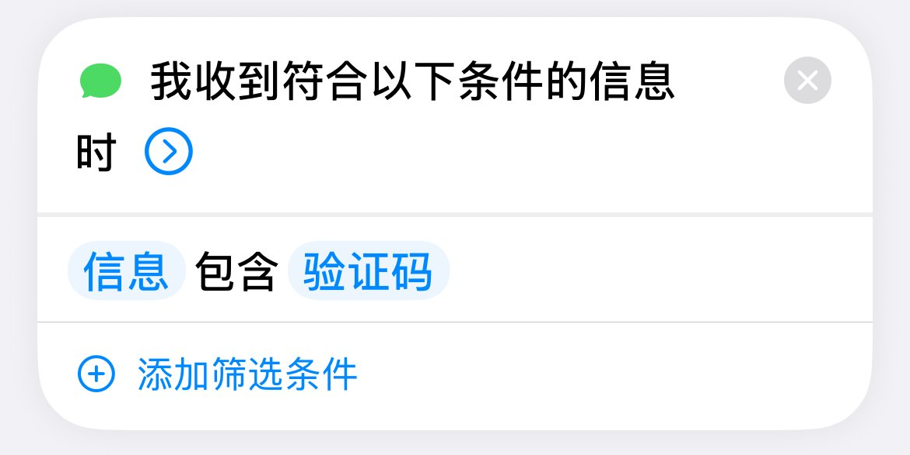
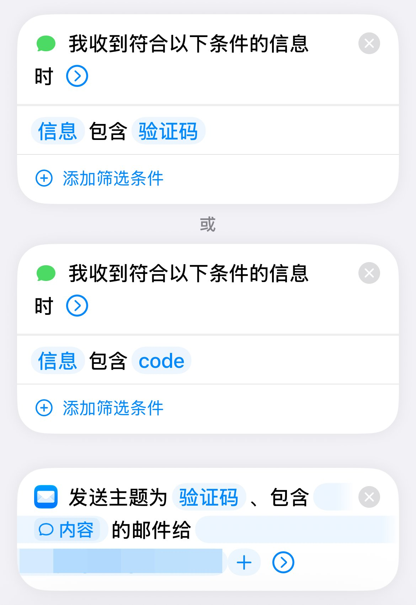
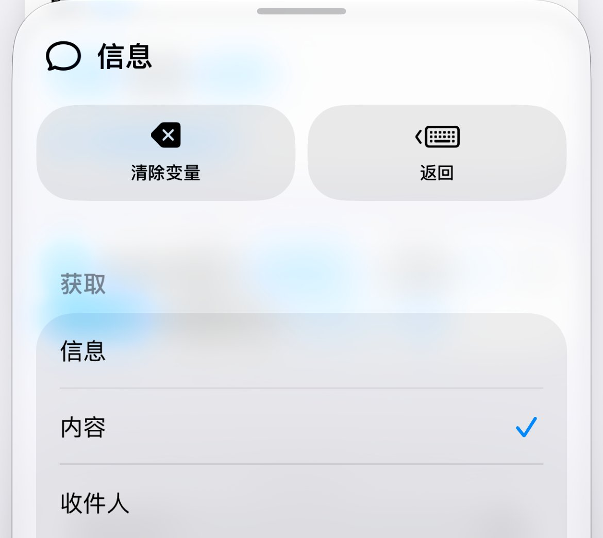
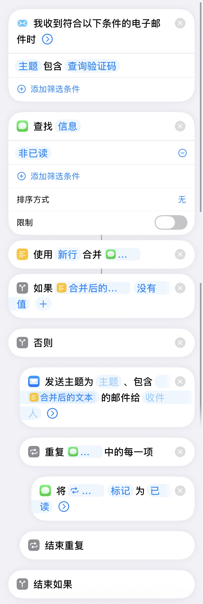

# 短信验证码自动转发邮件

有两种方案，一种是主动查询，另外一种是自动转发。

先说一下我的使用背景，我买了个二手手机放在国外堂哥的家里，然后买了个月租 $5 的手机卡用来接收短信，之前每次需要收个短信，我就得联系我堂哥帮忙打开手机看一下，然后发给我，这样老麻烦人家也不好，所以我就想了个方法可以自动转发验证码给我自己，不需要再麻烦堂哥帮我查了。只需要用到一个 iPhone 和快捷指令就可以了。

# 第一种、自动转发

先添加一个自动化，选择信息。

选择信息包含，然后设置一个关键词，这样包含这个关键词的短信就会触发这个自动化。就比如下图我设置了验证码，当收到一个包含验证码的短信的时候，就会触发流程。

可以在一个快捷指令里面添加多个自动化，这样可以设置多个关键词。如果怕漏掉短信的话，可以把 a-z, 0-9 都设置进去，这个不区分字母大小写。完整的流程就像下图这样。

在最后一个发送邮箱的指令设置一个邮箱，内容直接使用上面短信的变量，如果设置了多个选择任意一个就可以了，选完变量后要记得点击一下，然后会显示一个弹窗，选择内容，就像下图这样。

因为默认收到的这个数据好像是一种信息附件，不是纯文本，所以要选择内容，这样才会发送文本内容。全部设置好后就可以测试收到短信后会不会自动发送短信内容到邮箱里了。

# 第二种、主动查询

先发一下整个流程的图，按照这个设置就行。用的是自动化里面的电子邮件。

这个流程的功能是这样的，收到一个包含查询验证码标题的邮件就会触发流程。所以需要查询的时候只要发一个邮件到这个手机上。然后这个快捷指令就会查询非已读的短信，再把短信合并起来发送到邮件，发送完成后再把短信都设置成已读，避免再重复查询。

这两种方法只需要设置一种就够用了，亲测好用，现在我需要收验证码就会自动转发到我的邮件里了。当然，这个是我能想到的方案，如果有更好的方案大家也可以一起分享。
