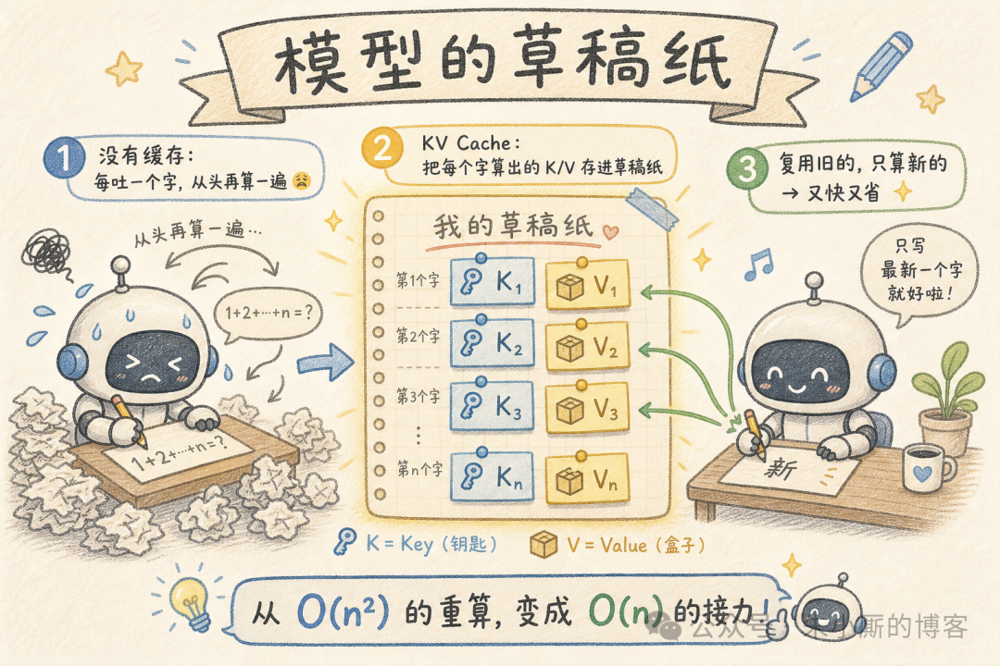
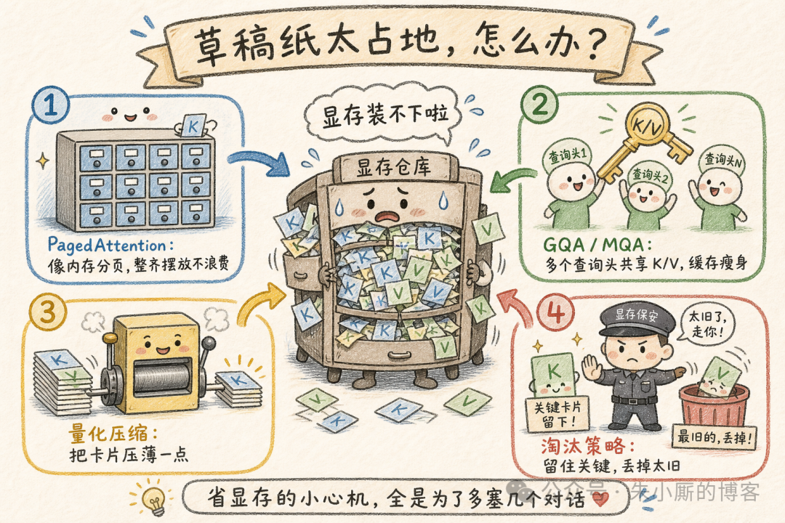
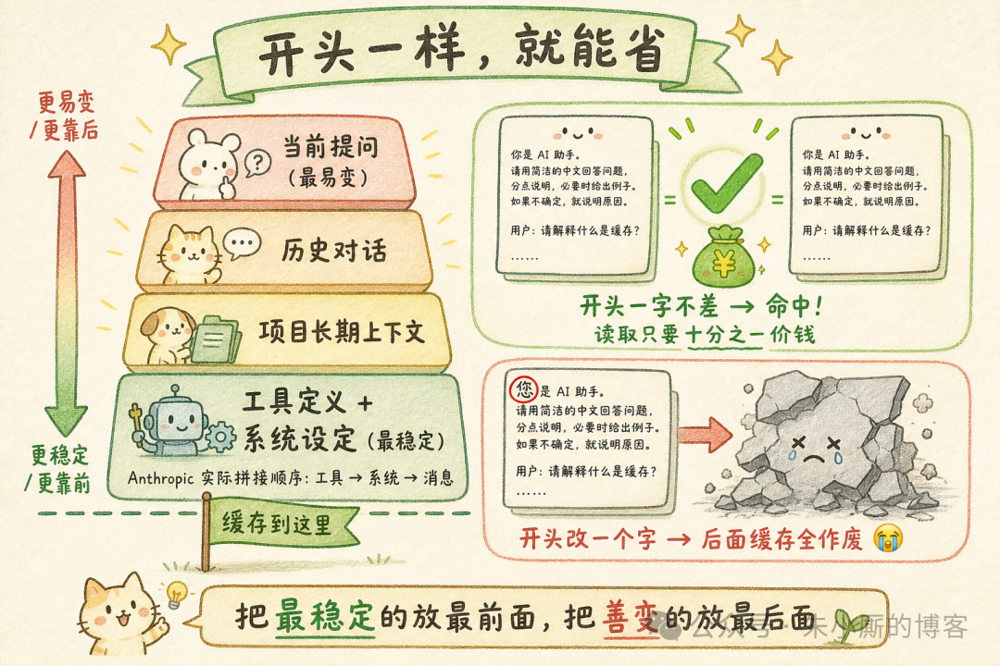
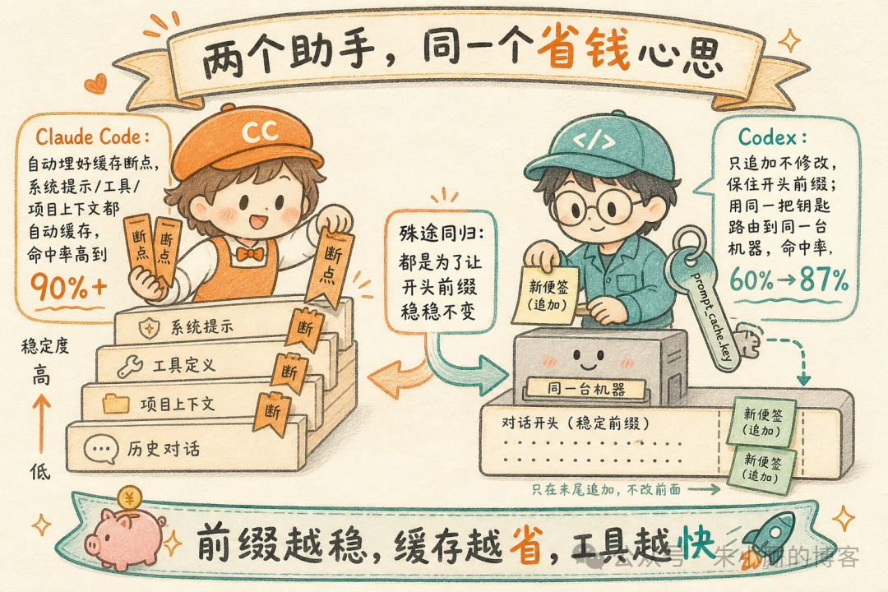

# LLM 缓存机制详解：从 KV Cache 到前缀缓存，再到 Claude Code / Codex 的工程实践

> LLM 推理的延迟和成本，本质上取决于同一件事：**同样的计算被重复了多少次**。从单次生成内部的注意力计算，到跨请求共享的相同前缀，缓存就是围绕"消除重复计算"展开的一整套工程手段。

<!-- more -->

## 一、问题的根源：自回归生成中的重复计算

LLM 是自回归模型：每一步只生成一个 token，并把它拼回输入作为下一步的条件。每个位置的 Key 和 Value 只由该位置的输入 token 与模型权重决定，一旦算出就是常量、不会再变。但如果每生成一个 token 都把整段序列重新前向一遍，生成长度为 n 的序列其总计算量会随 n 平方级增长——这正是 KV Cache 要消除的开销。

## 二、KV Cache：把注意力的 Key/Value 存下来复用

KV Cache 是所有 LLM 缓存里最底层的一块，几乎所有推理框架默认开启。把每个 token 在每一层算出的 Key、Value 张量缓存下来，后续步骤直接复用而不重算。

一次推理分成两个阶段：
- **Prefill（预填充）**：把整个 prompt 一次性喂入，并行算出所有位置的 K/V 写进缓存
- **Decode（解码）**：逐 token 生成，每来一个新 token 只计算它自己这一个位置的 Q/K/V，把新的 K/V 追加进缓存，再用它的 Q 去和缓存里全部 K/V 做注意力

缓存按"每层一组、每组含 Key 与 Value 两个张量"组织，张量形状通常是 `[batch, num_heads, seq_len, head_dim]`，随生成在 seq_len 维度上不断增长。

主流框架的缓存策略：
- **DynamicCache**：随生成动态扩容，默认项
- **StaticCache**：预分配固定上限，便于配合 torch.compile 做图编译加速
- **QuantizedCache**：把 K/V 量化存储以省显存
- **OffloadedCache**：把非当前层的缓存换出到 CPU 内存

语义约束：KV Cache 绑定的是"当前这一条序列"。两次相互独立的生成之间必须重置缓存，否则输出错乱。

## 三、显存才是瓶颈：KV Cache 的压缩与管理

KV Cache 的代价与"层数 × 注意力头数 × 上下文长度 × 并发请求数"成正比。工程上四类手段：

### 1. 架构上减少 K/V 数量
- **MQA（多查询注意力）**：所有 Query 头共享同一组 K/V
- **GQA（分组查询注意力）**：Query 头分组，每组共享一份 K/V。Llama、Mistral、Qwen 等现代模型普遍用 GQA，例如把 32 个 K/V 头压到 8 个，缓存体积直接降到四分之一

### 2. PagedAttention（vLLM）
借鉴操作系统的虚拟内存分页：不再为每条请求预留一整块连续显存，而是把缓存切成固定大小的块（block），用块表做逻辑地址到物理块的映射。消除了显存碎片，让批处理塞下更多并发，前缀相同的请求还能直接共享物理块。

### 3. 量化与换出
把 K/V 从 FP16 量化到 INT8/INT4，或换出到 CPU 内存。

### 4. 缓存淘汰
从丢最旧 token，到基于注意力分数的淘汰（H2O），再到摘要压缩。生产系统常用"保留系统提示 + 最近 N 轮"的静态策略兜底。

前沿方向：**多头潜在注意力（MLA）** 把 K/V 压成低维潜在向量。

## 四、前缀缓存：把复用从单次生成扩展到跨请求

海量请求共享几乎相同的开头——同一份系统提示、同一套工具定义、同一份文档上下文被反复发送。每次都对这段相同前缀重新做 prefill，是纯粹的浪费。

**前缀缓存（Prompt Caching / Prefix Caching）**：当新请求的前缀与此前某次请求完全一致时，服务端直接复用那段前缀已经算好的 KV 状态，跳过它的 prefill，只对新增部分计算与计费。读取缓存的价格通常约为正常输入 token 的 1/10，首 token 延迟（TTFT）也大幅下降。

硬约束：命中依赖逐 token 完全一致的连续前缀。服务端对前缀 token 做哈希来判定，前面任何一个 token 变化，从该位置往后的缓存全部失效。

**工程原则**：把稳定不变的内容（系统提示、工具定义、固定文档）放最前，把每次都变的内容（用户问题、时间戳、随机 ID）放最后。请求体应按"变化频率从低到高"排列。

## 五、两种实现路线：Anthropic 显式断点 vs OpenAI 自动前缀

### Anthropic（显式标记）
- 在内容块上加 `cache_control`（type=ephemeral）声明缓存断点
- 每个请求最多 4 个缓存断点，通常放在分层边界
- 读取走折扣价，写入略有溢价
- 默认 TTL ~5 分钟，每次命中自动续期；另有 1 小时长 TTL 选项
- 前缀拼接顺序固定：`tools → system → messages`

### OpenAI（默认自动开启）
- 长度达到约 1024 token 的请求自动尝试匹配前缀缓存
- 对前缀前约 256 个 token 做哈希来决定路由到哪台推理机
- 可选的 `prompt_cache_key` 提高路由黏性
- 缓存通常存活 5–10 分钟，较新模型支持长达 24 小时的延长缓存

## 六、工程实践：Claude Code 与 Codex 如何围绕缓存设计上下文

编程类 Agent 是前缀缓存的重度用户。命中率直接决定延迟和成本，两家都把上下文结构当作一等的性能问题来设计。

### Claude Code：自动埋点 + 严格分层
- 为所有内部调用自动放置 `cache_control`
- 系统提示、工具与 MCP 定义、项目长期上下文（如 CLAUDE.md）依次纳入缓存
- 严格按"变化频率"分层，断点卡在层边界上
- 配合 append-only 循环，断点随对话自动前移
- 实测活跃会话命中率可达九成以上

### Codex：append-only 保前缀
- 系统指令、工具定义、沙箱配置、环境上下文保持逐字节一致且顺序固定
- 运行时配置变化不回改既有前缀，而是追加到末尾
- 叠加 `prompt_cache_key` 后命中率从 60% 提升到 87%

## 七、适用场景与边界

判断前缀缓存是否划算，只看一个特征：**是否存在"长且高频复用的稳定前缀"**。

适合的场景：
- 带超长系统提示的客服与问答机器人
- 每次都拼接同一份文档/规范的 RAG
- 需要大量 few-shot 示例的任务
- 多轮 Agent（缓存从优化项变成可用性前提）

若前缀短于触发阈值、或前缀频繁变动导致命中率低，缓存收益有限——这时更该优先稳定前缀结构。

## 八、小结

三层手段各司其职：

| 层 | 作用 | 消除的重复 |
|----|------|-----------|
| KV Cache | 单次生成内部 | 每一步重复计算前面所有 token 的 K/V |
| 显存压缩（GQA/PagedAttention/量化） | 高并发、长上下文 | 显存瓶颈导致的吞吐限制 |
| 前缀缓存（Prompt Caching） | 跨请求 | 相同前缀的重复 prefill |

核心原则：**算过且不会变的东西不要重算，按"变化频率从低到高"组织上下文，让可复用的前缀尽可能长。**