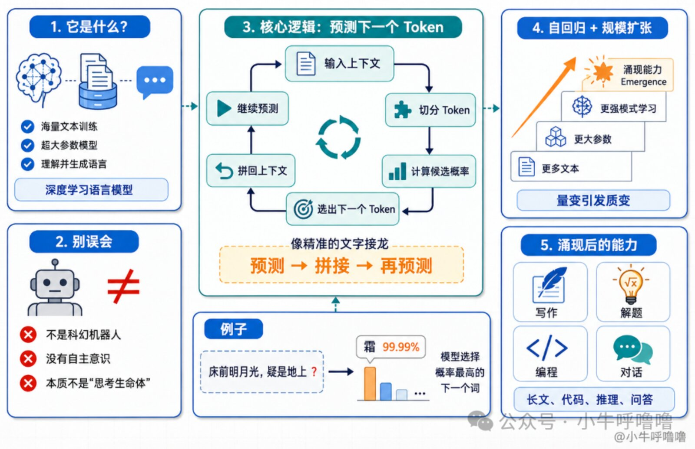
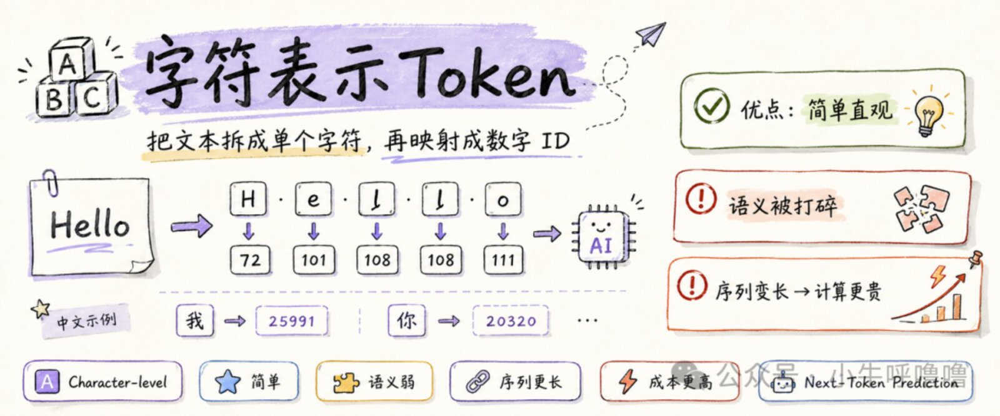
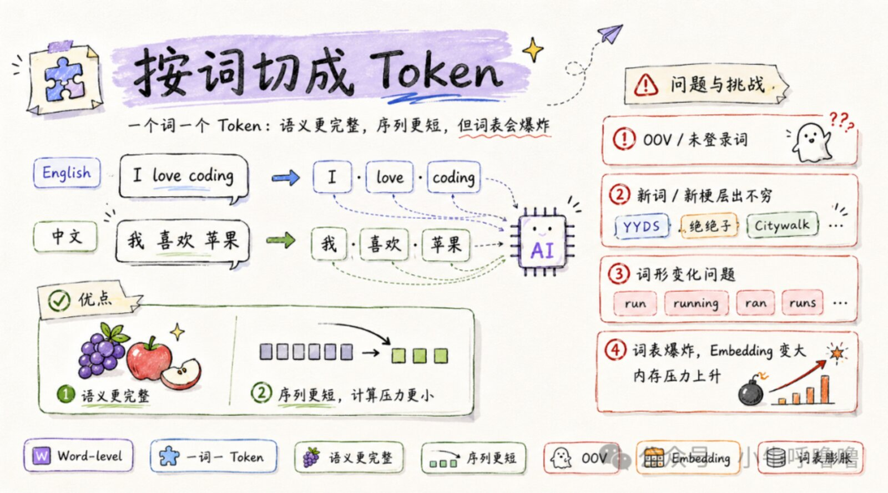
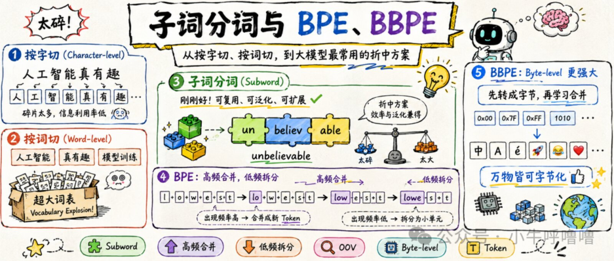
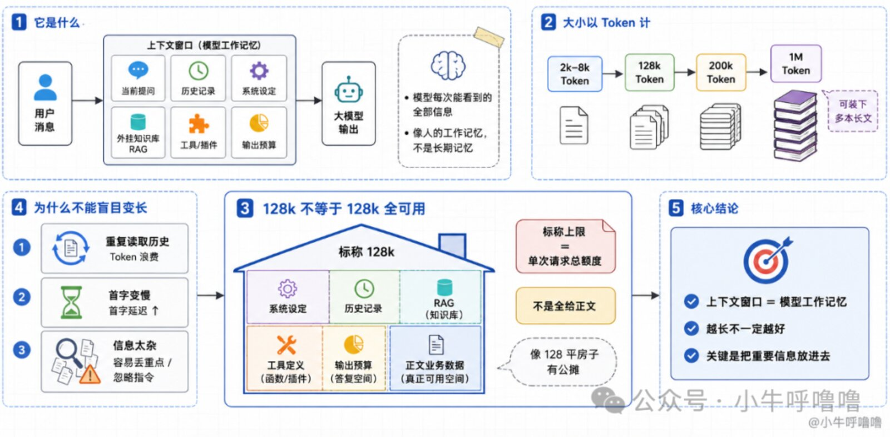
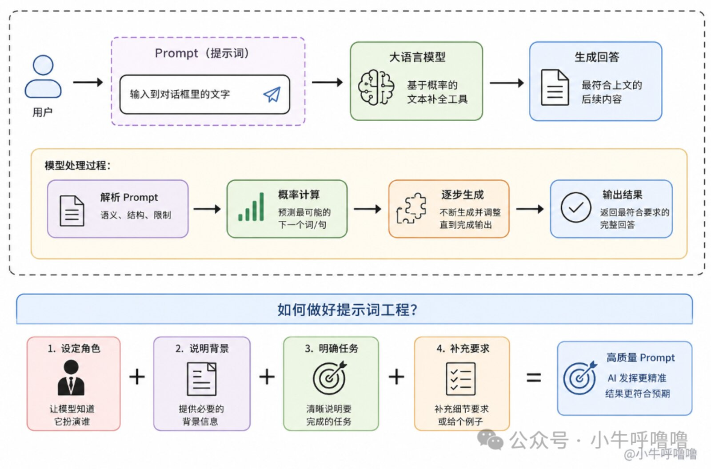

# 上下文 128k 也有“公摊”？通俗大白话聊透大模型底层逻辑

大家好，我是呼噜噜，当前大模型LLM是时代最热门的话题，我们普通人，除了利用AI来提效，成为生产力，有没有了解过大模型大家有没有过以下的疑问：大模型不就是调API聊天吗？除了写Prompt还能干啥？”这场 AI 浪潮，对我们传统的工程团队和普通开发者到底意味着什么？如果你也有这些困惑，这篇文章将为你梳理大模型的本质，讲透一些基础概念，希望大家有所收获，能找到AI 时代的破局之道什么是LLM?LLM大语言模型是一种通过学习海量文本数据、拥有数百亿甚至上万亿“记忆神经元”，能够像真人一样理解并生成语言的深度学习人工智能模型。很多人以为目前的大模型就是我们在科幻电影里的那种机器人，拥有自己的自主意识，但在目前还做不到那么复杂相反它的核心逻辑，其实非常简单：根据已有上下文预测下一个 Token，把新 Token 加进上下文后继续预测，直到生成结束，就像精准的"文字接龙"一样举个例子，当你给 AI 输入一句话：“床前明月光，疑是地上”，大模型会通过计算概率，很得出：后面接“霜”的概率是99.99%这个过程，其实就是大模型的自回归生成，当大模型学习的文本量达到几百亿、几千亿字，参数规模突破百亿级后，量变引发了质变，AI竟然拥有了涌现能力Emergence不仅仅能够文字接龙，还可以写长篇小说、解奥数题、编写程序代码....什么是token?直白地说，Token（词元）是大模型眼中的“基本阅读和书写单位”。官方定义它的中文叫“词元”，人类看到的是一段段连续的汉字或英文，而大模型看到的是一串串数字（Token ID）在 AI 时代，Token 就是新的“计量单位”，具有可计量、可定价、可交易的特征，买黄金看克数，交电费看度数，买猪肉看斤两，榨取AI算力看Token字符表示Character-level如今大模型看起来非常的智能，但它本质上是一个阅读了海量人类语料的超级概率计算器，它依靠Transformer 架构理解上下文，通过不断计算并预测“下一个最合理的词”（Next-Token Prediction），从而涌现出看似具备逻辑与思想的智能你给它一句话，它根据它学过的海量数据，推测出最合理的下一句话是什么其实对于我们人类来说，一直有个难点，怎么把人类的语言，喂给只懂0和1的计算机？img最早，大家觉得这还不简单？把每个英文字母或每个汉字都当成 token不就行了？比如：a是1，b是2，“我”是300，“你”是301。那么一句Hello拆开就是['H', 'e', 'l', 'l', 'o']。 这种方法有一个很明显的好处：简单。英文基础字符就那么多，中文虽然汉字多一点，但常用汉字也就几千个，全收录进字典，基本就不用担心遇到“不认识的词”这样一来，不管是一句话，还是一篇文章，都可以先拆成一个个字符，再变成一串数字，丢给模型去处理但现实很快就打了脸，这种“按字切分”的方案实在太碎了，直接暴露了两个致命缺陷：首先就是字都认识，却丢了语义。把Apple拆成A-p-p-l-e，单独看这些字母，它们没有什么实际含义。AI模型必须自己重新硬记这些组合学习：原来这几个字母连在一起，才表示“苹果”另一个问题就是，成本太高，因为字切得越碎，一句话转换成的数字串就越长。而大模型底层的注意力机制，算力消耗是“平方级增长”的：句子长度翻 2 倍，计算压力直接暴增 4 倍！如果不改变切分方法，大模型的算力瞬间就会被庞大的文本长度烧光所以按照字符去切，虽然简单，但是字太碎、AI 理解成本太高，又贵又低效词级表示Word-level既然“按字切”太碎，直接“按词切”行不行？聪明的你顺理成章就会想到：直接按“词”切不就好了？比如I love coding拆成['I', 'love', 'coding']，我喜欢苹果拆成['我', '喜欢', '苹果']这就是所谓的词粒度表示Word-level，即一个词一个 token，它的思路很直接：给每个词分配一个编号。这样一来，一句话就可以先被拆成词，再变成一串数字，交给模型处理这种方案还挺符合人类的直觉，首先是语义更完整，比如“葡萄”不再是两个毫无意义的单字，而是一个完整的水果；另外句子也变短了，拼图的块数少了，对大模型来说，序列越短，计算压力越小，尤其是注意力机制处理起来会轻松不少。img但问题也正是从这里开始的。词粒度最大的问题，就是：我们人类的词太多了，而且还在时时刻刻地不断变多！你今天刚把词表整理好，明天网上就冒出来一堆新词。比如：绝绝子、YYDS、Citywalk、鸡你太美等等当遇到这次词时，大模型就直接懵圈了，因为词表里没有这个词，在NLP里，这叫OOV 问题，也就是Out Of Vocabulary，未登录词问题另外英语这种语言，有多种“词形变化”，比如：单单一个“跑”，就有run、running、ran、runs。明明核心意思一样，却要在词库里硬生生占掉好几个坑种种问题就导致，在大模型底层，每个词都需要配备一个高维向量Embedding来记录它的特征。如果为了涵盖所有词汇，把词表膨胀到几百万个，撑爆显存所以按词切分解决了“太碎”的问题，却又亲手制造了“不认识新词”和“词表爆炸”的灾难子词分词与BPE、BBPE经过上面2种方案，我们可以发现，按字拆，太碎，模型理解成本高；按词拆，词太多，词表撑爆显存还认不全新词。那么，有没有一种“折中”的方案？img有的，有的兄弟！这就是大模型时代的核心解法——子词分词法Subword Tokenization。所谓的子词，就是介于“单个字符”和“完整单词”之间的小片段，或者可以说是 常见词根/组合。如果是高频词，直接整体保留：比如dog、我们、中国，不用拆，一口气吞下。那么如果是低频词、复杂词，拆成“通用小零件”， 比如unbelievable（难以置信），不用当成一个生词硬记，而是拆成：["un", "believ", "able"]这样一来，模型根本不需要死记硬背世界上所有的单词，只需要掌握一批有高复用价值的小零件。以后不管遇到什么新词、生僻词，大不了就把它拆开，用手头的积木“拼”着去理解！那该如何找到这些“小零件”字词呢？子词分词里最经典的做法，叫BPE字节对编码，Byte Pair Encoding，它的灵魂就是高频合并，低频拆分我们可以把它的训练过程，看作是 AI 在“找规律”：先拆散：一开始，AI 什么词都不认识，只能把所有文本拆成最基本的零散字符。比如l o w、l o w e r。找高频：它开始疯狂统计，发现l和o这两个字符老是紧挨在一起出没。做合并：把它们胶合在一起，变成一个新的 Token——lo。不断循环：接着发现lo和w也是连体婴儿，那就继续合并成low；往后还能把e和r合并成er。BPE 的成长轨迹就像拼图：l + o + w + e + r` ➡️ `lo + w + er` ➡️ `low + er随着合并的词逐渐增多，一套既不过分庞大、又不会太碎片化的Token 词表，就这样自然生长出来了。img那BPE到底强在哪里？解决了词形变化导致的浪费以前code、coding、coded、coder要占四个坑；现在有了子词，大家都共享词根cod，只要再加上ing或er这些小后缀就行，词表缩减无数倍。解决了新词不认识（OOV ）模型没见过Citywalk这个完整新梗？没有关系，BPE 可以把它拆解为City + walk。只要认识这两个常见零件，AI 就不会两眼一黑，照样能猜出个八九不离十。现实世界远远没有这么简单，传统 BPE 已经很强了，但现实世界里不光有英文和汉字，还有日文、阿拉伯文、甚至无穷无尽的Emoji表情，像这种🚀 😂 ❤️如今顶尖的大模型（如 GPT、Claude、DeepSeek 等）都使用了更底层的Byte-level BPE（字节级 BPE，简称 BBPE），不管你是文字、符号还是 Emoji 表情，对于计算机来说，最终全都是由字节（Byte）组成的。相较于BPE,BBPE不再从“字符”开始合并，而是从256 个基础字节0x00到0xFF开始合并，那么理论上，这个世界上的任何一段文本、任何一个神秘符号，都有兜底方案！最差的情况，无非就是退回到几个最基本的“字节”来处理，永远不可能出现“词表里完全没法表示”的情况所以你觉得Token 究竟是什么？Token是大模型眼中的“基本阅读和书写单位，它未必对于者人类语法里的一个“字”或一个“词”，它的设计灵魂在于“折中与平衡”，让大模型用有限的词表，以最低的算力成本，高效、精准地覆盖了这个世界上无限变化的语言上下文窗口上下文窗口其实就是大模型的“记忆力”，我们得知道大模型是没有人类大脑一样的长期记忆的每次你给它发一条消息，它能看到的信息，全都在当前这块“上下文窗口”上，也就是它的工作记忆Working Memory我们平时和大模型聊天，要是它聊到后面忘了前面的内容，就是上下文长度不够——就像和记性差的人聊天，聊两句就忘了你刚才说的重点，影响对话体验。这个窗口的大小，是以token为单位的:以前的模型上下文窗口小，只有2k～8k Token，聊几句就摆满了；现在的模型动辄标榜128k、200k 甚至 1M（100万）Token，折算下来能塞进好几本长篇小说另外模型厂商宣传的“支持 128k”，指的是单次请求里所有内容的绝对上限，并不是全给你放正文业务数据的这个很像我们中国人爱买的房子，一套号称 128 平的房子，进去才发现公摊占了30平 ==里面有，系统设定、历史记录、外挂知识库RAG、工具与插件定义、模型的输出预算等等那这个时候，很多人会想：那直接上 1M 甚至更长的模型不就完事了吗？但是上下文窗口盲目增大，过多的历史token重复读取，导致token的浪费；塞给模型的信息越多，它在吐出第一个字之前需要处理的计算量就越大，也就是首字延迟会增加；长文本里会出现塞的内容越多、越杂，模型越容易抓不住重点，甚至直接忽略核心指令的问题。PromptPrompt通常译为“提示词”，就是我们和大模型聊天时，输入到对话框里的文字我们知道大语言模型的本质是基于概率的文本补全工具。它在海量文本数据上训练而成，核心能力是根据上文预测最合理的下文。当我们向模型输入一段话时，模型会解析这段文本中的语义、结构和限制，然后从概率上计算并生成最符合这段上文的后续内容。Prompt就是你提供给模型的"上文"，你给的 Prompt 越清晰，AI 的发挥就越精准那么如何做好提示词工程呢？高质量 Prompt = 设定角色 + 说明背景 + 明确任务 + 补充要求（或给个例子）比如：“帮我写一份离职邮件”你是直接说，还是换成下面的提示词：角色：你现在是一位情商极高、懂职场人际关系的资深 HR。背景：我在一家互联网公司做前端开发满了3年，因为个人职业规划决定下周离职，和领导、同事关系都很融洽。任务：帮我写一封发给全组同事的告别邮件。要求：语气真诚、感恩，但不要过于煽情；篇幅在 200 字左右；结尾附上微信和电话，方便以后常联系；避开套话，自然得体一点。我觉得Prompt 的本质，就是清晰沟通的能力，以前我们和同事、程序员、产品打交道，现在我们和AI大模型沟通你在日常使用或开发大模型时，遇到过哪些“坑”？你觉得大模型最难被取代的能力是什么？ 欢迎在评论区留下你的看法，我们一起探讨觉得有启发别忘了点赞、收藏、关注，我们下期见！img如果想第一时间收到推送，也可以给我个星标呀⭐

大家好，我是呼噜噜，当前大模型LLM是时代最热门的话题，我们普通人，除了利用AI来提效，成为生产力，有没有了解过大模型

大家有没有过以下的疑问：大模型不就是调API聊天吗？除了写Prompt还能干啥？”

这场 AI 浪潮，对我们传统的工程团队和普通开发者到底意味着什么？

如果你也有这些困惑，这篇文章将为你梳理大模型的本质，讲透一些基础概念，希望大家有所收获，能找到AI 时代的破局之道

## 什么是LLM?

LLM大语言模型是一种通过学习海量文本数据、拥有数百亿甚至上万亿“记忆神经元”，能够像真人一样理解并生成语言的深度学习人工智能模型。

很多人以为目前的大模型就是我们在科幻电影里的那种机器人，拥有自己的自主意识，但在目前还做不到那么复杂

相反它的核心逻辑，其实非常简单：根据已有上下文预测下一个 Token，把新 Token 加进上下文后继续预测，直到生成结束，就像精准的"文字接龙"一样

举个例子，当你给 AI 输入一句话：“床前明月光，疑是地上”，大模型会通过计算概率，很得出：后面接“霜”的概率是99.99%

这个过程，其实就是大模型的自回归生成，当大模型学习的文本量达到几百亿、几千亿字，参数规模突破百亿级后，量变引发了质变，AI竟然拥有了涌现能力Emergence

不仅仅能够文字接龙，还可以写长篇小说、解奥数题、编写程序代码....

## 什么是token?

直白地说，Token（词元）是大模型眼中的“基本阅读和书写单位”。官方定义它的中文叫“词元”，人类看到的是一段段连续的汉字或英文，而大模型看到的是一串串数字（Token ID）

在 AI 时代，Token 就是新的“计量单位”，具有可计量、可定价、可交易的特征，买黄金看克数，交电费看度数，买猪肉看斤两，榨取AI算力看Token

### 字符表示Character-level

如今大模型看起来非常的智能，但它本质上是一个阅读了海量人类语料的超级概率计算器，它依靠Transformer 架构理解上下文，通过不断计算并预测“下一个最合理的词”（Next-Token Prediction），从而涌现出看似具备逻辑与思想的智能

你给它一句话，它根据它学过的海量数据，推测出最合理的下一句话是什么

其实对于我们人类来说，一直有个难点，怎么把人类的语言，喂给只懂0和1的计算机？

最早，大家觉得这还不简单？把每个英文字母或每个汉字都当成 token不就行了？

比如：a是1，b是2，“我”是300，“你”是301。那么一句Hello拆开就是['H', 'e', 'l', 'l', 'o']。 这种方法有一个很明显的好处：简单。英文基础字符就那么多，中文虽然汉字多一点，但常用汉字也就几千个，全收录进字典，基本就不用担心遇到“不认识的词”

这样一来，不管是一句话，还是一篇文章，都可以先拆成一个个字符，再变成一串数字，丢给模型去处理

但现实很快就打了脸，这种“按字切分”的方案实在太碎了，直接暴露了两个致命缺陷：

首先就是字都认识，却丢了语义。把Apple拆成A-p-p-l-e，单独看这些字母，它们没有什么实际含义。AI模型必须自己重新硬记这些组合学习：原来这几个字母连在一起，才表示“苹果”

另一个问题就是，成本太高，因为字切得越碎，一句话转换成的数字串就越长。而大模型底层的注意力机制，算力消耗是“平方级增长”的：句子长度翻 2 倍，计算压力直接暴增 4 倍！如果不改变切分方法，大模型的算力瞬间就会被庞大的文本长度烧光

所以按照字符去切，虽然简单，但是字太碎、AI 理解成本太高，又贵又低效

### 词级表示Word-level

既然“按字切”太碎，直接“按词切”行不行？聪明的你顺理成章就会想到：直接按“词”切不就好了？

比如I love coding拆成['I', 'love', 'coding']，我喜欢苹果拆成['我', '喜欢', '苹果']

这就是所谓的词粒度表示Word-level，即一个词一个 token，它的思路很直接：给每个词分配一个编号。这样一来，一句话就可以先被拆成词，再变成一串数字，交给模型处理

这种方案还挺符合人类的直觉，首先是语义更完整，比如“葡萄”不再是两个毫无意义的单字，而是一个完整的水果；另外句子也变短了，拼图的块数少了，对大模型来说，序列越短，计算压力越小，尤其是注意力机制处理起来会轻松不少。

但问题也正是从这里开始的。词粒度最大的问题，就是：我们人类的词太多了，而且还在时时刻刻地不断变多！

你今天刚把词表整理好，明天网上就冒出来一堆新词。比如：绝绝子、YYDS、Citywalk、鸡你太美等等

当遇到这次词时，大模型就直接懵圈了，因为词表里没有这个词，在NLP里，这叫OOV 问题，也就是Out Of Vocabulary，未登录词问题

另外英语这种语言，有多种“词形变化”，比如：单单一个“跑”，就有run、running、ran、runs。明明核心意思一样，却要在词库里硬生生占掉好几个坑

种种问题就导致，在大模型底层，每个词都需要配备一个高维向量Embedding来记录它的特征。如果为了涵盖所有词汇，把词表膨胀到几百万个，撑爆显存

所以按词切分解决了“太碎”的问题，却又亲手制造了“不认识新词”和“词表爆炸”的灾难

### 子词分词与BPE、BBPE

经过上面2种方案，我们可以发现，按字拆，太碎，模型理解成本高；按词拆，词太多，词表撑爆显存还认不全新词。

那么，有没有一种“折中”的方案？

有的，有的兄弟！这就是大模型时代的核心解法——子词分词法Subword Tokenization。所谓的子词，就是介于“单个字符”和“完整单词”之间的小片段，或者可以说是 常见词根/组合。

如果是高频词，直接整体保留：比如dog、我们、中国，不用拆，一口气吞下。那么如果是低频词、复杂词，拆成“通用小零件”， 比如unbelievable（难以置信），不用当成一个生词硬记，而是拆成：["un", "believ", "able"]

这样一来，模型根本不需要死记硬背世界上所有的单词，只需要掌握一批有高复用价值的小零件。以后不管遇到什么新词、生僻词，大不了就把它拆开，用手头的积木“拼”着去理解！

那该如何找到这些“小零件”字词呢？

子词分词里最经典的做法，叫BPE字节对编码，Byte Pair Encoding，它的灵魂就是高频合并，低频拆分

我们可以把它的训练过程，看作是 AI 在“找规律”：

先拆散：一开始，AI 什么词都不认识，只能把所有文本拆成最基本的零散字符。比如l o w、l o w e r。

找高频：它开始疯狂统计，发现l和o这两个字符老是紧挨在一起出没。

做合并：把它们胶合在一起，变成一个新的 Token——lo。

不断循环：接着发现lo和w也是连体婴儿，那就继续合并成low；往后还能把e和r合并成er。

> BPE 的成长轨迹就像拼图：l + o + w + e + r` ➡️ `lo + w + er` ➡️ `low + er

BPE 的成长轨迹就像拼图：

随着合并的词逐渐增多，一套既不过分庞大、又不会太碎片化的Token 词表，就这样自然生长出来了。

那BPE到底强在哪里？

解决了词形变化导致的浪费

以前code、coding、coded、coder要占四个坑；现在有了子词，大家都共享词根cod，只要再加上ing或er这些小后缀就行，词表缩减无数倍。

解决了新词不认识（OOV ）

模型没见过Citywalk这个完整新梗？没有关系，BPE 可以把它拆解为City + walk。只要认识这两个常见零件，AI 就不会两眼一黑，照样能猜出个八九不离十。

现实世界远远没有这么简单，传统 BPE 已经很强了，但现实世界里不光有英文和汉字，还有日文、阿拉伯文、甚至无穷无尽的Emoji表情，像这种🚀 😂 ❤️

如今顶尖的大模型（如 GPT、Claude、DeepSeek 等）都使用了更底层的Byte-level BPE（字节级 BPE，简称 BBPE），不管你是文字、符号还是 Emoji 表情，对于计算机来说，最终全都是由字节（Byte）组成的。

相较于BPE,BBPE不再从“字符”开始合并，而是从256 个基础字节0x00到0xFF开始合并，那么理论上，这个世界上的任何一段文本、任何一个神秘符号，都有兜底方案！

最差的情况，无非就是退回到几个最基本的“字节”来处理，永远不可能出现“词表里完全没法表示”的情况

所以你觉得Token 究竟是什么？

Token是大模型眼中的“基本阅读和书写单位，它未必对于者人类语法里的一个“字”或一个“词”，它的设计灵魂在于“折中与平衡”，让大模型用有限的词表，以最低的算力成本，高效、精准地覆盖了这个世界上无限变化的语言

## 上下文窗口

上下文窗口其实就是大模型的“记忆力”，我们得知道大模型是没有人类大脑一样的长期记忆的

每次你给它发一条消息，它能看到的信息，全都在当前这块“上下文窗口”上，也就是它的工作记忆Working Memory

我们平时和大模型聊天，要是它聊到后面忘了前面的内容，就是上下文长度不够——就像和记性差的人聊天，聊两句就忘了你刚才说的重点，影响对话体验。

这个窗口的大小，是以token为单位的:

以前的模型上下文窗口小，只有2k～8k Token，聊几句就摆满了；

现在的模型动辄标榜128k、200k 甚至 1M（100万）Token，折算下来能塞进好几本长篇小说

另外模型厂商宣传的“支持 128k”，指的是单次请求里所有内容的绝对上限，并不是全给你放正文业务数据的

这个很像我们中国人爱买的房子，一套号称 128 平的房子，进去才发现公摊占了30平 ==

里面有，系统设定、历史记录、外挂知识库RAG、工具与插件定义、模型的输出预算等等

那这个时候，很多人会想：那直接上 1M 甚至更长的模型不就完事了吗？

但是上下文窗口盲目增大，过多的历史token重复读取，导致token的浪费；塞给模型的信息越多，它在吐出第一个字之前需要处理的计算量就越大，也就是首字延迟会增加；

长文本里会出现塞的内容越多、越杂，模型越容易抓不住重点，甚至直接忽略核心指令的问题。

## Prompt

Prompt通常译为“提示词”，就是我们和大模型聊天时，输入到对话框里的文字

我们知道大语言模型的本质是基于概率的文本补全工具。它在海量文本数据上训练而成，核心能力是根据上文预测最合理的下文。

当我们向模型输入一段话时，模型会解析这段文本中的语义、结构和限制，然后从概率上计算并生成最符合这段上文的后续内容。

Prompt就是你提供给模型的"上文"，你给的 Prompt 越清晰，AI 的发挥就越精准

那么如何做好提示词工程呢？

高质量 Prompt = 设定角色 + 说明背景 + 明确任务 + 补充要求（或给个例子）

比如：“帮我写一份离职邮件”你是直接说，还是换成下面的提示词：

我觉得Prompt 的本质，就是清晰沟通的能力，以前我们和同事、程序员、产品打交道，现在我们和AI大模型沟通

你在日常使用或开发大模型时，遇到过哪些“坑”？你觉得大模型最难被取代的能力是什么？ 欢迎在评论区留下你的看法，我们一起探讨

觉得有启发别忘了点赞、收藏、关注，我们下期见！

如果想第一时间收到推送，也可以给我个星标呀⭐
