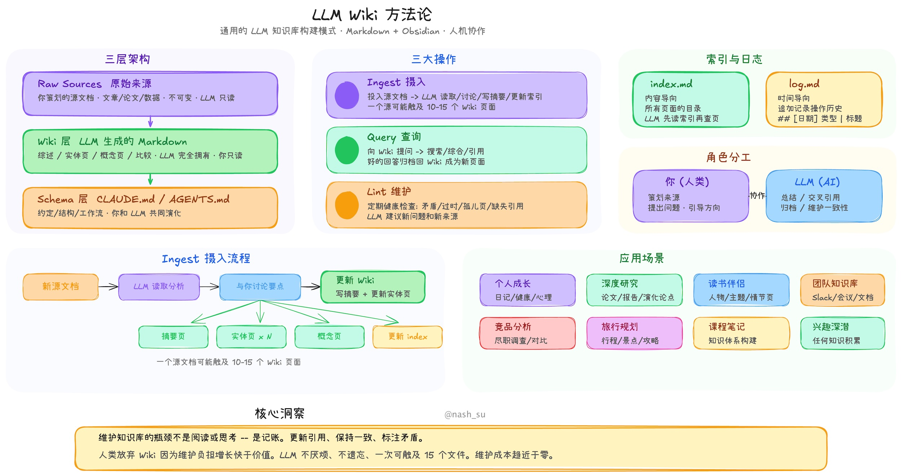
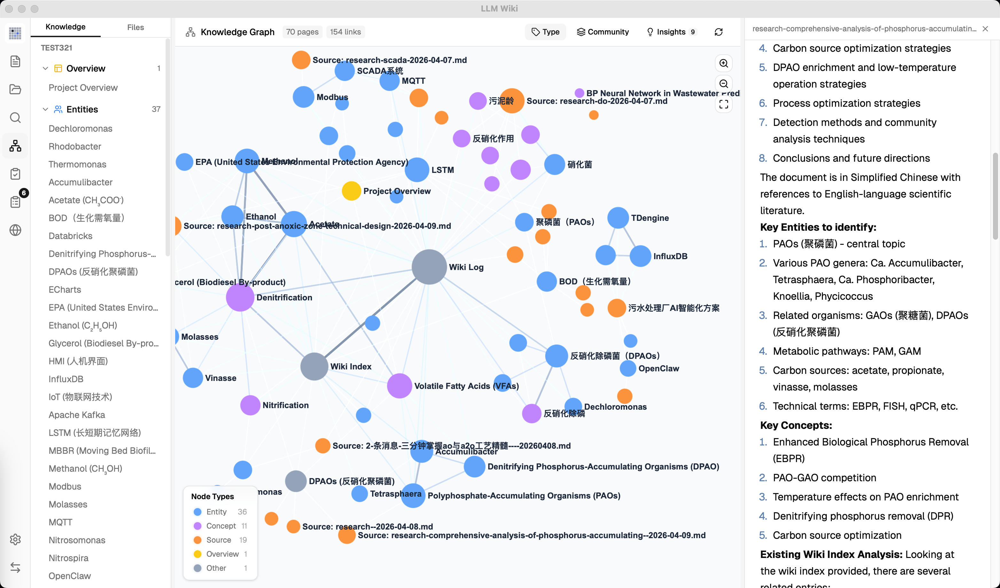

# LLM Wiki — AI 时代知识管理的产品化实现

> LLM Wiki 是将 Karpathy 的个人知识库方法论工程化最完整的开源实现，一款跨平台桌面应用，把文档变成自动维护、互相链接的知识库。

<!-- more -->

## 产品定位

LLM Wiki 解决的核心问题是：**不是 AI 帮你搜知识，而是 AI 帮你维护知识**。

传统 RAG（检索然后回答）每次query都要从零检索；而 LLM Wiki 的思路是：LLM 增量构建并持久维护一个 Wiki，知识和答案编译一次、持续更新，不需要每次都重新推导。

## 核心功能

### 1. 两步 Chain-of-Thought 入库

不是一步到位读资料写页面，而是分两步：

- **第一步（分析）**：LLM 读源文档 → 结构化分析（关键实体、与现有 Wiki 的连接、与现有知识的矛盾）
- **第二步（生成）**：基于分析结果生成 Wiki 页面、交叉引用、更新 index.md

### 2. 知识图谱（4 信号相关性模型）

 relevance model 包含4个信号：

| 信号 | 权重 | 说明 |
|------|------|------|
| 直接链接 | ×3.0 | 通过 `[[wikilinks]]` 链接的页面 |
| 来源重叠 | ×4.0 | 共享同一原始源文件的页面 |
| Adamic-Adar | ×1.5 | 共享共同邻居（按邻居度数加权） |
| 类型亲和 | ×1.0 | 同类型页面加分（entity↔entity） |

### 3. Louvain 社区发现

自动发现知识集群，用内聚度评分（intra-edge density）：低于 0.15 的集群被标记为"知识缺口"。

### 4. 知识缺口自动标出

- **孤立页面**（连接度 ≤ 1）
- **稀疏社区**（内聚度 < 0.15，≥ 3 页）
- **桥接节点**（连接 3+ 个集群）

点一下就能触发 Deep Research 自动补全。

### 5. Deep Research

当 LLM 发现知识缺口时：
- 通过 Tavily / SerpApi / SearXNG 进行网络搜索
- LLM 综合研究发现写成 Wiki 研究页面
- 自动入库提取实体/概念

### 6. Chrome 一键剪藏

内置 Chrome 扩展（Manifest V3），用 Readability.js 提取文章 + Turndown.js 转 Markdown，自动触发两步入库流程。

### 7. 本地 HTTP API + Agent Skill

- 内置 `127.0.0.1:19828` JSON API（Token 保护）
- Agent Skill 一行安装：`npx skills add https://github.com/nashsu/llm_wiki_skill.git --skill llm_wiki_skill`
- 安装后 Coding Agent 可以直接读你的 Wiki

### 8. Obsidian 零迁移

整个 Wiki 目录就是标准 Obsidian Vault，`.obsidian/` 配置自动生成。

## 技术栈

| 层级 | 技术 |
|------|------|
| 桌面 | Tauri v2 (Rust backend) |
| 前端 | React 19 + TypeScript + Vite |
| UI | shadcn/ui + Tailwind CSS v4 |
| 编辑器 | Milkdown (ProseMirror-based) |
| 图谱 | sigma.js + graphology + ForceAtlas2 |
| 搜索 | Tokenized search + Graph relevance + LanceDB (optional) |
| PDF | pdf-extract (Rust) |
| Office | docx-rs + calamine |
| LLM | OpenAI / Anthropic / Google / Ollama / Custom |

## 与 Karpathy 原始方法论的关系

Karpathy 的方法论是纯方法论文档，没有现成产品。LLM Wiki 保留了其核心设计：

- **三层架构**：Raw Sources（不可变）→ Wiki（LLM 生成）→ Schema（规则）
- **三种核心操作**：Ingest、Query、Lint
- **index.md** 作为内容目录
- **log.md** 作为操作历史记录
- **`[[wikilink]]`** 语法做交叉引用
- **YAML frontmatter** 每个 Wiki 页面
- **Obsidian 兼容**
- **人做 curator，LLM 做 maintainer**

同时做了大量扩展：从 CLI 到桌面应用、增加 purpose.md、两步入库、知识图谱、Louvain 社区发现、Deep Research、Chrome 剪藏、等。

## 安装方式

预构建版本（[Releases](https://github.com/nashsu/llm_wiki/releases)）：
- macOS：`.dmg`（Apple Silicon + Intel）
- Windows：`.msi`
- Linux：`.deb` / `.AppImage`

## 数据

- **10.3k Stars**
- **1.3k Forks**
- **526 Commits**
- **v0.4.19**（2026-06-03）

