# Loop Engineering 批判：一个被过度炒作的技术名词

> Loop Engineering 本质就是定时任务/循环调度的重新包装，在 KOL 的利益驱动下被层层加码，炒作成了"新的编程范式"。

<!-- more -->

## 名词溯源：三波炒作接力

### 第一波：Boris 的随口一说

Claude Code 创始人 Boris 在访谈中提到自己越来越多地使用 `/loop` 命令，本质是给 Agent 定时发送 prompt 的任务调度器。他对这个功能很满意，随口说了一句"loops 就是未来"。

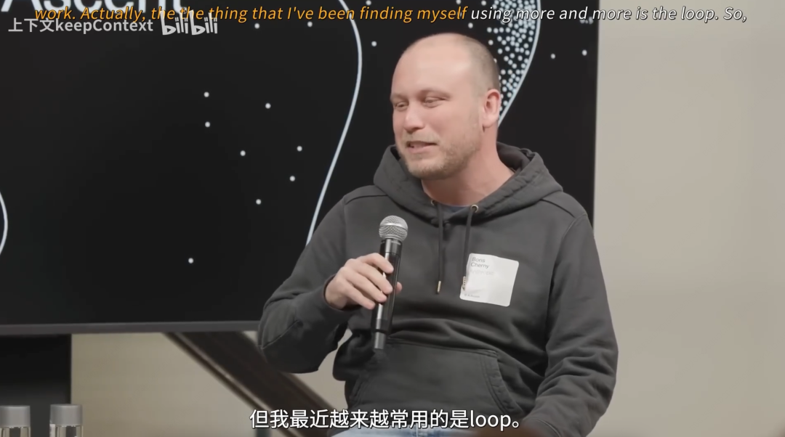

`/loop` 的运作机制极其简单：输入命令 → 指定时间间隔 → 输入任务 prompt → Claude Code 后台按间隔自动发送。就是 cron 的 Agent 包装版。

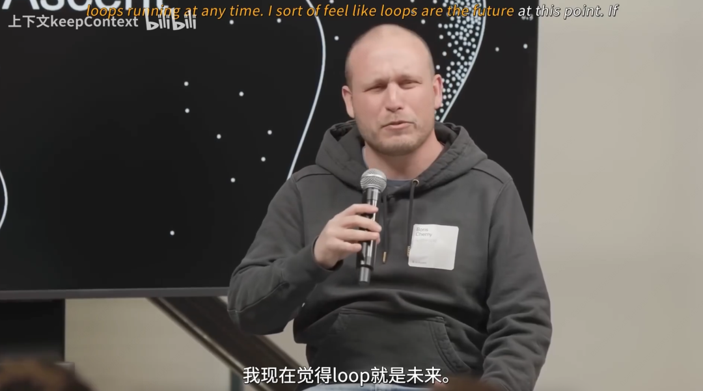
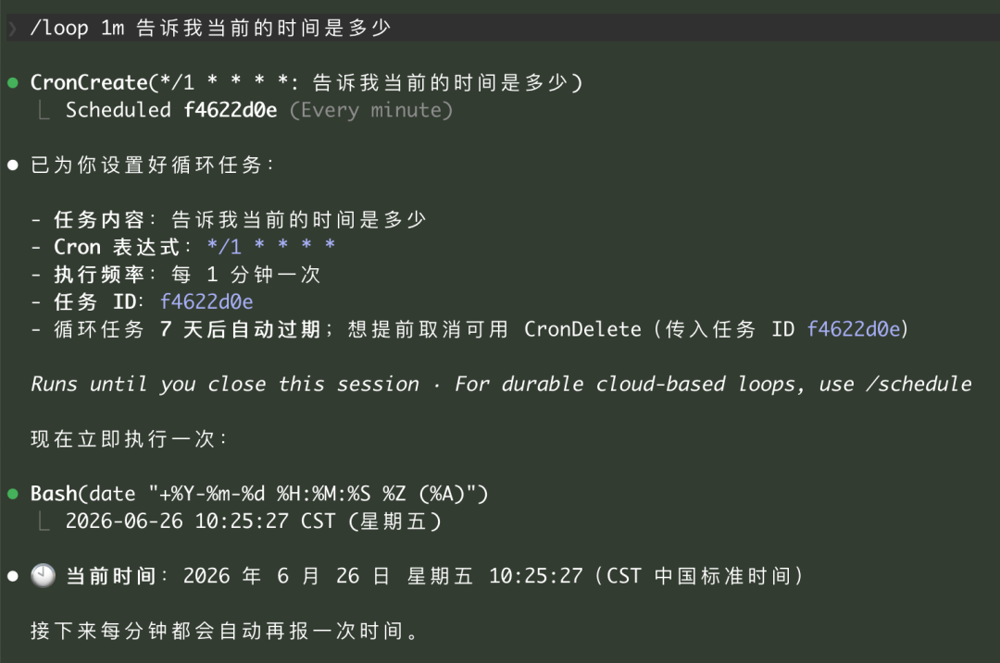

国内各大厂的 Agent 工具早就标配了定时任务，但谁让 Claude Code 掌握了技术的**定义权**。

### 第二波：Peter 的标题党

OpenClaw 创始人 Peter 在 OpenClaw 热度下降后，看到了 Loop 这个话题的潜力。Boris 只是推荐大家用用，Peter 却直接来了个"XXX 已死，YYY 当立"式标题党。

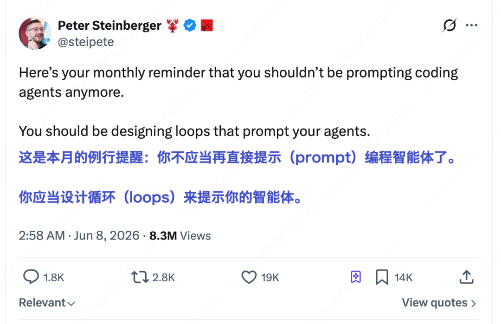

标题党确实有效 —— 传播成本低，还方便转发者"装逼说我发现了新趋势"。

### 第三波：Addy 的抢注定义

谷歌的 Addy（同时也是知名技术博主）这次学聪明了。上次 Harness 概念火的时候他晚了一步没抢到定义权，这次 Loop 刚冒头他就速速写了一篇博客，试图把这个概念正式定义。

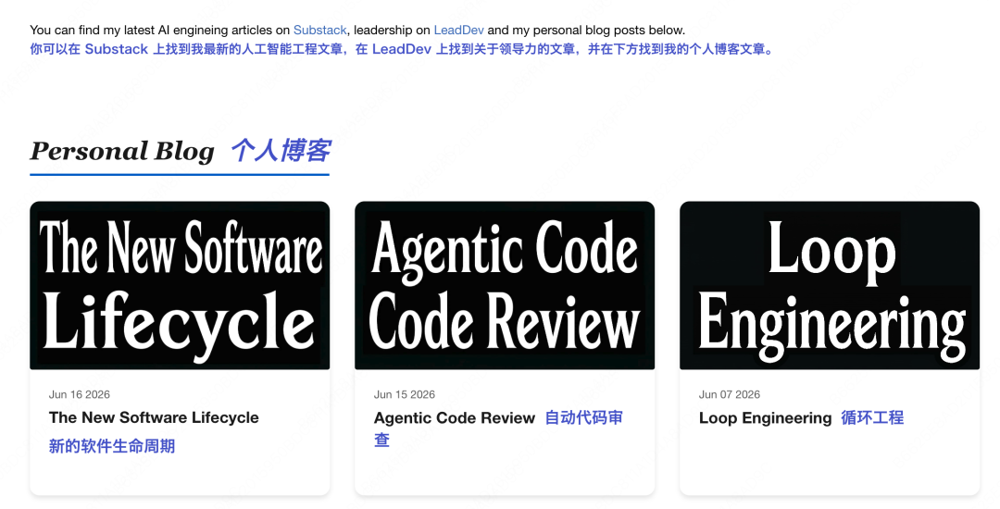

## Addy 文章的致命缺陷

Addy 的文章被作者评为"非常非常非常水"，像是赶工对付出来的。核心套路：

**制造焦虑 → 回顾历史 → 定义框架 → 蹭热度收工**

文章用焦虑体开篇："Prompt Engineering 已死，Loop Engineering 当立"。

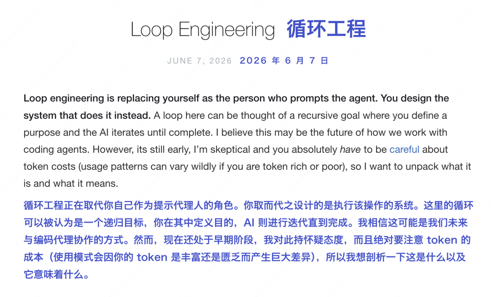

然后回顾前两位大佬的热度发言，表示"你们造热度，定义我来做"。

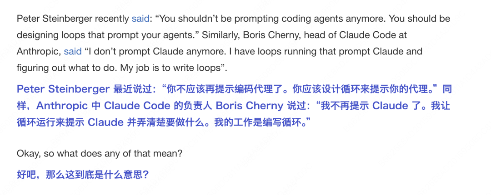

顺便宣传自己上次没赶上热度的 Harness Engineering，把 Loop 放在 Harness 之上作为更高层概念。

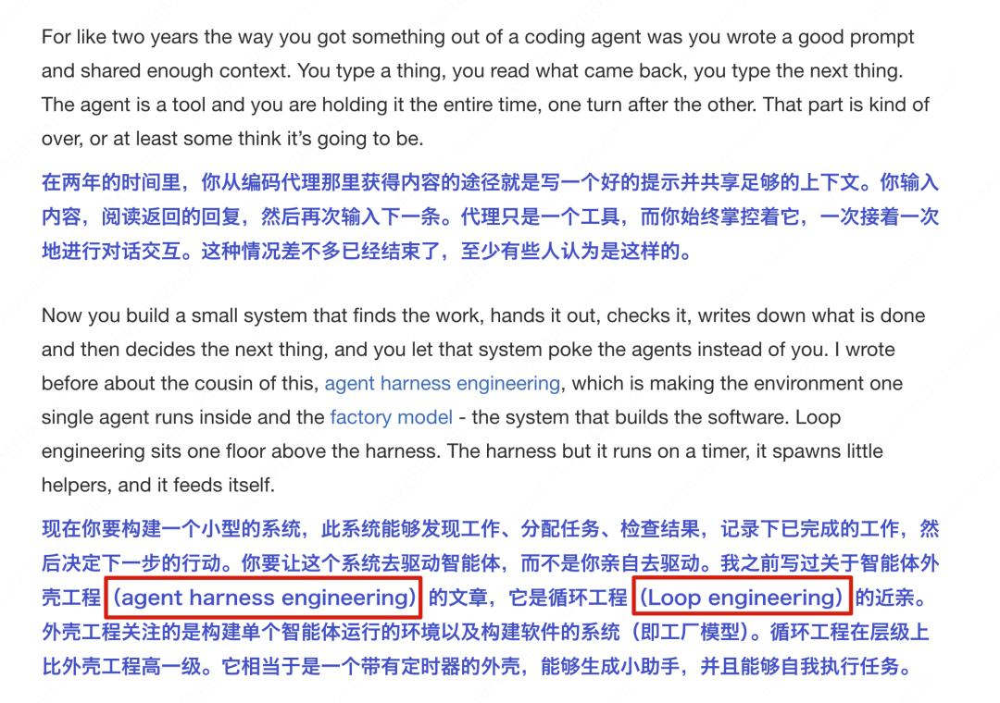

### 五组件框架的问题

Addy 定义了 Loop 需要的五个组件：
1. **Automations** — 自动化机制（定时任务或钩子触发）
2. **Worktrees** — Git 分支
3. **Skills** — 技能包
4. **Plugins/MCP** — 插件或 MCP
5. **Sub-agents** — 子智能体

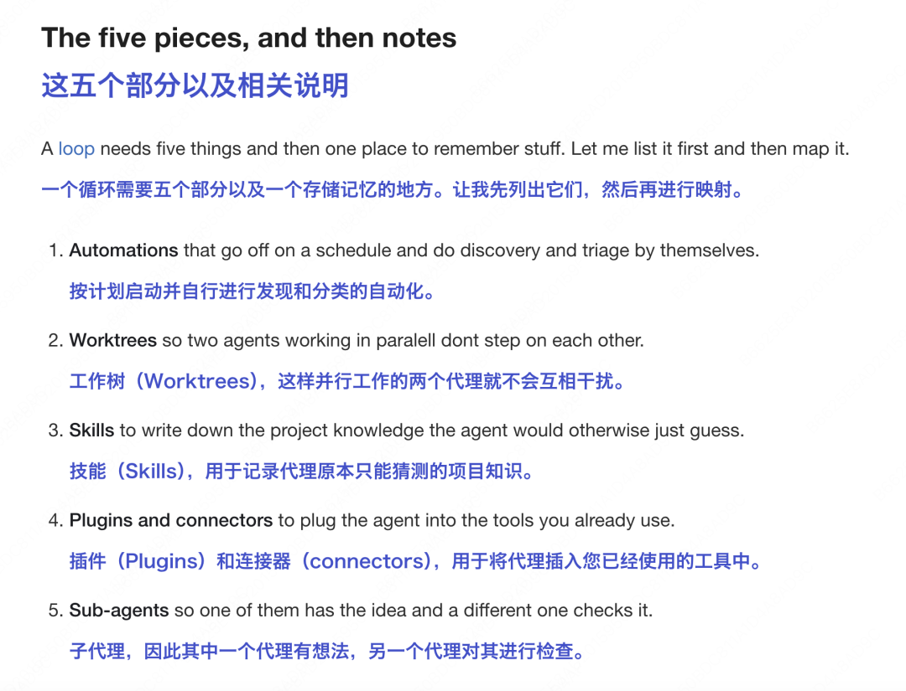

这五个词既没有构成全集的要素、互相之间又不正交、描述的 Scope 也不在一个维度——是个非常粗糙的分类。

后续内容变成了对这些早已熟知概念的流水账描述，强行和 Loop 关联。

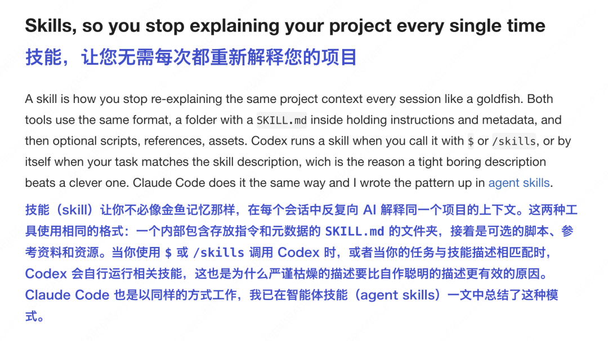

例子也是 Boris 早就讲过的老掉牙案例。

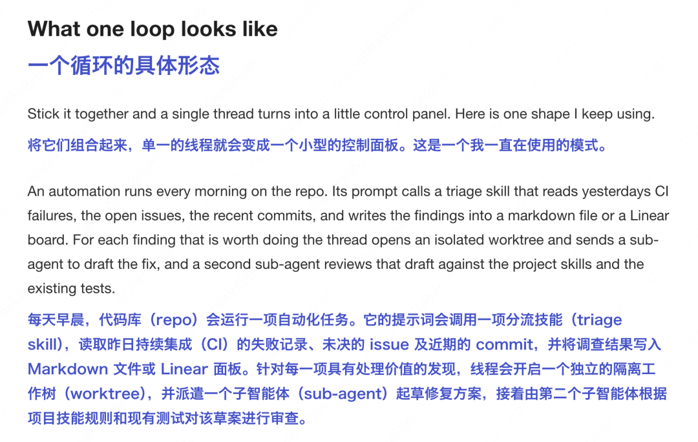

最后不忘叠甲放水："放手去设置循环，但也别忘了直接写 Prompt 同样有效"——开篇那种 Prompt 已死的自信荡然无存。

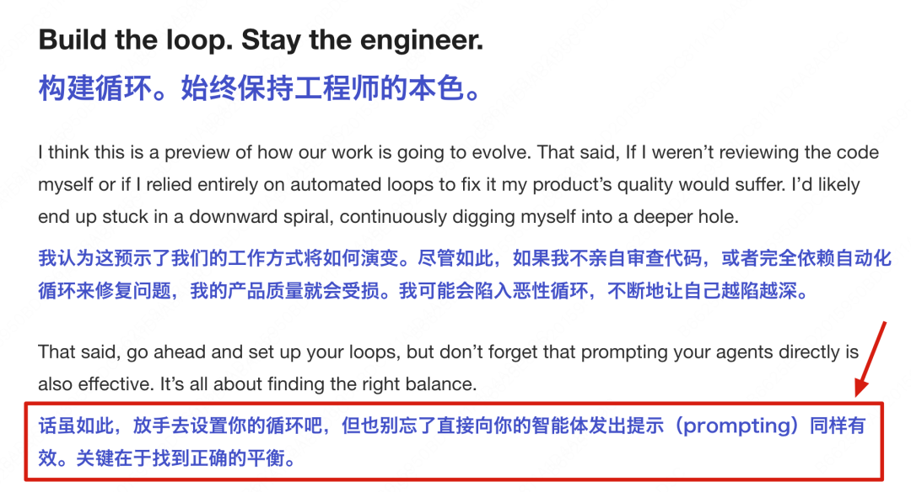

## 核心洞察：KOL 的利益驱动

每个推动这个词的人都有自己的目的：

- **Boris**：宣传 Claude Code 产品功能
- **Peter**：维持 OpenClaw 热度，发言难免标题党
- **Addy**：抓住技术名词热点刷存在感，千载难逢的机会
- **Karpathy**（类比）：加入 Anthropic 后有些发言也难免带营销味

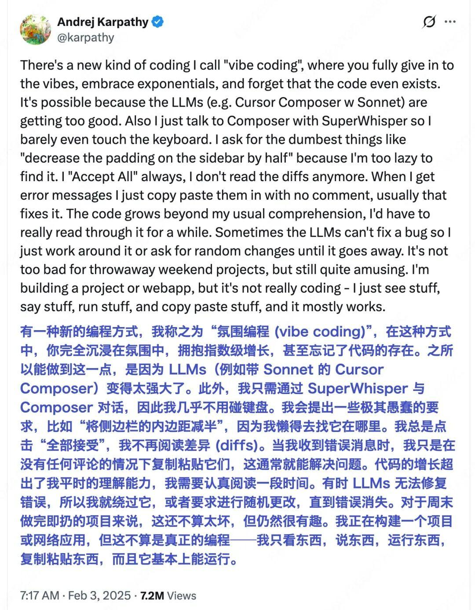
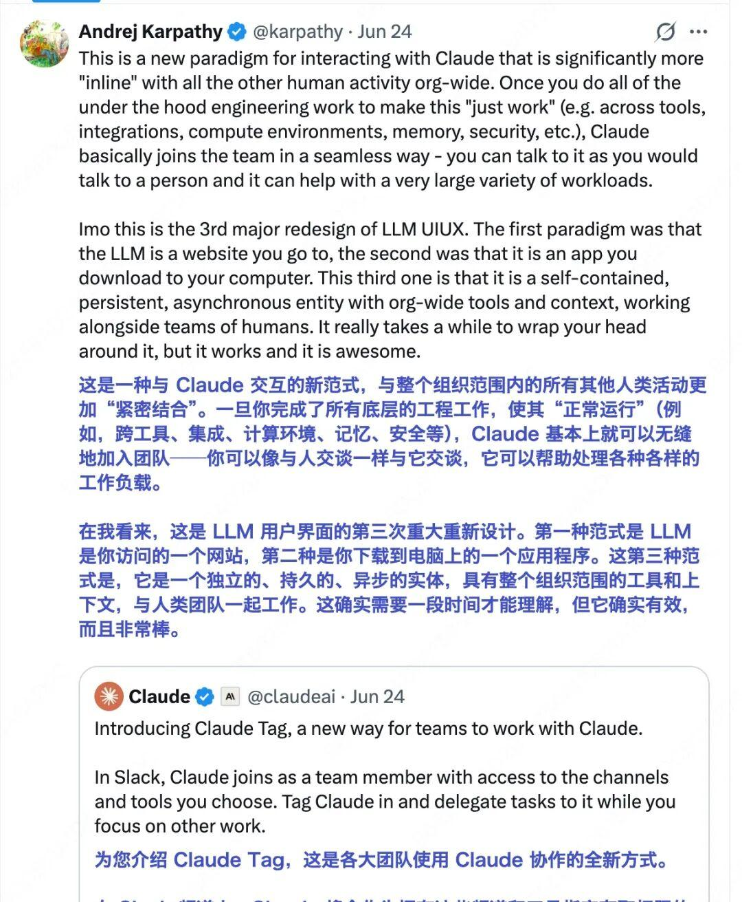

## 深度思考：循环思想确实存在，但不需要新名词

抛开炒作不谈，循环思想在 AI Agent 领域确实有其位置：

- Agent 出现后就有了**循环思想**：Agent 代替人类与大模型循环沟通，通过多轮对话完成任务
- 现在人们想找一个程序再和 Agent 循环沟通，解决更大更持久的问题
- 本质是在寻找更高层级的自动化方式

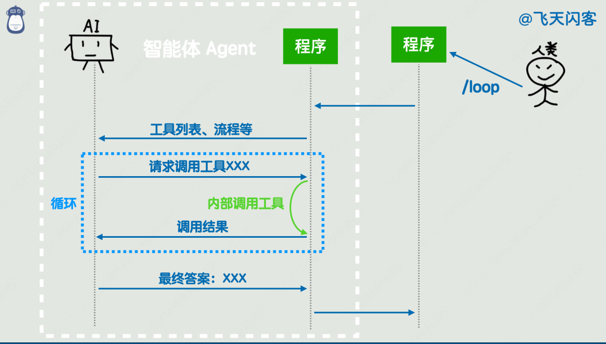

分布式系统（Raft 选主循环）、k8s（循环监控保持稳定）等领域早已实践了循环思想。**循环这层壳不重要，重要的是这套机制能持续运行、自动恢复，需要算法和边界条件的精巧设计**。

## 结语

对于大部分人来说，别说建立一个能运行 Loop 的系统，连一个代码仓库都没有，甚至还没用简单 prompt 写过一个 Demo——哪来的 Loop Engineering 时代？

技术热词的膨胀是 KOL 利益、社区焦虑和注意力经济的合力产物。看清词源，回归本质，比追逐新概念重要得多。
