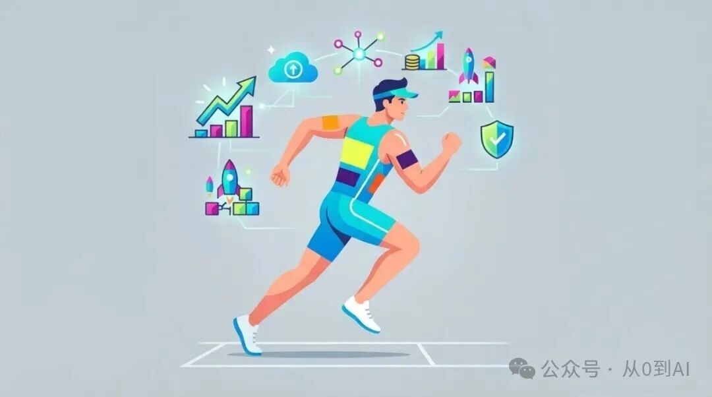

# 他把自己的身体卖了 11.2 万美元：Marc Lou 的钱早就不从代码里来了

独立开发圈里，Marc Lou 大概是最爱做实验的一个人。

9 月 8 日，他发了一条推：I'm selling my body。

这不是比喻。他要去土耳其伊兹密尔跑人生第一场 HYROX 比赛，于是把自己身上的位置当成广告位拍卖。按他自己公布的数字，大约 58 小时，54 笔付款，一共 112,062 美元。

同一时间，让他出名的产品 ShipFast，近 30 天只有大约 2,000 美元的收入。

这篇想聊的就是这个反差：一个靠卖代码模板出名的人，收入是怎么一步一步挪走的。

## 1、Marc Lou 现在靠什么赚钱

先看他 X 简介上自己写的月收入（自报）：

身体：11.2 万美元

TrustMRR：4.4 万美元

DataFast：2.6 万美元

Ship or Die：1.3 万美元

CodeFast：6,000 美元

ShipFast：4,000 美元

他在 X 上有大约 40.2 万粉丝。TrustMRR 上他的创始人页面显示，18 个产品累计收入 318 万美元。

这个排序本身就说明问题：排在最后的，恰恰是让他出名的那个。ShipFast 累计卖了 130 万美元，但近 30 天只剩大约 2,000 美元。

钱从「卖工具」挪到了两个地方：做平台，和卖他本人。

## 2、TrustMRR：一个只收验证数字的数据库

TrustMRR 做的事很简单：创业者用 Stripe 接入，网站展示经过验证的收入。在这之上，再搭一个买卖小公司的交易市场。

它自己的页面，也是 Stripe 验证的：

MRR：2.35 万美元

近 30 天收入：4.64 万美元

累计收入：35.3 万美元

成立时间：2025 年 10 月

团队：1 人

注意，页面上的 MRR 和他简介里的「4.4 万美元/月」不是一个口径。简介是他自己写的，页面是 Stripe 验证的。两个数都摆在这里，读的时候分开看。

## 3、上线 5 天，MRR 到 1.8 万美元

TrustMRR 在 2025 年 10 月 31 日上线。他自己公布的战绩：

52 分钟，收入 1,198 美元。

36 小时，收入 10,085 美元。

5 天，MRR 从 0 到 18,380 美元。

钱主要来自赞助位：网站上 20 个赞助位，全部卖完。

这里的关键不是产品有多复杂，而是他背后站着一大群观众。同样一个网站，换一个没有观众的人来做，第一天可能一个赞助位都卖不出去。

## 4、他拒绝了 120 万美元

2026 年 1 月 15 日，他发推说自己拒绝了 100 万美元的收购报价。

几周以后，报价涨到 120 万美元，条件是他要留在公司干几个月。他的原话是：我给自己打工 8 年多了，这一条让我害怕。

同一条推文里，他公布了新的变现方式：交易市场收 3% 的中介费，当时平均每天成交一笔。每天新上架的项目有 30 个，是刚上线时的 10 倍。推文最后一句是：Back to Cursor，回去写代码了。

5 月 19 日，他又加了推荐分成：3% 的费用，和推荐人五五分。

网站现在公布的数字（站方自报）：

365 天里 180 笔收购，交易总额 110 万美元。

平均成交倍数 1.6 倍，平均 23 天成交。

上架费 29 美元。成功费现在显示为 4% 到 6%，比推文里说的 3% 要高。

## 5、「我在卖我的身体」

回到开头那场拍卖。规则是他自己设计的：

第一，每个位置起拍价 1,000 美元。

第二，有人抢走这个位置，价格翻倍。

第三，被抢走的人拿回退款，只扣 Stripe 手续费。

第四，臀部的位置单独定价，起拍 1 万美元，每次加 5,000 美元。

结果（他自报）：Higgsfield 一家拿下 10 个位置，大约 6.8 万美元；getstanley.ai 用 2 万美元拿下了臀部。

9 月 19 日比赛当天，他跑了 1 小时 5 分 11 秒，拿了年龄组第一。

赛后他写：Getting paid $112,000 to race...

还有一句我印象更深：「我迷茫了很久。我觉得自己被误解，大家觉得我很怪，因为我总在尝试各种实验。」

一周之内就有人照抄。有个创作者把裙子上的 13 个位置卖了，大约 9,200 美元。

## 6、这场拍卖为什么能成

我把它拆成三点。

第一，价格翻倍的规则，本身就是传播。每被抢一次，就多一个「谁又出价了」的故事，推文自己往外走。

第二，退款机制降低了出价的心理成本。被抢走基本不亏钱，所以大家敢先出手。

第三，买家买的不是衣服上的一个 logo，是几十万人的注意力，加上一个有结局的故事：他能不能跑完，跑得怎么样。最后他拿了年龄组第一，赞助商等于顺便买到了一个好结局。

照抄的人拿到了 9,200 美元，他拿到了 11.2 万美元。规则可以抄，观众抄不走。

## 7、我的操作？

看完这个案例，我给自己定了三件事。

第一，把收入按来源拆开看，而不是按产品看。Marc 的 18 个产品里，还在涨的是「平台」和「本人」，代码模板在往下走。我也要看清楚：我的钱到底是产品在赚，还是信任在赚。

第二，给已有的产品加一层撮合。TrustMRR 从展示数字走到收中介费，用户还是同一批，只是多了一个付钱的理由。

第三，把实验公开做。他说自己被当成怪人很久，但正是这些公开的实验，攒下了一群愿意在 58 小时里付 11 万美元的观众。

## 8、值得盯的三个方向

（1）TrustMRR 的交易市场能不能长大。180 笔、110 万美元是站方自己的数字，平均 1.6 倍的成交倍数并不高，看它能不能吸引更大的卖家。

（2）成功费从 3% 变成 4% 到 6% 以后，上架和成交的数量会不会掉。

（3）「卖身体」能不能从一次事件变成持续的收入。简介里「身体 11.2 万美元/月」其实是一场比赛的钱，下一场还有没有人买，才是真正的测试。

代码模板会被 AI 越做越便宜，一个人的注意力却越来越贵。我的看法是：独立开发者最该经营的，可能不是下一个产品，而是自己。
