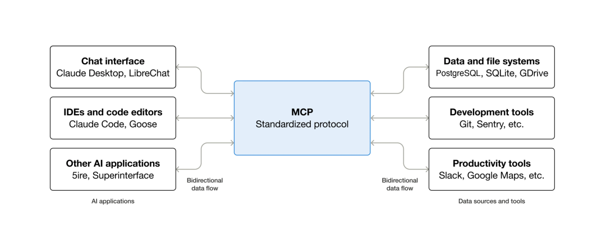
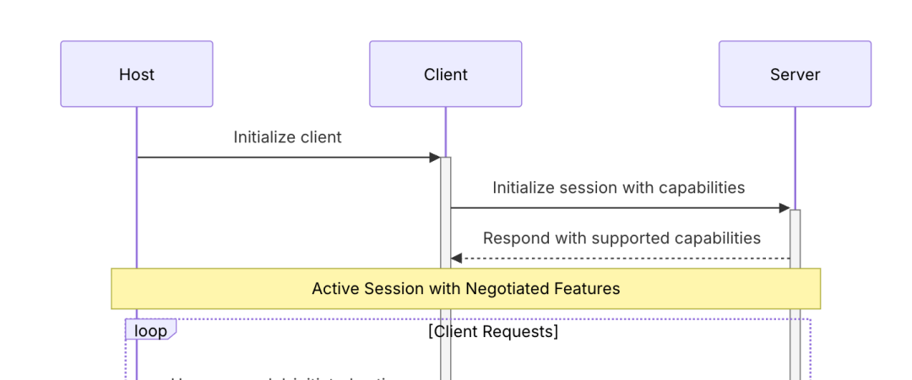
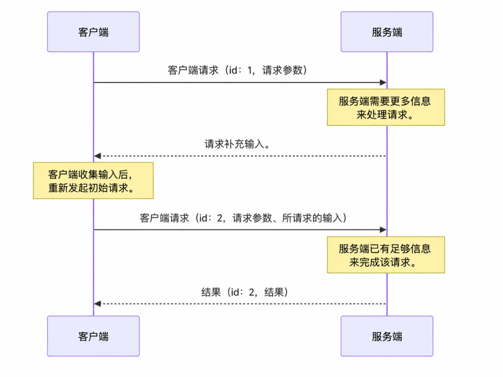

# 一文看懂 MCP 新版本：无状态、可缓存、可扩展

2026 年 7 月 28 日，MCP 发布了新一版协议，是 MCP 诞生以来最大的一次变动。

MCP 正在从一个类似 LSP 的、有会话的双向 RPC 协议，变成更接近现代 Web 基础设施的无状态请求/响应协议。这次更新重新设计了 MCP 的连接方式、多轮交互方式，以及生产环境中的扩展、缓存、路由和安全能力——MCP 变得更加 agentic 了。

## 一、最大的变化：MCP 变成无状态 + 短连接

旧版 MCP 的 Streamable HTTP 通信需要先完成 initialize/initialized 握手。服务端生成 Mcp-Session-Id，客户端后续的每个请求都要带上它。

这个设计诞生之初并没有为远程 MCP server 考虑，更像面向本地场景：Client 和 Server 通过 stdio 或长连接持续通信，双方天然知道对面是谁、支持什么能力。

随着远程 MCP server 的普及，问题开始出现：服务端多实例时，后续请求必须回到保存 Session 的实例，或者所有实例共享会话状态。负载均衡器需要 sticky session，服务端需要 Redis 一类的共享存储。

2026-07-28 版本移除了：
- initialize/initialized 握手
- Mcp-Session-Id
- 协议层隐含的长生命周期会话

协议版本、客户端身份和客户端能力改为通过每次请求的 `_meta` 传递。每个请求都能被独立理解，由普通轮询负载均衡分发到任意实例。

| 旧版 MCP | MCP 2026-07-28 |
|----------|----------------|
| 先握手，再发送请求 | 请求可以直接发送 |
| 用 Mcp-Session-Id 维持协议会话 | 每个请求携带完整的协议元信息 |
| 请求依赖之前建立的上下文 | 请求可以被独立处理 |
| 扩容依赖粘性会话或共享存储 | 可以使用普通轮询负载均衡 |

客户端可以调用新的 `server/discover` 提前了解服务端支持的能力，但不强制——客户端也可以直接发送业务请求，根据协议版本错误降级。

无状态不等于应用不能保存状态。比如浏览器 MCP 需要连续操作同一个浏览器实例，工具可以返回 `browser_id`，让模型在后续调用中作为普通参数传回。变化的关键是：**把隐藏在传输层 Session 中的状态，变成协议之外显式传递的业务句柄**。MCP server 需要自己处理幂等，更像现在的后端服务。

## 二、没有双向会话后，服务端怎么向客户端提问？

旧协议允许 Server 主动向 Client 发起 `elicitation/create`、`sampling/createMessage` 和 `roots/list` 等请求。例如删除文件工具执行到一半需要用户确认，服务端要保持 SSE 连接和当前请求的中间状态，与无状态扩容目标冲突。

新版本使用 **MRTR（Multi Round-Trip Requests，多轮往返请求）** 重构：
1. Client 调用工具
2. Server 发现缺用户确认，返回 `resultType: "input_required"`，附上 `inputRequests` 和可选的 `requestState`
3. Client 收集用户或模型的回答
4. Client 使用新的 JSON-RPC ID 重试原始调用，带上 `inputResponses` 和原来的 `requestState`
5. 任意 Server 实例都能根据本次请求中的信息继续处理

以前是"服务端 hold 住电话等客户端回答"，现在是"服务端先把待确认事项和续办凭证交给客户端，客户端收集完答案后重新提交"。

新版结果增加了 `resultType`：普通完成是 `complete`，需要补充输入是 `input_required`；Tasks 扩展还会增加 `task`。

## 三、其他更新都指向同一件事：生产化

### #1. 请求更容易路由和鉴权

Streamable HTTP 请求需要携带 `Mcp-Method`，涉及工具、资源或 Prompt 名称时还要携带 `Mcp-Name`。网关、WAF 和限流器不必解析 JSON Body 就能知道这是一次 `tools/call` 以及调用了哪个工具。

### #2. 工具和资源列表可以缓存

`tools/list`、`prompts/list`、`resources/list` 和 `resources/read` 等结果增加了 `ttlMs` 与 `cacheScope`。服务端可以告诉客户端缓存多久以及缓存是 public 还是 private。规范建议列表保持确定性顺序，避免工具顺序频繁变化破坏模型 Prompt Cache。

### #3. 通知改成按需订阅

客户端通过 `subscriptions/listen` 明确订阅工具列表、资源或 Prompt 变化，再通过一条 SSE 流接收通知。旧的 HTTP GET 通知通道和可恢复 SSE 机制被移除，连接断开时客户端需要重新订阅、重新拉取数据。

### #4. Tasks 成为正式扩展

MRTR 适合短时间等待确认，Tasks 适合耗时长的后台工作。服务端返回 `resultType: "task"` 和 `taskId`，客户端通过 `tasks/get` 查询进度；任务需要输入时通过 `tasks/update` 提交。即使连接断开，任务也可以继续存在。Tasks 已从实验性核心能力迁移到 `io.modelcontextprotocol/tasks` 扩展，目前只支持用于 `tools/call`。

### #5. 扩展和安全机制更加正式

新版建立了正式的 Extensions 框架，Tasks、MCP Apps 和 Enterprise Managed Authorization 等能力可以独立演进。授权方面增加了 OAuth Issuer 校验、凭据与签发方绑定等安全要求，正式弃用 Dynamic Client Registration，推荐使用 Client ID Metadata Documents。

Roots、Sampling、Logging 以及旧的 HTTP+SSE Transport 进入弃用阶段，至少保留 12 个月迁移窗口。

## 如何理解这次更新？

MCP 最初更像一个连接本地 IDE、工具与模型的双向协议。随着远程 MCP Server 增多，开始遇到标准 Web 服务早已解决过的问题：负载均衡、无状态扩容、网关路由、缓存、异步任务、OAuth 和版本治理。

2026-07-28 的价值就是把这些能力补进协议。

> MCP 正在从面向连接的工具协议，走向一套更接近 Web 原生、适合大规模部署的 Agent 基础协议。

对于只运行本地 stdio Server 的开发者，变化可能暂时不明显；但如果开发远程 MCP、网关或托管平台，这是一版需要认真迁移的破坏性更新。尤其要检查代码是否依赖 `initialize`、`Mcp-Session-Id`、旧的 Server-to-Client RPC 以及可恢复 SSE。