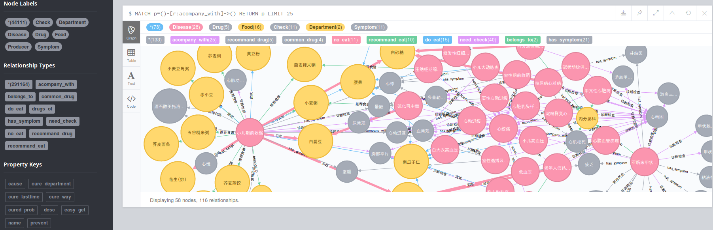
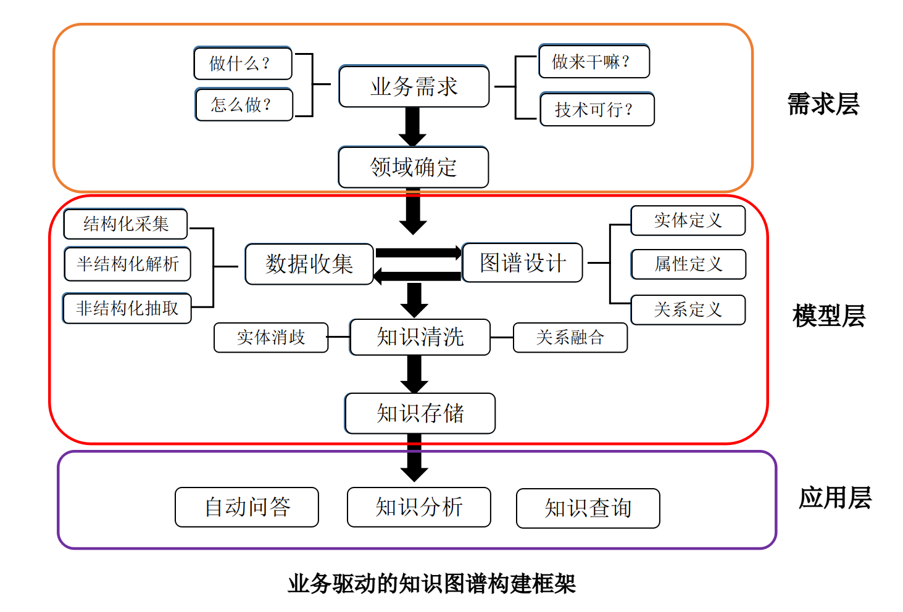
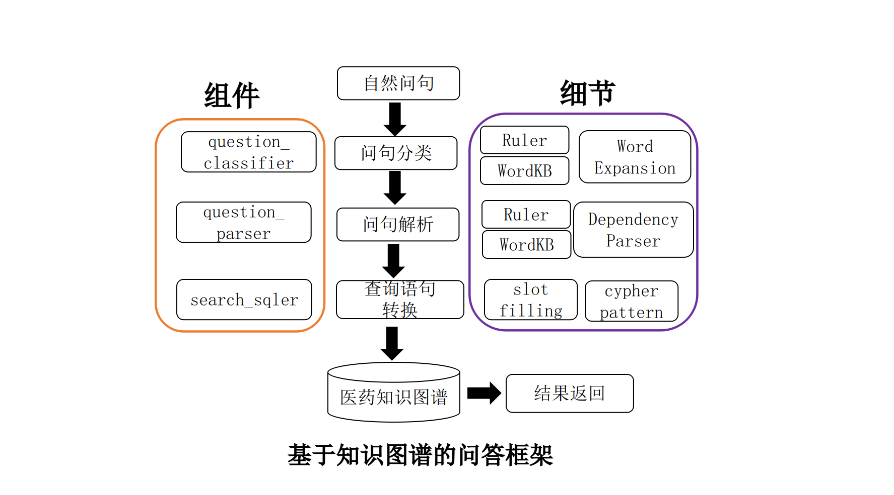
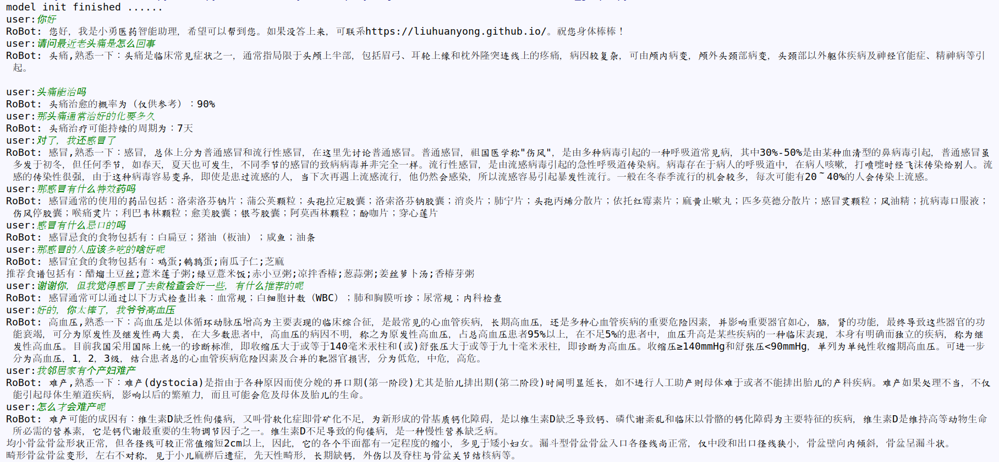
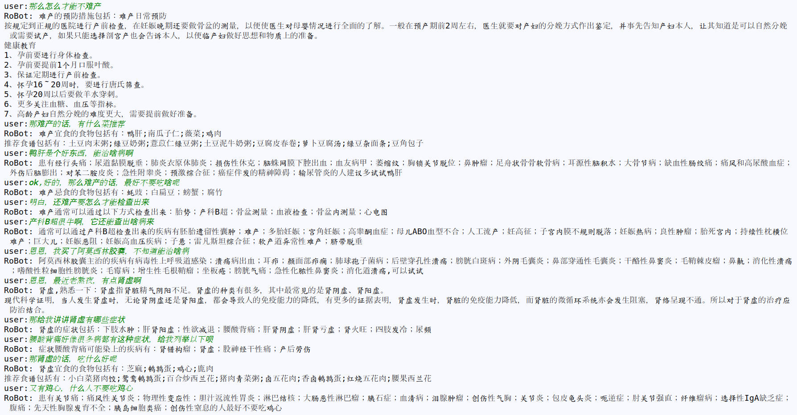

# 基于 Neo4j 图数据库的医疗知识图谱智能问答机器人

> 以疾病为中心，构建 4.4 万实体、30 万关系的医药知识图谱，基于 Neo4j + Cypher 实现 18 类医疗问答。由刘焕勇（360AI研究院）原版，同济子豪兄教程讲解。

<!-- more -->

## 项目概述

将疾病、症状、药物、科室、检查、治疗方法、药物厂商、宜吃不宜吃等医疗术语，提取为知识图谱的节点实体，节点实体之间通过关系连接，将人类的医学"知识"定量固化存储为"知识图谱"。

**原作者**：刘焕勇（360AI研究院）
**教程作者**：同济子豪兄
**Notebook 教程**：https://github.com/TommyZihao/QASystemOnMedicalKG/tree/master/notebook_tutorials

### 完整流程

1. 导入 CSV 表格数据，构建知识图谱
2. 可视化、探索知识图谱（Bloom、GraphXR）
3. 输入问题
4. 提取问题中的实体和连接（命名实体识别、意图识别）
5. 生成 Cypher 查询语句
6. 在 Neo4j 图数据库中运行 Cypher 查询语句
7. 将 Cypher 查询结果翻译回"人话"，输出

## 知识图谱规模

### 实体类型（7 类，共 44,111 个）

| 实体类型 | 中文含义 | 数量 | 举例 |
|---------|---------|------|------|
| Disease | 疾病 | 8,807 | 血栓闭塞性脉管炎 |
| Symptom | 症状 | 5,998 | 乳腺组织肥厚 |
| Drug | 药品 | 3,828 | 京万红痔疮膏 |
| Check | 检查项目 | 3,353 | 支气管造影 |
| Department | 科室 | 54 | 烧伤科 |
| Food | 食物 | 4,870 | 竹笋炖羊肉 |
| Producer | 药品厂商 | 17,201 | 通药制药青霉素V钾片 |



### 关系类型（11 类，共 294,149 个）

| 关系类型 | 含义 | 数量 | 举例 |
|---------|------|------|------|
| has_symptom | 疾病症状 | 5,998 | 早期乳腺癌 → 乳腺组织肥厚 |
| acompany_with | 并发疾病 | 12,029 | 下肢交通静脉瓣膜关闭不全 → 血栓闭塞性脉管炎 |
| common_drug | 常用药品 | 14,649 | 阳强 → 甲磺酸酚妥拉明分散片 |
| recommand_drug | 推荐药品 | 59,467 | 混合痔 → 京万红痔疮膏 |
| need_check | 所需检查 | 39,422 | 单侧肺气肿 → 支气管造影 |
| do_eat | 宜吃食物 | 22,238 | 胸椎骨折 → 黑鱼 |
| no_eat | 忌吃食物 | 22,247 | 唇病 → 杏仁 |
| recommand_eat | 推荐食谱 | 40,221 | 鞘膜积液 → 番茄冲菜牛肉丸汤 |
| belongs_to | 属于 | 8,844 | 妇科 → 妇产科 |
| drugs_of | 在售药品 | 17,315 | 青霉素V钾片 → 通药制药青霉素V钾片 |

### 疾病属性

| 属性 | 含义 | 举例 |
|------|------|------|
| name | 疾病名称 | 喘息样支气管炎 |
| desc | 疾病简介 | 又称哮喘性支气管炎... |
| cause | 疾病病因 | 常见的有合胞病毒等 |
| prevent | 预防措施 | 注意家族与患儿自身过敏史 |
| cure_lasttime | 治疗周期 | 6-12 个月 |
| cure_way | 治疗方式 | 药物治疗、支持性治疗 |
| cured_prob | 治愈概率 | 95% |
| easy_get | 易感人群 | 无特定的人群 |

## 架构设计

### 知识图谱构建框架



数据来源：垂直型医药网站结构化数据 → XPath 解析 → JSON 格式化 → Neo4j 入库

### 问答系统架构



核心模块：
- **question_classifier.py**：问句类型分类（18 类意图识别）
- **question_parser.py**：问句解析（实体抽取 + Cypher 生成）
- **answer_search.py**：答案搜索（Cypher 执行 + 结果整理）
- **chatbot_graph.py**：对话主程序

### 支持的 18 类问答

| 问句类型 | 含义 | 示例 |
|---------|------|------|
| disease_symptom | 疾病症状 | 乳腺癌的症状有哪些？ |
| symptom_disease | 症状找疾病 | 最近老流鼻涕怎么办？ |
| disease_cause | 病因 | 为什么有的人会失眠？ |
| disease_acompany | 并发症 | 失眠有哪些并发症？ |
| disease_not_food | 忌口 | 失眠的人不要吃啥？ |
| disease_do_food | 宜吃 | 耳鸣了吃点啥？ |
| food_not_disease | 禁忌人群 | 哪些人不能吃蜂蜜？ |
| food_do_disease | 食物益处 | 鹅肉有什么好处？ |
| disease_drug | 用药 | 肝病要吃啥药？ |
| drug_disease | 药品治啥 | 板蓝根颗粒能治啥病？ |
| disease_check | 检查 | 脑膜炎怎么查出来？ |
| check_disease | 检查查啥 | 全血细胞计数能查出啥？ |
| disease_prevent | 预防 | 怎样才能预防肾虚？ |
| disease_lasttime | 治疗周期 | 感冒要多久才能好？ |
| disease_cureway | 治疗方式 | 高血压要怎么治？ |
| disease_cureprob | 治愈概率 | 白血病能治好吗？ |
| disease_easyget | 易感人群 | 什么人容易得高血压？ |
| disease_desc | 疾病描述 | 糖尿病 |

## 问答运行效果




## 项目运行

```bash
# 1. 配置 Neo4j 数据库及 Python 依赖
# 2. 导入知识图谱数据（约需数小时）
python build_medicalgraph.py
# 3. 启动问答
python chat_graph.py
```

## 总结

1. 从无到有构建以疾病为中心的医疗知识图谱，实体 4.4 万、关系 30 万，耗时 3 天
2. 基于规则的方式完成知识问答，以 Cypher 查询语句作为问答搜索
3. 以业务驱动构建，schema 基于网页结构化数据 XPath 解析生成
4. 可快速部署，数据已放在 `data/medical.json`