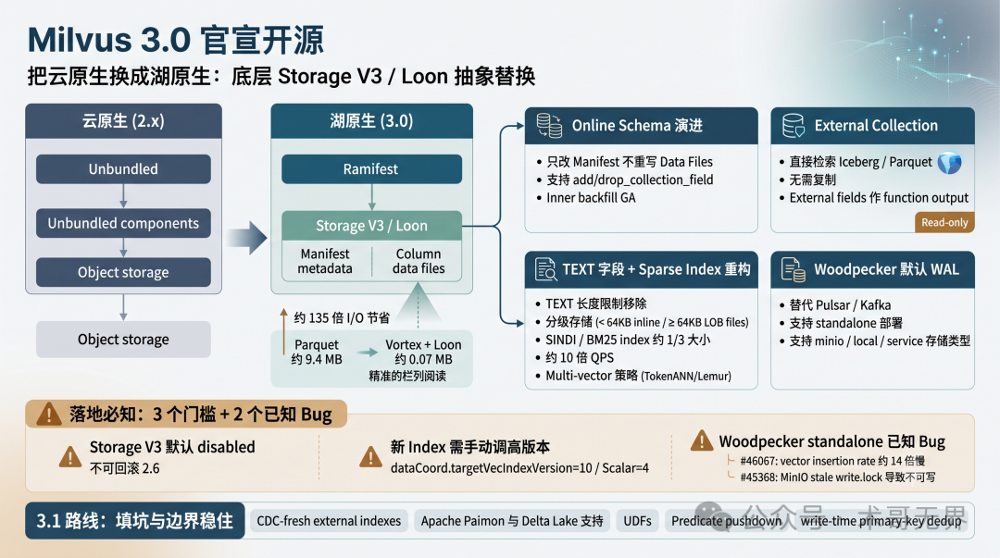
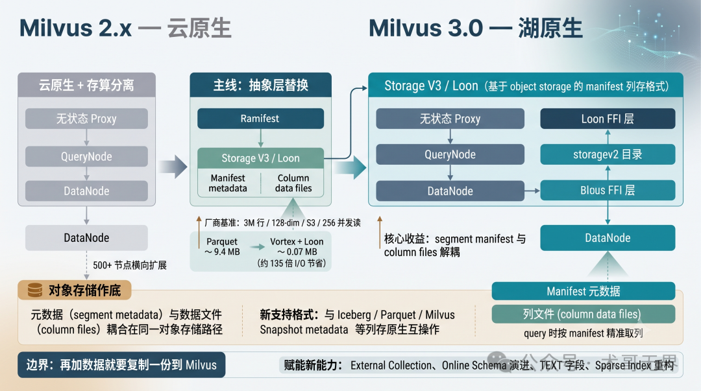
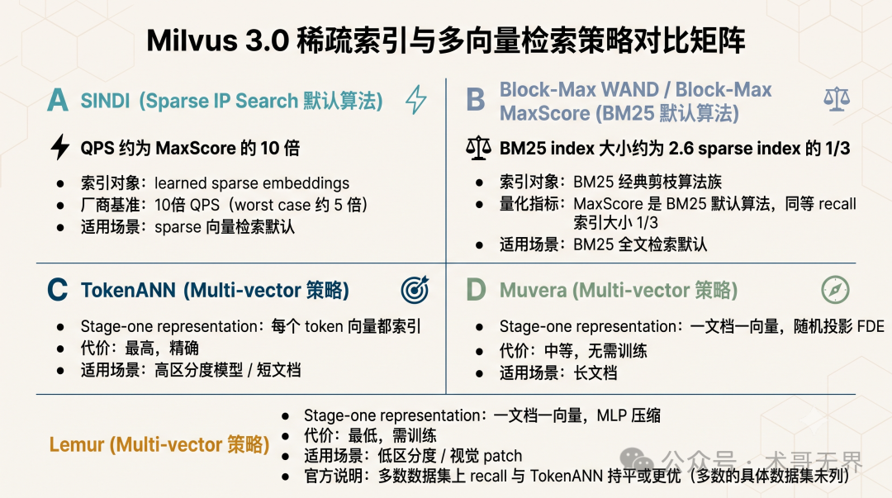
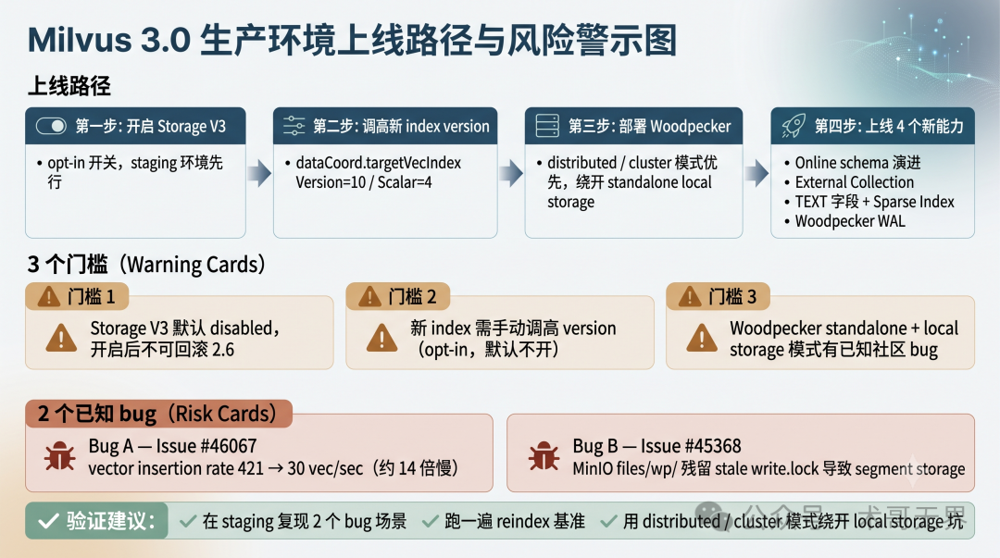

# Milvus 3.0 官宣开源：4 个真改工作流的能力，剩下 16 项要看场景再上

> 作者：运维有术。Milvus 3.0.0 的 GA 不是新功能堆叠，而是把 beta 挖的坑填上、把上层能力的边界稳住。Lake-native 是故事，complete what the beta started 才是这一版本号做的工作。

Milvus 3.0.0 在 2026 年 7 月 29 日 GA（来自 GitHub tag 与 LF AI & Data 基金会的双源验证）。官方 release notes 里有一句话被很多人跳过：

> Building on the lake-native architecture introduced in 3.0-beta, this release completes what the beta started.

这句话很重要。它不是谦虚，是把 3.0 定性成 beta 的句号，而不是新功能堆叠。如果你只把它当成 2.6 → 3.0 的常规升级看，会错过这条主线。

翻完一遍源码（internal/core/src/storage/loon_ffi/、internal/storagev2/、pkg/streaming/walimpls/）和官方文档库（web-content/v3.0.x），我对这次发布的判断是：底层是 Storage V3 / Loon 这层抽象替换，上层是 External Collection、Snapshots、Online Schema、TEXT 字段、Sparse Index 重构，它们才是真正改你工作流的东西。

## 1. 主线：把云原生换成湖原生

Milvus 2.x 的核心卖点是云原生 + 存算分离：无状态组件、对象存储做底、500+ 节点可扩。这套思路的边界在 2.6 已经摸到了，再加数据就要复制一份到 Milvus。

3.0 不打算解决扩的问题，它换了抽象。从 release notes 提到的新一代存储抽象、源码里 internal/storagev2/ 目录、loon_ffi/ 路径下的 FFI 封装来看，Milvus 把存储底座换成了 Storage V3 / Loon：基于 object storage 的 manifest 列存格式。

更准确说，Loon 干的是这件事，把 segment 的元数据（manifest）和数据文件（column files）解耦，query 时按 manifest 精准取列。对用户表现出来的效果，官方博客给了一组厂商口径数字（3M 行 / 128-dim / S3 / 256 concurrent readers）：Parquet 基础读每点 ~9.4 MB，Vortex + Loon 压到 ~0.07 MB，约 135 倍 I/O 节省。但要注意：这个数字只有官方博客一处来源，没找到第三方独立复现。

## 2. 这 4 个能力，真正改变工作流

### 2.1 Online schema 演进：加字段、backfill、删字段

Schema 在线变更在 3.0 才算正式闭环。官方博客对 add_collection_field 和 drop_collection_field 的描述很关键：只改 manifest，不重写 data files。存量向量文件一个字节都不动，新增列只是元数据层面的事。

3.0 的 backfill 区分了两种方向：
- **Inner backfill（已 GA）**：函数计算的字段。比如给一个 text 列加 BM25 函数，输出列对存量数据自动算出来，不用双写
- **External backfill（仍在 roadmap，3.0 之后）**：值在 Milvus 外计算。take a snapshot → run Spark → compute a new column → write back。换 embedding 模型走 hot path 是 3.1 的事

### 2.2 External Collection：从 zero-copy 读到完整 lakehouse 检索

你能在 Milvus 里直接检索一份已经存在 Iceberg / Parquet 里的数据，不用把数据复制进 Milvus。

3.0.0 的新增强化：External fields 可以作为 function output 字段；Refresh 支持 additive schema evolution；新增 milvus-tableexternal format。

第三方实战（ideas.paasup.io）确认了 zero-copy 可行。但有几个坑：
- External Collection 是 **read-only**，写入和 CDC 自动同步在 3.1
- Schema 变更靠 tbl.overwrite() 重写 Parquet + drop + recreate collection
- external_source 必须指向 metadata.json 文件路径，不是目录
- S3 URL scheme 必须是 s3://，不能用 minio://

### 2.3 TEXT 字段 + Sparse Index 重构：RAG 和 BM25 同时变

3.0 把 TEXT 字段提升到一等公民。长度限制在存储侧被移除；小于 64 KB 的值 inline 存储，≥ 64 KB 进 partition-level LOB files（Vortex 格式）。LOB files 跨 segments 共享，compaction 时移动引用不重写文本。

RAG 场景里，向量和源文本现在可以放在同一个 store 里一次 IO 取出。

Sparse Index 这条线 3.0 重写了，引入三个算法：
- **SINDI**：在 learned sparse embeddings 上，默认 sparse IP search 算法
- **Block-Max WAND / Block-Max MaxScore**：BM25 的默认算法

厂商口径：BM25 index 大小约为 2.6 sparse index 的 1/3；SINDI QPS 约为 MaxScore 的 10×。

Multi-vector 给了三种 trade-off 策略：

| 策略 | Stage-one representation | 代价 | 适用场景 |
|------|------------------------|------|---------|
| TokenANN | 每个 token 向量都索引 | 最高，精确 | 高区分度模型 / 短文档 |
| Muvera | 一文档一向量，随机投影 FDE | 中等，无需训练 | 长文档 |
| Lemur | 一文档一向量，MLP 压缩 | 最低，需训练 | 低区分度 / 视觉 patch |

### 2.4 Woodpecker 当默认 WAL：运维侧变化

3.0 默认 WAL 已经是 Woodpecker（替代 2.x 默认的 Pulsar / Kafka）。支持 3 种 storage.type：minio（默认）/local/service。支持 standalone service 部署，独立扩缩、故障隔离、可观测。

少一个 ZooKeeper / BookKeeper 组件栈，少一份 Pulsar 集群的运维负担。

## 3. 落地前必须知道的 3 个门槛 + 2 个已知 bug

### 3.1 Storage V3 默认 disabled，但一旦开启就不可回滚

common.storage.useLoonFFI 默认是关闭的。更关键：一旦启用改变序列化数据格式的功能（如 Storage V3），回滚 2.6 不再可能。

### 3.2 新 index 需要手动调高 version

新 sparse algorithms 需要先把 dataCoord.targetVecIndexVersion=10 和 dataCoord.targetScalarIndexVersion=4 手动调起来。

### 3.3 Woodpecker 的两个已知问题

- Issue#46067：切换 Woodpecker MQ + local storage 后，vector insertion rate 从 421 vec/sec 暴跌到 30 vec/sec（约 14× 慢）
- Discussion#45494：docker compose down/up 后启动报 segment storage not writable，原因是 MinIO 中 files/wp/ 残留 stale write.lock 文件

## 4. 3.0 没解决的、3.1 在路上的事

- CDC-fresh external indexes：让外部表增量同步到 Milvus
- Apache Paimon 和 Delta Lake support
- UDFs（User-Defined Functions）
- Time-travel / schema evolution / snapshot rollback 完整化
- Predicate pushdown、write-time primary-key dedup

如果你的核心场景是 lake 数据要写要更新，那 3.0 是过渡版本，3.1 才是目标版本。

商业生态上，Pinecone / Weaviate / Qdrant 也都在朝低搜索延迟 + lake 互操作的方向走。Snowflake / Databricks 已经在云数仓端有向量能力。这是 Milvus 商业侧的隐形墙。

## 总结

把这次发布拆穿看：主线是架构替换（云原生 → lake-native），底层是 Storage V3 / Loon 的 manifest 列存抽象。真正改变工作流的能力：online schema 演进、External Collection、TEXT 字段、Sparse Index 重构、Woodpecker 默认 WAL。

上线前必须知道的边界：Storage V3 开启后不可回滚 2.6；新 index 默认不开启；Woodpecker standalone + local storage 有两个未确认修复的社区 bug。

我赌的判断是：Milvus 3.0 这次 GA 的关键不是功能数量，而是把 beta 挖的坑填上、把上层能力的边界稳住。lake-native 是故事，complete what the beta started 才是这一版本号做的工作。

> 说明：本文内容基于 Milvus 3.0.0 官方 release notes、本地源码（milvus-io/milvus）和 GitHub tag、LF AI & Data 博客等公开来源交叉整理而成。文中标注的"厂商口径"数据均为官方公布的内部基准，未做独立复现。