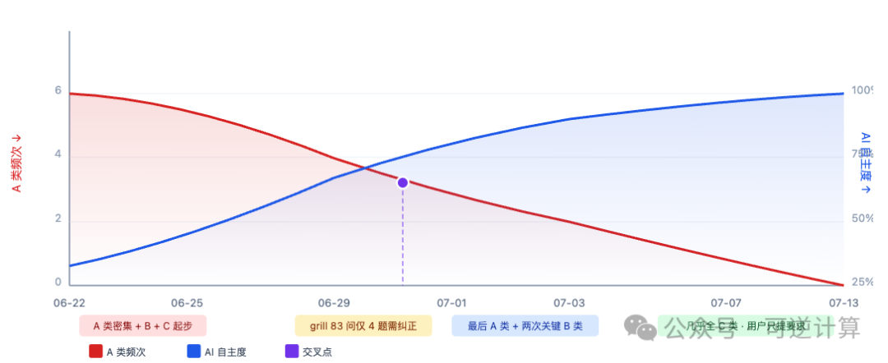

# 关于《Mission Driver：Loop Engineering 的一种通用参考实现》的补充说明

> 本文澄清 Mission Driver 所在的概念体系（Loop Engineering / Attractor-Guided Engineering），回答它解决什么问题，以及为什么这样设计。核心命题：Mission Driver 不只是 Loop Engineering 的通用实现，而是在 AGE 概念体系下定义状态与演化的框架。

<!-- more -->

## 引言

本文是对《Mission Driver：Loop Engineering 的一种通用参考实现》的补充说明，澄清 Mission Driver 的独特定位。

**关键区分**：网上常见的 Loop Engineering 实现大多是黑箱模型——AI 的内部状态对使用者不可见、不可控，人工介入只能停止循环并修改提示词。而 Mission Driver 把核心运行状态显性化为 **roadmap 与 plan 文件**（文件就是 AI 的认知），人工介入是**异步的**——可以直接修改 roadmap 或投放新的 plan，下一轮循环自动拾取。

另一个更根本的区别：目前大部分 AI 工程都是面向**单次任务**的——包括 goal 驱动在内。信息容器就是任务本身，任务完成、会话结束，信息便随之失效。AI 长时间（周甚至月）自主运行所依赖的方向引导，不能来自外部用户输入，只能来源于**项目自身的 Owner Doc 体系**。

> "文件就是 AI 的认知"并不是说文件等于 AI 运行的全部内部状态，而是说：只有被外化、能够跨 Session 恢复并继续约束后续行动的认识，才构成长期自主系统可继承的项目认知。

---

## 一、概念体系定位：Loop Engineering vs. AGE

### 1.1 Loop Engineering：业内的概括性表达，但没有回答"为什么能收敛"

Loop Engineering 是业内对 AI 自主运行当前能达到的阶段的概括性表达。Andrew Ng 的三层 Loop 模型（Agentic Coding 分钟级、Developer Feedback 小时级、External Feedback 天/周级）、Boris Cherny 的"我不再写 prompt 了，我改成设计写 prompt 的系统——我在写 Loop"。

这个概括本身没问题。但它只描述了"自主运行需要采用什么执行形态"，没有回答两个更深的问题：

1. **loop 为什么能稳定存在，以致趋于收敛？**
2. **在 loop 持续运行期间，人与 AI 如何交互？**

很多号称 loop 驱动的系统，方向、裁决、纠偏其实都来自循环外的人——用户一边看输出一边做决定，跟 vibe coding 并没有本质区别。想调整行为，通常只能停止循环、修改提示词，然后重来。

**这两个缺口来自同一个根源：loop 只是一个执行结构。方向、状态、轨迹——这些让系统能够自我校正的东西，不在 loop 的范畴之内。**

### 1.2 AGE：回答"loop 为什么能稳定存在以致收敛"

AGE（Attractor-Guided Engineering，吸引子引导工程）的核心是四个概念：

| 概念 | 定义 |
|------|------|
| **状态空间** | 系统演化过程所有可能出现的结构 |
| **吸引子** | 系统长期应稳定趋向的结构 |
| **轨迹** | 系统实际上怎样走到了现在 |
| **控制** | 测量与纠偏机制如何把轨迹拉回吸引子附近 |

在这个概念体系中，"持续运行"不再是目的，而是方向已经被外化后的自然结果。loop 之所以能稳定存在并趋于收敛，不是因为循环设计得有多精巧，而是因为三个时间维度上的机制已经就位：

**运行之前**：docs 体系已经建立
- 规范性文档（architecture / design 等稳定 Owner Docs）定义"系统长期应该是什么"——期望吸引子与权威归属，不带日期、原地更新
- 时效性文档（plans / logs / audits / analysis 等过程记录）描述"某个时间窗口内实际发生了什么"——带日期、只在有效窗口内可信，过期后必须重新验证
- 冲突以 **Precedence** 定义的权威归属为准，而非按更新时间或取用便利性裁决

**运行之中**：AI 的内部状态和认知被显性化
- roadmap / plan / audits 文件就是它的认知，人不需要猜 AI 在想什么
- 人的介入有标准方案：直接修改 roadmap 或增删 plan，下一轮循环自动拾取

**运行之后**：经验被提炼并反哺
- AI 可以从 logs / plans / audits 中挖掘本轮经验
- 人工纠正的模式沉淀为 skill，审计遗漏的维度补入审计提示词
- 重复失败提升为 lessons

#### 长期连续性来自认知恢复，而不是 Session 延续

单个 Session 的认知不是时间平移不变的。长期自主运行必须满足更严格的条件：

> 在任意合理的中断点启动一个新的执行主体，它都能够仅依据当前项目状态，恢复继续同一条工程轨迹所需的认知。

AGE 不要求保存每个 Session 的完整推理过程，也不要求回放全部历史。它要求当前仓库保存对后续行动**足够的认知结构**。

### 1.3 Mission Driver：对 Loop Engineering 的通用实现

Mission Driver 可以看作是对 Loop Engineering 的一种通用实现——底层是一个通用的 **Flow DSL 运行引擎**，每一轮循环为下一个 AI 步骤重新构建 prompt，占位符（`{{planGuide}}`、`{{roadmapPath}}` 等）从配置变量表注入实际值。换一个 flow 文件就能适配不同场景。

在概念体系上，Mission Driver 是 **AGE 框架下的一种全自动运行机制**：

- **Loop 的执行结构**由 Loop Engineering 提供
- **状态管理和演化规则**由 AGE 定义
- Mission Driver 运行于由 docs 体系承载的吸引子定义之上

### AGE、Harness、Mission Driver 的界限

| 层级 | 角色 | 回答什么问题 |
|------|------|-------------|
| **Harness** | 模型之外的一切（指令、上下文、传感器、护栏、验证、反馈循环） | 当前轨迹是否偏离？如何纠偏？ |
| **AGE** | 定义吸引子 + 收敛标准 | 应该回到哪里？什么是收敛？ |
| **Mission Driver** | AGE 下按 roadmap 编排 Plan 生命周期的执行器 | 接下来该关闭哪一次变更？ |

> Harness 解决"当前轨迹是否偏离、如何纠偏"，但 Harness 本身不定义"应该回到哪里"。AGE 定义了吸引子，并赋予 Harness 长期演化方向与收敛标准。

### 四个可观察的机制设计

1. **状态显性化**：roadmap / plan / audits 文件显性化 AI 的内部运行状态与认知
2. **不停循环的介入**：人工介入可以在不停止 loop 的情况下直接修改或新增 plan、修改 roadmap
3. **轨迹的充分统计量**：通过 logs 记录核心轨迹信息，新主体不必考古历史提交就能恢复关键演化认知
4. **审计反哺**：审计历史可以反向抽取各种 skill，改进后续工作

### nop-app-erp 案例数据

**22 天（06-22 → 07-13）、187 份 Plan 全部双审计通过，人工介入从早期高频衰减至 07-14 后为零。**

人工介入分三类：
- **A 类**（明确指明 Nop 平台机制）：集中在早期 06-22 ~ 06-26
- **B 类**（指明工程原则方向）：集中在中期 06-29 ~ 07-01
- **C 类**（只要求 AI 自查对比、不暗示答案）：后期 07-04 之后占绝大多数

A 类频次下降与 AI 自主度上升两条曲线在 **06-29 ~ 07-01 交叉**，此后 AI 自主成为主要工作模式。被转移的知识沉淀在 **19 个可复用 skill**、docs-for-ai 补充与 lessons 教训中。

> 用户不是在写代码，而是在转移平台知识。一旦知识转移完成，介入频率自动归零。

---

## 二、它解决什么问题

### 2.1 Vibe Coding 的两个结构性困境

**第一个：质量失控。** AI 的执行本质上是概率采样过程，在没有外部控制结构介入时，AI 很容易走上岔路：改到一半跑去改别的代码，改完忘记跑测试，失败了陷入死循环，进程崩溃后状态丢失只能从头再来。更危险的是自我宣称完成——跳过实际实现直接声称做完了。

**第二个：产能限制。** 人在环中时，每一步都依赖人的触发和判断。AI 可以 7×24 运行时，工时不再是制约因素——较弱的模型虽然慢，但足够便宜，可以夜间跑。成本结构从"每小时人时产出"变为"**每美元智能产出**"。

### 2.2 从 Human In The Loop 到 Human On The Loop

Mission Driver 的目标不是"替代人"，而是"让人可以在任意时间点介入，但不需要在每一步都介入"。它把人的介入从"必须"变成了"可选"。

这种可选参与的机制是**异步的**：plans/ 目录就是文件系统上的共享队列。人可以随时自己起草一张 Plan 放进队列，或修改某张 Plan 的状态——下一轮循环的 REVIEW_PLANS 会自动拾取并审查。

**四个必须自动解决的子问题**：

| 子问题 | 说明 |
|--------|------|
| **排序** | 大量变更的执行顺序——动态查询路线图结构，而非一次性确定的甘特图 |
| **状态** | 每张 Plan 当前处于什么阶段——持久化在 Plan 文件自身中 |
| **推进** | 谁来选择下一个工作项？谁来起草新的 Plan？推进和审计不能是同一个主体 |
| **审计** | 路线图工作项耗尽时，谁来触发深度审查？ |

### 2.3 与普通工作流引擎的区别

| 维度 | 普通工作流引擎 | Mission Driver |
|------|---------------|----------------|
| **运行内容** | 设计时已确定的既定任务 | roadmap 动态规划 work item，plan 定义关闭契约 |
| **状态位置** | 引擎内部（运行时/数据库） | 仓库文件中（plan 的 status 与 checkbox） |
| **运行形态** | 一次运行消费一个确定实例 | 面向 7×24 持续运行，重启后扫盘恢复 |

**最本质的区别**：普通工作流引擎编排的是确定性步骤，Mission Driver 编排的是**概率性 AI 步骤**。

Flow DSL 的五种步骤类型中：
- `tool`（shell 命令）和 `script`（JS 函数）是确定性的
- `group`（子步骤的带轮次循环）和 `subflow`（递归子流程）是结构性编排
- `agent`（spawn opencode 子进程）**天然不确定**——同一个 prompt 在不同 session 可能走不同路径

**三层容错机制**：

1. **微循环**：agent 步骤内部，marker 解析失败 → runParseAgent 推断 → 修正子进程（最多 2 次）；进程被杀 → onError 重试（默认 3 次）；限流 → 指数退避
2. **Loop 嵌套 Loop**：主循环（五步闭环）在外，内嵌 group 与 subflow
3. **结构性容错**：每个步骤独立 `maxRetries` / `onError` / `onMaxRetries`；全局有 ping-pong 检测、`maxCycleVisits`、`maxTotalSteps` 防死循环

### 2.4 与 LoopX 的对比

LoopX 是面向长周期 AI agent 的本地控制平面，slogan 是"Keep the loop moving. Keep the judgment human."

**工程层共识**：

| 共识点 | 体现 |
|--------|------|
| 聊天记忆不是长期任务的事实源 | logs 记录核心轨迹，"文件就是它的认知" |
| Human On The Loop | 人的介入从"必须"变成"可选" |
| 有界回合 + 验证后写回 | Closure Gates 拒绝虚假完成 |
| 更长的运行不等于更好的产品 | 固定目标的 Loop 只是伺服机构 |
| 证据紧凑可恢复 | Plan 关闭契约定义"从哪开始、允许什么、在哪闭合" |

**三点差异**：

1. **理论层**：AGE 的吸引子体系是独特增量。LoopX 自我定位为控制平面而非方向来源；Mission Driver 前进一步：期望吸引子定义长期结构，方向前提外化为仓库结构
2. **自动化边界**：LoopX 保留人的判断在每个环节；Mission Driver 把人类治理限定在方向层，执行与编排层追求无人值守
3. **架构取向**：LoopX 是 agent-agnostic 旁路控制层；Mission Driver 是自包含的 Flow DSL 引擎 + 编排器，文件系统即唯一真相层

---

## 三、为什么这样设计：内部设计思想

### 3.1 Plan 是关闭契约，也是中间状态合法性的管理器

Plan 不是任务清单——它是 AI 自主执行的基本单位，是一份**关闭契约**：

- **当前基线**（Current Baseline）：从仓库读，不靠记忆
- **目标集**（Goals + Non-Goals）：明确做什么，更重要的是不做什么
- **退出标准**（Exit Criteria + Closure Gates）：可观察的完成条件
- **审查记录**（Draft Review Record）：使 Plan 的演化过程可追溯

在跨会话场景中，Plan 同时管理着中间状态的合法性。一次迁移进行到一半时，仓库可能同时存在旧接口、新接口、兼容层、临时测试、部分迁移模块。如果没有显式 Plan，下一个主体很可能把这些临时结构理解成正式架构。

> Plan 的核心不是管理工作量，而是管理对中间状态合法性的裁决。

### 3.2 生成与验收分离

解决的问题：同一个上下文生成的证据会逐步偏向某一概率分布。

AI 可以在同一个上下文中生成代码、测试、文档、Plan 更新、完成说明和自我审查结论。如果最初理解发生偏差，这些产出可以彼此一致，却共同指向错误方向。

**Fresh Session 和独立 Audit 的意义不是"再看一遍"，而是切断验收对生成者完成叙事的直接继承。**

**Proof Drift** 的隐蔽陷阱：测试只有在与某项承诺保持有效关系时，才构成 Proof。实现改动后，旧测试可能仍然稳定、清晰，却已经不再证明原始行为——它开始保护旧实现细节。

> AGE 要维护的不是简单的"代码 ↔ 测试"，而是"语义承诺 → 可观察后果 → 证明证据"。

### 3.3 工程实现细节

- **注入机制**：Prompt 模板包含占位符，从 mission 配置变量表注入实际值，换项目时只需修改 JSON 配置
- **断点恢复**：进程崩溃后重启，引擎不回放历史步骤，而是扫描磁盘上 Plan 的 status 行和 checkbox 标记
- **零 IPC**：没有进程间通信、消息队列或数据库。要判断系统当前状态，只需读文件
- **子流隔离**：一个 plan 的失败不传播到兄弟 plan

### 3.4 循环即智能：多时间尺度的递归闭环层叠

"固定目标、固定反馈和固定控制规则的单一 Loop，只是一个伺服机构。"

智能的本质：一个系统围绕某种组织同一性，在不确定环境中运行多时间尺度的感知—预测—行动闭环，将反馈沉淀为**结构记忆**，并递归修正自身模型、控制方式和结构边界的能力。

在 AGE 中，这表现为不同时间尺度的闭环层叠：

| 层级 | 时间尺度 | 功能 |
|------|----------|------|
| **执行级 Loop** | 秒至分钟 | 捕获错误、诊断、修复和重试 |
| **Plan Loop** | 小时至天 | 审查、执行、Proof、Closure Audit |
| **Mission Loop** | 天至周 | 编排多个 Plan，识别跨模块缺口 |
| **Attractor 演化 Loop** | 更长周期 | 修正实现、Harness 或 Attractor 本身 |

> 从 AGE 的视角看，智能不是一个固定目标下的单层 Loop，而是受 Attractor 引导、跨多个时间尺度运行、能够自我修正并积累结构记忆的递归闭环层叠。

---

## 四、它的边界：Mission Driver 不能做什么

### 4.1 它不定义方向

> Mission Driver 能保证 Loop 持续推进，但不能单独保证轨迹方向正确。

如果当前基线本身已经偏离，它会更快地固化错误。

### 4.2 期望吸引子与实际吸引子

| 概念 | 定义 |
|------|------|
| **期望吸引子** | 系统在持续演化中，应该反复保持或重新回到什么结构附近？ |
| **实际吸引子** | 在当前代码基线、开发习惯、测试、CI、Agent 行为共同作用下，项目实际上会反复回到什么结构？ |

AGE 的目标是让二者逐步对齐：

> 定义期望吸引子 → 外化为仓库语义结构 → 设计 Harness → 观察长期轨迹 → 判断实际吸引子是否接近期望吸引子 → 修正

> 当前状态符合 Owner Docs，不足以证明实际吸引子已经对齐。

### 4.3 它不是中性执行器

Mission Driver 不定义期望吸引子，但它会**显著影响实际吸引子**。它决定哪些行为会被反复执行。

> Mission Driver 不只是提高效率。它还在检验：项目是否已经将足够多的方向、权威、证明和轨迹记忆外化，使其不再依赖某个同步在场的人进行解释。

如果答案是否定的，**Mission Driver 越自动，漂移可能越快**。

### 4.4 它是对 AGE 完整性的压力测试

在人工协作中，许多缺口可以被人的临时解释掩盖。Mission Driver 持续运行后，这些隐性补丁会消失，系统会暴露：路由不完整、Owner 不明确、Precedence 无法裁决、Plan 与 live repo 基线不符、Closure 只是 Checkbox、Proof 与语义承诺脱节、Freshness 不足却仍允许自动扩张。

---

## 五、如何理解"AI 全自动开发"

"全自动"至少有三个不同层次：

1. **执行自动化**：给定明确 Plan，AI 自主修改代码、编写测试、运行验证
2. **编排自动化**：给定 Roadmap 和 Attractor，Mission Driver 自主起草 Plan、审查、排队执行、关闭任务
3. **方向自治**：系统自主澄清模糊目标、提出新结构语言、比较竞争 Attractor、处理组织利益冲突

**前两层已可实现高度自动化，第三层仍需明确的人类治理。**

---

## 六、总结

传统软件工程本质上是以人为核心的工程。人所扮演的角色相当于一个随时可以降临、随时可以注入"正确答案"的全知全能的上帝。

但 AI 7×24 小时自主运行，意味着**上帝必须退场**。系统必须戒断对神谕的依赖，自己拥有内在的运行规律。

> 不是让某个 Agent 记住项目，而是让项目本身不再遗忘自己。

> 曾经的问题：如何让 Agent 更稳定地长期工作。
> 真实的问题：如何让项目本身——文档、代码以及运行其上的 Mission Driver 等工具——构成一个持续演化的主体。

---

## 关联文章

- [Mission Driver：Loop Engineering 的一种通用参考实现](./mission-driver.md) — 可逆计算
- [实用循环工程](./bestblogs-2026-08-15.md) — Addy Osmani
- [Agent Token 架构](../concepts/agent-token-architecture.md)
- [AgentScope HarnessAgent 声明式策略](../concepts/agentscope-harnessagent-declarative.md)