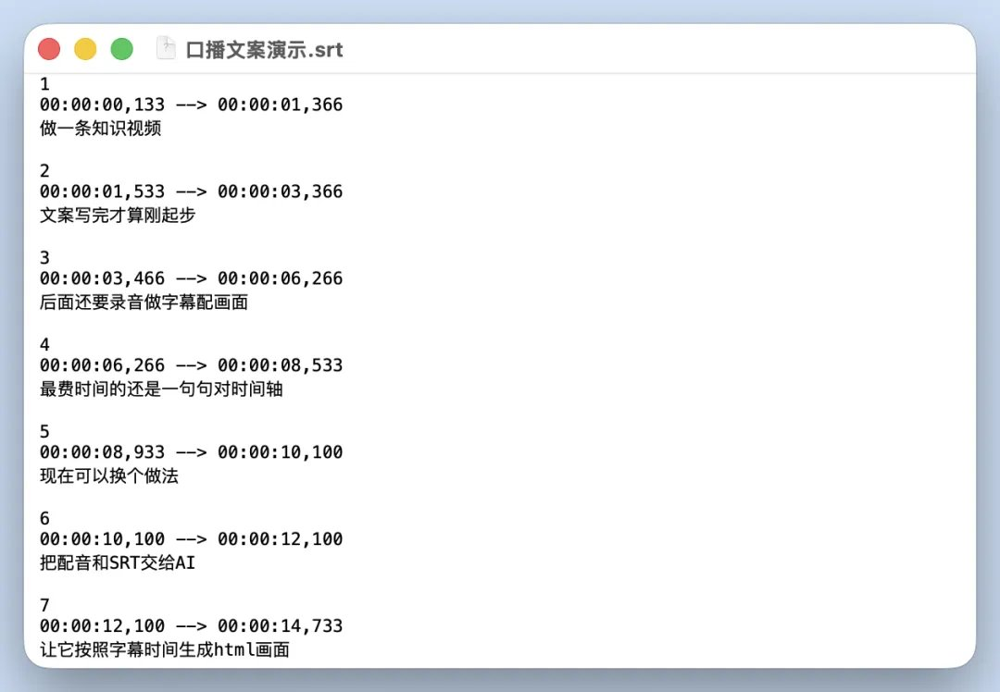
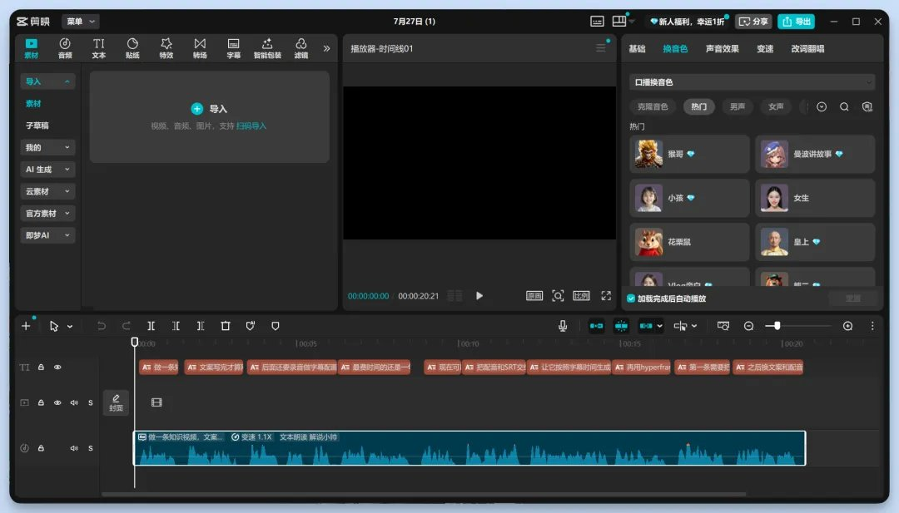
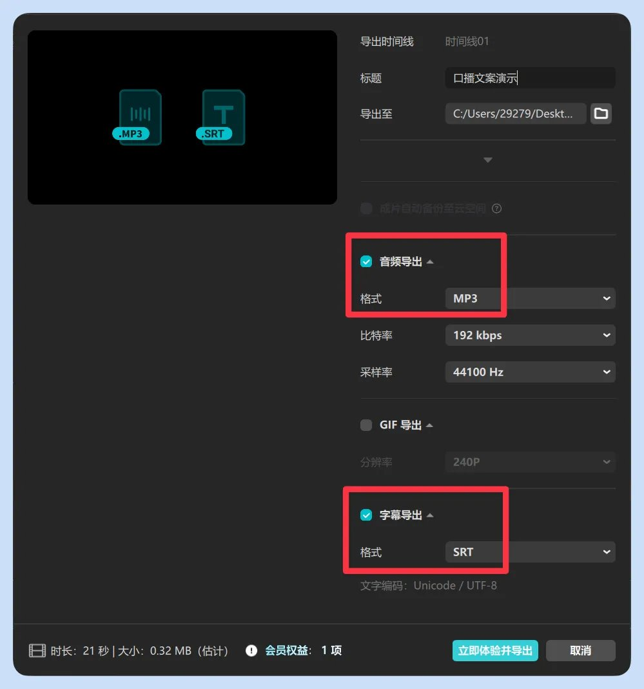
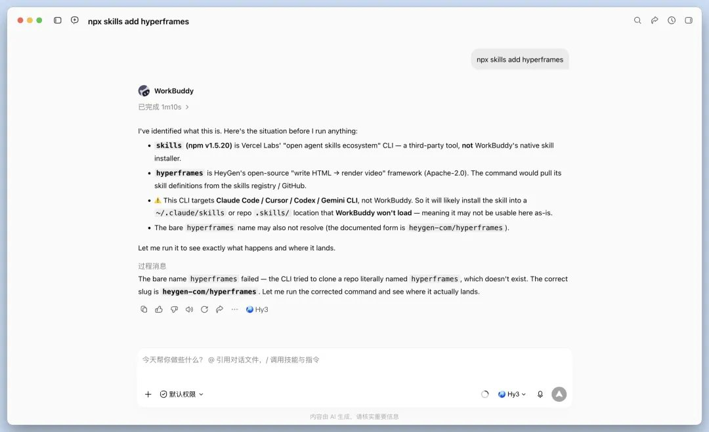
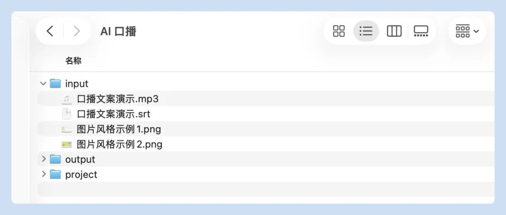
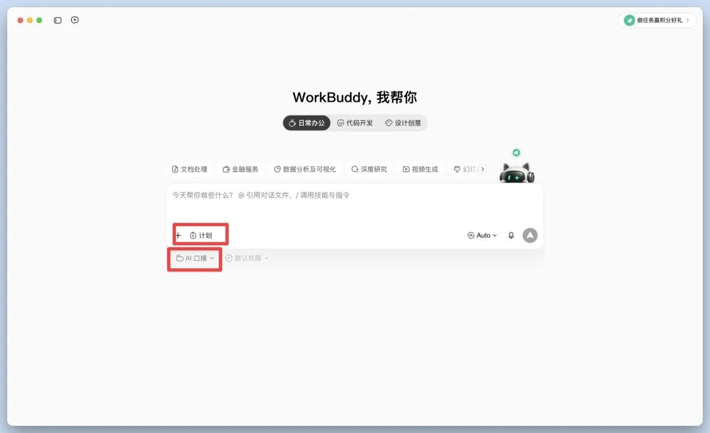
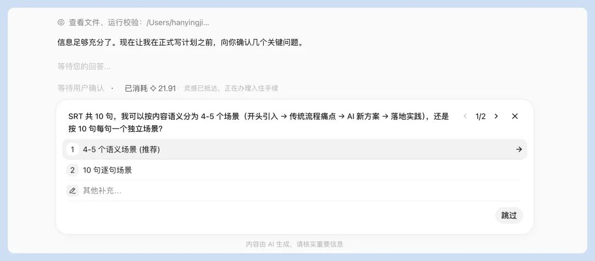
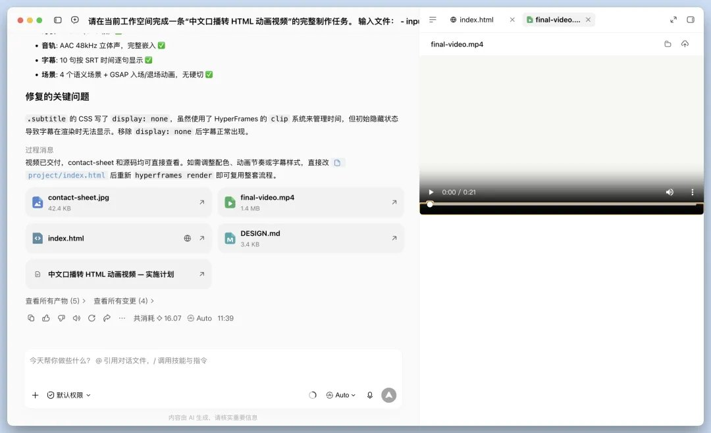

# 手把手教你用WorkBuddy做HTML视频


大家有没有刷到一些讲解类视频，整体画面就像是一套能动的 HTML 版PPT？

刚好这段时间我们在研究 HyperFrames 玩法，它的原理也是用 HTML生成画面然后组合成视频。于是我们想能不能让 HTML 负责前端画面，HyperFrames 负责时间轴和渲染？

沿着这个思路，我们用 WorkBuddy 成功复刻了同款视频。

先看两段最终成片，大家可以看出哪一条是 WorkBuddy 制作的吗？

视频一：


[video](../videos/mixailab-workbuddy-html-pipeline/001.mp4)

视频二：


[video](../videos/mixailab-workbuddy-html-pipeline/002.mp4)

整套流程分为4步：文案、音频、SRT字幕文件、HTML视频。

文案、配音和 SRT 可以生成逐句同步的 HTML 画面，再直接渲染成 MP4。

正式开始前，先把需要的工具和素材准备完整。

## 01. 开始前，工具准备

一个AI Agent：WorkBuddy、Codex或Claude Code；

HyperFrames：负责把HTML逐帧渲染成MP4；

剪映：识别字幕、导出 mp3 口播录音、出SRT口播稿；

Node.js 22+：运行HyperFrames（配置交给AI）；

FFmpeg：最后编码视频（配置交给AI）。


最后在生成视频前，要有三份素材：

```
xxx.mp3            最终配音
xxx.srt            带时间戳的字幕
xxx.png、xxx.png    视觉参考图
```

工具就这些，接下来讲这套方法里真正巧妙的地方。

## 02. SRT会给画面“排期”

普通的AI视频做法，是把整篇文案丢进去，让AI自己猜每一页该停多久。

猜得准还好。猜不准时，配音已经讲到下一段，画面还卡在上一页；或者一句话还没念完，标题先飞走了。

这套方法没有让AI猜，直接把SRT字幕交给AI。

AI拿到它，就像拿到了一张画面排期表。卡片什么时候弹出来，哪一秒切场景，都能直接固定在时间戳上。



## 03. 第一步：先写一份“能变成画面”的口播稿

先把文案写完，这一步暂时不用考虑动画。

这里有个小窍门：你写的每一小段，最好都能找到一个明确的视觉重点。

比如这一句：「整套流程只有四步：文案、音频、字幕和HTML渲染。」

很自然就能拆成「展示四步流程」画面。所以文案写完后，一定要自己读一遍，拗口的地方改掉。

如果等音频录完再动文案，后面的时间戳又要跟着重做。

## 04. 第二步：录好音频，固定节奏

接下来做声音。

音频可以自己录制，也可以使用AI配音。手机录音、剪映或其他AI语音工具都能完成。



录完后，把明显口误、过长停顿和多余空白剪掉。但别剪得太狠，画面也需要给观众留一点看字的时间。

## 05. 第三步：导出SRT

然后使用剪映的“识别字幕”功能。

字幕出来后，先逐句校对。HyperFrames、Workbuddy这类词很容易识别错，需要重点检查。

然后检查字幕切分。字幕太长，容易做出一页塞满字的画面。

我们要的是清楚的时间节点，不是把每个逗号都做成一次转场。

检查完，导出xxx.srt文件。



用文本编辑器打开看一眼。只要有编号、起止时间和文字，这份“画面排期表”就做好了。

到这里，前期准备结束。接下来，终于能看到前面三份素材开始变成画面了。

## 06. 第四步：把素材交给WorkBuddy

在WorkBuddy 中接入 HyperFrames，一条命令即可。



准备工作空间，先新建专属文件夹，层级结构可以是这样：

```

AI口播/
├── input/
│   ├── xxx.mp3
│   ├── xxx.srt
│   ├── xxx.png
│   └── xxx.png
├── output/
└── project/
```

把配音、SRT、参考图放进 input。



建议通过“设置工作空间”选择整个 AI口播 文件夹，然后工作模式选 Plan 模式，模型可以选择 auto。



然后，复制这段提示词交给WorkBuddy。

```
请在当前工作空间完成一条“中文口播转 HTML 动画视频”的完整制作任务。  
输入文件： 
- input/xxx.mp3：最终配音，必须原样使用，不得重新生成 
- input/xxx.srt：最终字幕和时间轴，不得擅自改写时间码 
- input/xxx.png、input/xxx.png：视觉参考  
制作要求： 
1. 检查 MP3 时长、SRT 内容和结束时间。 
2. 分析参考图，先生成 project/DESIGN.md，明确颜色、字体、版式和动画规则。 
3. 根据 SRT 内容划分场景，生成 project/index.html。 
4. 使用 HTML、CSS、GSAP 制作动画。 
5. 使用 HyperFrames 管理场景、音频和字幕时间。 
6. 分辨率为 1920×1080，帧率为 30fps。 
7. 字幕必须逐句按照 SRT 时间出现。 
8. 必须使用 input/xxx.mp3作为音轨。 
9. 每个场景要有入场动画，场景之间不能硬切。 
10. 运行 HyperFrames check，修复全部错误和布局溢出。 
11. 校验通过后渲染：
    output/final-video.mp4 
12. 生成：
    output/contact-sheet.jpg 
13. 检查最终视频的分辨率、帧率、时长和音轨。 
14. 不要只交付代码，必须实际导出 MP4。 
15. 修改或安装软件、执行网络下载前先向我确认。
```

后续WorkBuddy可能会请求询问你风格样式。可根据个人情况选择：



等它渲染生成后，打开预览。



到这里，已经生成一条完整视频了，不需要录屏，也不用手动翻页，HyperFrames会按照时间逐帧读取HTML，再编码成MP4。

## 07. HTML 模板可复用

做到这里，你已经能出一条视频demo了。当然第一条视频可能需要反复调整，未必比手剪快多少。但调到满意后就可以把HTML当成后续模板完整留下来，持续复用。

下一条同类视频，只给AI三样东西：

```

上一条视频的HTML模板
新的XXX.mp3
新的XXX.srt
```

再告诉它：

```

保留这份HTML的配色、字体、布局和动画节奏。
根据新的音频和SRT替换内容，重新划分场景。
非必要，不要修改现有设计参数。
```

以后换文案、换配音、换SRT，同样的视觉风格就能继续往下出。

## 08. 最 后

现在的AI写HTML的能力已经够用了，代码层面是可以实现各种动效效果。参考图很重要，AI 会根据参考图样式生成相对应的前端效果。

当然，发布前也要检查一下版权，避免出现版权问题。


这套工作流特别适合知识讲解、产品介绍和不露脸口播。

如果想要增加真人感也可以录制一段真人口播视频讲解，然后从视频中提取文案，再根据文中流程重新操作一遍，即可获得有真人出镜的知识讲解类视频了。

欢迎大家关注万象AI实验室，帮你把AI工具真正用起来。
