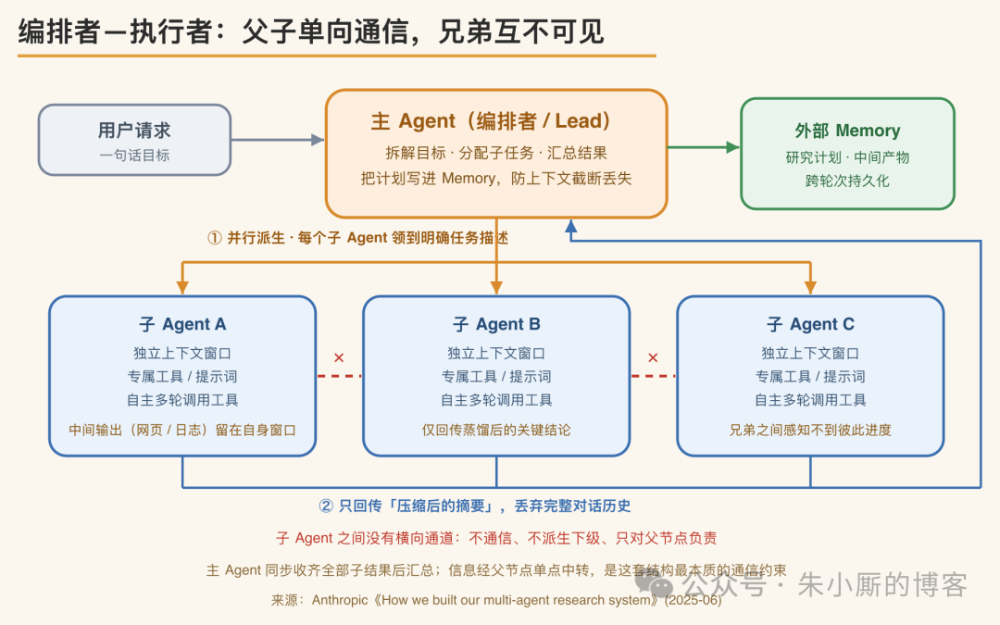
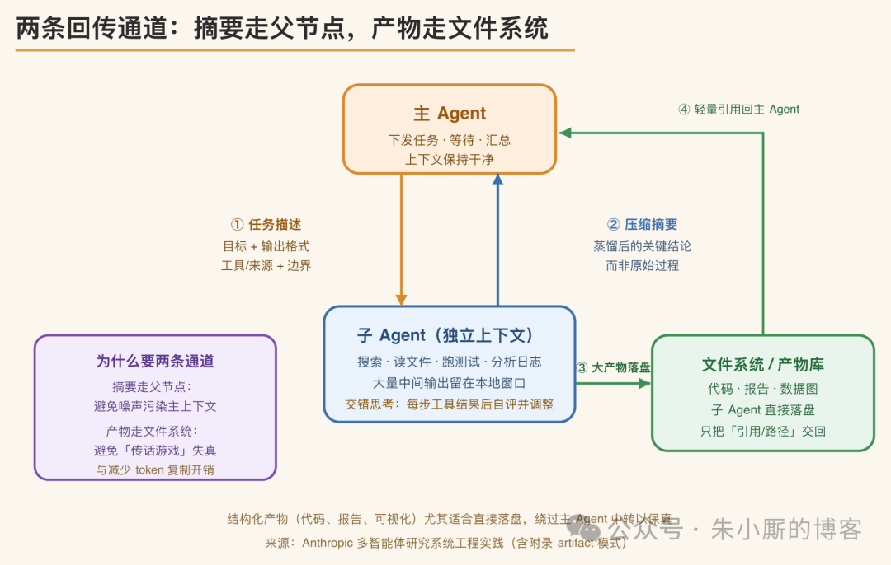
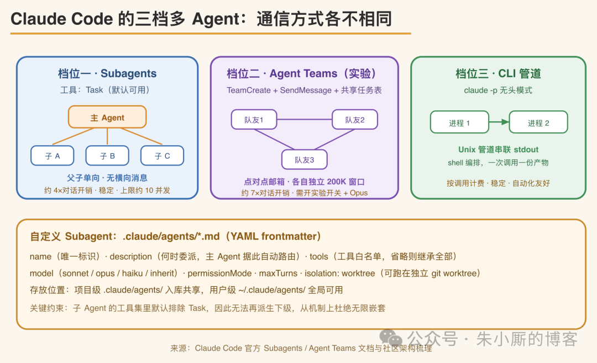
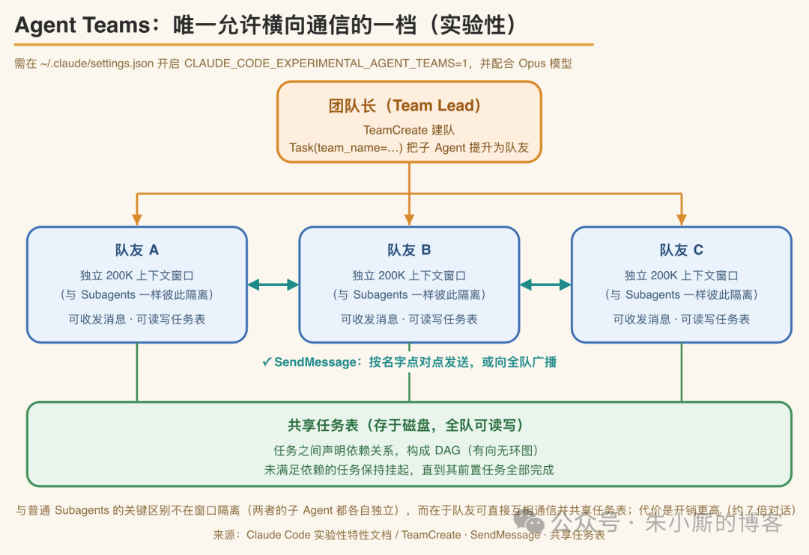
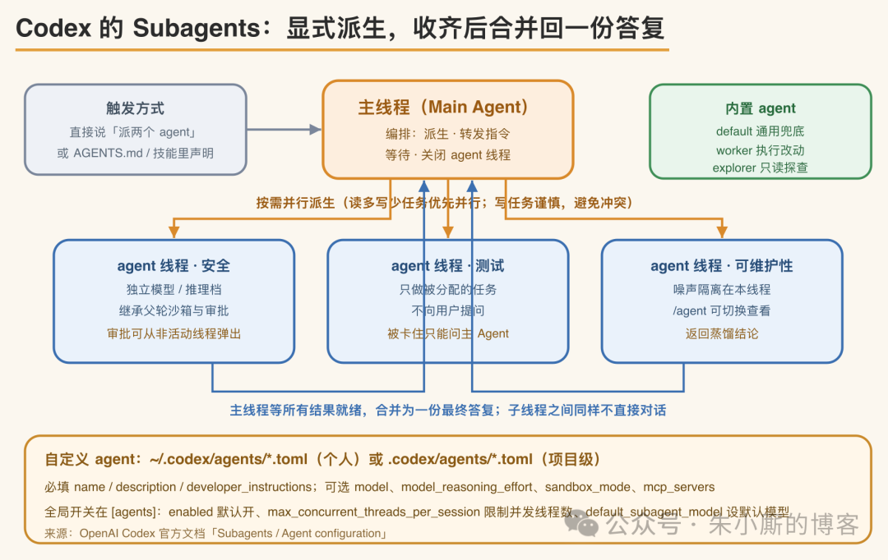

# 多 Agent 项目中，子 Agent 之间是如何通信的？

> 核心结论：当前主流工程实现中，子 Agent **基本不直接通信**。实际流动的是主 Agent 下发的任务规格和子 Agent 回传的压缩摘要，大块产物绕过主 Agent 直接写入文件系统，主 Agent 依靠外部 Memory 应对上下文上限。

<!-- more -->

## 多 Agent 系统的实际拓扑：父子树而非对等网络

当一个编码任务超出单个模型的上下文窗口容量，或者需要同时朝几个方向探查时，多数工具会把它拆分给多个 Agent 执行。"多 Agent 协作"这一表述容易让人联想到一组对等的智能体互相调用、互发消息、协商分工。

但对照 Claude Code、Codex 以及 Anthropic 公开披露的 Research 系统可以发现，主流实现的拓扑并非网状对等通信，而是一棵树：一个主 Agent（编排者，orchestrator / lead）位于根节点，若干子 Agent（执行者，worker / subagent）为其子节点，信息仅在父子之间单向流动。子 Agent 之间没有横向通道——它们既不互相发送消息，也无法感知彼此的进度，并且通常被禁用了继续向下派生一层的能力。

"编排者—执行者"结构成为事实标准的核心原因是上下文管理。每个子 Agent 启动时持有独立的上下文窗口、专属的工具集和提示词，在较窄的任务边界内自主地多轮调用工具，将探索过程中产生的大量中间输出——搜索结果、文件内容、测试日志、堆栈跟踪——保留在自身窗口内，最终仅将蒸馏后的关键结论回传给主 Agent。搜索的本质是压缩：从大量语料中提炼出少量有效信息。子 Agent 承担了这一压缩环节，使主 Agent 的上下文不被探索过程的中间输出占满。

## 第一条通道：任务描述下发与压缩摘要回传

父子之间的通信，其中一部分是自上而下的任务下发。主 Agent 能够传递给子 Agent 的仅有一段任务描述，而这段描述的精确度直接决定并行效果。Anthropic 在复盘中指出，早期让主 Agent 给出模糊指令导致了明显的分工失效：多个子 Agent 重复劳动，或留下无人覆盖的空白——例如一个子 Agent 去查 2021 年的汽车芯片危机，另外两个都在查 2025 年的供应链。

据此，一段合格的任务描述必须包含四项内容：

- **明确的目标**
- **期望的输出格式**
- **应使用哪些工具和数据源的提示**
- **清晰的任务边界**

编排者对子 Agent 的下发，本质是将意图转写为可独立执行的规格说明，转写越精确，并行的效果越好。

另一部分是自下而上的结果回传。子 Agent 完成任务后，回传给主 Agent 的不是完整的对话历史，而是一段压缩后的摘要——保留探索过程中的有效结论，其余部分丢弃。这一机制直接影响成本：正因回传的是摘要而非全量，主 Agent 才能在有限的窗口内同时消化多个子 Agent 的产出。

Anthropic 给出的经验规则是按任务复杂度伸缩投入：

| 任务复杂度 | 子 Agent 数 | 工具调用次数 |
|-----------|------------|-------------|
| 简单事实查证 | 1 个 | 3–10 次 |
| 直接对比类 | 2–4 个 | 每个 10–15 次 |
| 复杂研究 | 10 个以上 | 明确划分职责 |

这些数值不是硬编码在代码中的调度参数，而是写入提示词、由主 Agent 自行判断的启发式规则。

## 第二条通道：产物绕过父节点直接写入文件系统

仅依靠"摘要走父节点"这一条路径存在瓶颈。如果子 Agent 的产出是一大段代码、一份完整报告或一张数据可视化，将其塞入摘要再经主 Agent 转发给下一环节，会导致多级转述的信息失真，并消耗额外 token 用于复制大块内容。

Anthropic 的方案是提供第二条通道——**产物系统（artifact）**。子 Agent 直接调用工具将成果写入外部文件系统，仅将一个轻量的引用或路径回传给主 Agent。主 Agent 得到的是产物的位置，而非产物本身。对于代码、报告这类结构化产出，子 Agent 使用其专属提示词生成的质量通常高于经通用编排者过滤后的结果，因此让其直接写盘反而更能保真。

另一个关键细节是：当整轮研究可能超出主 Agent 自身的上下文窗口时，主 Agent 会先将研究计划写入外部 Memory。由于上下文超过 20 万 token 会被截断，将计划持久化后，主 Agent 在触及上限后仍能保留原有目标，并可派生上下文干净的新子 Agent 继续执行。因此"外部存储"在此架构中承担两个角色：既是子 Agent 交付大产物的落点，也是主 Agent 应对自身上下文截断的持久化记忆。

## 子 Agent 之间不直接通信的原因

网状对等通信在灵活性上更高，主流实现却将其舍弃，原因在于当前模型尚不能可靠协调这一模式，而其代价明确存在。

在 Anthropic 目前的实现中，主 Agent 同步执行子 Agent——派出一批后需等待该批全部完成才能继续。这一设计简化了协调：无需处理子 Agent 之间的状态一致性，也无需处理错误在多个 Agent 之间的交叉传播。其代价是信息流受限：主 Agent 无法中途对子 Agent 纠偏，子 Agent 之间无法相互协调，整个系统还可能被某个长时间未完成的子 Agent 阻塞。异步执行可换取更强的并行，但需额外解决结果协调、状态一致和跨 Agent 的错误传播，而这些正是当前 Agent 尚不擅长实时处理的部分。

**成本是另一项直接约束。** 多 Agent 系统之所以有效，很大程度上源于其 token 投入——将工作分摊到多个独立的上下文窗口，等于为系统扩展出更多并行推理的容量。

Anthropic 对不同系统的成绩做过归因分析：

- 各系统投入的 token 总量，基本就能对应其成绩高低——单这一项就可说明约 **80%** 的成绩差异
- 再加上工具调用次数和所用模型，这三项几乎覆盖了造成成绩差异的全部原因（约 95%）

其中 token 投入量权重最大，这也印证了前面的判断：多 Agent 把任务分摊到多个窗口、从而投入远超单 Agent 的 token，是其成绩更好的主要原因。

至于多 Agent 究竟能好多少，Anthropic 给出的数字是：在其内部研究能力评测（考察需要同时展开多个方向的广度优先任务）中，以 Claude Opus 4 为主 Agent、Claude Sonnet 4 为子 Agent 的组合，综合得分比单个 Opus 4 高出约 **90.2%**——即成绩接近单 Agent 的两倍。

相应的代价是：

- Agent 类交互本身的 token 消耗约为普通对话的 **4 倍**
- 多 Agent 系统则高达约 **15 倍**
- 若在子 Agent 之间进一步开放自由通信，token 消耗和协调复杂度将进一步上升

这也说明多 Agent 更适用于"高价值、可高度并行、信息量超出单窗口"的任务，而多数编码任务——串行依赖多、可并行部分少——并非其最佳适用场景。

## Claude Code：三档能力对应三种通信模型

具体到工具层面，Claude Code 将多 Agent 分为三档，三者的通信模型各不相同。

### 第一档：Subagents（父子单向）

最常用的一档是 Subagents：主 Agent 通过内置的 Task 工具派生子 Agent，通信严格限定为父子单向，子 Agent 之间不能互发消息，也不持有 Task 工具因而无法再派生下级——这一限制从机制上避免了无限递归嵌套。

派生行为通过 Task 工具的参数控制：

- `subagent_type`：指定使用哪个 Agent 定义
- `prompt`：子 Agent 唯一能接收的完整指令
- `model`：可覆盖默认模型
- `run_in_background`：决定是否异步执行而不阻塞主会话

实践中并发上限约为 10 个，超出部分排队分批执行。

自定义子 Agent 通过一个带 YAML frontmatter 的 Markdown 文件描述，放在项目级的 `.claude/agents/`（可入库共享）或用户级的 `~/.claude/agents/`（全局可用）。frontmatter 中：

- `name`：唯一标识
- `description`：供主 Agent 判断何时将任务委派给它——主 Agent 依据这段描述进行自动路由
- `tools`：工具白名单，省略则继承全部
- `model`：可选 sonnet、opus、haiku 或 inherit
- 此外还有 `permissionMode`、`maxTurns`，以及 `isolation: worktree`，使子 Agent 运行在临时的 git worktree 中、改动互不干扰

frontmatter 之下的正文即该子 Agent 的系统提示词，子 Agent 仅接收这段提示加基本环境信息，而不继承 Claude Code 完整的主系统提示。

### 第二档：Agent Teams（对等横向）

第二档是实验性的 Agent Teams，也是唯一真正允许横向通信的一档。它需要在 `~/.claude/settings.json` 中开启 `CLAUDE_CODE_EXPERIMENTAL_AGENT_TEAMS=1` 并配合 Opus 模型。

开启后，团队长用 TeamCreate 建队，用带 `team_name` 参数的 Task 将子 Agent 提升为"队友"，队友之间可用 SendMessage 按名字点对点发送消息或全员广播，并共享一份存放在磁盘上的任务表——任务可声明依赖关系构成 DAG，未满足依赖的任务会保持挂起直到前置完成。

此处需澄清一个常见误解：普通 Subagents 与 Agent Teams 的队友，都各自运行在独立、隔离的上下文窗口中，子 Agent 并不占用主会话的上下文预算——这正是前面所说"用子 Agent 隔离中间输出"的前提。两者真正的区别在通信与协调方式：

- 普通 Subagents：只能把结果单向回传给父节点，兄弟之间互不通信
- Agent Teams：除各自独立的窗口外，还能用 SendMessage 直接互发消息、共享同一份任务表

代价也不同——普通 Agent 类交互约为普通对话 token 消耗的 4 倍，而 Agent Teams 因每个队友都是一个完整独立的会话、额外叠加消息往来，开销升至约 7 倍。

### 第三档：CLI 管道（操作系统级）

第三档是 CLI 管道，用 `claude -p` 无头模式将 Claude 作为命令行程序调用，通过 Unix 管道将上一进程的 stdout 接入下一进程，编排完全交给 shell。

三档从左到右，通信模型依次为**父子单向、对等网状、操作系统级管道**，成本和复杂度随之上升。

## Codex：显式派生，收齐结果后合并为一份答复

OpenAI 的 Codex 在较新版本中默认开启了 subagent 工作流，其思路与 Claude Code 的第一档高度一致，但在触发和配置上有自身特点。

它同样采用树形结构：主线程（main agent）负责编排——派生子 agent、转发后续指令、等待、关闭 agent 线程；当多个 agent 在运行时，主线程会等待所有请求的结果就绪，再将其合并为一份统一答复返回。子线程之间同样不直接对话，被阻塞时只能回问主 agent，而不能打扰用户。

官方明确了这一设计的出发点：若将探索笔记、测试日志、堆栈跟踪等中间输出全部并入正在定义需求和决策的主对话，会导致会话"上下文污染"和"上下文腐烂"，可靠性下降。将中间输出隔离到并行的子 agent、仅回传摘要，是为了使主线程专注于需求、决策和最终产出。

**触发方式上，Codex 以显式为主：**

- 在大多数智能等级下，需明确说明"派两个 agent""并行委派这部分工作"，它才会派生
- 项目中的 AGENTS.md 或技能文件若声明了委派需求，Codex 也会执行
- 只有在 Ultra 这一最高等级下，它才能在并行确实能提升速度或质量时主动委派

官方给出的样例 prompt 说明了这一点——让它对当前分支分别派出关注安全、代码质量、Bug、竞态、测试稳定性、可维护性的 agent，全部完成后按项汇总。

一段合格的子 agent 提示应说明三点：

1. 如何切分工作
2. 是否等待所有 agent 完成
3. 需要返回何种摘要或产出

在交互式 CLI 中，可用 `/agent` 在多个 agent 线程之间切换查看进度；由于子线程也可能弹出审批请求，审批浮层会标明来源线程，按 `o` 可先进入该线程查看再决定是否批准。

**配置层面，Codex 使用 TOML 而非 Markdown。** 它自带三个内置 agent：

- `default`：通用兜底
- `worker`：专注执行改动
- `explorer`：负责只读探查代码库

自定义 agent 是一组独立的 TOML 文件，放在个人级的 `~/.codex/agents/` 或项目级的 `.codex/agents/`，每个文件描述一个 agent，必填 `name`、`description`、`developer_instructions` 三项，可选 `model`、`model_reasoning_effort`、`sandbox_mode`、`mcp_servers` 等键——例如将一个 reviewer 固定为 read-only 沙箱、高推理档，专门检查正确性和安全问题。

全局行为由 `[agents]` 段控制：`enabled` 默认开启，`max_concurrent_threads_per_session` 限制同时打开的子线程数，`default_subagent_model` 和 `default_subagent_reasoning_effort` 设定默认档位。

一条值得注意的**继承规则**是，子 agent 沿用父轮次实时设定的沙箱和审批策略——即便某个自定义 agent 文件写了不同的默认值，会话中临时用 `/permissions` 或 `--yolo` 所做的调整仍会重新套用到派生出的子 agent 上，避免权限被配置文件放宽。

## 结论

综合来看，"子 Agent 之间如何通信"这一问题，在当前主流工程实现中有一个相当一致的答案：**它们基本不直接通信**。实际流动的是主 Agent 下发的任务规格和子 Agent 回传的压缩摘要，大块产物绕过主 Agent 直接写入文件系统，主 Agent 依靠外部 Memory 应对自身的上下文上限。

选择这条克制路线的原因，不是对等网状无法实现，而是在当前模型协调能力和 token 成本的约束下，父子单向的树结构在可靠性、可观测性和成本之间取得了更好的平衡。

Claude Code 的实验性 Agent Teams 已在向横向通信探索，Anthropic 也将异步执行列为下一步方向，但在它们成熟之前，这棵树就是当下多 Agent 编码工具的通信基础。