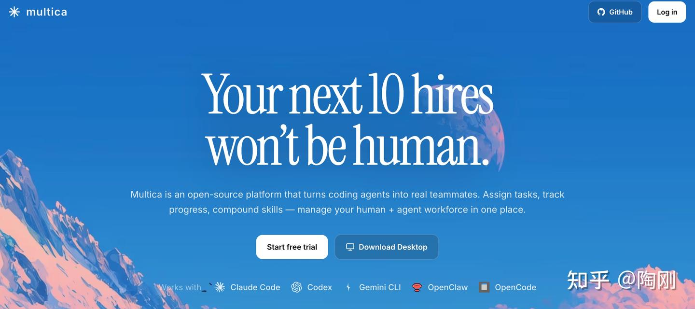
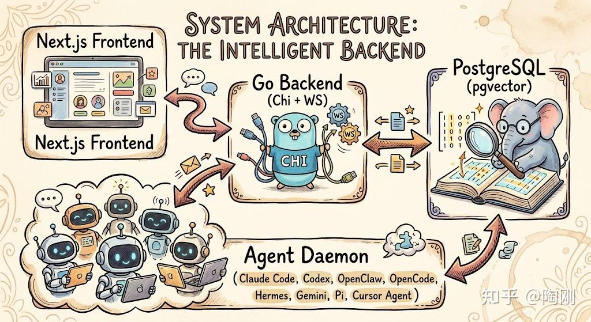

# 从 Multics 到 Multica：AI 编码 Agent 的项目经理

> 过去一年，AI 编码 Agent 的单体能力提升很快，但到了团队层面常常卡住。Multica 的定位不是再造一个 Agent，而是给现有的 Agent 做一套协作外壳——开源的托管 Agent 平台，让编码 Agent 变成真正的团队成员。

<!-- more -->

过去一年，AI 编码 Agent 的单体能力提升很快。Claude Code、Codex、Gemini CLI、Cursor Agent 这类命令行工具，让一个工程师可以同时跑好几个任务。但这种个人生产力的提升，到了团队层面常常卡住。每个人开自己的终端窗口，谁也看不到别人的 Agent 在做什么。跑到一半中断，别的人接不了手。上周解决过的问题，这周另一个 Agent 还要重新摸一遍。

这种”个体飞跃、团队失速”的感觉，在最近几个月被越来越多人提及。4 月初，GitHub 上出现了一个新项目叫 [Multica](https%3A//github.com/multica-ai/multica)。它的定位不是再造一个 Agent，而是给现有的 Agent 做一套协作外壳。发布后 11 天内涨到一万六千多颗 Star，在 Trending 上挂了一整周。



我花了一些时间读了它的代码库、文档和一部分 Issue 讨论，整理出这篇解读。

### 名字从哪来

先说名字。Multica 的发音容易让人以为是 “Multi-Claude-Agent” 的缩写，但官方 About 页面给了另一个词源：**Multiplexed Information and Computing Agent**。这是在向 1964 年 MIT、贝尔实验室和 GE 联合研发的 Multics 致敬——那个比 Unix 早、后来被认为是 Unix 灵感来源的分时操作系统。

这个命名选得挺讲究。Multics 解决的是把一台昂贵大型机的算力分时给多个人用；Multica 想解决的是把一组工作流分给人和 AI Agent 一起做。底层逻辑一脉相承：多路复用（multiplex）一套有限的资源，让不同的参与者并发共享。

项目 README 对自己的描述是一句话：”开源的托管 Agent 平台，让编码 Agent 变成真正的团队成员——分配任务、追踪进度、沉淀技能。”

### License 需要单独看一眼

很多第三方博客把 Multica 的协议描述成 “Apache 2.0”。这个说法不完整。

按 [http://medevel.com](http%3A//medevel.com) 的协议分析以及仓库 LICENSE 文件的限制条款，它实际上是一份**被修改过的 Apache 2.0**，加了两条商业限制：

*   不能把 Multica 作为托管服务或嵌入产品再卖给第三方，等于限制了 SaaS 转售；
*   不能移除前端界面上的 Multica logo 和版权信息。

这两条合起来，其性质更接近 BSL-lite 或 Elastic 那种做法，不是真正意义上的 Apache 2.0。

对于知乎读者，尤其是打算在公司内部部署、或者基于它做二次开发的团队，这条应该进入采购决策的检查清单。等到产品做出来再回头看协议，会很被动。

### 时间线

几个关键日期：

*   **2026 年 4 月 8 日**，JY Zhang 在 X 上发推宣布项目，原话接近 “We created the open source version of Claude Managed Agents”。这条推文后来有大约 3.6 万次展示。
*   **4 月 10 日到 16 日之间**，项目登上 GitHub Trending。BuilderPulse 的周报记录那一周新增约 1.08 万颗 Star。
*   到我写这篇文章时（4 月 19 日），仓库大约积累了 **1.66 万颗 Star、2047 个 Fork、127 个 Open Issue、111 个 Open PR**。
*   最新版本是 4 月 18 日发布的 **v0.2.6**。Release 节奏近乎每天都有补丁。

从 0 到 1.6 万颗 Star，用了不到两周。这个速度在 AI Agent 这个已经相对饱和的赛道里很少见。Star 增长的参考价值需要打折扣——大量 Star 可能来自 Trending 吸引来的路人——但至少说明项目触碰到了一个真实的讨论焦点。

### 它想解决什么问题

把几处来源的说法拼起来（README、mem0.ai 的架构分析、Arun Baby 的试用笔记），Multica 瞄准的痛点可以归到五类：

**第一类是团队可见性的缺失。** 每个工程师各开各的终端，Claude Code 在哪台机器上跑什么任务、进度如何、是否卡住，只有本人知道。出了问题没人能接手。

**第二类是 Agent 会话之间的记忆隔离。** 每次新开一个会话都从零开始。上周同事调通的部署脚本，这周另一个 Agent 遇到同样问题时，要重新摸索一遍。知识没有沉淀机制。

**第三类是运行环境的分散。** 有人用笔记本跑，有人用云主机跑，有人同时在多台机器上开。缺少一个统一的调度面板来回答 “现在有几个 Agent 在跑？分别在哪？”

**第四类是 Jira/Linear 这类工具对 Agent 不友好。** 把 Agent 当成一个 “人” 来指派任务、在评论区对话、追踪状态，这件事在现有 PM 工具里基本没有原生支持。Devin 和 Factory 解决了这部分体验，但它们是闭源 SaaS，按席位收费，也不给你模型和 CLI 的选择权。

**第五类是 Arun Baby 在他博客里提到的 “AI 生产力悖论”：** AI 产出代码的速度快了，下游的 Review 和协作反而变成瓶颈。单点 Agent 再强，团队一级的吞吐量也上不去。

Multica 的假设是：当单个 Agent 的能力不再是短板时，团队一级的协调基础设施才是新瓶颈。它想做的就是这一层。

### 架构

这是整篇文章里我最分享的部分，也是读者最关心的部分。

### 物理拓扑

系统在物理层面是四层结构。前端有两个形态，一个是 Next.js 16 做的 Web 端，一个是 Electron 的桌面端（构建时打成 “Multica Canary”）。它们都通过 HTTP + WebSocket 连到一个 Go 写的后端。后端把状态落到 PostgreSQL 17，数据库里装了 pgvector 扩展。用户自己的机器上跑一个 Multica Daemon 进程，Daemon 拉任务，然后派生子进程去调用 Claude Code、Codex、Cursor Agent 这类实际执行代码的 CLI。



注意这个流向：Agent 进程永远不直接和前端对话。一切状态都要穿过服务端落到 Postgres。这个选择有一个很重要的好处——强一致性、可审计、可回放。

### 仓库分层

代码组织上，Multica 走的是 TypeScript + Go 混合 monorepo，用 Turborepo + pnpm 管理。

```
server/              # Go 后端
  cmd/multica/       # CLI 入口：multica login / daemon / issue 等子命令
  cmd/server/        # HTTP + WS 服务端
  cmd/migrate/       # 迁移工具
  pkg/agent/         # Agent Backend 接口 + New() 工厂
  pkg/db/queries/    # sqlc 的 SQL 文件
  internal/handler/  # Chi 的 handler 层
  internal/realtime/ # WebSocket Hub
  migrations/        # 编号过的 SQL 迁移

apps/web/            # Next.js 前端
apps/desktop/        # Electron 桌面

packages/core/       # 无框架依赖的业务逻辑：Zustand、React Query、API 客户端
packages/ui/         # shadcn/Base UI 原子组件
packages/views/      # 跨端共享的业务组件，用 NavigationAdapter 适配两种路由

e2e/                 # Playwright 端到端测试
```

读这个结构时我留意到一条工程纪律：`core/` 和 `ui/` 两个 package 被设计成**不能依赖任何框架特定的东西**。`core/` 里不允许出现 `react-dom`、`localStorage`、`process.env`；`ui/` 不允许 `import @multica/core`。跨端共享的 `views/` 通过一个叫 NavigationAdapter 的桥接层，吸收 Next.js 和 Electron 里不同的路由方式。这种层级分工在独立开发者主导的项目里并不常见，反映出作者对代码可维护性的重视。

### 数据模型

mem0.ai 那篇分析文章对 Multica 的数据模型讲得比较细。我对照迁移文件 008、029 和 handler 源码，整理出六张核心表，全部带 `workspace_id` 外键，并且配了 `ON DELETE CASCADE`：

*   **workspace**：租户边界。migration 006 里加了一个 `context` 字段——这是整个工作区共享的 Prompt，每个 Agent 执行任务时都会继承。
*   **project**：相当于 Epic 或 Sprint 的分组。
*   **issue**：一个工作单元，也是系统里最核心的实体。字段包括 `status`、`assignee_type`、`assignee_id`，还有 JSONB 的 `context_refs` 和 `acceptance_criteria`。
*   **agent**：逻辑意义上的 AI 队友。每个 Agent 绑定一个 provider（claude、codex 之类），关联一个 runtime。
*   **runtime**：一台实际的执行机器，可以是本地 Daemon，也可以是云上节点。
*   **skill**（配合 `skill_file`、`agent_skill` 两张关联表）：可复用的 “技能”。这是 Multica 想让团队沉淀知识的那一层。

还有两张比较关键的辅助表：

*   **agent_task_queue**：任务队列，把 issue 下发给 Daemon。表里有一个 JSONB 的 `context` 字段——这是个值得单独讲的设计，见下节。
*   **activity_log**：append-only 的审计日志。
*   **comment**：issue 下的对话线程，`author_type` 区分是真人成员还是 Agent。

Issue 的状态列表在 `server/cmd/multica/cmd_issue.go` 里定义得很简单：`backlog → todo → in_progress → in_review → done`，分支到 `blocked` 和 `cancelled`。扁平的 7 状态，没有分阶段的 workflow state machine。Issue #815 里有人对此提出疑问，认为给 AI 指派任务时，更合理的是 “需求确认 → 方案确认 → 实现 → 测试 → 验收 → 合并” 这种有门控的流程。这个批评我觉得有道理，后面对比段落会再提。

### Agent 的执行流程

完整链路是这样的：

1.   用户在 Web UI（或者用 CLI `multica issue create`）创建一个 issue，并把它指派给某个 Agent。
2.   服务端往 `agent_task_queue` 插入一行，`context` 字段里**拍一张 JSONB 快照**：当前 workspace 的 context + issue 描述 + 验收条件 + 挂载的 skill 文件内容，全部冻结到这一行里。
3.   用户机器上的 Daemon 每 3 秒轮询一次服务端（`MULTICA_DAEMON_POLL_INTERVAL`），每 15 秒发一次心跳。
4.   Daemon 抢到任务后，在本地 `~/multica_workspaces/` 下开一个隔离的工作目录，把 skill 文件落到磁盘上，派生子进程去跑对应的 CLI（`claude` 或 `codex` 等等）。
5.   执行过程通过 WebSocket 流回服务端，再推给前端。Agent 的评论以 `author_type=agent` 的身份写进 `comment` 表。
6.   完成以后，这次的解法可以被人工标记成一个新的 skill，供后续任务复用。

几个边界条件：

*   单任务超时默认 2 小时（`MULTICA_AGENT_TIMEOUT`）。
*   单 Daemon 最大并发 20 个任务（`MULTICA_DAEMON_MAX_CONCURRENT_TASKS`）。
*   Daemon 的 Token 前缀是 `mdt_`，便于日志识别。
*   Daemon ID 最近改成了**按机器绑定**，让 CLI 和 Electron 桌面端在同一台机器上共享一个 Daemon 身份。要在一台机器上跑多个隔离的 Daemon（比如 prod 和 staging 分离），用 `--profile` 子命令。

### 搜索设计：没有向量检索

这是整个 Multica 里我觉得最值得单独讲的一点。

按 mem0.ai 的分析，Multica 虽然在 Postgres 里装了 pgvector 扩展，但**当前版本完全没有用到向量检索**。Skill 的匹配是 `agent_skill` 表上的普通 SQL JOIN，不是 cosine similarity。Context 的交付是前面提到的 JSONB 快照——在任务入队的那一刻拍下来，之后 Daemon 拿到任务就本地直接用，不再回查数据库。

这个选择是有取舍的，值得说说。

好处有三点。一是**行为可预测**，整个 prompt 是什么内容可以从表里一眼看见，便于排查。二是**运维复杂度低**，一个 Postgres 搞定所有存储，不用再引入向量数据库。三是**执行期零依赖**，Daemon 跑起来之后不需要和数据库通讯，不用担心中途网络抖动。

坏处也明显。

*   **没法做模糊召回**——如果某个 skill 在语义上和当前任务相关、但名字对不上，Agent 就找不到。
*   **快照的 staleness 问题**——任务入队后如果 issue 又被编辑了，正在跑的 Agent 看不到新改的内容。
*   **skill 的质量依赖团队纪律**。它不会自动冒出来，要靠人手工挂载到 Agent 或 issue 上。
*   **没有跨 workspace 的记忆**——A 公司 workspace 沉淀的经验，B 公司 workspace 完全看不到。

pgvector 装着但不用，读起来像是 “为未来留一个口子”。这个设计见仁见智。在我看来这是 Multica 当前最可争议的一处架构决定。

### Provider 适配层

`server/pkg/agent/agent.go` 里定义了一个 `Backend` 接口，和一个 `New()` 工厂。工厂的实现大致是这样（按源码和 Issue #257 的描述重构了一下）：

```
func New(kind string, cfg Config) (Backend, error) {
    switch kind {
    case "claude":
        return newClaudeBackend(cfg)
    case "codex":
        return newCodexBackend(cfg)
    default:
        return nil, fmt.Errorf("unknown backend: %s", kind)
    }
}
```

这里有一件事值得读者注意：README 的营销描述和首页罗列了 8 种被支持的 CLI——Claude Code、Codex、Cursor Agent、Gemini CLI、OpenClaw、OpenCode、Hermes、Pi。但仓库里 `CLI_AND_DAEMON.md` 这份相对严肃的技术文档，**详细覆盖的只有 Claude Code 和 Codex 两种**。其他几种有不同程度的检测逻辑和 Runtime 类型，但**完整的一等公民目前只有 Claude Code 和 Codex 这两位**。

社区里已经有对应的 Feature Request。Issue #257 讨论的就是希望把 Provider 改成可插拔的注册机制，这样第三方可以不用 fork 核心代码就加入新的 CLI 后端。这个改造没做之前，”支持 8 种 CLI” 这个说法对新用户要打折扣——评估时应该先在目标 CLI 上做端到端试用。

### Skills 系统

Skill 在 Multica 里是一个文件夹，存的是代码片段、配置、类似 CLAUDE.md 的上下文文档。存储层由三张表组成：`skill`、`skill_file`、`agent_skill`（关联表）。

召回完全是显式的——某个 issue 或某个 Agent 手动挂载一组 skills，Daemon 在起任务前把这些文件写进隔离工作目录。对于支持原生 skill 目录约定的 CLI，写入路径会适配。最近一个 commit 专门修了 “把 Copilot 的 skills 写到 `.github/skills/`” 这条路径。

这里要和 Anthropic 最近推的 Agent Skills 规范做个区分。**两者不在同一层**。Anthropic Skills 描述的是 “Claude 自己能自主做什么”，属于模型侧的能力声明。Multica Skills 描述的是 “你们团队的 Agent 池子历史上解过什么、可以被回放”，属于团队知识沉淀的层。两者可以共存——Multica 完全可以把一份 Anthropic 格式的 SKILL.md 作为它自己 skill 文件夹里的一员，让 Claude Code 打开任务时读到。

### Autopilot

这是 Multica 里做定时任务或条件触发的模块。从 commit 历史看，目前支持两种模式：

*   `create_issue`：完整实现，按规则或定时自动创建 issue。
*   `run_only`：数据模型里已经定义，但在 Daemon 执行路径里还没完全接通（截至 4 月 18 日的文档）。

能想到的用法：每晚跑一次安全审计、每周做依赖升级、定时对指定仓库做 Code Review。

### 实时层

`server/internal/realtime/hub.go` 用 gorilla/websocket 做了一个 hub。前端为每个 workspace 建一条 WS，服务端通过推送来让前端 invalidate TanStack Query 的 key。CLAUDE.md 里写了一条很具体的工程约束：**WS 事件不能直接写进 Zustand store，必须走 React Query 的 invalidation**。这条规则本身就能说明作者对状态管理边界的讲究——它避免了 WS 消息和本地缓存之间的竞态问题。

### 多租户和认证

每条查询都带 `workspace_id` 过滤，HTTP 层用 `X-Workspace-ID` header 做路由。

Assignee 做成了**多态**：`assignee_type` 区分成员还是 Agent，`assignee_id` 指向对应的表。前端里，Agent 的 assignee 用紫色背景加一个机器人图标标出来，和人类成员视觉分开。

Middleware 里有一个 `resolveActor`，用来区分请求来自人还是 Agent：看 JWT 是普通用户的还是 `X-Agent-ID + X-Task-ID` 的组合。

登录方式是 Resend 寄出的 Magic Link。这意味着自部署时 `RESEND_API_KEY` 是强制项——没有它，用户收不到登录邮件，整个系统就卡在登录页。开发模式下（`APP_ENV=development`）有一个万能验证码 `888888` 可以绕过，但生产环境不能用。

可选的 Google OAuth 也支持。

### 部署与上手

### 三条安装路径

Multica 给了三条上手路径，适合不同类型的用户。

**路径 A：把 README 贴给你的 Agent，让它自己装。** 真的就是这样：

```
Fetch https://github.com/multica-ai/multica/blob/main/CLI_INSTALL.md
and follow the instructions to install Multica CLI, log in,
and start the daemon on this machine.
```

把上面这段话扔给 Claude Code、Codex 或 OpenClaw，它会自己把 CLI 装好、登录、把 Daemon 跑起来。这个路径在营销上很讨巧，顺带展示了 “Agent 管理 Agent” 的自洽闭环。

**路径 B：Homebrew + Cloud。** 这是最轻的路径：

```
brew tap multica-ai/tap
brew install multica
multica login
multica daemon start
```

登进 `multica.ai` 的 Cloud 工作区直接用。

**路径 C：Docker Compose 自托管。** 这是团队部署的正确姿势：

```
git clone https://github.com/multica-ai/multica.git
cd multica
cp .env.selfhost.example .env   # 改 JWT_SECRET 和 RESEND_API_KEY
docker compose -f docker-compose.selfhost.yml up -d

# 然后装 CLI，指向自己的服务
multica config set server_url https://your-host/ws
multica login
multica daemon start
```

### 跑完第一个任务

假设服务已经起来了，流程大致是这样：

1.   Web 端打开 workspace，进 **Settings → Runtimes**，确认你这台机器已经被 Daemon 自动注册进去。
2.   **Settings → Agents → New Agent**：选一个 Runtime、选 provider（比如 Claude Code）、起个名字，比方 “Atlas”。
3.   到 Board 页面，点 Create Issue，写清楚任务描述和验收条件，Assignee 选 Atlas。
4.   Atlas 会抢到这个任务，在 `~/multica_workspaces/` 下开隔离目录，跑起来，过程通过 WS 流回来。你在 issue 页面看得到 Agent 的 comment。
5.   任务完成后，手动把解决方案提升成一个 Skill，以后别的 Agent 可以挂载这个 Skill 复用。

CLI 也能做同样的事：

```
multica issue create --title "修掉 rate limit bug" \
                     --assignee atlas \
                     --project api-v2
multica issue runs <issue-id>
multica issue run-messages <issue-id> --since 0   # 尾随日志
```

### 常见的坑

读完 Issue 列表和几篇试用帖，新手最容易踩的坑集中在几处：

*   **忘了配 `RESEND_API_KEY`**。自托管部署时很多人直接跳过这一步，结果收不到 Magic Link 邮件，连登录都进不去。
*   **PATH 里没装对应的 Agent CLI**。Daemon 会在机器上注册一个 Runtime，但这个 Runtime 的 capability 是空的，任务永远 claim 不到。
*   **把协议当成了纯 Apache 2.0**。前面说过，Multica 的协议是改过的 Apache 2.0，转售和去 logo 都受限，做商用前要确认。
*   **以为 8 种 CLI 都一样好用**。Claude Code 和 Codex 是一等公民，其它几种属于第二梯队，生产前先在目标 CLI 上跑通一条 issue。
*   **以为 Skill 能被语义召回**。当前没有向量检索，要自己手动挂载。
*   **任务跑到一半改 Issue 的描述没用**。JSONB 快照在入队时冻结，Agent 看不到后改的内容。要么重新创建任务，要么取消后重启。
*   **一台机器上启两个 Daemon 没加 `--profile`**。它们会争同一个 `daemon.id`。正确做法是用 `multica daemon start --profile staging` 开第二个实例。
*   **自托管时没改 `.env.selfhost.example` 里的 `JWT_SECRET`**。这是生产环境里最容易出的安全事故之一。

### 和同类项目的对比

先把 Multica 放回它应该在的赛道。AI 编码这个圈子现在大致分几层玩家：

*   **框架层**：LangGraph、AutoGen / AG2、CrewAI、OpenAI Agents SDK、Agno、Mastra、Pydantic AI、LlamaIndex、DSPy、Haystack 这些。它们的用途是帮你**构建**一个 Agent。它们和 Multica 不是竞争关系——Multica 不造 Agent，它把这些框架或 CLI 做出来的 Agent 拿来用。
*   **编排 / 工作流引擎**：Temporal、Inngest AgentKit、Prefect 配 ControlFlow、Restate。它们是通用的持久化执行器，可以跑任何工作流。和 Multica 的差别在于，Multica 是一个专门给编码任务做的、看板形状的、用户界面友好的产品，不是通用引擎。
*   **编辑器内的 Copilot**：Cursor、Aider、Continue.dev、Plandex、Sweep AI。它们是 IDE 里的贴身助手，为单个工程师的实时交互优化。Multica 故意不在编辑器里，它是编辑器之外的团队协调层。
*   **闭源的自主 SWE Agent**：Devin（Cognition）、Factory.ai 的 Droids、Sourcegraph Amp。这是 Multica 最直接的商业竞争对手。它们都是 SaaS、闭源、按席位收费，并且都自带一套专有 Agent 引擎。
*   **开源的编码 Agent Runtime**：OpenHands（原 OpenDevin）、Cursor Background Agents、Conductor.build、Crystal（已被 Nimbalyst 取代）、Backlog.md、[http://Codegen.com](http%3A//Codegen.com)。这些是 Multica 最近的同类，区别在形态。
*   **MCP 和 Skills 生态**：Anthropic Claude Agent SDK、Anthropic Skills、MCP 服务器、OpenClaw。它们是 Multica 的下游协议消费者，不是对手。

Multica 在这张地图里的独特性来自三条同时成立的属性：

1.   开源可自托管（带前面说的商业限制），协议许可相对宽松。
2.   多用户团队工作区 + Linear 形状的 issue/project 模型 + WebSocket 实时状态。
3.   供应商中立的 CLI 包装层——Multica **不自带任何 Agent 逻辑**，它自动检测本机装了哪些编码 Agent CLI，把任务路由过去。这一条别人做不到。Devin、Factory、OpenHands 都自带专有 Agent；Conductor 和 Crystal 几乎只锁定 Claude Code 加 Codex。

挑三个最容易被拿来对比的讲细一点。

### 对比 Devin / Factory.ai

Multica 的优势：不按席位收费、没厂锁、代码可审计、模型和 CLI 自选。

劣势：没有 Devin/Factory 的专有规划与 RL 训练底层。Multica 更像一个壳，真正的智能来自它包装的那个 CLI。如果 Claude Code 不擅长做大跨度规划，Multica 也救不了你。

另外 Factory 带了大量 SDLC 原生集成——Jira、Slack、Sentry、PagerDuty 这些。Multica 目前没有。企业合规类的 SOC2、SSO、审计控制，Multica 也还没有。

### 对比 OpenHands / All Hands AI

两者都是开源 + 可自托管 + 编码 Agent 重点，但形态不同。OpenHands 自带 Agent，属于**平台 + Agent 捆绑**；Multica 不带 Agent，属于**控制面**，只负责调度和协作。

OpenHands 的项目体量更大，有 VC 融资（公开信息约 1880 万美元）、有 NeurIPS 论文背书（arXiv:2407.16741）、有像样的 SDK 路线、贡献者多。Multica 的团队 UX 更好看，更侧重多人协同那一层。

如果你要一个 “把 Agent 关在沙箱里自己跑完” 的单机方案，OpenHands 合适；如果你要一个 “多个工程师、多台机器、多种 CLI 共享一块看板” 的场景，Multica 合适。

### 对比 Conductor / Crystal / Nimbalyst

这几个是独立开发者用得比较多的桌面端。Conductor.build 和 Crystal 都是单机 Mac 应用。Crystal 在 2026 年 2 月官方弃用，由 Nimbalyst 接手——如果你读到比较老的文章推荐 Crystal，记得换成 Nimbalyst。

Multica 和它们相比，是**多人、团队形状**的平台。不是 Mac only。支持的 CLI 更多（标称 8 种，实际 2 种成熟）。有 Skill 这样的团队沉淀层，而不止是按 worktree 管理并行会话。代价是上手成本更高——要装 Docker、配 Daemon、配 Token，不像 Mac 应用那样双击运行。

### 一句话的定位比喻

Multica 之于 Devin，相当于 Mattermost 之于 Slack，GitLab Self-Hosted 之于 GitHub Enterprise：**一个开源、可自托管、供应商中立的 AI 编码队友控制面——线性的交互，Kubernetes 式的运行时模型，外层包装你已经信任的那个 CLI Agent。**

### 客观列一下优劣

好的地方：

*   真开源、有自托管路径，这个赛道里不多见。
*   供应商中立的 CLI 联邦——Claude Code、Codex 升级了什么能力，它免费继承。
*   团队形状的 UX——Linear 式看板、profile 卡片、评论区、运行日志都做得像样。
*   工程纪律——headless-core、平台适配、严格的 monorepo 分层，对一个独立项目来说很少见。
*   单一数据库（Postgres，pgvector 装着未用）——运维复杂度低。
*   迭代快——几乎每天出 patch。

需要打折扣的地方：

*   License 是改过的 Apache 2.0，不是纯 Apache，采购前要看清。
*   Provider 还没有插件化（Issue #257），加新 CLI 要 fork。
*   标称的 8 种 CLI 支持部分是 “宣传中” 的，第一梯队只有 Claude Code 和 Codex。
*   没有向量记忆，Skill 召回靠人手工挂载。
*   主创个人项目，公司信息不透明，bus factor 基本是 1。
*   没有 SOC2、SSO、审计等企业功能，合规行业用不了。
*   Issue 状态扁平（Issue #815 的批评）——没有阶段门控的 workflow state machine。
*   没有公开 benchmark，没有 SWE-bench 分数或延迟数据。

### 结语

Multica 让我感兴趣的不是它的代码质量（虽然已经比很多独立项目整齐），也不是 Star 增速（虽然很少见），而是开始的一个概念分层正在成形。

2024 年左右，Agent 这个词还很模糊，从 “简单的 prompt 编排” 到 “完全自主的开发者替代品” 都被叫 Agent。2025 年逐渐清楚了——工具层（MCP、Agent Skills）、模型层（Claude、GPT）、执行壳层（Claude Code、Codex 这类 CLI）各自有自己的边界。

2026 年浮现的这一层，是**编码 Agent 的控制面**：当你同时有多个 Agent 跑、多个任务排队、多台机器参与、多个团队成员协作时，你需要一个统一的地方来调度、可见、审计、沉淀。这一层以前没有真正的开源产品。Multica 看起来是第一个尝试把它做出来的。

它做得好不好，现在下结论还早。但**“这一层应该存在”**这个观点，我是认同的。站在流式数据基础设施从业者的角度看，这件事和 Kubernetes 之于容器、之于 VM 管理有点像——底层的原子单元越来越标准化，上层的控制面就会出现。你可以认为现在的Agent有点像之前的微服务。这一层和过去的微服务编排有几分相似。

至于 Multica 自己能不能变成那个控制面的赢家，取决于几件事：Provider 插件机制什么时候落地、License 和商业模式的解释能不能让团队放心上手、主创能不能把团队扩张起来。

剩下的就是时间的问题了。

* * *

**一点补充**：项目迭代很快，一些可验证的事实（Star 数、最新版本号、CLI 支持的实际情况、Issue 讨论结果）在你读到这篇文章时可能已经变化。主要源材料可以回到下面几处自己核实：

*   主仓库：`github.com/multica-ai/multica`
*   自托管文档：仓库里的 `SELF_HOSTING.md`
*   CLI 和 Daemon 说明：仓库里的 `CLI_AND_DAEMON.md`
*   记忆模型的第三方分析：`mem0.ai/blog/how-memory-works-in-a-multi-agent-system-inside-multica`
*   官网：`multica.ai`（有 About 页面讲名字的由来）
