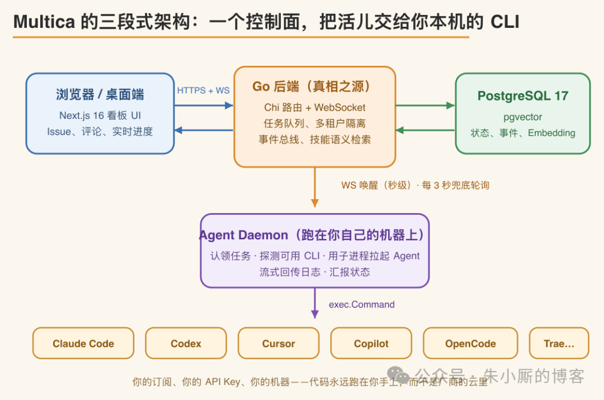
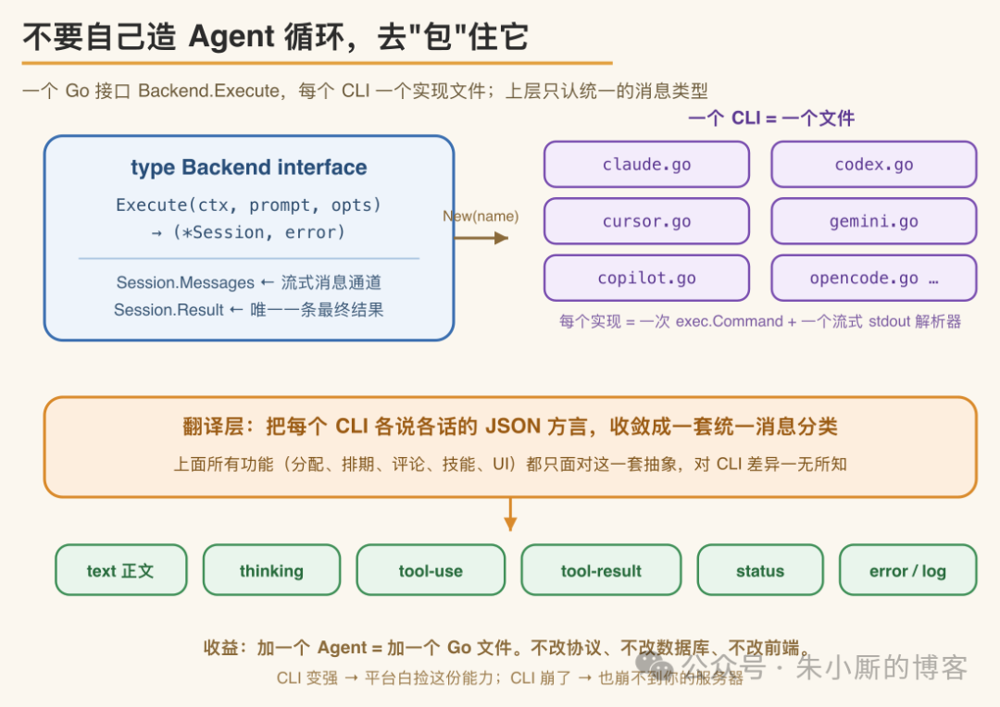
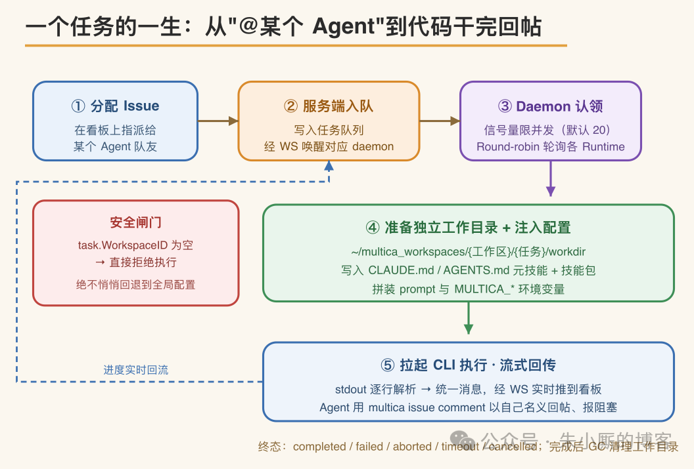

# Multica 深读：把编码 Agent 变成真正的队友，靠的是「不造循环，只做控制面」

> Multica（GitHub: multica-ai/multica）是一个开源的 Managed Agents 平台，把 Issue 指派给 AI 编码 Agent 后它就接手任务、修改代码、回帖反馈阻塞。核心设计原则是「不造循环，只做控制面」——不自建 Agent runtime，而是调度本机已装好的编码 CLI。

## 定位与边界

Multica 产品形态接近 Linear：包含 Issue、项目、评论、收件箱和实时看板。区别在于看板上的负责人除了人，还可以是 AI 编码 Agent。将一个 Issue 指派给某个 Agent 后，它会接手任务、修改代码、在评论中反馈阻塞、更新状态，无需手动复制 prompt 或在终端旁监控输出。该仓库已有数万 star，是目前较为完整的开源 Managed Agents 实现之一。

**先厘清一个前提：Multica 本身不是 Agent。** 它不发起 LLM 调用，不解析工具调用，也不包含 RAG。实际执行任务的是本机已安装的编码 CLI——Claude Code、Codex、Cursor、Gemini、GitHub Copilot CLI、OpenCode，以及 Kimi、Kiro、Trae CLI 等。Multica 是这些 CLI 之上的**控制面**，只负责调度、状态管理和协作。就职责而言，它相当于 Linear 与 GitHub Actions 的组合，区别在于任务执行方是 AI Agent。

名字来源于 **M**ultiplexed **I**nformation and **C**omputing **A**gent，呼应 1960 年代的分时操作系统 Multics——后者让多个用户共享同一台机器且互不干扰。Multica 的隐喻是：以往软件协作以单个工程师、单个任务、单个上下文为单位串行推进，而现在被多路复用进系统的参与者既包括人类，也包括自主运行的 Agent。

## 三段式架构：控制面调度本机 CLI

整个系统只有三个进程角色：

1. **前端**：浏览器或桌面端，Next.js 看板界面
2. **后端**：Go 编写，Chi 做路由、gorilla/websocket 提供实时通道、PostgreSQL 加 pgvector 存储全部状态，是系统的单一真相源
3. **Agent Daemon**：运行在用户本机，负责拉起 CLI

前端与后端之间走 HTTPS 加 WebSocket，后端与 daemon 之间采用「WS 唤醒 + HTTP 轮询兜底」的双通道，daemon 最终通过 `exec.Command` 启动本地 CLI。

这一拓扑决定了系统的安全边界：**代码始终在用户本机运行，使用用户自己的订阅和 API Key，不上传到第三方云端。**

## 核心设计：不自建 Agent 循环，而是封装现成 CLI

项目以较小的团队实现较大的功能面，关键在：**不自行实现 Agent runtime，而是作为控制面把任务分派给现成的 CLI**。落到代码上分三步：

1. 定义一个 Go 接口 `Backend`，只有一个流式的 `Execute` 方法，返回一个 `Session`（内含消息通道 + 最终结果通道）
2. 每种 CLI 对应一个实现文件，本质是一次 `exec.Command` 加一个逐行解析 stdout 的解析器
3. 把各 CLI 格式不一的 JSON 输出翻译成统一消息分类：text、thinking、tool-use、tool-result、status、error、log

此层之上的全部功能——任务分配、排期、评论、autopilot、技能、UI——都只面向这套统一抽象，不感知底层 CLI 的差异。

这种设计带来几点直接收益：新增一个 Agent 只需新增一个 Go 文件，无需改动协议、数据库或前端；不产生供应商锁定；底层 CLI 能力提升时平台自动获益；某个 CLI 崩溃时，受影响的只是一个子进程。

实现细节反映工程取向。以 `claude.go` 为例：用 `--output-format stream-json` 让 Claude 以 NDJSON 逐行输出，并自动批准所有工具调用的控制请求——因为人工审批发生在 Issue 和评论层，而非每次工具调用。另一个值得借鉴的做法：每个子进程都挂一个**有界的 64KB stderr 环形缓冲区**；缺少它时，底层 CLI 崩溃只会返回一句 `exit status 3`，缺乏可排查的上下文。这类「每条经验对应一个真实 bug」的约束，是该仓库工程价值的集中体现。

## 任务执行流程：从指派到回帖

Daemon 通过 `multica daemon start` 运行在本地。启动时先占用一个健康检查端口（默认 19514）做 fail-fast；接着用 `exec.LookPath` 探测本机已装 CLI，执行版本门禁，再注册为一个个 Runtime。核心是 `pollLoop`：用容量默认 20 的信号量控制并发，round-robin 轮询各 Runtime 认领任务，默认三秒一轮。同时 daemon 维持一条 WS，服务端入队新任务立即发来唤醒，兼得 WebSocket 的秒级延迟和轮询在断网后的自愈能力。

每个任务分配一个独立工作目录，路径形如 `~/multica_workspaces/{工作区}/{任务}/workdir`。Daemon 将一份元技能写为 CLAUDE.md 或 AGENTS.md 注入该目录，说明 Agent 如何使用 `multica issue` 这套 CLI——get、comment add、update、assign 均统一带 `--output json`，多行内容用 `--content-stdin` 配合 HEREDOC 传入，避免 `--content "..."` 参数中 `\n` 不展开、换行错乱成字面量的问题。

此处有一道**安全闸门**：一旦发现 `task.WorkspaceID` 为空，daemon 直接拒绝执行，不回退到用户的全局配置，避免跨工作区串用。任务终态统一为 completed、failed、aborted、timeout、cancelled 五种，执行完成后由 GC 按 TTL（默认 24 小时）清理工作目录。

## 与各 CLI 的交互：一次性流式与持续协议会话

`Backend.Execute` 隐含的前提：交互粒度是「一次 run 对应一个子进程」，而非常驻 Agent 进程。同一 Issue 被多次执行时，每一次都是全新的 run、全新的子进程，可用 `multica issue runs` 查看执行历史，用 `multica issue usage` 汇总 Token 消耗。

「进程内部如何与 CLI 通信」，按 CLI 支持的协议分两条路径：

**一次性流式执行**（Claude Code、Qwen、Cursor、Copilot、OpenCode）——拉起进程，prompt 经 argv 或 stdin 送入，逐行读取 stdout 的 NDJSON 事件流，直到进程自行退出。claude.go 用 `--output-format stream-json`、Qwen 用 `qwen -p <prompt> --output-format stream-json`。

**持续 stdio 协议会话**（Codex 及走 ACP 的 Kiro、Qoder、Trae、Grok）——以 Codex 为例，启动 `codex app-server --listen stdio://`，通过 JSON-RPC 2.0 建立长连接：握手后发送 thread/start、turn/start，持续接收 item/started、item/completed、turn/completed 等 notification；遇到审批请求自动回 accept；任务结束时关闭 stdin 优雅退出。因此单任务生命周期内这类进程是持续、可多轮交互的，但仍只服务这一个任务，结束即退出。

### 厘清「持续」≠「常驻」

「持续」作用域被严格限定在单个 run 内部：一次性流式形同寄一封信，持续 stdio 会话形同一通电话——但无论信还是电话，都只服务这一个任务，办完即断。下一次 run 是重新拉起，而非复用常驻热线。

跨 run 的「上下文连续」由会话恢复承接：`ExecOptions` 带有 `ResumeSessionID`。Codex 的会话状态——rollout JSONL、auth 与 config——保存在任务本地的 codex-home，GC 清理构建产物时特意保留这部分，文档原话是「以便 Agent 能恢复它」。下一次 run 带上 session id 即可接续上一轮上下文；若恢复被拒，`Result.ResumeRejected` 置位，daemon 回退到全新会话重跑。

## 技能、Squads 与 Autopilot

- **技能（Skill）**：可复用的 markdown 指令包，每次任务启动时注入工作目录。部署流程、数据库迁移、代码审查等经验一旦写成技能，就沉淀为团队共享资产。`skills-lock.json` 锁定各技能版本，确保可复现。
- **Squads（小队）**：面向较大团队，任务交给 leader agent 带队的小队，由队长决定谁接手。团队调整时 `@前端组` 这样的写法始终不变。
- **Autopilot**：把「创建任务」自动化——定时 Cron、Webhook 或手动触发，自行建出 Issue 并指派给 Agent，适合日报周报、定期巡检、告警转工单。

任务入口也不止一条：直接指派、评论中 @ 提及、Chat 对话、quick-create（自然语言异步转成一次 issue create），结果以收件箱通知返回。

## 一个端到端案例：从告警到合并

某团队线上服务半夜触发错误率告警 → 告警平台经 Webhook 打到 Autopilot → 规则转成 Issue（标题带错误摘要，正文附堆栈与日志链接），指派给 `@后端组` Squad → leader 判断接手者 → daemon 在 `~/multica_workspaces/backend/{任务}/workdir` 拉起 Codex 子进程，带上仓库、注入的 AGENTS.md 元技能和「排查线上错误」技能 → Agent 通过 JSON-RPC 会话定位判空缺失，改完代码、跑过测试，用 `multica issue comment add --content-stdin` 回帖，任务转 completed。发起人只在收件箱收到通知。

接手人 review 后补一句「顺手把同类调用判空补上」→ 触发一次全新的 run，但带上上一轮的 `ResumeSessionID`，Codex 从 codex-home 恢复 rollout，接着原有上下文继续改。若某次运行超时或恢复被拒，任务落到 timeout 或由 `Result.ResumeRejected` 触发全新会话重跑。改动满意后，最后一轮 run 在 `multica repo checkout` 拉出的 git worktree 上提交并推出 PR。

> Agent 全程只在工作目录里干活并回帖，**合并权始终在人手里**。

综合来看，Multica 的核心并非某个新模型，而是一组工程约束：一个接口配多份实现、一套工作目录约定、一个单一真相源，以及一份将多数规则都标注了对应触发 bug 的工程文档。对于研究「人与 Agent 协作」如何落地的开发者，它是一个值得逐行阅读的开源参考实现。