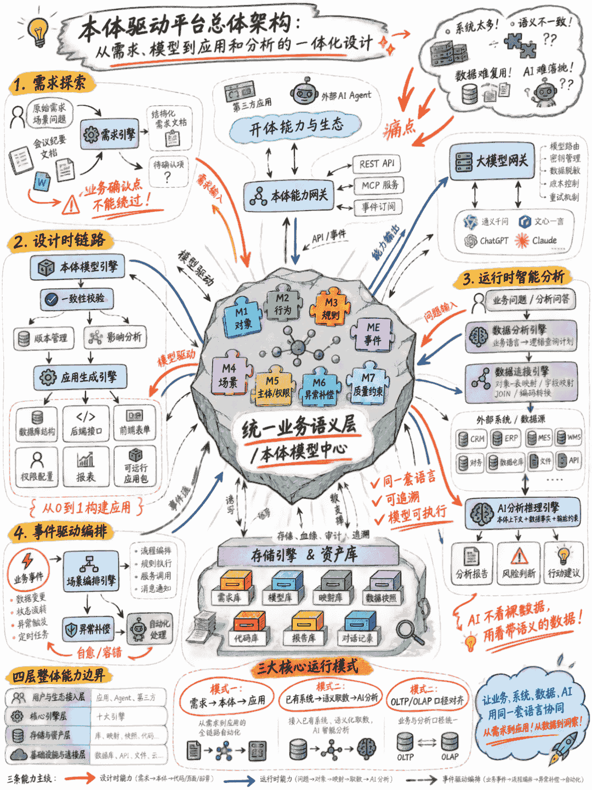
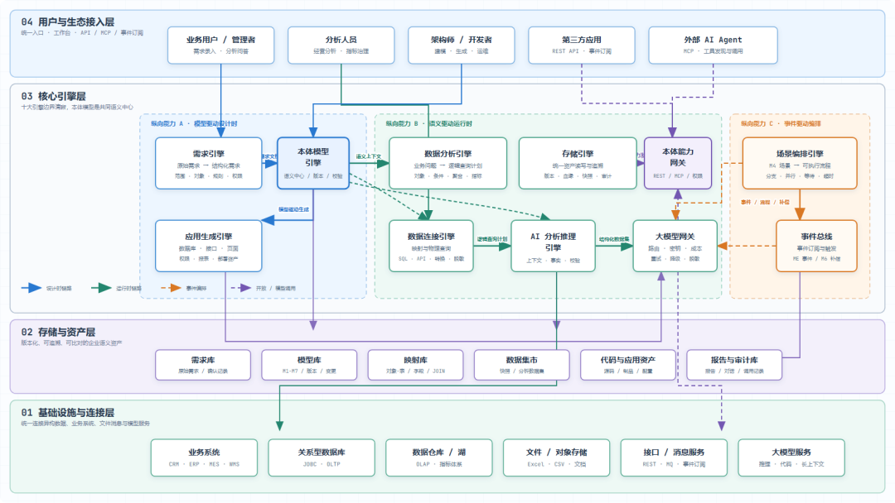
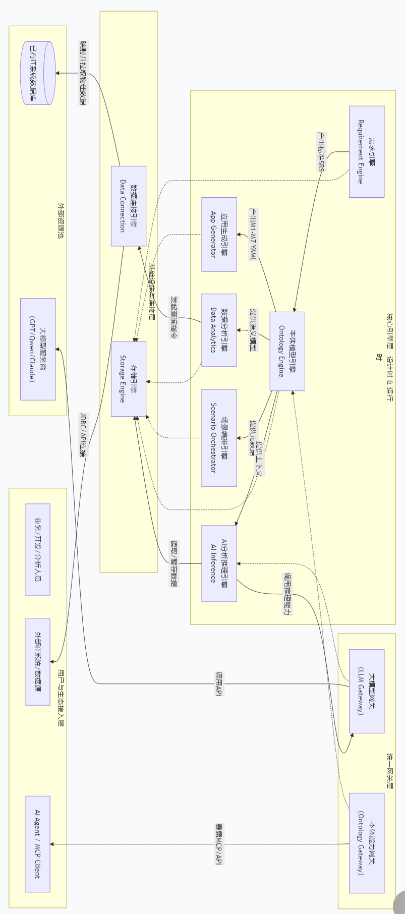
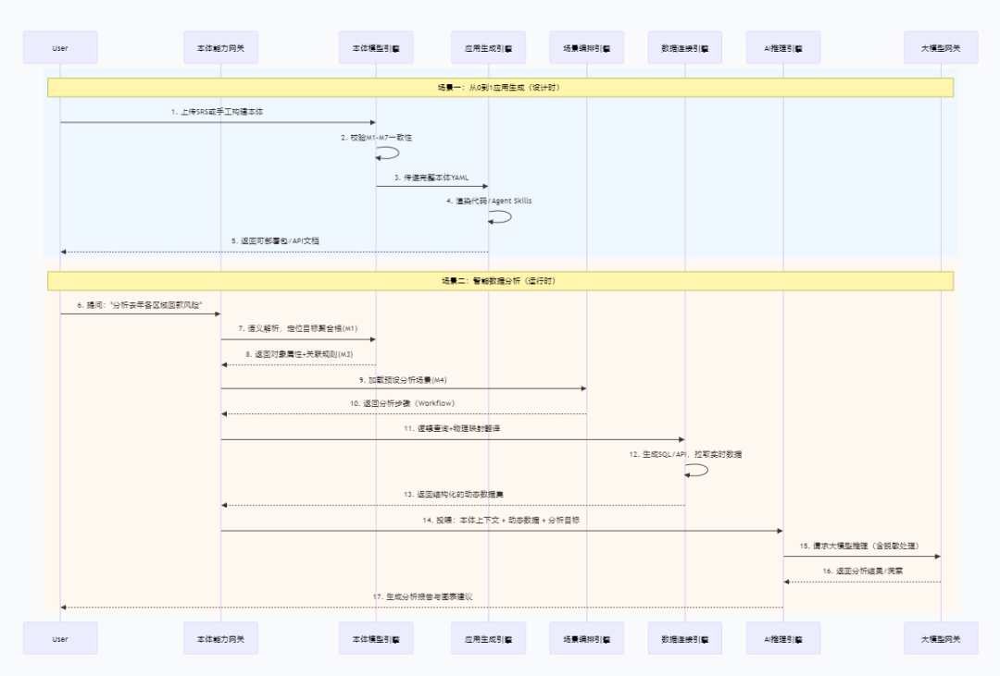

# 本体平台总体架构：从需求到本体建模，从本体模型驱动的AI应用构建和数据分析推理

> 企业数字化做到一定阶段后，问题通常不再是缺少系统，而是系统太多、语义不一致、数据难复用、AI难落地。本体驱动平台将需求、业务模型、应用生成、数据连接、智能分析放到同一套语义框架下，建立统一的业务语义基础设施。

<!-- more -->

大家好，我是人月聊IT。今天聊下本体平台的整体规划和架构设计的关键点，供大家参考。

企业数字化做到一定阶段后，问题通常不再是缺少系统，而是系统太多、语义不一致、数据难复用、AI难落地。业务人员说的是客户、合同、订单、库存、回款，系统里存的是表、字段、接口、状态码；管理层要看经营指标，BI团队要维护口径，IT团队要处理系统集成，AI团队又要把数据整理成大模型能理解的上下文。每一层都在做翻译，翻译多了，偏差就会越来越大。

本体驱动平台要解决的就是这个问题。它不是再做一个低代码工具，也不是单独做一个BI系统或知识图谱系统，而是把需求、业务模型、应用生成、数据连接、智能分析放到同一套语义框架下。平台从场景问题和原始需求开始，通过需求探索形成完整需求文档，再把需求转成本体模型。后续不论是从0到1生成应用，还是连接已有系统做智能分析，还是对齐OLTP和OLAP系统，都围绕这套本体模型展开。

本文以“本体平台构建的总体架构”为基础，重新梳理一个更适合落地讨论的总体方案。文章重点不放在概念包装上，而是说明这个平台要解决什么问题、由哪些引擎组成、这些引擎如何协同，以及第一阶段应该怎样做出最小闭环。

---

## 一、先说清楚平台要解决的问题

企业系统建设里有三个长期存在的问题：

### 1. 需求到系统之间缺少稳定的中间层
传统做法通常是业务提出需求，分析师写需求文档，架构师设计系统，开发人员写代码。每一次交接都会损失一部分语义。需求文档里写“合同生效后生成付款计划”，到了数据库里可能变成几张表和几个状态字段，到了代码里又分散在多个服务和定时任务中。几年之后，没人能快速说清楚某个规则到底来自哪条需求，也没人敢轻易改字段、改流程。

### 2. 数据系统和业务系统长期分离
OLTP系统负责业务操作，OLAP系统负责统计分析。业务上同一个“客户”“订单”“合同”，在不同系统里的字段名称、粒度、状态定义、时间口径可能都不一样。一个经营指标要跨多个系统取数，BI团队要写大量SQL和ETL逻辑，但这些逻辑很难和原始业务规则保持同步。最后形成的结果是：业务系统改了，分析口径滞后；报表口径变了，源头系统不知道；AI分析拿到数据后，也不知道这些字段背后的业务含义。

### 3. AI落地缺少可控上下文
大模型擅长理解自然语言和生成分析结论，但它不能凭空理解企业内部对象、规则、流程和指标口径。如果只是把一张宽表、几段SQL结果或一堆文档丢给大模型，分析结果看起来完整，实际可能混淆概念、误用口径，甚至引用不存在的规则。企业真正需要的不是一个会聊天的入口，而是一个能理解业务对象、遵守业务规则、读取真实数据、输出可追溯结论的分析机制。

**本体驱动平台的核心判断是：企业需要一个统一的业务语义层。** 这个语义层既能承接需求，又能指导应用构建，还能连接数据库、接口和指标体系，并为AI分析提供结构化上下文。

---

## 二、需求探索与本体建模的背景说明

平台的前置基础有两个：**需求探索方法** 和 **本体建模规范**。

### 需求探索方法
解决“原始需求如何变成完整需求”的问题。现实中，业务人员通常不会一次性给出完整需求，更多是一句话、一个问题或一个场景。例如“想做一个合同管理系统”“想分析库存积压原因”“想让AI帮我看销售回款风险”。这些表达有方向，但不够支撑建模和开发。需求探索的作用，是让AI按结构化方式推进访谈：先确认业务范围，再识别业务对象，接着梳理功能、规则、流程、角色、权限和报表。通用行业知识可以由AI先补全，企业特有规则必须让用户确认。这样既减少业务人员负担，又避免AI随意假设关键制度。

### 本体建模规范
解决“完整需求如何变成可运行模型”的问题。它把业务系统拆成几个相互引用但职责清楚的模型：
- **M1 对象模型**：描述业务中有哪些核心对象、属性和关系
- **M2 行为模型**：描述这些对象能执行哪些操作
- **M3 规则模型**：描述校验、计算、推导和风控等可复用规则
- **ME 事件模型**：描述业务状态变化后触发的事件及订阅关系
- **M4 场景模型**：描述端到端流程和用例编排
- **M5 主体模型**：描述岗位、角色和权限边界
- **M6 异常补偿模型**：描述失败、回滚和补偿策略
- **M7 质量约束模型**：描述性能、可靠性、并发和安全等非功能要求

这套方法的价值在于把“文字需求”转成“结构化业务模型”。模型不是为了画图好看，而是为了被系统读取、校验、生成和执行。后续如果要扩展到UI模型、对象-表映射模型、接口模型，也可以在八个核心模型基础上继续扩展，用于支撑页面生成、数据库映射和外部系统集成。

---

## 三、平台总体定位

本体驱动平台可以定位为**企业级AI原生应用与智能分析平台**。它的主要职责有三类：

1. **从0到1构建应用**：用户提出原始需求后，平台通过需求引擎生成需求文档，再通过本体模型引擎生成模型，最后由应用生成引擎生成数据库、后端接口、前端表单、权限配置、查询报表和基础运行框架。重点是从业务对象、行为、规则和流程出发生成系统骨架。
2. **面向已有系统做智能分析**：企业已经有CRM、ERP、MES、WMS、财务系统和数据仓库，不可能全部重建。平台把本体对象映射到这些系统中的表、视图、接口和文件，通过数据连接引擎动态取数，再把“本体语义+业务数据+分析问题”一起交给AI分析推理引擎。AI拿到的不再是裸数据，而是带业务解释的数据上下文。
3. **对齐OLTP和OLAP**：OLTP关注交易过程，OLAP关注分析结果。两者经常在对象口径、状态口径、时间口径和指标口径上脱节。本体模型作为中间层，把业务对象、源系统字段、数据仓库维度、指标公式、报表展示统一管理，减少口径争议。

平台的目标不是替代所有系统，而是建立一套可复用的语义底座。

---

## 四、四层三纵的总体架构

平台整体可以按“四层三纵”理解：

### 四层架构

1. **基础设施与连接层**：负责接入外部世界，包括关系型数据库、数据仓库、对象存储、接口服务、消息队列、文件系统和大模型服务。支持JDBC、REST API、消息订阅、文件导入等方式。大模型服务通过统一网关接入。
2. **存储与资产层**：保存平台运行过程中形成的资产，包括原始需求、需求文档、本体模型、模型版本、对象-表映射、数据快照、生成代码、分析报告和对话记录。核心是**可追溯**。
3. **核心引擎层**：包含平台的主要处理能力，包括需求引擎、本体模型引擎、应用生成引擎、数据分析引擎、数据连接引擎、AI分析推理引擎、场景编排引擎等。
4. **用户与生态接入层**：业务用户、分析人员、架构师、开发人员、外部AI Agent、第三方应用从这一层进入平台。入口包括需求录入页面、分析问答界面、本体建模工作台、应用生成控制台、REST API、MCP服务或事件订阅接口。

### 三纵贯穿能力

- **模型驱动的设计时能力**：从需求到本体，再到代码、接口、页面和部署资产。
- **语义驱动的运行时能力**：从用户问题到本体对象，再到数据映射、数据拉取和AI分析。
- **事件驱动的编排能力**：从业务事件到流程编排，再到异常补偿和自动化处理。

设计时解决系统怎么建，运行时解决数据怎么用，编排时解决流程怎么动。三条线都以本体模型作为共同语义基础。

---

## 五、十大引擎的职责边界

### 1. 需求引擎
负责把模糊想法变成结构化需求。接收一句话需求、会议纪要、访谈材料或已有文档，按照需求探索方法生成需求草稿。区分通用内容（先给建议）与企业特有内容（必须确认）。输出包含业务范围、业务对象、功能清单、业务规则、端到端流程、角色权限、查询报表和待确认项的需求文档，并带来源标记。

### 2. 本体模型引擎
负责把需求文档转成本体模型，并管理模型的生命周期。支持自动生成初始模型、人工调整和版本管理。进行一致性检查（如行为引用的对象是否存在、规则引用的字段是否匹配）。建立对象、行为、规则、事件、场景、角色索引，并支持变更影响分析。

### 3. 应用生成引擎
负责把本体模型变成可运行应用。根据M1生成数据库结构与领域对象，根据M2生成接口与服务骨架，根据M3生成校验与计算逻辑，根据M4生成流程编排，根据M5生成权限配置。输出可启动、可录入、可查询、可校验、可部署的应用包。

### 4. 数据分析引擎
负责把业务语言转成逻辑查询计划。识别问题涉及的本体对象和属性，生成与业务语义一致的逻辑计划（对象、过滤条件、聚合维度），不直接拼SQL，交由数据连接引擎翻译。

### 5. 数据连接引擎
负责把本体对象连接到真实IT系统。维护对象到表、字段到字段、对象关系到JOIN关系、枚举值到系统编码的映射。处理方言、认证、字段转换、增量同步、缓存、脱敏和数据质量检查，返回带溯源记录的结构化数据集。

### 6. AI分析推理引擎
负责把本体上下文和动态数据组织成可用的分析输入，并调用大模型生成结论。选取相关本体上下文，注入必要数据事实，约束输出格式和分析边界。对输出结果进行校验，无依据的判断标注为推测。

### 7. 存储引擎
负责保存平台资产，划分为需求库、模型库、映射库、数据集市、代码库和报告库。重点是“能查、能追溯、能比对”，支撑版本追溯与口径变更溯源。

### 8. 场景编排引擎
负责把M4场景模型转成可执行流程，处理顺序执行、条件分支、并行执行、事件等待、超时处理和异常补偿。支持业务流程驱动与分析流程编排。

### 9. 本体能力网关
负责把平台内部能力对外开放。通过REST API、MCP服务或消息订阅暴露对象、行为、查询能力，并统一权限和调用边界，保留审计日志。

### 10. 大模型网关
负责统一管理大模型调用。处理模型路由、密钥管理、敏感信息脱敏、成本统计、失败重试和降级策略。按任务类型（需求探索、代码生成、经营分析、简单摘要）分发到最合适模型。

---

## 六、三类核心运行模式

### 模式一：从0到1构建应用
- **链路**：原始需求 → 需求引擎（需求文档）→ 本体模型引擎（八大模型）→ 应用生成引擎（数据库、接口、页面、权限、报表）→ 确认测试部署。
- **适用**：轻量业务系统、内部管理工具、领域应用原型、AI Agent工具包。
- **优势**：速度快，需求与模型有追溯关系，需求变更可增量生成。

### 模式二：基于已有系统做AI智能分析
- **链路**：业务问题 → 数据分析引擎（识别对象/指标）→ 数据连接引擎（动态取数）→ AI分析推理引擎（结合本体上下文生成报告）→ 输出结论与建议。
- **适用**：经营分析、风险分析、供应链分析、客户分析、合同履约分析。
- **优势**：AI在明确的对象、规则、口径和数据范围内工作，可追溯不幻觉。

### 模式三：OLTP与OLAP语义对齐
- **链路**：业务对象、交易表、分析宽表、指标公式、报表字段统一登记到本体和映射模型中。
- **适用**：数据治理和指标治理。
- **优势**：减少报表口径争议，业务系统变更可自动识别受影响的指标与报表。

---

## 七、引擎之间的集成关系

平台集成关系分为三条链路：

1. **设计时链路**：需求引擎 → 本体模型引擎（校验）→ 应用生成引擎 → 存储引擎（版本归档）。
2. **运行时链路**：用户问题 → 数据分析引擎（逻辑计划）→ 数据连接引擎（物理取数）→ AI分析推理引擎（结合本体上下文）→ 存储引擎。解耦设计：AI推理不直连数据库。
3. **开放链路**：本体能力网关暴露能力，大模型网关统一模型调用，外部Agent受控接入并审计。

**本体模型是平台的语义中心**，所有链路围绕模型建立关系。

---

## 八、建议的实施路线

平台建议按四阶段建设：

- **第一阶段（最小闭环）**：做“本体建模到智能分析”的最小闭环。核心模块包括本体模型引擎、数据连接引擎、AI分析推理引擎和存储引擎。选一个明确业务场景（如合同履约分析、库存积压分析、销售回款风险分析），验证本体增强AI分析的可靠性。
- **第二阶段（应用生成）**：补齐“需求到应用生成”闭环。加入需求引擎和应用生成引擎，支持单体应用、标准CRUD、主从表单、简单状态机和固定报表。
- **第三阶段（编排与开放）**：建设场景编排和开放能力。引入场景编排引擎、本体能力网关和大模型网关，支持跨系统事件、自动化流程、外部Agent调用。
- **第四阶段（治理与规模化）**：做版本管理、影响分析、指标血缘、权限体系、审计报表和团队协作。

---

## 九、落地时要注意的五个边界

1. **不要把本体建模做成纯文档工作**：模型必须能被程序读取、校验和执行。
2. **不要让AI绕过业务确认**：通用字段可补全，核心审批规则、权限范围、金额口径必须业务确认。
3. **不要一开始追求全自动生成复杂系统**：先做稳定模型、表结构、接口与表单，再扩展工作流和事件。
4. **不要让数据连接变成一次性项目**：映射关系本身是核心资产，需版本管理和影响分析。
5. **不要把AI分析结果当成最终事实**：AI输出必须带依据、带数据来源、带口径说明，保留人工复核机制。

---

## 十、总结

本体驱动平台的核心价值，是把企业软件建设和智能分析中反复出现的“语义翻译”问题收敛到一套模型体系里。需求通过结构化探索进入模型，应用通过模型生成，数据通过模型映射，分析通过模型获得上下文，OLTP和OLAP通过模型统一口径。

真正可落地的路径是**先做小闭环，再扩展平台能力**。选一个业务对象清楚、数据源可连接、分析问题明确的场景跑通闭环，逐步沉淀为企业级语义基础设施。
