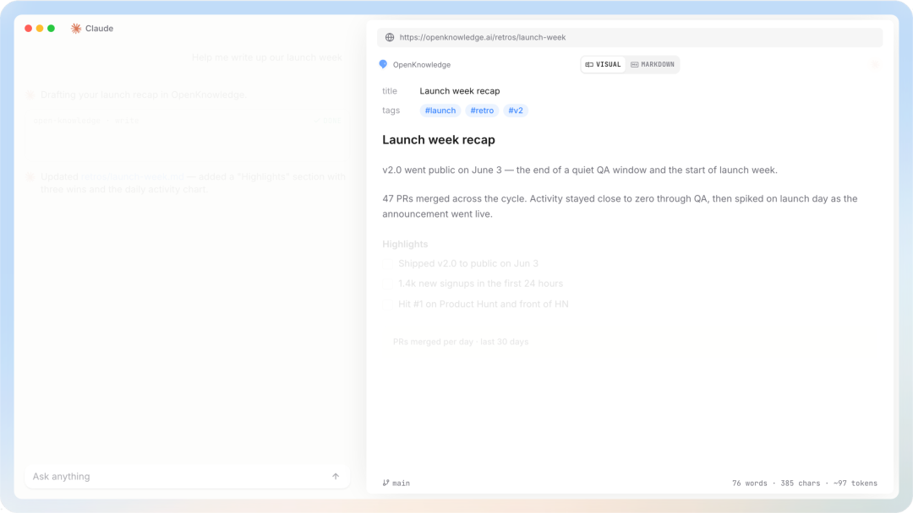
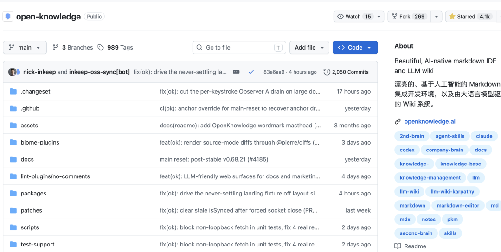
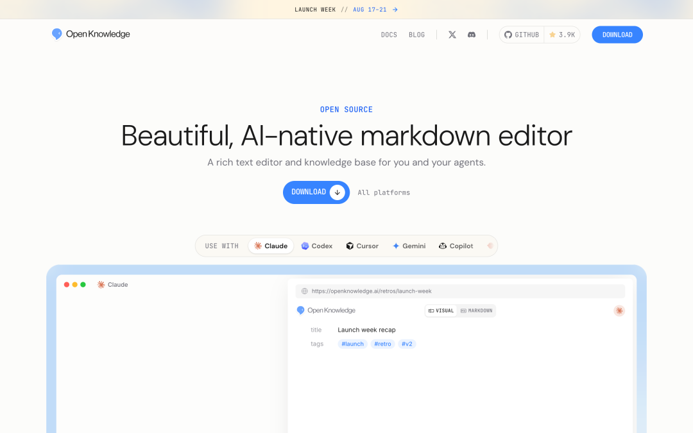
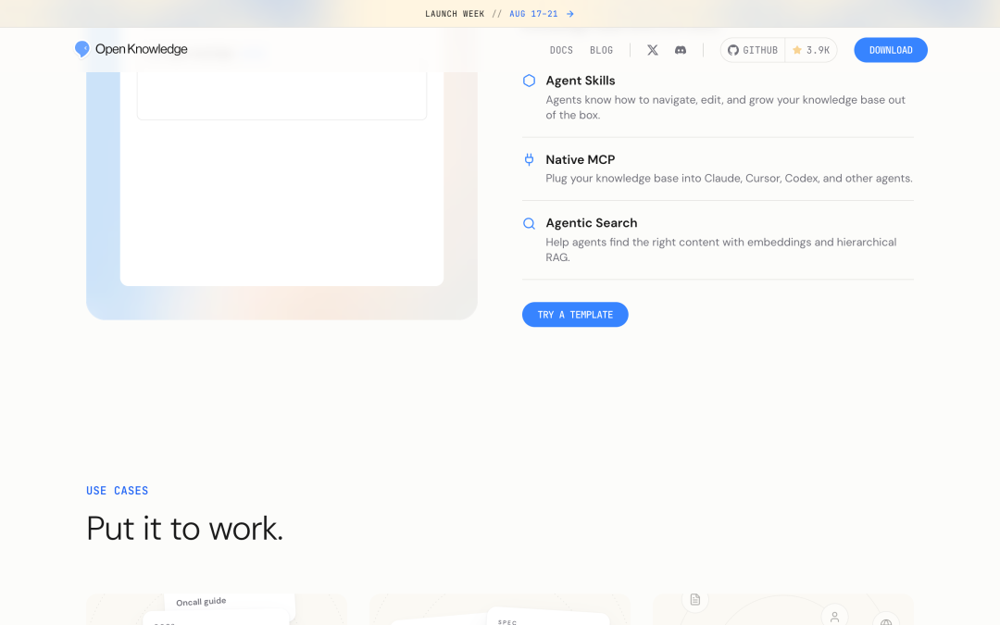
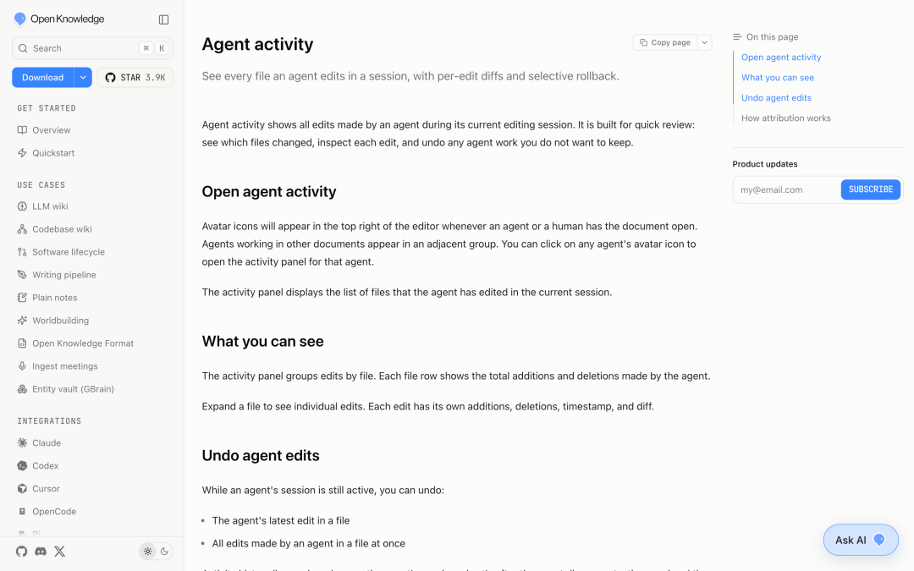
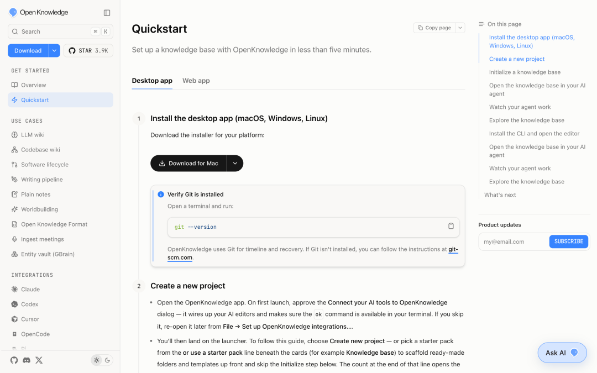

# 4.1 K Star！这个开源 Markdown IDE，让 Claude、Codex、Cursor 共用一套知识库

同一个项目，Claude Code 已经读过一遍，换到 Codex 还得重新交代背景。需求、技术方案和踩坑记录明明都在仓库里，Agent 真正用起来却还是东翻一个 README，西找一篇文档。更麻烦的是后面：Agent 改过哪些内容？有没有写坏链接？哪些页面已经没人引用？VS Code 能编辑，Obsidian 能整理笔记，Git 能记版本，但这些事得靠人自己串起来。前两天朋友推荐了一个项目 OpenKnowledge， 刚好可以解决这些问题，把这几个环节接到一起。OpenKnowledge项目地址：https://github.com/inkeep/open-knowledgeREADME 用 “Notion meets VS Code” 介绍它，这句话说的是人看到的编辑器。往后多看一层，才是它和普通 Markdown 编辑器拉开差别的地方：Agent 也有自己的入口。项目由 Inkeep 团队开发，采用 GPL-3.0 许可证，目前约 4.1K Star。人和 Agent 编辑的是同一批文件OpenKnowledge 是一个开源 Markdown IDE。人可以在可视化编辑器里写文档，表格、代码块、Mermaid、LaTeX、图片、视频和交互式 HTML 都能放进去；保存下来的内容仍是仓库里的 Markdown/MDX 文件。Claude Code、Codex、Cursor 这类工具则通过 MCP、Skills 和知识管理工具读取这些文件。人在编辑器里写下需求，Agent 搜索相关资料并补充文档，改动随后进入 Git 历史和 OpenKnowledge 的时间线。下次换个 Agent，接着读这批文件就行，不必搬知识库。

同一个项目，Claude Code 已经读过一遍，换到 Codex 还得重新交代背景。需求、技术方案和踩坑记录明明都在仓库里，Agent 真正用起来却还是东翻一个 README，西找一篇文档。

更麻烦的是后面：Agent 改过哪些内容？有没有写坏链接？哪些页面已经没人引用？VS Code 能编辑，Obsidian 能整理笔记，Git 能记版本，但这些事得靠人自己串起来。

前两天朋友推荐了一个项目 OpenKnowledge， 刚好可以解决这些问题，把这几个环节接到一起。

项目地址：https://github.com/inkeep/open-knowledge

README 用 “Notion meets VS Code” 介绍它，这句话说的是人看到的编辑器。

往后多看一层，才是它和普通 Markdown 编辑器拉开差别的地方：Agent 也有自己的入口。项目由 Inkeep 团队开发，采用 GPL-3.0 许可证，目前约 4.1K Star。

## 人和 Agent 编辑的是同一批文件

OpenKnowledge 是一个开源 Markdown IDE。人可以在可视化编辑器里写文档，表格、代码块、Mermaid、LaTeX、图片、视频和交互式 HTML 都能放进去；保存下来的内容仍是仓库里的 Markdown/MDX 文件。

Claude Code、Codex、Cursor 这类工具则通过 MCP、Skills 和知识管理工具读取这些文件。人在编辑器里写下需求，Agent 搜索相关资料并补充文档，改动随后进入 Git 历史和 OpenKnowledge 的时间线。下次换个 Agent，接着读这批文件就行，不必搬知识库。

官网首页这和直接把一堆 Markdown 丢给 Agent 有一点区别。OpenKnowledge 会继续处理文件之间的关系和改动记录，不只是把文件内容读进上下文。Notion 的可视化编辑很成熟，不过内容保存在它自己的系统里，Agent 需要通过 API 访问。Obsidian 直接使用本地 Markdown，对人很友好，交给 Agent 时通常还是普通文件。OpenKnowledge 选的是中间那条路：编辑体验靠 IDE，Agent 接入靠 MCP 和 Skills，文件与版本继续交给 Markdown 和 Git。编辑器演示我更看重的亮点找资料时，会顺着文档关系继续查比如让 Codex 查“登录鉴权”相关资料，它不会只做一次关键词匹配。OpenKnowledge 默认会结合 BM25、目录结构、文档链接和 Agent 的多轮检索，沿着引用关系继续找。这套默认搜索不要求先部署向量数据库。语义搜索也有，但属于可选项；打开后，查询内容和匹配到的文档会发给你配置的模型服务商，这一点要根据文档敏感程度来决定。链接关系也会被拿来做日常维护。失效链接、没有其他页面引用的孤立文档、知识库里的核心页面，都能被单独找出来。文档多起来后，这比等读者点到 404 再回头修省事。Agent 动过什么，时间线里能看到写入、移动和删除都会留下记录，改错后可以查看和回滚。要让 Agent 长期整理文档，这一步比“能调用一个写文件工具”重要得多。Agent Activity 文档团队同步仍然走 Git/GitHub：提交、推送，再由其他人拉取。它没有 Google Docs 那种实时多人共同编辑，原本就用 Git 管文档的团队更容易接上；需要多人同时改一页内容的场景，体验不会和在线文档一样。ok init还会检测本机已有的 Agent 工具并帮忙配置。官方文档目前列出了 Claude Code、Claude Desktop、Cursor、Codex、OpenCode、OpenClaw、Pi、Antigravity、LM Studio 和 Hermes。其他工具只要支持 MCP，也有继续接入的空间。先拿一个现成目录试桌面端支持 macOS、Windows 和 Linux，可以从openknowledge.ai下载，地址：https://openknowledge.ai。喜欢命令行的话，本机需要 Node.js 24+ 和 Git：npm install -g @inkeep/open-knowledgemkdir my-knowledge-basecdmy-knowledge-baseok initok start --openok init会生成.ok/目录，同时配置检测到的 AI 编辑器。启动后可以新建知识库，也可以直接打开现有代码仓库或 Markdown 目录；从 Obsidian Vault、Notion 迁移则有单独的官方文档。Quickstart 文档第一次用，没必要马上搬整套团队知识库。拿一个现成的 Markdown 目录，让 Codex 或 Cursor 搜索其中一个主题，再补一篇关联文档。随后回到 OpenKnowledge，看看新链接有没有进入文档关系、修改能不能在时间线里找到。这个小流程跑通，基本就知道它适不适合自己的工作方式了。总结只用 Markdown 写几篇个人笔记，VS Code 或 Obsidian 已经够用。OpenKnowledge 更适合另一种情况：文档放在 Git 里，几个人和多个 Agent 都会碰，而且你希望搜索、链接维护、改动追踪也跟着走。它目前仍是 pre-1.0，功能和行为还可能变化。我会更建议先拿一个非关键目录试ok init，确认现有文件、Git 流程和 Agent 配置都没受影响，再决定要不要把主要知识库迁过去。

这和直接把一堆 Markdown 丢给 Agent 有一点区别。OpenKnowledge 会继续处理文件之间的关系和改动记录，不只是把文件内容读进上下文。

Notion 的可视化编辑很成熟，不过内容保存在它自己的系统里，Agent 需要通过 API 访问。Obsidian 直接使用本地 Markdown，对人很友好，交给 Agent 时通常还是普通文件。OpenKnowledge 选的是中间那条路：编辑体验靠 IDE，Agent 接入靠 MCP 和 Skills，文件与版本继续交给 Markdown 和 Git。

## 我更看重的亮点

### 找资料时，会顺着文档关系继续查

比如让 Codex 查“登录鉴权”相关资料，它不会只做一次关键词匹配。OpenKnowledge 默认会结合 BM25、目录结构、文档链接和 Agent 的多轮检索，沿着引用关系继续找。

这套默认搜索不要求先部署向量数据库。语义搜索也有，但属于可选项；打开后，查询内容和匹配到的文档会发给你配置的模型服务商，这一点要根据文档敏感程度来决定。

链接关系也会被拿来做日常维护。失效链接、没有其他页面引用的孤立文档、知识库里的核心页面，都能被单独找出来。文档多起来后，这比等读者点到 404 再回头修省事。

### Agent 动过什么，时间线里能看到

写入、移动和删除都会留下记录，改错后可以查看和回滚。要让 Agent 长期整理文档，这一步比“能调用一个写文件工具”重要得多。

团队同步仍然走 Git/GitHub：提交、推送，再由其他人拉取。它没有 Google Docs 那种实时多人共同编辑，原本就用 Git 管文档的团队更容易接上；需要多人同时改一页内容的场景，体验不会和在线文档一样。

ok init还会检测本机已有的 Agent 工具并帮忙配置。官方文档目前列出了 Claude Code、Claude Desktop、Cursor、Codex、OpenCode、OpenClaw、Pi、Antigravity、LM Studio 和 Hermes。其他工具只要支持 MCP，也有继续接入的空间。

## 先拿一个现成目录试

桌面端支持 macOS、Windows 和 Linux，可以从openknowledge.ai下载，地址：https://openknowledge.ai。喜欢命令行的话，本机需要 Node.js 24+ 和 Git：

ok init会生成.ok/目录，同时配置检测到的 AI 编辑器。启动后可以新建知识库，也可以直接打开现有代码仓库或 Markdown 目录；从 Obsidian Vault、Notion 迁移则有单独的官方文档。

第一次用，没必要马上搬整套团队知识库。拿一个现成的 Markdown 目录，让 Codex 或 Cursor 搜索其中一个主题，再补一篇关联文档。随后回到 OpenKnowledge，看看新链接有没有进入文档关系、修改能不能在时间线里找到。这个小流程跑通，基本就知道它适不适合自己的工作方式了。

## 总结

只用 Markdown 写几篇个人笔记，VS Code 或 Obsidian 已经够用。OpenKnowledge 更适合另一种情况：文档放在 Git 里，几个人和多个 Agent 都会碰，而且你希望搜索、链接维护、改动追踪也跟着走。

它目前仍是 pre-1.0，功能和行为还可能变化。我会更建议先拿一个非关键目录试ok init，确认现有文件、Git 流程和 Agent 配置都没受影响，再决定要不要把主要知识库迁过去。
