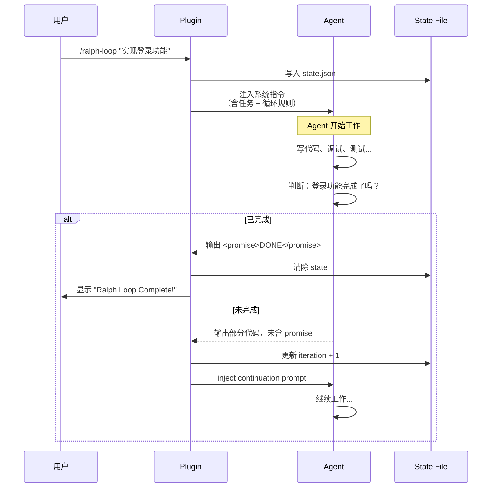
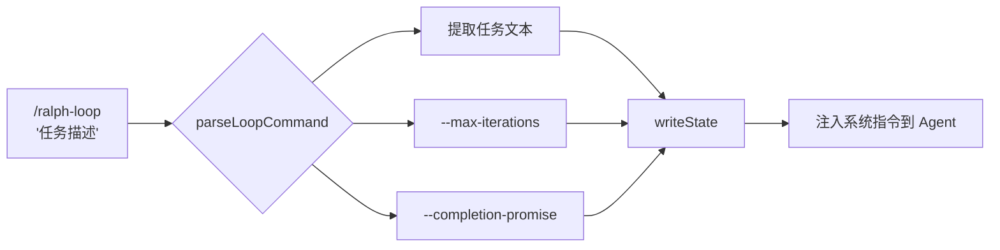
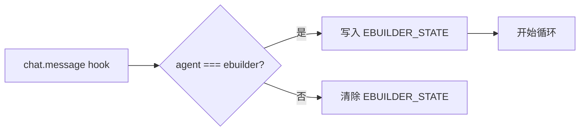
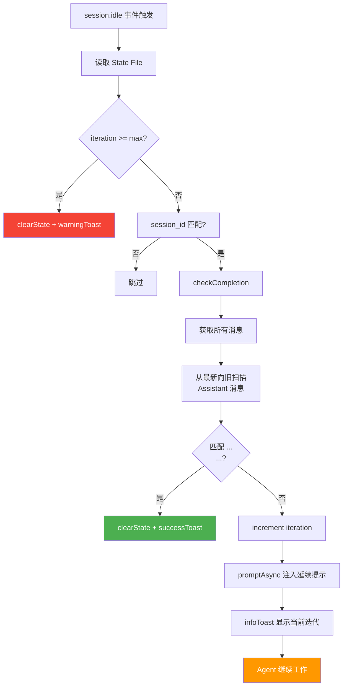
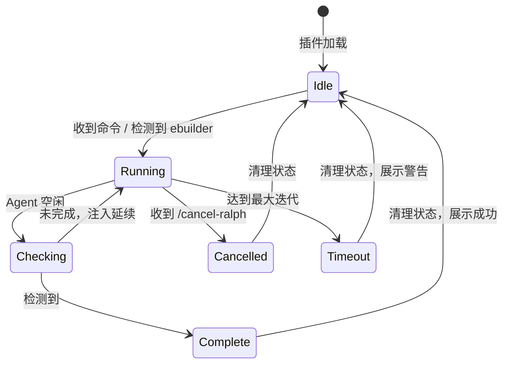

# opencode-ralph-loop 插件原理分析：自指完成循环的工程实现

> 让 AI Agent 自己判断"做完了没"，没做完就继续干——直到明确说"我完了"。

## 背景：为什么需要 Ralph Loop

AI 编程助手（如 OpenCode、Claude Code）在复杂任务中面临一个核心问题：**模型会"自我满足"**——写了一段代码就觉得任务完成了，实际上还有大量工作待做。

传统的解决方案是人工反复说"继续"、"还没完"，但这对多步骤、长链路任务来说效率极低。Ralph Loop 模式提供了一种**自指完成循环**：Agent 在执行过程中持续判断自己是否完成了任务，完成则输出特定信号（`<promise>DONE</promise>`），插件检测到信号后终止循环；未完成则自动注入延续提示，让 Agent 继续工作。

## 架构全景

```mermaid
graph TB
    subgraph "Plugin 内部"
        A[chat.message Hook] -->|解析命令| B[写入 State File]
        C[event Hook<br/>session.idle] --> D{handleContinuation}
        D --> E[checkCompletion]
        E -->|找到 promise| F[clearState + successToast]
        E -->|未找到| G[increment iteration<br/>promptAsync 注入延续]
        G -->|agent 继续工作| C
    end

    subgraph "外部系统"
        H[opencode.json] <--> A
        I[.ralph-loop.state.json] <--> B
        I <--> D
        J[Agent 输出流] --> E
    end

    subgraph "用户"
        K[/ralph-loop "任务"] --> A
        L[/cancel-ralph] --> A
    end

    style F fill:#4CAF50,color:#fff
    style G fill:#FF9800,color:#fff
```

## 核心概念：自指完成循环

这不是一个简单的"定时重试"或"轮询"机制。Ralph Loop 的核心是**自指性**：

1. **Agent 承担完成判断责任**：不是插件来判断任务是否完成，而是 Agent 自己在合适的时机输出 `<promise>DONE</promise>`
2. **插件是执行引擎**：负责检测信号、注入延续提示、管理迭代次数
3. **状态持久化**：Loop 状态写入文件，进程重启后仍可继续



## 两种激活模式

### 模式一：命令驱动（显式启动）

用户通过 `/ralph-loop` 或 `/ulw-loop` 命令显式启动循环：

```bash
/ralph-loop "实现用户注册功能，包括表单验证、邮箱确认、密码加密"
# 默认 100 次迭代，完成信号为 <promise>DONE</promise>

/ulw-loop "重构整个认证模块" --max-iterations=500 --completion-promise=SHIPPED
# 极限模式，500 次迭代，自定义完成信号 <promise>SHIPPED</promise>
```

命令解析流程：



### 模式二：Agent 自动检测（隐式启动）

当用户切换到 **ebuilder** Agent 时，插件自动检测到 `agent === "ebuilder"` 并启动循环。切换回其他 Agent 时自动停止。



## 状态管理

插件使用 JSON 文件持久化循环状态，支持两种状态文件：

| 文件 | 用途 | 默认最大迭代 |
|------|------|-------------|
| `.ralph-loop.state.json` | ralph-loop / ulw-loop | 100 / 500 |
| `.ebuilder.state.json` | ebuilder 自动模式 | 500 |

状态文件结构：

```json
{
  "agent": "claude-3.5-sonnet",
  "session_id": "ses_xxxxxxxxxx",
  "iteration": 5,
  "max_iterations": 100,
  "completion_promise": "DONE",
  "task": "实现用户注册功能",
  "ultrawork": false,
  "timestamp": "2026-08-08T12:00:00Z"
}
```

## 完成检测机制



检测逻辑的核心是扫描 Agent 的全部输出消息（从最新向旧扫描），使用正则 `/<promise>\s*(.*?)\s*<\/promise>/is` 匹配完成信号。这意味着无论 Agent 在哪条消息中输出完成信号，插件都能准确捕获。

## 延续提示注入

当检测到未完成时，插件注入的延续提示包含：

```
[SYSTEM DIRECTIVE: RALPH LOOP iteration 5/100]
You are in a self-referential loop. Continue working on the task.
Do NOT output <promise>DONE</promise> until the task is TRULY 100% complete.
Original task: 实现用户注册功能，包括表单验证、邮箱确认、密码加密
```

这个提示的设计要点：
- **迭代计数**：让 Agent 知道当前进度
- **禁止过早完成**：明确要求"直到真正 100% 完成才输出 promise"
- **原始任务**：每次注入都携带原始任务，防止 Agent 偏移目标

## 竞态保护

```mermaid
flowchart LR
    A[session.idle 事件1] --> B{inFlight.has(sessionId)?}
    A2[session.idle 事件2] --> B
    B -->|否| C[add to inFlight]
    C --> D[handleContinuation]
    D --> E[remove from inFlight]
    B -->|是| F[跳过]
```

插件使用 `inFlight` Set 来防止并发处理。当多个 idle 事件同时触发时，只有第一个被处理，后续的被跳过。这是比 debounce 更简单的方案，同时保证不会出现重复注入。

## 系统指令模板

插件注册了三个命令，每个命令都包含详细的系统指令模板。以 `ralph-loop` 为例：

```markdown
<command-instruction>
You are in a self-referential loop.
You MUST continue working until the task is fully complete.
When the task is 100% complete and only then, output: <promise>DONE</promise>
Rules:
- Do NOT output <promise>DONE</promise> prematurely
- If you are unsure, continue working
- If you encounter errors, fix them
- The loop will continue automatically
</command-instruction>

<user-task>
{用户输入的任务描述}
</user-task>
```

`ulw-loop` 在此基础上增加"maximum intensity"的语言，鼓励更激进的完成度。

## 配置同步机制

插件启动时自动将三个命令写入 `~/.config/opencode/opencode.json`，并标记 `__cc_source: "ralph-loop"`，便于后续清理：

```json
{
  "commands": [
    {
      "name": "ralph-loop",
      "__cc_source": "ralph-loop",
      "template": "..."
    }
  ]
}
```

清理脚本 `scripts/cleanup.py` 通过扫描此标记来移除所有属于该插件的命令配置。

## 整体生命周期



## 与 oh-my-opencode 的对比

| 维度 | ralph-loop | oh-my-opencode |
|------|-----------|---------------|
| 依赖 | 零运行时依赖 | 可能有更多依赖 |
| 文件数 | 单文件 (400 行) | 多文件 |
| 状态持久化 | JSON 文件 | JSON 文件 |
| 完成信号 | `<promise>` XML 标签 | 类似机制 |
| 竞态保护 | inFlight Set | 类似 |
| Oracle 验证 | 无 | 有 |
| 会话恢复 | 无 | 有 |
| 范围 | 专注循环 | 功能更全 |

## 设计原则

1. **零依赖**：整个插件只有 400 行 JS，无运行时依赖，Peer Dependency 仅 OpenCode SDK
2. **状态持久化**：JSON 文件而非内存，进程重启后不丢失
3. **信号规约**：XML 标签作为完成信号，简单、明确、可扩展
4. **会话隔离**：`session_id` 绑定，跨会话不干扰
5. **优雅退出**：最大迭代保护、手动取消、错误时自动清理

## 总结

opencode-ralph-loop 是一个精巧的**自指完成循环**实现。它不试图判断"任务是否完成"——那是 Agent 的责任。它只做三件事：**检测信号、注入延续、管理状态**。这种关注点分离使得插件本身极简，而将智能判断交给更擅长此道的 AI 模型。

核心创新在于：
- **Agent 承担完成判断**：利用模型的理解能力，而非硬编码规则
- **XML 信号规约**：`<promise>` 标签既可以被代码解析，也对人类可读
- **持久化状态**：确保循环在意外中断后可以恢复
- **零依赖设计**：单文件 400 行，可读性和可维护性极强

这个模式可以扩展到更广泛的场景：不只是代码补全，任何需要 Agent 持续工作直到满足条件的任务都可以应用 Ralph Loop 模式。