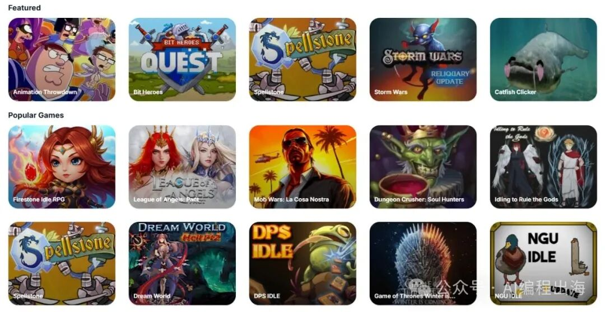

# 出海游戏网站，比你想象的要简单得多

> 开发游戏站不等于开发游戏。你可以在网站中通过 iframe 加载其他网站的 HTML5 游戏，一样可以让用户在网站中玩游戏，从而带来流量。

## 查找 HTML5 游戏来源

不必亲自开发小游戏，到以下来源查找开源代码或授权游戏：

- GitHub
- 游戏发布平台（itch.io、Kongregate 等）
- HTML5 游戏开发论坛

## 开发游戏站页面的几种方式

**纯静态 HTML 页面**：让 AI 编写 HTML+CSS+JS 静态页面，在合适区域添加 iframe 加载其他站点的 HTML5 小游戏，最快实现。

**NextJS 框架**：后续需要用户管理和付费功能时，在 raphael-starterkit-v1 框架上让 AI 修改首页文案，将 Hero 区域改为 iframe 窗口。

**WordPress 框架**：通过 Page 页编辑器搭建首页，用 HTML 模块添加 iframe；或让 AI 编写 WordPress 插件实现游戏功能，通过 Shortcode 添加到首页。

技术方案没有优劣，达到你的目的即可。