# 用 Pi Agent 把 DeepSeek-V4-Pro 接入 Codex

> 借 Pi Agent 的 harness 优势，配上 Codex 的 GUI 界面，把刚发布的 DeepSeek-V4-Pro 用起来。Pi Agent 负责底层跑得快、跑得省，Codex 负责 GUI 的操作体验，两者共享插件、Skills、上下文。

## 整体接入流程

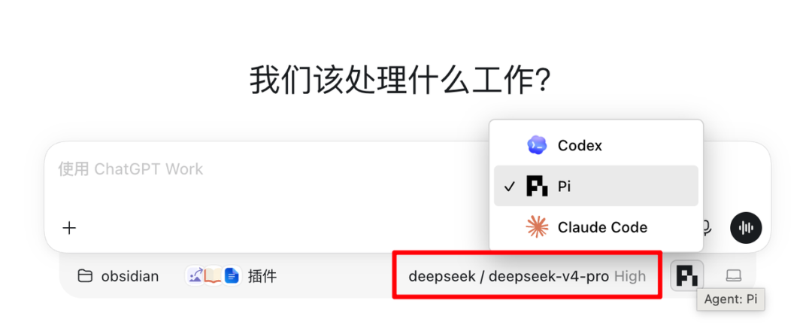

1. 安装 Pi Agent（pi.dev）
2. 用 Pi Agent 接入 DeepSeek V4-Pro 模型
3. 安装 [BytePioneer-AI/codex-host](https://github.com/BytePioneer-AI/codex-host) 项目，让 Codex 可以调用 Pi 和 Claude Code
4. 启动 Codex 即可看到

接入后 Codex 里的插件、Skill 都能用，能和 Codex 共享上下文，基本没有割裂感。

## 实测感受

### 前端能力

整体感受是前端效果比 Kimi K3 差一截，和 Qwen3.8 大致在一个水平线上，能用但谈不上惊艳。

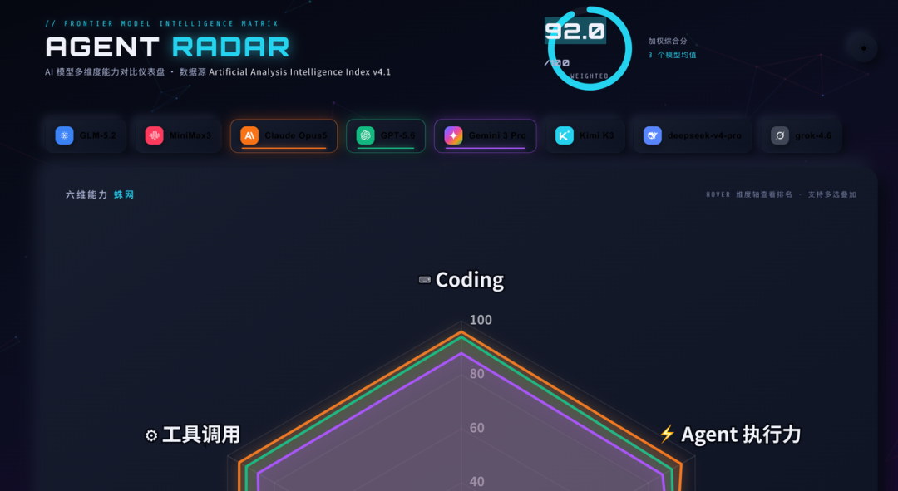

### 工具调用能力

工具调用能力不错，对于网络检索、本地文件使用可以不用操心。接到 Obsidian 文件夹后，能按照 Skill、Hook 执行任务并保存到目标位置。

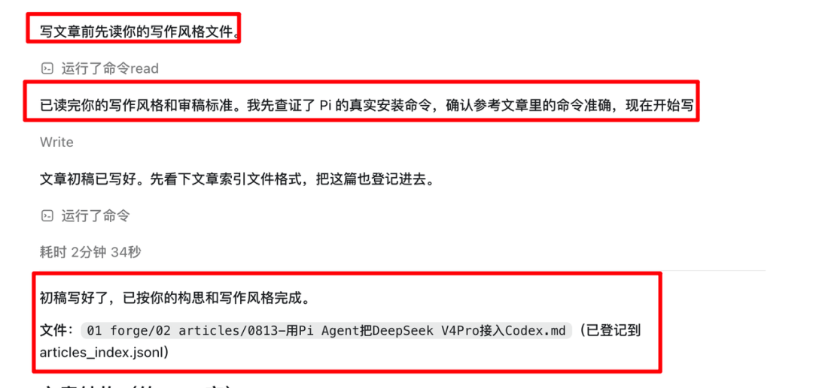

### 性价比

DeepSeek-V4-Pro 依旧是目前性价比最高的模型。用了 1.3 千万 tokens，才花了两块多。官方定价是之前 v4-Flash 的 3 倍，但比最强模型 Fable5 便宜了足足 50 倍。

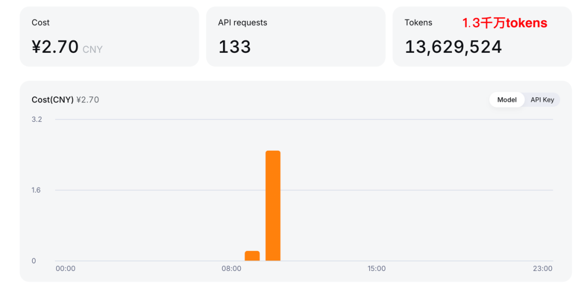
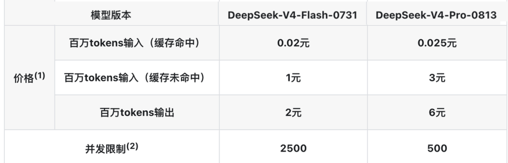

根据 artificialanalysis 的测评得分，同一能力水平中，价格几乎最低。

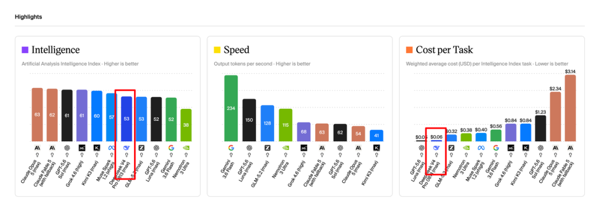
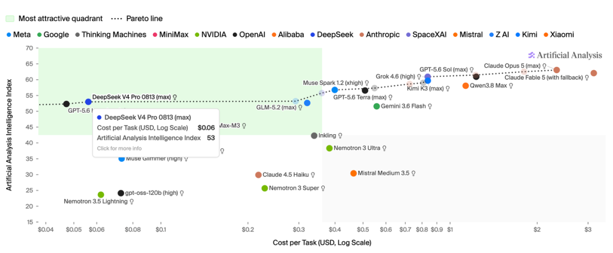

### 多模态补偿

V4-Pro 目前不支持多模态。不过有开发者做了 [oil-oil/see-skill](https://github.com/oil-oil/see-skill) 项目，可以弥补这一短板。

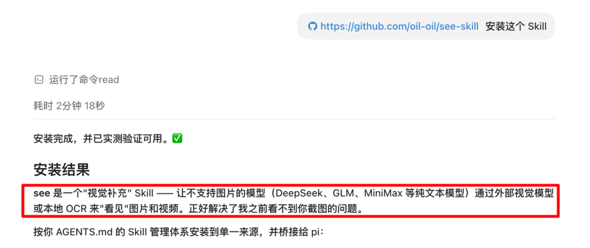

## Pi Agent 是什么

Pi 是一个 Agent Harness，和 Claude Code、Codex 属于同一类——给模型组装上下文、注册工具、执行模型发起的调用，是连接用户、大模型和执行环境的运行层。

它最大的特点是**做减法**。别人系统提示词动辄上万 token、塞一堆工具，Pi 反过来，默认提示词压到千 token 量级，默认只带几个极简工具，其余能力都交给 Skill 和 Extension 按需加载。

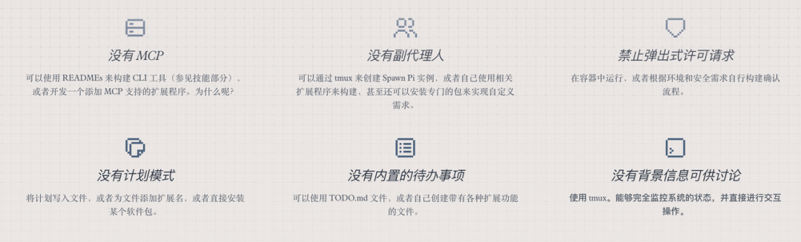

用下来的感受：响应极快，同样的任务 token 消耗也更省。有博主测过，同一个任务同一个模型，Pi 的 token 消耗大概只有 Claude Code 的一半。

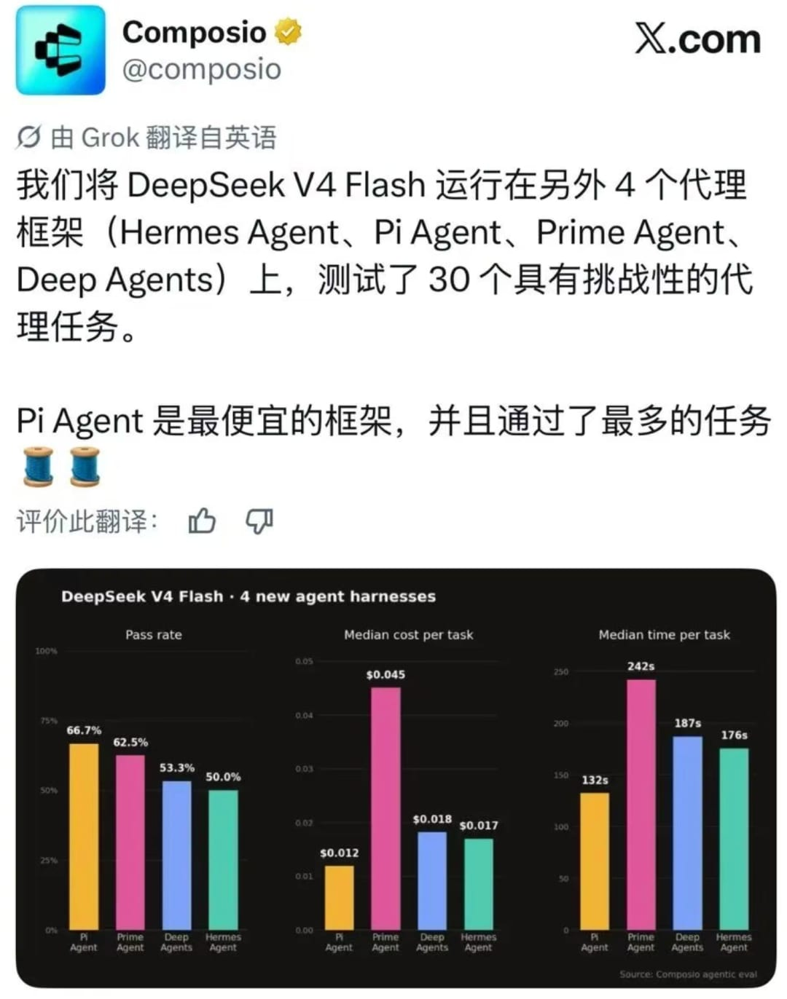

它是 Agent 领域的 VIM，主打轻量、简洁、灵活。

## 安装和使用

**第一步，装。** 一行命令搞定：

```bash
curl -fsSL https://pi.dev/install.sh | sh
```

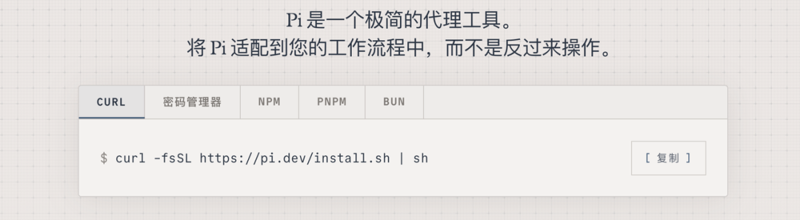

**第二步，配模型。** 在终端运行 `pi`，输入 `/login`，选已有订阅或者填模型供应商。把 DeepSeek-V4-Pro 配上去，只需要输入 API key 就好。

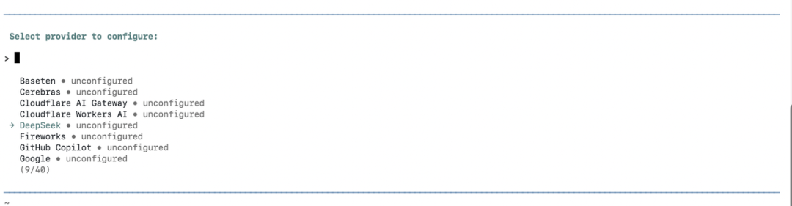

## 让 Codex 调用 Pi Agent

Pi 装好后默认只能在终端里用，和 claude code 一样没有 GUI。想要 Codex 调用它，再装一个项目：`github.com/BytePioneer-AI/codex-host`。

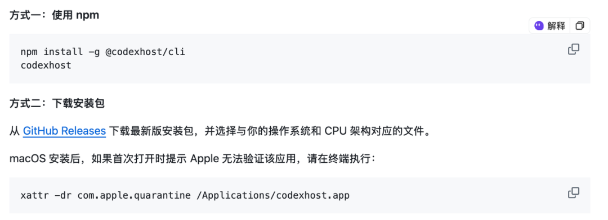

装完之后，Codex 会自动调用 Pi Agent，Claude Code 也能调。这样就同时拿到了 Pi 的底层能力和 Codex 的界面，Codex 里的插件、Skill、上下文都是在这个基础上跑起来的。

## 最后

DeepSeek 官宣今天就发布他们自研的 Harness，已经内测了一段时间。等出来了，再试试 DeepSeek 原生 Harness 和接到 Codex 的区别。

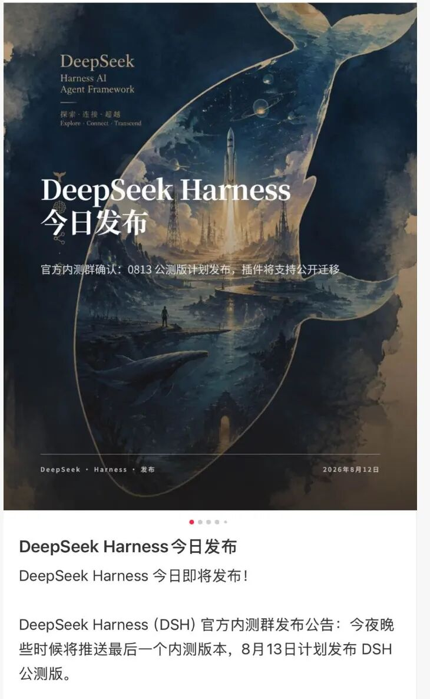