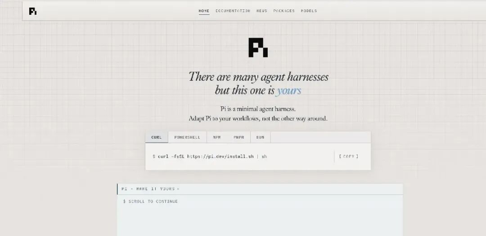
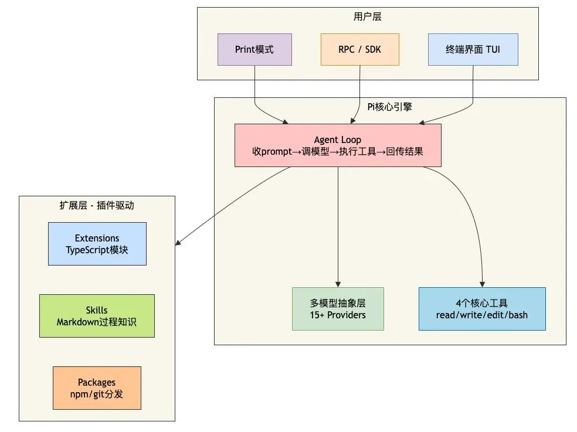

# 为什么越来越多人用 Pi？

> 系统提示词只有 200 Token，核心工具就 4 个（Read、Write、Edit、Bash），GitHub 狂揽 8.6 万 Star——Pi 被开发者评为"目前唯一能真正平替 Claude Code 的 Agent 架构"。

## Pi 到底是什么？

Pi 是由 libGDX 创始人 Mario Zechner 创建的开源终端 AI 编程 Agent。核心思想：**给你原语（Primitives），而不是预烹饪好的功能（Features）**。

刻意删掉了其他工具拼命添加的功能——不支持 MCP、不支持内置子代理、不支持内置计划模式、没有权限弹窗、没有内置 TODO 管理、甚至没有绑定任何特定模型。但留下了四个原语级别的工具。

Mario Zechner 的解释："这一代最先进的大模型其实已经非常擅长几件事：读文件、写文件、改文件，以及调用 bash。很多情况下，bash 本身就是最通用的工具接口。你不需要教模型怎么做，只需要告诉它有什么工具可用。"

## 核心架构

本质上就是一个 **while 循环**：调用 LLM，配上 4 个工具，根据模型返回结果决定是否继续调用。

## 为什么越来越多人用 Pi？

### 1. 便宜到离谱

**99.93% 的缓存命中率**。有开发者把 DeepSeek 接入 Pi 后，约 99.93% 的输入 Token 都命中缓存。因为系统提示词只有 200 Token，加上工具定义也不到 1000 Token。Composio 团队测试表明 Pi 完成一次任务平均成本约 **0.028 美元**，是 Claude Code 的七分之一。

### 2. 不锁模型

支持 Claude、Kimi、DeepSeek、OpenAI、Google、xAI、Groq 等 **15 个以上供应商**。Claude 封号了换一个就行，生产工具不被单一平台绑架。

### 3. 兼容已有积累

自动读取 `~/.agents/skills` 和 `AGENTS.md`——Claude Code 里积累的 Skill 和项目规范，换到 Pi 里一行不用改。

### 4. 可扩展

默认只给 4 个工具，但通过 Extensions、Skills、Packages 可以按需添加任何功能。有开发者基于 Pi 搭建了 17 个插件、18 个全局 Skill、2 个 MCP 服务器的配置。

## Pi vs Claude Code

| 维度 | Pi | Claude Code |
|------|----|-------------|
| 系统提示词 | ~200 Token | ~14000 Token |
| 核心工具 | 4 个 | 10+ 个 |
| 模型绑定 | 不绑定，支持 15+ 供应商 | 仅 Claude |
| 开源协议 | MIT | 闭源 |
| 扩展方式 | 插件/Skills/TypeScript | 有限（Skill） |
| 设计哲学 | 做减法 | 做加法 |
| 权限管理 | 默认 YOLO 模式 | 弹窗确认 |
| 成本 | ~0.028 美元/任务 | 7 倍于 Pi |
| GitHub Stars | 8.6 万+ | 12.4 万+ |

## 优缺点

**优点**：极致省钱、不锁模型、完全开源 MIT、兼容 Claude Code Skill、可无限扩展、极简设计完全可控。

**缺点**：默认功能太少、需要动手能力、纯终端门槛、生态相对年轻。

## 总结

> 对 Agent 来说，你刻意不做什么，比你做什么更重要。

当其他工具都在疯狂堆功能的时候，Pi 选择了做减法。Claude Code 是"给你一个 AI 助手"，Pi 是"给你造 AI 助手的工厂"。

开源地址：<https://github.com/earendil-works/pi>  
官方文档：<https://pi.dev>