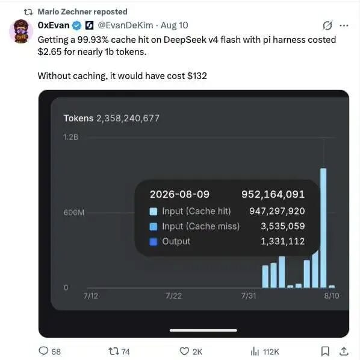
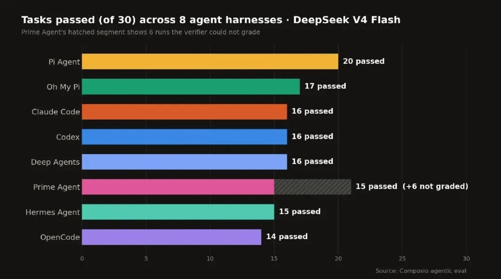
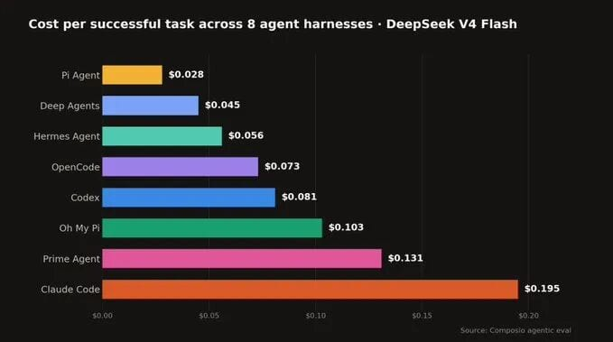
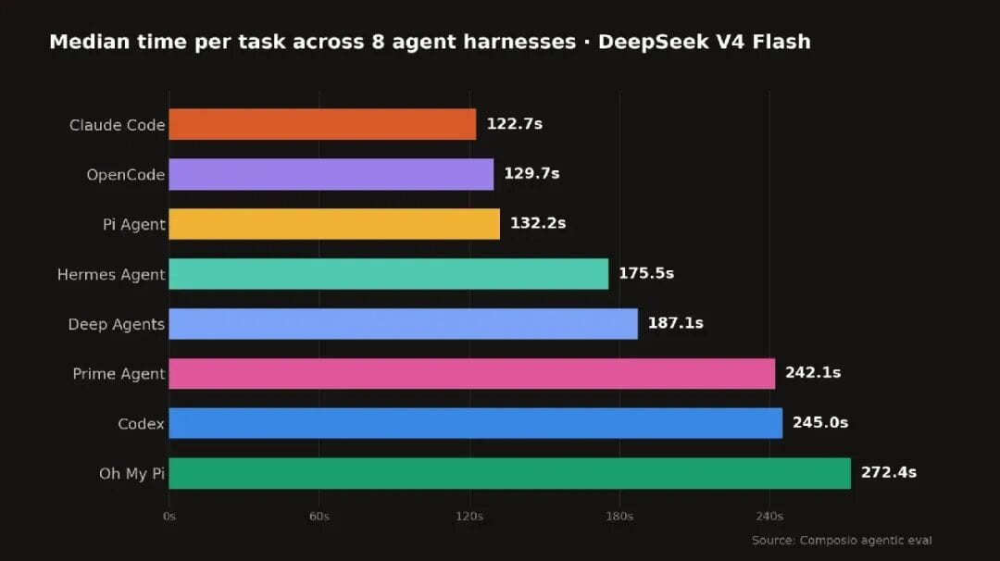
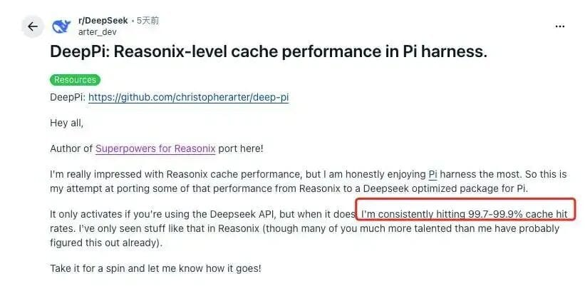
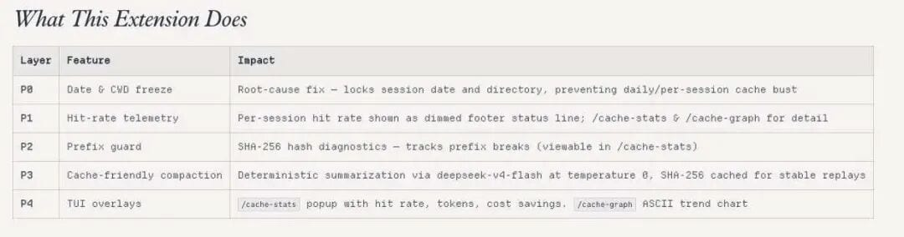

# DeepSeek + Pi 王炸组合跑赢 Claude Code？Pi 创始人：这套组合我早押中了

> Composio 用同一个模型（DeepSeek V4 Flash）跑遍 8 种 Harness，30 项高难度 Agent 任务：Pi Agent 66.7% 成功率第一，成本仅 $0.028/任务，Claude Code 需要 $0.195。同一个模型，换 Harness，成功率差 20 个百分点，成本差 7 倍。

<!-- more -->

## 背景

2026 年 8 月 11 日，Pi Harness 创始人 Mario Zechner 转发了一组数据：开发者 **0xEvan** 用 Pi 调用 DeepSeek V4 Flash，处理了近 **10 亿输入 Token**，缓存命中率达到 **99.93%**，最终只花了 **$2.65**。如果没有缓存，同等用量预计需要 **$132**。

同一天，开发者 Shantanu Goel 表示，DeepSeek V4 Flash 在其他 Harness 中的缓存命中率通常为 **94% 至 97%**，到了 Pi 中却能持续达到 **99% 以上**。Mario 评论道："使用本地模型时，这一点尤其好用。"

2026 年 5 月，Mario 对 Pi 与 DeepSeek V4 这一组合的评价是：

> "pi + ds4 == sovereign AI enterprise ready clearly."

当时，这只是他看到开发者用 Pi 搭配 DeepSeek V4 跑通一个终端俄罗斯方块后的一句调侃。三个月后，一项公开横向测试，却意外给这句话补上了数据。

---

## Composio 横向测试：Pi 拿下第一名

**Composio**（为 AI 智能体开发工具的公司）用同一个模型 **DeepSeek V4 Flash**，分别在 **8 种 Harness** 中完成 **30 项高难度智能体任务**。

### 结果排名

| 排名 | Harness | 通过率 | 成功任务数 |
|------|---------|--------|-----------|
| **1** | **Pi Agent** | **66.7%** | **20/30** |
| 2 | Oh My Pi | 56.7% | 17/30 |
| 3 | Claude Code | 53.3% | 16/30 |
| 3 | Codex | 53.3% | 16/30 |
| 3 | Deep Agents | 53.3% | 16/30 |
| 6 | Prime Agent | 50.0% | 15/30 |
| 6 | Hermes Agent | 50.0% | 15/30 |
| 8 | OpenCode | 46.7% | 14/30 |

> 同一个模型，仅仅更换外面的 Harness，成功率便从 46.7% 升至 66.7%，相差整整 **20 个百分点**。

### 成本差距

| Harness | 每成功任务成本 |
|---------|--------------|
| **Pi Agent** | **$0.028** |
| Claude Code | $0.195 |

> Claude Code 需要接近 Pi **7 倍**的成本。

### 时间对比

| Harness | 中位时间 |
|---------|----------|
| **Pi Agent** | **132.2 秒** |
| Claude Code | 122.7 秒 |
| OpenCode | 129.7 秒 |

Pi 完成任务的中位时间略慢，但综合成功率、速度与成本来看，它交出了最突出的成绩。

---

## "Harness 乘数效应"

这项测试体现了所谓的 **"Harness 乘数效应"**：围绕 AI 搭建的工具会放大或削弱模型的实际表现。

> 选对 Harness，同一个模型可以同时变得更可靠、更高效；选错 Harness，即使底层模型的智能水平完全相同，任务成功率和运行效率也可能明显下降。

Composio 因此强调：**不应孤立评测模型。** 如果一份 Agent 排行榜只写模型名称，却没有交代使用了哪套 Harness，那么这个分数就是不完整的。

---

## 极简的 Pi 为什么反而赢了

**Pi 几乎没有添加额外配置**，采用的是全新、未经修改的默认安装，只接入了测试所需的 MCP 服务器插件。除此之外，Pi 没有进行自定义设置、调优或特殊配置。

作为对比，Prime Agent 产生了最庞大的会话——部分会话消耗多达 **350 万 Token**，进行了 **33 次工具调用**。评分器仅仅为了处理这些会话就发生了超时，导致 **6 次运行未被计入成绩**。

> 这组数据呈现出一个明显的反差：功能和会话最为庞杂的 Prime，最终被自身的运行负担拖慢；更加轻量的 Pi 则以较低开销通过了最多任务。至少在这项测试中，增加更多层并没有换来更好的结果。

### 干净 Harness 的核心逻辑

> 选择一款速度快、成本低的模型，把它放进干净、轻量的 Harness 中，再用真实任务检验两者的组合。

- 每增加一层，智能体就多了一个可能迷路的地方
- 每增加一个工具，它就多了一项需要做出的选择
- 每增加一份庞大的指令文件，它在行动前就要阅读更多噪声

**干净的 Harness 给模型提供一条从接收任务到完成任务的短路径，臃肿的 Harness 则让它四处绕路。** 这就是默认安装能够击败重量级配置的原因：路径更短，走错方向的机会也更少。

---

## 99.9% 的缓存命中率是怎么做到的？

Pi 本身并不是一款专门为 DeepSeek 设计的 Harness。它是一套面向开发者开放的 Agent 底座：允许通过扩展修改系统提示词、筛选对话历史、自定义上下文压缩，并动态增删或启停工具。这种**可编程性**给 DeepSeek 的缓存优化留下了很大空间。

### DeepSeek 前缀缓存机制

DeepSeek API 会缓存请求中提示词的**前缀**。如果下一次请求开头的 Token 序列与上一次完全相同，服务端就会直接从缓存中读取，并以远低于普通输入 Token 的价格计费。

关键在于：**这是一种前缀缓存，匹配需要从第一个 Token 开始。** 如果上下文前部发生变化，其后的大量 Token 就可能无法继续命中。

### Reasonix 的设计原则

开源 Reasonix 围绕 DeepSeek 前缀缓存设计，核心设计原则：

| 原则 | 具体做法 |
|------|----------|
| **保持上下文前端稳定** | 启动时注入精简、稳定的环境摘要，每轮不重新生成 |
| **追加而非修改** | 变更成本降至最低 |
| **过时输出剪枝** | 触发摘要压缩之前截断和清理过时的工具输出 |
| **Schema 契约文档化** | 工具定义变更时进行回归审查，避免意外缓存失效 |
| **双模型独立会话** | 执行模型和规划模型分别运行在独立且缓存稳定的会话中 |

> 将规划轮次直接插入同一段对话，会破坏两个角色的缓存稳定性。将它们放在独立会话中，可以让各自的提示词前缀保持不变。

### pi-deepseek-cache 扩展

Pi 生态中的 pi-deepseek-cache 扩展设计思路与 Reasonix 有不少共同点：

| 层级 | 做法 | 效果 |
|------|------|------|
| **P0** | 启动时冻结日期和当前工作目录 | 从根源上杜绝 `Current date` / `Current working directory` 等动态内容导致缓存失效 |
| **P2** | SHA-256 哈希对前缀进行诊断 | 追踪前缀何时变化，及时发现缓存失效根因 |
| **P3** | deepseek-v4-flash temperature 0 确定性摘要 + 哈希缓存 | 相同历史输入始终复用字节一致的摘要，避免文字波动破坏前缀 |

**降本效果**：

| 模型 | 缓存未命中 | 缓存命中 | 降幅 |
|------|-----------|---------|------|
| deepseek-v4-flash | $0.14/M Token | $0.003/M Token | **98%** |
| deepseek-v4-pro | $3.00/M Token | $0.025/M Token | **99%** |

---

## DeepSeek 官方 Harness 即将发布？

有趣的是，DeepSeek 官方至今还没有推出自己的 Harness。8 月 11 日，"DeepSeek Harness 团队"微信公众号已完成注册，被外界解读为 Harness 产品即将正式发布的重要信号。产品内测也已启动。

官方 Harness 最核心的优势可能是**原生适配**：第三方 Harness 只能通过公开 API 做逆向优化，而官方团队可以和模型训练团队背靠背协同，让模型针对 Harness 的调用模式做针对性优化，Harness 也能利用模型内部的非公开信息。

---

## 关键数据速查

| 指标 | 数据 |
|------|------|
| 0xEvan 总输入 Token | ~10 亿 |
| 0xEvan 缓存命中率 | **99.93%** |
| 0xEvan 总成本（含缓存） | **$2.65** |
| 0xEvan 预估成本（无缓存） | **$132** |
| Composio 测试模型 | DeepSeek V4 Flash |
| Composio 测试 Harness 数 | 8 种 |
| Composio 任务数 | 30 项 |
| Pi Agent 成功率 | **66.7%**（20/30） |
| Pi Agent 每任务成本 | **$0.028** |
| Claude Code 每任务成本 | $0.195 |
| 缓存未命中 vs 缓存命中（v4-flash） | $0.14/M vs $0.003/M |

## 关联文章

- [Pi AI 编程 Agent 解析](./pi-ai-coding-agent-popularity.md) — 苏三
- [DeepSeek V4 Flash + OMP/Pi 配置指南](../concepts/deepseek-v4-omp-pi.md)
- [DeepSeek Harness Agent 公式](../concepts/deepseek-harness-agent-formula.md) — 林大友
- [AGE 与 Mission Driver 体系](../concepts/age-mission-driver.md)

## 参考链接

- https://x.com/badlogicgames/status/2086877202239353285
- https://dev.to/arshtechpro/reasonix-deepseek-a-terminal-coding-agent-built-around-the-thing-everyone-else-ignores-3l21
- https://pi.dev/packages/@rohaquinlop/pi-deepseek-cache
- https://www.youtube.com/watch?v=j3c35v386T0