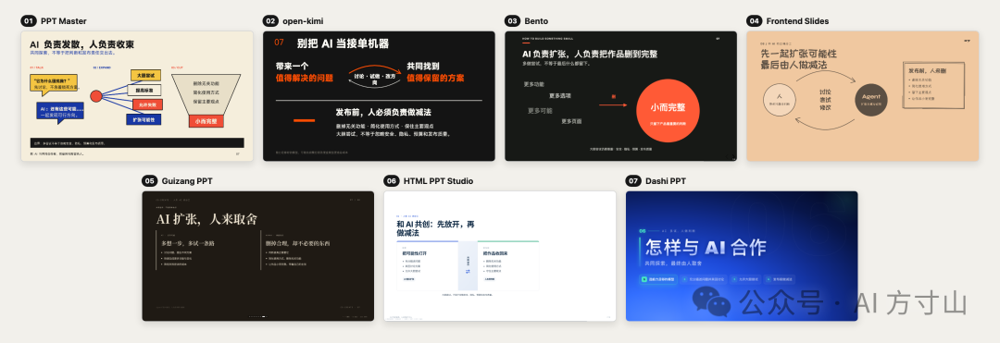
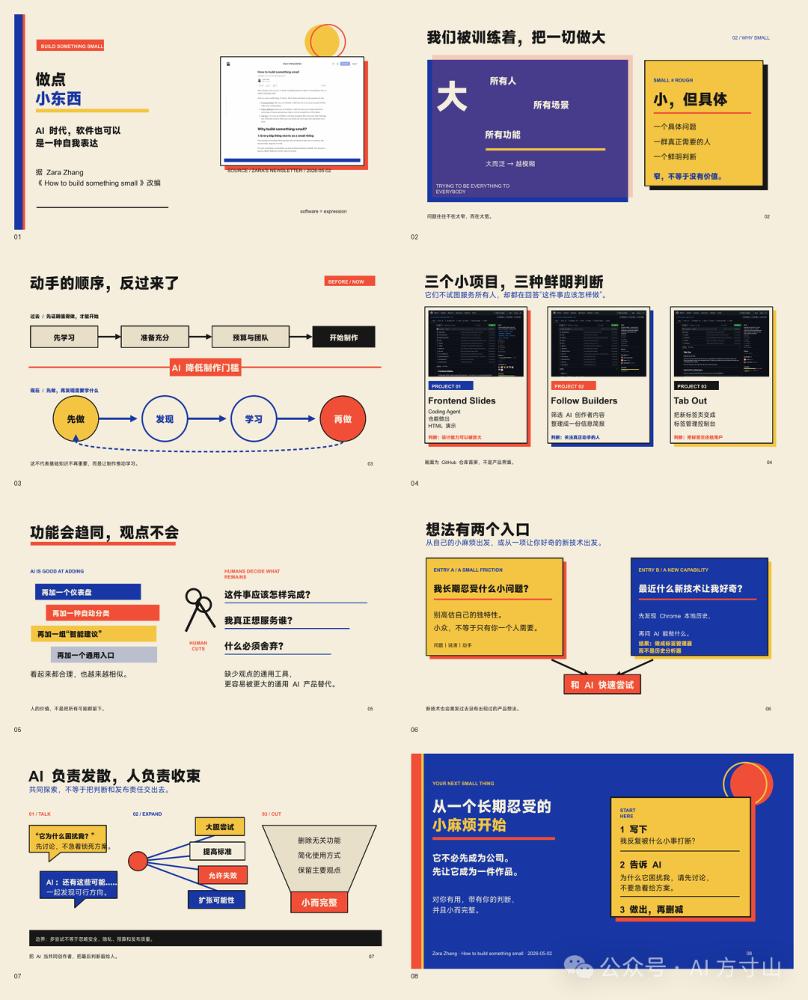
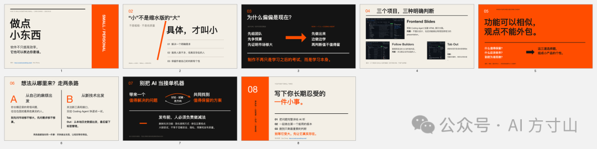
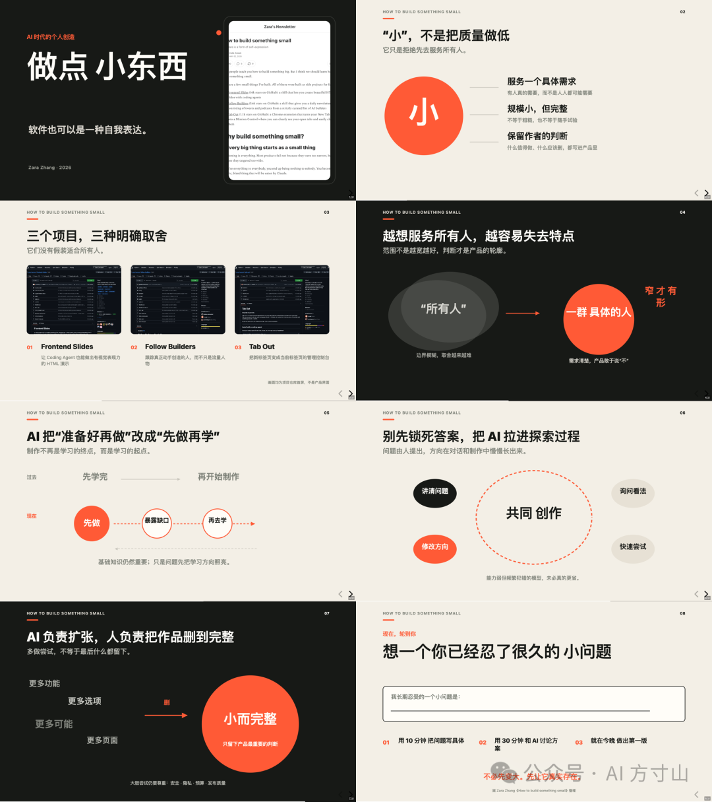
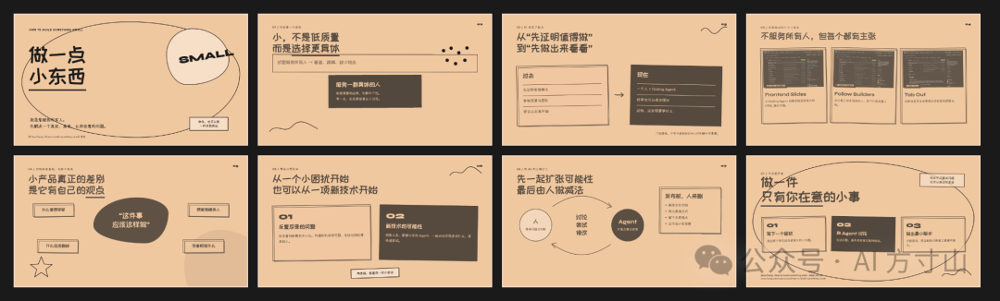
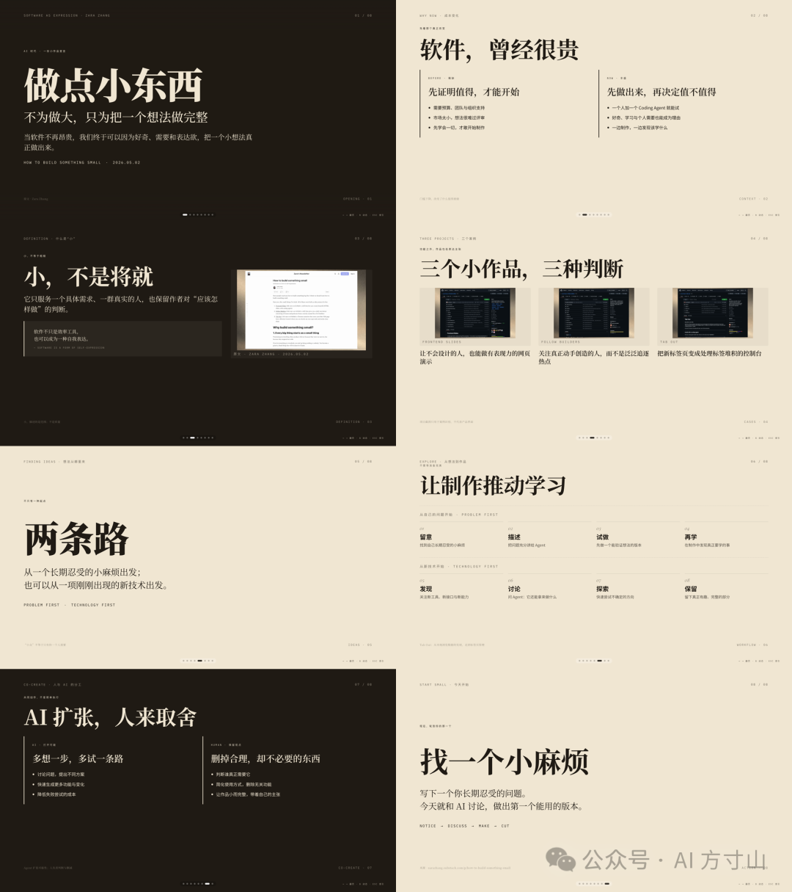
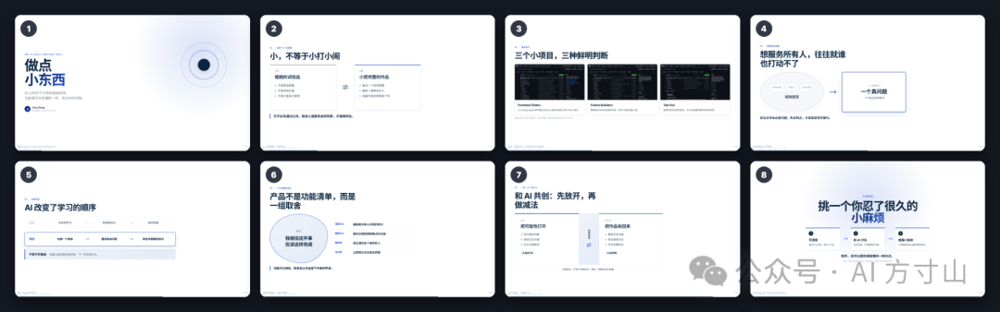
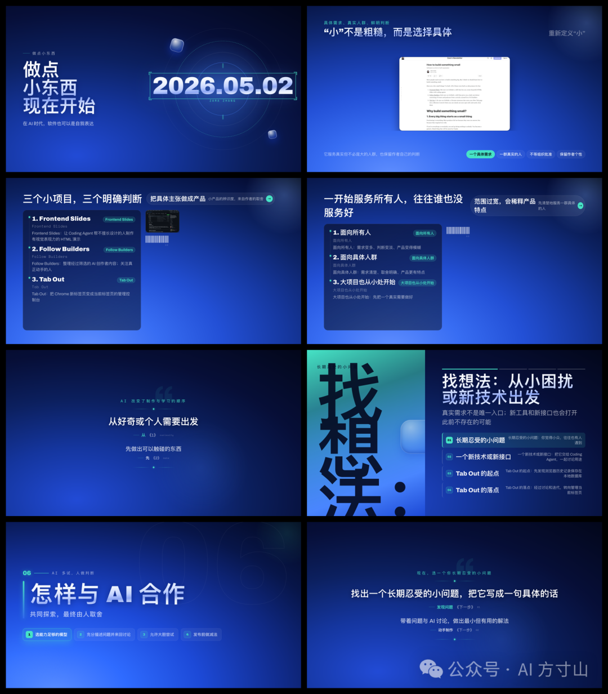

# PPT Skill 哪家强？实测 GitHub 上 7 个热门项目

> 同一篇文章和 5 张截图，交给 7 个不同的 PPT Agent Skill，由 7 个 Sub Agent 并行生成 8 页演示。盲评结果：PPT Master 第一（76/80），open-kimi 第二（75/80），Bento 第三（71.5/80）。

## 测试方法

- 测试材料：Zara Zhang 的文章《How to build something small》+ 5 张截图
- 任务：做一套 8 页演示，标题、页纲和视觉风格均由各 Skill 自行决定
- 7 个 Sub Agent 并行执行，相互隔离
- 盲评（匿名编号，评估者不知仓库名称）：内容、叙事、图文关系、可读性

## 排名与评分

| 排名 | 工具 | 静态得分 | 特点 |
|------|------|---------|------|
| 1 | PPT Master | 76.0 / 80 | 最会把观点画出来 |
| 2 | open-kimi | 75.0 / 80 | 内容最全也最稳 |
| 3 | Bento | 71.5 / 80 | 简洁，行动感强 |
| 4 | Frontend Slides | 70.5 / 80 | 个性最鲜明 |
| 5 | Guizang PPT | 70.0 / 80 | 像编辑设计小册 |
| 6 | HTML PPT Studio | 69.5 / 80 | 清楚，适合现场讲 |
| 7 | Dashi PPT | 63.0 / 80 | 科技感强，静态阅读吃亏 |

## 各工具详情

### 1. PPT Master（43,264 Star）

成品是原生 PPTX。赢在"解释"——把抽象观点变成关系图和流程对比。第 2 页用两个相反色块讲"大而模糊" vs "小而具体"。附 8 页讲者备注。生成问题是东亚字体映射导致中文丢失，需换字体后逐页检查。

### 2. open-kimi（7,655 Star）

成品为 PPTD（可在线编辑），最终导出 PPTX。内容最全，8 页接得很顺，不堆摘要。过程曲折：npm 版本冲突、导出图片超时、首次导出中文竖排画布越界、大括号变黑块。前后导出四次才正常。

### 3. Bento（621 Star）

成品为 `.bento.html`——自包含单文件，编辑和放映装在一起。左边选页，右边改内容，演讲者窗口同步。设计简洁，第 5 页"先做、暴露缺口、再学"的叙事节奏好。封面截图裁得偏紧，第 3 页稍拥挤。

### 4. Frontend Slides（26,992 Star）

成品为可编辑 HTML。杏色纸张、手绘线条、歪卡片、笔画夸张的大字——个性最鲜明，一眼可辨。按 E 在浏览器内改字。代价：汉字变形影响远读识别，GitHub 截图偏暗，底部翻页控件干扰静态截图。

### 5. Guizang PPT（23,282 Star）

单文件 HTML。方向键/滚轮/触屏翻页，ESC 索引，B 切换静态模式。黑色与纸张色交替，大号衬线字配细线。节奏好——第 5 页只说"两条路"让读者停一下，下一页再展开。依赖排版，解释图少。

### 6. HTML PPT Studio（3,942 Star）

单文件 HTML，专门为演讲准备：观众看当前页，讲者窗口看下一页+备注+计时。页面最稳妥克制。盲评认为少讲了一块内容。本地使用时演讲者窗口有时空白，截图会漏掉变化页面，需手动检查。

### 7. Dashi PPT（3,914 Star）

每页给 4 个方向，8 页共 32 个候选，可导出多种格式。选中深蓝杂志风，科技感强。候选多检查量大：8 个方案都出现画布越界，模板文字残留，小字裁切问题。

## 关键洞察

- 7 个工具对同一份材料产出了 7 种截然不同的风格，像 7 个人在讲
- 生成过程普遍需要调试：字体映射、版本冲突、导出超时、画布越界
- 成品格式多样：原生 PPTX、PPTD（可在线编辑）、单 HTML 自包含文件
- 选择工具先看要讲什么、希望观众记住什么，文件格式满足当前使用即可
- 第一次做可借用现成表达，再逐步替换配色、字体、图解，形成个人风格

## 资料链接

- [Zara Zhang 原文](https://zarazhang.substack.com/p/how-to-build-something-small)
- [open-kimi-ppt-skill](https://github.com/Binaryify/open-kimi-ppt-skill)
- [bento](https://github.com/nyblnet/bento)
- [ppt-master](https://github.com/hugohe3/ppt-master)
- [guizang-ppt-skill](https://github.com/op7418/guizang-ppt-skill)
- [frontend-slides](https://github.com/zarazhangrui/frontend-slides)
- [html-ppt-skill](https://github.com/lewislulu/html-ppt-skill)
- [dashi-ppt-skill](https://github.com/chuspeeism/dashi-ppt-skill)

## 配图

