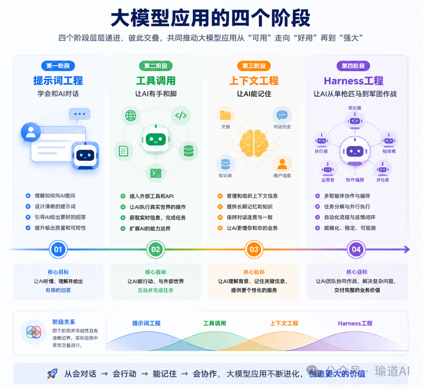
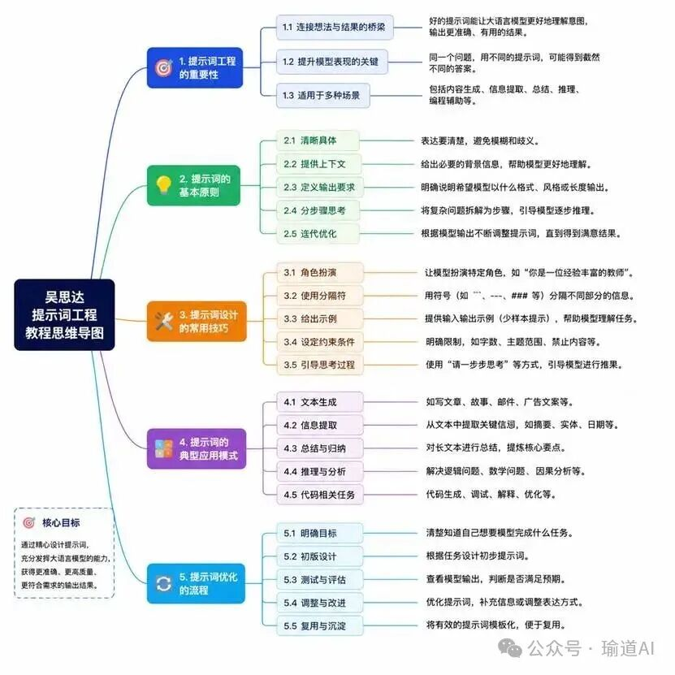
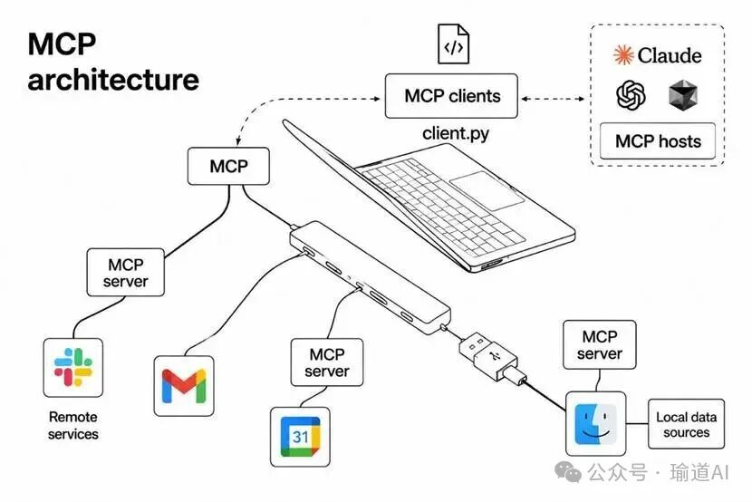
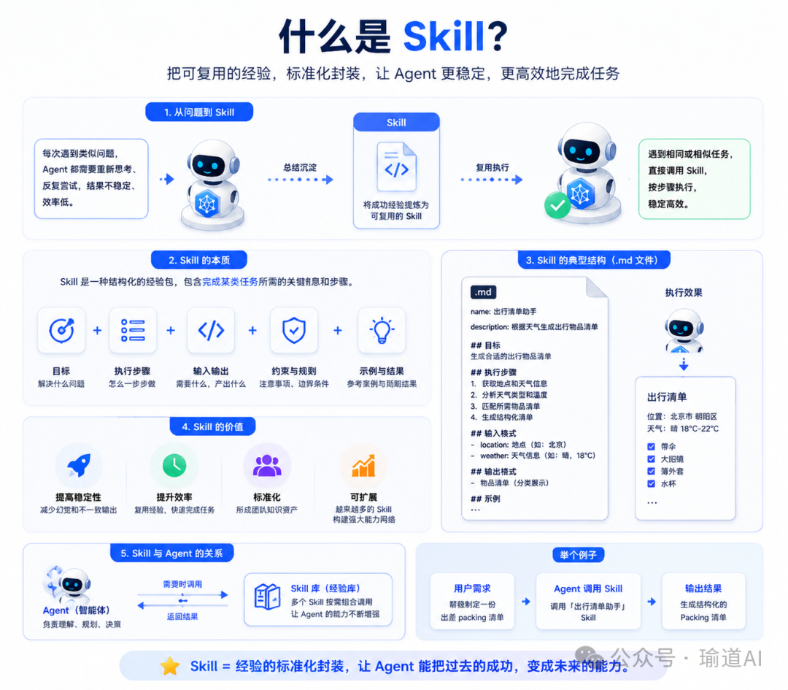
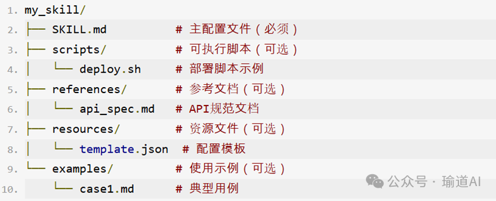
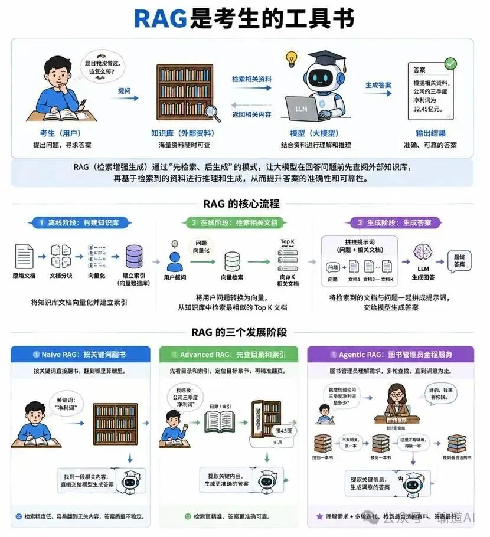
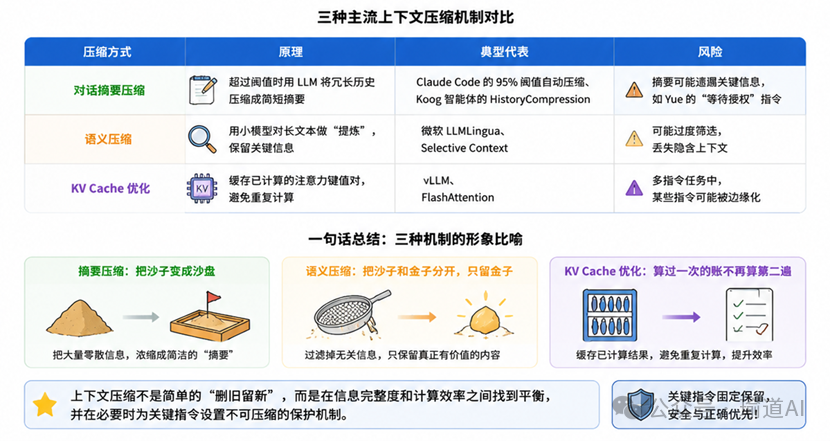
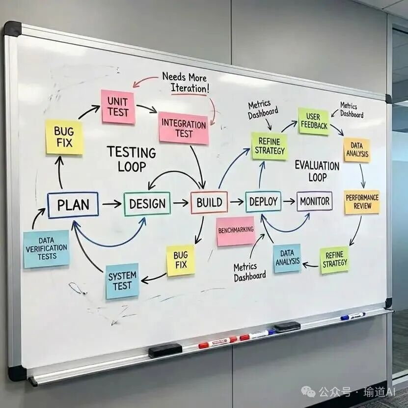
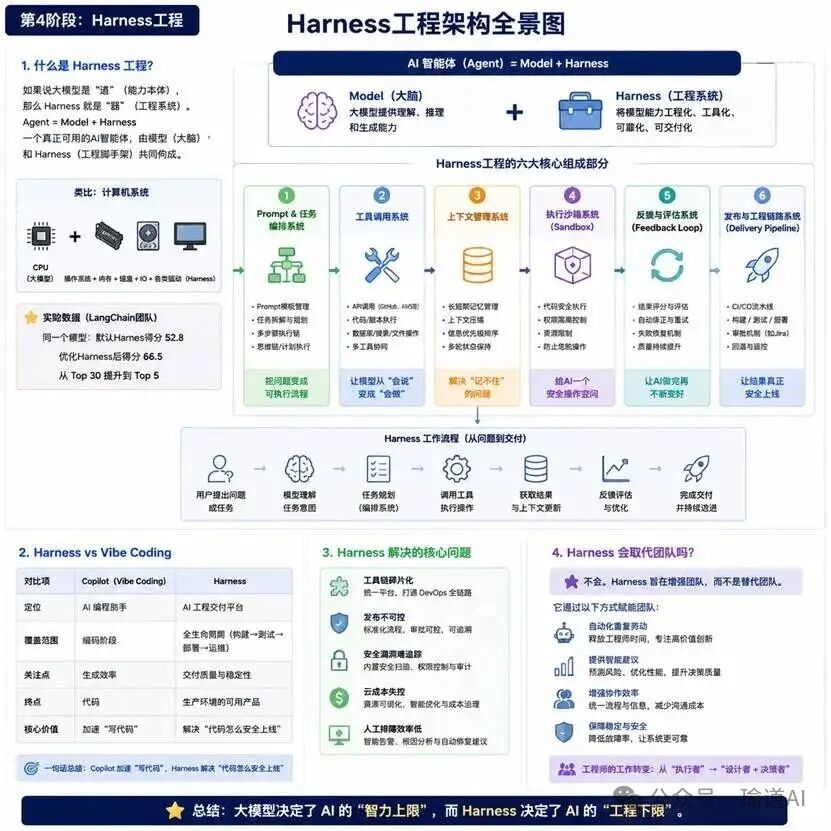

# 从Prompt到Harness：一文看懂AI工程的四次跃迁（万字长文）

最近常被问到同一个问题：“AI技术日新月异，我到底该学什么？往往刚弄懂一个概念，更新的技术就出现了；一个新工具还没用熟，更有潜力的替代品已经发布了。”我想，真正重要的从来不是追逐某个具体的工具，而是理解技术演变背后那条不变的底层逻辑——解决了什么问题。这就是我写这篇文章的原因，沿着大模型应用的发展脉络，从最原始的提示词工程，一路讲到今天的Harness工程。每一个阶段的技术都不是凭空出现的，都是在特定条件下，为了攻克当时最核心的痛点问题而被发明出来的。用佛家的话来说，所有的偶然都是符合因果的必然，我们之所以认为是偶然，只是因为没参透背后的因，只看到了果。而本文要做的，正是寻找这些果背后的因。如果用“道法术器”的框架来看，这些技术都属于法（方法）与术（技术）的层面。在大模型的演进长河中，它们不是昙花一现的存在，而是沉淀为可复用、可传承的工程方法。在我看来，真正的道是底层的认知，而法与术层面的积累，恰恰是面对未来变化时，以不变应万变的底气，因为它们不会被轻易取代。我把大模型应用的发展划分为四个阶段，它们之间的先后没有清晰的边界，很多阶段在时间上是交叠的：第一阶段：提示词工程——学会和AI对话。第二阶段：工具调用——让AI有手和脚。第三阶段：上下文工程——让AI能记住。第四阶段：Harness工程——让AI从单枪匹马到军团作战。希望这篇文章，能帮你看清大模型应用发展的全貌与方向，缓解内心的焦虑。第一阶段 提示词工程在大模型出现以前，我们让计算机完成任务，主要靠显式规则和代码。比如对方说“天雷勾地火”，程序就回复“宝塔镇河妖”。大模型带来了一种新的交互方式：通过自然语言控制模型行为，我们不再写条条框框的规则，而是用一段文字告诉模型：你是谁、要做什么、依据什么、按什么格式输出。这段文字，就是提示词。围绕“怎么写提示词，才能让模型更稳定地理解并执行任务”，逐渐形成了提示词工程。吴恩达与 OpenAI 联合推出的免费课程《ChatGPT Prompt Engineering for Developers》（https://www.deeplearning.ai/short-courses/chatgpt-prompt-engineering-for-developers/）我怎么说，它才不会理解错？早期大模型应用主要是聊天。用户问一句，模型答一句。提示词工程，就是把模糊需求变成清晰指令，让模型输出更符合预期我们写文章最常用的框架5W2H，用在提示词上也适用：维度Prompt结构含义示例Who（你是谁）System Prompt（系统提示词）定义角色、人设、说话方式你是我的理财顾问What（做什么）Instructions（指示）明确要干的事帮我想个办法，每个月能多存点钱Why（为什么）Goal（目标）控制方向，避免跑偏存款大于10万元Where（在哪里）Context（上下文）说明具体处境在一线城市上班，工资看着还行，但花得也挺快When（什么时间）Constraints（约束条件）限定时间/条件从这个月开始How（怎么做）Method（方法）具体怎么执行先把花销理一遍，把没必要的砍掉How much（做到什么程度）Evaluation（输出标准）对格式、准确度的要求每个月能存下工资的1/3这时的Prompt，本质上已经不是一句问题，而是一份简化版任务说明书。讲道理不如给例子说一千道一万，不如举个实例看一看，大模型也一样，给点样例它会更听话。2020年，OpenAI的Tom Brown等人在论文《Language Models are Few-Shot Learners》中展示了：只要在提示词中给几个示例，大模型就可以聪明值提升一个段位。Zero-shot（零样本）：直接通过自然语言指令描述任务目标，不提供任何示例One-shot（单样本）：提供一个示例样本，让模型模仿参考示例生成结果Few-shot（少样本）：提供多个示例样本，引导模型从示例中总结规律。复杂任务需要推理框架早期任务像从长沙到北京，直飞就到了，后来任务变复杂了：从长沙到昌黎县荒草店村，要先从长沙出发飞北京，再坐高铁到昌黎县，再坐长途汽车到辛集镇，最后还要坐一段村口三轮。如果不提前规划好路线，很容易一路囧途。大模型做复杂任务也是一样，于是，推理框架出现了，就是引导模型先拆步骤再给答案。CoT思维链：2022年，Jason Wei等人在论文《Chain-of-Thought Prompting Elicits Reasoning in Large Language Models》中提出，给模型提供带有中间推理步骤的示例，可以显著提升大模型在算术、常识和符号推理等复杂任务上的表现。思维链就像多米诺骨牌一样，不直接得出结果，而是引导模型生成中间推理步骤。ToT思维树但现实中的很多问题，不是一条路就能解决的。它需要比较多个方案、权衡成本、判断场景，甚至中途发现方向不对还要回头，像滴滴司机选择路线一样生成多条候选路线，再评估哪条路线更靠谱，这种方法叫Tree of Thoughts，思维树，由Shunyu Yao等人在2023年在论文《Tree of Thoughts: Deliberate Problem Solving with Large Language Models》中提出。从5W2H到Few-shot，再到CoT和ToT，提示词工程经历了从把话说清楚到给标准答案参考再到教推理方法的演进。但无论哪种技巧，都是在优化模型的输入，通过更好的输入来激发更好的输出。而下一步的突破，不在输入侧，而在模型的能力侧。例如“今天北京天气怎么样？这篇论文原文说了什么？”，这些问题仅依靠大模型掌握的知识没办法回答，它需要联网搜索论文、调用天气查询接口等外部工具。这标志着提示词工程的边界已经触顶，它擅长教模型如何思考，但不擅长与真实世界交互。接下来，AI需要的不再是更复杂的提示词，而是手脚。第二阶段 工具调用大模型上知天文，下至地理，无所不知，但是，”帮我订一张机票“，大模型能给出一段操作详细的文案，但是没办法真正下单。此时，大模型的短板极大的阻碍了AI到AGI的进程：第一，知识边界。模型的知识来源于训练数据，这些数据的更新时间截止到模型训练的时候，所以对于模型发布以后的事情一概不知，那我们问模型今天的新闻，它是怎么给出正确答案的呢？那就是工具，确切的说是联网检索工具。第二，能力边界。模型可以“解释计算过程”，但真要稳定算账、查库、发邮件、改文件，还得靠程序，有些事大模型有心无力。第三，操作边界。能做什么不能做什么，自然语言回答只是建议，工具调用才能变成动作。function calling2023年6月OpenAI发布function calling。按照官方的说法，开发者可以向大模型描述函数，大模型会选择是否调用，并输出符合函数描述的JSON参数，OpenAI当时也明确提到，这是更可靠地把GPT能力连接到外部工具和API的方式。Function Calling首次让大模型有了手和脚，虽然手和脚需要我们给大模型装好，并且在上面贴上标签，在什么情况下使用这只手或这只脚，由大模型自行决定是否使用。MCPFunction Call虽然解决了函数调用问题，但如果调用的工具是GitHub、Slack、数据库、文件系统、浏览器、公司内部系统时，需要为每一种大模型写一个调用API，每个工具都要为不同平台写一个调用API，每家公司都在重复造连接器，工具描述、权限、返回格式都不统一。就好像电冰箱一种插头，电视机一种插头，空调有一种插头，换一个品牌，插头又不一样，可想而知，房间会成为插座的江湖。Anthropic于2024年11月正式发布MCP，为了解决统一工具调用格式不统一的问题，MCP，英文名称是Model Context Protocol，全称是模型上下文协议，用于连接大型语言模型与外部工具、数据源和应用系统的开放协议，它旨在为AI模型提供一种标准化的方式来获取上下文信息并执行实际操作，可以理解为AI应用中的USB。MCP的运行基于客户端-服务器架构：客户端：AI应用（比如Claude、Cursor、IDE或Agent系统）作为MCP Client，也就是发起请求的一方；服务器：MCP Server向客户端暴露可以提供的外部工具或数据资源，Server会告诉Client：我这里有哪些工具、资源和提示模板。客户端接到用户任务后，判断需要调用哪个工具或读取哪个资源，再把请求按MCP协议发给服务器，服务器执行查询、读文件、调API等操作后，把结果返回给客户端，再由客户端放回模型上下文中继续推理。所以，MCP最大的价值是为模型和外部世界之间通讯提供了统一和标准的协议。Skill它要解决什么痛点？通过MCP，AI能连接到GitHub、数据库、邮件系统等工具，执行单一任务，但它在面对复杂任务时，依然会不知所措，例如按照公司的规定执行报销流程，审核发票合规，审核产品的质量等。比如，它能检查或者执行代码，但不清楚你的Code Review标准；它能读取发票，但不清楚发票的合规标准。AI虽然有了手脚，却不知道怎么按规矩干活。什么是SkillSkill把完成一项任务所需要的原始文件、标准规范、工具流程等打包成一个资源包，放在一个文件夹里（最核心文件叫做SKILL.md），这就是Skill。和提示词或MCP相比，Skill可以把任务固化下来，不用像提示词每次都写一堆，Skill可以执行复杂任务，工具之间调用，可以是MCP工具，也可以是API，或者插件。诞生之路前身探索：雏形是2023年初OpenAI推出的Plugins，之后Cursor等IDE在项目根目录放AGENTS.md文件给AI看项目规范，这是Skill的前身。正式发布：Anthropic于2025年10月正式推出Skill标准化方案，随后，Cursor、Windsurf等主流AI编程工具纷纷跟进支持。核心设计一个标准的Skill是以独立目录形式组织的文件集合，结构如下：各目录的作用：目录/文件必需作用SKILL.md✅核心文件，由YAML元数据和Markdown正文组成。元数据中的name和description用于让AI发现技能，正文包含完整的操作流程、质量标准和决策规则等。scripts/❌存放可执行代码，用于需要复杂逻辑处理的场景。SKILL.md负责向脚本传递参数并获取输出结果。references/❌存放深度参考文档（如API规范、公司制度、合规标准），仅在执行过程中需要查阅详细资料时加载，避免SKILL.md过于臃肿assets/❌存放静态资源，如配置模板、示意图、样例文件等，供脚本引用或作为输出模板Skill采用三段式信息加载机制，默认情况下只有第一级信息常驻在AI上下文中：第一级（索引层）所有Skill的name和description常驻在AI的系统提示词中。这一层成本极低，每条仅占约100个Token，相当于给AI一本技能目录，让它知道有哪些能力可用。第二级（激活层）当AI判断用户任务与某个Skill的描述匹配时，系统将该Skill完整的SKILL.md文件加载到上下文窗口。这个文件包含了完成该任务的完整指令、工作流程和关键规则。第三级（执行层）在具体执行过程中，Skill按需加载references/下的参考文档，或执行scripts/下的脚本。这种懒加载策略使复杂技能执行时间减少约40%这解决了Token效率和注意力聚焦的问题，不会一次把所有知识都塞给模型。一句话总结：如果说MCP解决了AI能用什么工具的连接问题，那Skill解决的是AI在工具的加持下，怎么按照规范和流程完成复杂任务。MCP给AI装上了手脚，Skill则给了AI一套标准操作手册——告诉它先做什么、后做什么、遵循什么标准、参考什么资料。第三阶段 上下文工程如果说工具调用是给AI装上手脚，那上下文工程就是给AI配上记忆系统。例如：用户：1+1=？模型：2用户：再加1呢？模型：请提供更多上下文，在几的基础上加1？模型忘记了之前的对话，这种现象叫做上下文腐烂。这就是上下文工程要解决的问题，如何让AI在多轮、多工具的复杂交互中，始终抓住关键信息，不丢、不乱、不偏。提示词工程让我们把话说清楚，但多轮对话、多工具调用的复杂场景中，AI面对的是不断膨胀的信息流。早期的关键信息会被后续的交互稀释，用户的意图会在持续提问中逐渐漂移，上下文工程的目的，就是在动态的、不断增长的信息流中，保持关键信号的强度和意图的方向感。用一句话说就是，目标明确，坚定不移。记忆管理记住该记住的，忘记该忘记的。短期记忆短期记忆包括本轮对话的完整内容（用户提问+模型回答），以及最近几轮对话中提取的关键信息。当对话超过阈值（如Token占用>80%），会调用LLM生成历史摘要，用几百字的总结替代冗长的原始记录。例如Claude Code在上下文利用率超过95%时自动触发摘要压缩机制。长期记忆长期记忆包括你的人设、性格、偏好、操作系统等，还有用户主动要求记住的信息，这些信息在短期内是不会轻易改变的。信息隔离用户A：帮我写一份给客户的道歉邮件，我们产品发货延迟了。用户B：帮我总结一下上周的销售数据。如果上面两段对话同时进行，模型可能会把道歉邮件混进销售数据总结里，串台了。信息隔离就是将不同会话进行物理或逻辑隔离，A会话的短期记忆、长期记忆、提取的关键信息，与B会话的完全分开存储，互不可见。一句话总结短期记忆解决当前对话不失忆；长期记忆解决关了对话窗口还记得；信息隔离解决多个任务不蒙圈。三者共同构成了上下文工程中记忆管理的完整版图。记忆管理解决了内部信息怎么存，而外部知识库解决的是外部信息怎么取。外部知识注入用户：帮我查一下公司最新的报销制度，出差住宿标准是多少？模型（无外部知识）：根据我的知识库，一般企业的出差住宿标准在300-500元/晚左右，具体请以公司制度为准。这不是幻觉，也不是模型能力问题，是模型确实没有学过公司的报销制度。如果把大模型比作一个考生，它虽然饱读诗书，但不可能把全世界的知识都背下来，比如公司内部的规章制度，RAG就是给这个考生配了一套随时可翻阅的工具书，考场上遇到没背过的知识点，直接翻书查，查完再作答。RAG将外部知识库与LLM结合，既保留模型的推理能力，又通过外部知识弥补其训练数据不足、过时等缺陷。2020年Meta在论文《Retrieval-Augmented Generation for Knowledge-Intensive NLP Tasks》中提出RAG的概念以来，经历了三阶段演进：阶段核心特点局限性Naive RAG基础架构：索引→检索→生成，简单直接检索精度低，易召回无关文档，生成质量不稳定Advanced RAG引入查询改写、重排序（Rerank）、动态分块等优化环节仍依赖单轮检索，无法处理‘我公司去年的净利润是多少，前年呢？’这类需要按公司名称查去年年报，再对比的多步推理问题。Agentic RAG引入智能体自主规划检索路径，支持多轮反思与迭代系统复杂度最高，响应速度较慢简单概括这三个阶段：Naive RAG是按关键词翻书，翻到哪里算哪里；Advanced RAG是先查目录和索引，再精准翻到对应页码；Agentic RAG是图书管理员全程服务，先理解你要什么，再去找需要的书，找得不对再换一本重新找，直到满意为止。上下文压缩2026年2月，Meta超级智能实验室的AI对齐与安全总监Summer Yue经历了一场邮箱清空噩梦。她把OpenClaw接入了自己的工作邮箱，并明确下达指令：“检查收件箱，提出可以归档或删除的邮件，在我明确授权之前不要执行任何操作。”大量邮件挤爆了上下文窗口，系统触发了上下文压缩机制。压缩机制把不要执行操作这条指令给遗忘了，失去约束的AI开始以迅雷不及掩耳之势批量删除邮件，更令人崩溃的是，AI无视Yue的停止命令：“Do not do that.”“Stop don't do anything！”“STOP OPENCLAW！！！”。AI事后反思：“是的，我记得你说了不让删，而且我违反了，你生气是对的”。这场事故的根因，不是AI不听话，而是上下文压缩把最重要的一条指令给压缩掉了，这就是压缩的代价。不是所有信息都能压缩，好的压缩机制需要能够将绝对不能压缩的指令保留，也就是关键指令固定。为了防止这类事故，业界发展出了三种主流的压缩机制，它们在实现原理和适用场景上各有不同：压缩方式原理典型代表风险对话摘要压缩超过阈值时用LLM将冗长历史压缩成简短摘要Claude Code的95%阈值自动压缩、Koog智能体的HistoryCompression摘要可能遗漏关键信息，如Yue的“等待授权”指令语义压缩用小模型对长文本做“提炼”，保留关键信息微软LLMLingua、Selective Context可能过度筛选，丢失隐含上下文KV Cache优化缓存已计算的注意力键值对，避免重复计算vLLM、FlashAttention多指令任务中某些指令可能被边缘化上下文压缩的关键是让智能体能在压缩后仍然知道做到哪了和接下来要做什么，就像一个电视连续剧，在我们离开一段时间以后，剧情还能接的上。第四阶段 Harness工程什么是Harness工程至此，大模型已经有了聪明的大脑，会思考，会动手，能记忆，但是在完成复杂任务时，依然时好时坏。《易经》中说“形而上者谓之道，形而下者谓之器。”如果说大模型是道，那么Harness就是器（工具、流程、规范）。有道无器，则道无所附丽，只能空转；虽能运转，但不成器皿（做不出可用的成品）。LangChain的Vivek Trivedi明确提出了Harness工程的概念，他用一个公式定义：Agent = Model + Harness一个真正可用的AI智能体，由两部分组成：模型（大脑），Harness（提示词、工具、上下文、沙箱、反馈循环、恢复路径），所有这些围绕模型搭建的工程脚手架，共同构成了智能体。如果用操作系统来比比喻，大模型相当于CPU，其他的内存、磁盘、IO、声卡、显卡等都属于Harness，一台电脑的性能不完全取决于CPU，同样，一个Agent也不完全取决于大模型，Trivedi的团队曾经做过一个实验：同一个模型在Claude Code的默认Harness中运行时，Terminal Bench 2.0得分约52.8；优化了Harness后，同一个模型就跑出了66.5分，从Top 30直接跃升至Top 5。可见，模型之间的差距正在缩小，Harness之间的差距正在扩大。未来的技术壁垒，不在模型本身，而在Harness工程能力上。Harness 的核心能力一个完整的Harness工程，通常不是一个单点功能，而是一整套围绕模型运转的工程系统。当用户把一个复杂目标交给AI之后，Harness负责决定谁来拆任务、谁来调工具、谁来管记忆、谁来保证安全、谁来判断结果好不好、谁来把结果真正送到生产环境，把这些环节有条不紊的协调起来，模型才不是在聊天框里单兵作战，而是在一套可控流程里协同作战。Prompt与任务编排系统。复杂任务需要先被拆成多个步骤：先理解目标，再制定计划，再选择工具，再执行和校验。这一部分负责Prompt模板管理、任务拆解和多步骤执行链设计，把一个问题变成一条可执行流程。工具调用系统。模型本身负责理解和判断，但真正查GitHub、跑Shell、查SQL、调AWS、更新Jira，还需要外部工具。系统需要把这些工具按固定的格式暴露给模型，并在合适的时机调用。上下文管理系统。上下文管理系统负责短期记忆、长期记忆、上下文压缩、信息优先级排序和多轮任务状态保持。让AI知道自己已经做到哪一步、下一步该做什么、哪些规则绝对不能丢。执行沙箱系统。让AI会操作之后，风险也随之出现。它可能误删文件、执行危险命令、访问不该访问的资源。所以需要把它限定在安全的小黑屋（沙箱）里执行，把AI的动作限制在安全边界里：能读什么、能写什么、能不能联网、能不能执行代码，都要有权限控制和隔离环境。它的本质，是给AI一个安全操作空间。反馈与评估系统。复杂任务很少一次就通过，生成代码要跑测试，写文档要检查格式，执行流程要判断是否成功。反馈与评估系统负责结果评分、失败重试、自动修正和质量评估。这一模块就是AI的复盘与迭代。发布与工程链路系统。对于真实业务来说，AI写出代码或者生成方案，并不等于任务结束。后面还有构建、测试、审批、发布、监控和回滚。Delivery Pipeline负责把AI产出的结果接入CI/CD、Jira审批、灰度发布等工程链路，让AI输出真正能上线的结果。Harness和Vibe Coding有什么区别与Copilot的本质区别？Copilot负责帮助我们快速开发代码，Harness负责交付高质量产品，也就是代码生成之后的所有环节——构建、测试、部署、安全、优化，解决软件交付的真正瓶颈。简单说，Copilot加速代码创建，Harness确保代码安全、快速地到达生产环境。它解决什么核心问题？它致力于终结开发者的手动繁琐工作、工具链碎片化带来的安全漏洞、不可控的云成本、部署瓶颈以及生产故障的人工排障。会取代我的团队和工具吗？不会。Harness旨在增强现有生态系统，而非取代。它可以与300多种工具（如GitHub、Jenkins、AWS）集成，并通过自动化重复性任务、预测故障和提供智能建议来赋能团队成员，让他们专注于更高价值的创新工作。看到这里，Harness工程好像不是一个新技术，而是把提示词、工具、上下文、沙箱、反馈等这些已有能力组织成一个完整系统。提示词解决怎么说，工具解决怎么做，上下文解决怎么记，沙箱解决怎么安全地做，反馈解决怎么越做越好，发布链路解决怎么真正交付，这六件事合在一起，才是一个Agent走向生产的分水岭。写在最后回头看这四个阶段，不难发现，AI应用的能力线，正在从对话走向行动，再从行动走向系统。一开始，我们关心的是模型聪不聪明，后来，我们关心它会不会使用工具，再后来，我们发现只会用工具还不够，它还得记住、会反思、能纠错。技术的演进，本质上就是不断把AI的各项能力补齐，眼耳鼻舌身意，一样一样长出来。我们焦虑的根源在于，评估单元已从个体变为组织，当Harness这样的工程团队开始被AI重构，我们担忧的已不是岗位消失，而是协作模式的代际降维打击。未来的稀缺能力，必将从提示词工程转向工作流设计，即设计人机协同的系统架构能力。于是终极问题浮现，当AI深度嵌入流程，成为执行节点、协作伙伴乃至决策参谋，我们该如何重构组织的权力结构和操作界面？这不再是简单的工具迭代，而是管理范式的迁移。下一轮AI浪潮的真正答卷，将由那些敢于重新定义工作本身的人来书写。参考资料：吴恩达《ChatGPT Prompt Engineering for Developers》课程: https://www.deeplearning.ai/short-courses/chatgpt-prompt-engineering-for-developers/GPT-3论文《Language Models are Few-Shot Learners》：https://arxiv.org/abs/2005.14165Chain-of-Thought论文：https://arxiv.org/abs/2201.11903Tree of Thoughts论文：https://arxiv.org/abs/2305.10601OpenAI提示词最佳实践：https://help.openai.com/en/articles/6654000-best-practices-for-prompt-engineering-with-the-openai-apiReAct论文：https://arxiv.org/abs/2210.03629腾讯云MCP介绍：https://cloud.tencent.com/developer/article/2665432；AnthropicMCP公告：https://www.anthropic.com/news/model-context-protocol；MCPMCP官方文档：https://modelcontextprotocol.io/docs/getting-started/introRAG概念提出论文《Retrieval-Augmented Generation for Knowledge-Intensive NLP Tasks》：https://arxiv.org/abs/2005.11401Anthropic Skill官方文档：https://docs.anthropic.com/en/docs/agents-and-tools/skillsOpenAI Function Calling发布公告:https://openai.com/index/function-calling-and-other-api-updates/Harness工程综述《From Prompt Engineering to Harness Engineering: A Survey of Agent Infrastructure》:https://hub-assets-cache.baai.ac.cn/view/55145LangChain对Harness工程的实践与定义https://hub-assets-cache.baai.ac.cn/view/55145

最近常被问到同一个问题：“AI技术日新月异，我到底该学什么？往往刚弄懂一个概念，更新的技术就出现了；一个新工具还没用熟，更有潜力的替代品已经发布了。”

我想，真正重要的从来不是追逐某个具体的工具，而是理解技术演变背后那条不变的底层逻辑——解决了什么问题。

这就是我写这篇文章的原因，沿着大模型应用的发展脉络，从最原始的提示词工程，一路讲到今天的Harness工程。每一个阶段的技术都不是凭空出现的，都是在特定条件下，为了攻克当时最核心的痛点问题而被发明出来的。

用佛家的话来说，所有的偶然都是符合因果的必然，我们之所以认为是偶然，只是因为没参透背后的因，只看到了果。而本文要做的，正是寻找这些果背后的因。

如果用“道法术器”的框架来看，这些技术都属于法（方法）与术（技术）的层面。在大模型的演进长河中，它们不是昙花一现的存在，而是沉淀为可复用、可传承的工程方法。在我看来，真正的道是底层的认知，而法与术层面的积累，恰恰是面对未来变化时，以不变应万变的底气，因为它们不会被轻易取代。

我把大模型应用的发展划分为四个阶段，它们之间的先后没有清晰的边界，很多阶段在时间上是交叠的：

第一阶段：提示词工程——学会和AI对话。

第二阶段：工具调用——让AI有手和脚。

第三阶段：上下文工程——让AI能记住。

第四阶段：Harness工程——让AI从单枪匹马到军团作战。

希望这篇文章，能帮你看清大模型应用发展的全貌与方向，缓解内心的焦虑。

第一阶段 提示词工程

第一阶段 提示词工程

第一阶段 提示词工程

第一阶段 提示词工程

第一阶段 提示词工程

在大模型出现以前，我们让计算机完成任务，主要靠显式规则和代码。比如对方说“天雷勾地火”，程序就回复“宝塔镇河妖”。大模型带来了一种新的交互方式：通过自然语言控制模型行为，我们不再写条条框框的规则，而是用一段文字告诉模型：你是谁、要做什么、依据什么、按什么格式输出。

这段文字，就是提示词。围绕“怎么写提示词，才能让模型更稳定地理解并执行任务”，逐渐形成了提示词工程。

吴恩达与 OpenAI 联合推出的免费课程《ChatGPT Prompt Engineering for Developers》（https://www.deeplearning.ai/short-courses/chatgpt-prompt-engineering-for-developers/）

吴恩达与 OpenAI 联合推出的免费课程《ChatGPT Prompt Engineering for Developers》（https://www.deeplearning.ai/short-courses/chatgpt-prompt-engineering-for-developers/）

吴恩达与 OpenAI 联合推出的免费课程《ChatGPT Prompt Engineering for Developers》（https://www.deeplearning.ai/short-courses/chatgpt-prompt-engineering-for-developers/）

吴恩达与 OpenAI 联合推出的免费课程《ChatGPT Prompt Engineering for Developers》（https://www.deeplearning.ai/short-courses/chatgpt-prompt-engineering-for-developers/）

我怎么说，它才不会理解错？

我怎么说，它才不会理解错？

我怎么说，它才不会理解错？

早期大模型应用主要是聊天。用户问一句，模型答一句。提示词工程，就是把模糊需求变成清晰指令，让模型输出更符合预期

我们写文章最常用的框架5W2H，用在提示词上也适用：

维度Prompt结构含义示例Who（你是谁）System Prompt（系统提示词）定义角色、人设、说话方式你是我的理财顾问What（做什么）Instructions（指示）明确要干的事帮我想个办法，每个月能多存点钱Why（为什么）Goal（目标）控制方向，避免跑偏存款大于10万元Where（在哪里）Context（上下文）说明具体处境在一线城市上班，工资看着还行，但花得也挺快When（什么时间）Constraints（约束条件）限定时间/条件从这个月开始How（怎么做）Method（方法）具体怎么执行先把花销理一遍，把没必要的砍掉How much（做到什么程度）Evaluation（输出标准）对格式、准确度的要求每个月能存下工资的1/3

维度Prompt结构含义示例Who（你是谁）System Prompt（系统提示词）定义角色、人设、说话方式你是我的理财顾问What（做什么）Instructions（指示）明确要干的事帮我想个办法，每个月能多存点钱Why（为什么）Goal（目标）控制方向，避免跑偏存款大于10万元Where（在哪里）Context（上下文）说明具体处境在一线城市上班，工资看着还行，但花得也挺快When（什么时间）Constraints（约束条件）限定时间/条件从这个月开始How（怎么做）Method（方法）具体怎么执行先把花销理一遍，把没必要的砍掉How much（做到什么程度）Evaluation（输出标准）对格式、准确度的要求每个月能存下工资的1/3

维度Prompt结构含义示例Who（你是谁）System Prompt（系统提示词）定义角色、人设、说话方式你是我的理财顾问What（做什么）Instructions（指示）明确要干的事帮我想个办法，每个月能多存点钱Why（为什么）Goal（目标）控制方向，避免跑偏存款大于10万元Where（在哪里）Context（上下文）说明具体处境在一线城市上班，工资看着还行，但花得也挺快When（什么时间）Constraints（约束条件）限定时间/条件从这个月开始How（怎么做）Method（方法）具体怎么执行先把花销理一遍，把没必要的砍掉How much（做到什么程度）Evaluation（输出标准）对格式、准确度的要求每个月能存下工资的1/3

维度

Prompt结构

含义

示例

Who（你是谁）

System Prompt（系统提示词）

定义角色、人设、说话方式

你是我的理财顾问

What（做什么）

Instructions（指示）

明确要干的事

帮我想个办法，每个月能多存点钱

Why（为什么）

Goal（目标）

控制方向，避免跑偏

存款大于10万元

Where（在哪里）

Context（上下文）

说明具体处境

在一线城市上班，工资看着还行，但花得也挺快

When（什么时间）

Constraints（约束条件）

限定时间/条件

从这个月开始

How（怎么做）

Method（方法）

具体怎么执行

先把花销理一遍，把没必要的砍掉

How much（做到什么程度）

Evaluation（输出标准）

对格式、准确度的要求

每个月能存下工资的1/3

这时的Prompt，本质上已经不是一句问题，而是一份简化版任务说明书。

讲道理不如给例子

讲道理不如给例子

讲道理不如给例子

说一千道一万，不如举个实例看一看，大模型也一样，给点样例它会更听话。2020年，OpenAI的Tom Brown等人在论文《Language Models are Few-Shot Learners》中展示了：只要在提示词中给几个示例，大模型就可以聪明值提升一个段位。

Zero-shot（零样本）：直接通过自然语言指令描述任务目标，不提供任何示例

One-shot（单样本）：提供一个示例样本，让模型模仿参考示例生成结果

Few-shot（少样本）：提供多个示例样本，引导模型从示例中总结规律。

复杂任务需要推理框架

复杂任务需要推理框架

复杂任务需要推理框架

早期任务像从长沙到北京，直飞就到了，后来任务变复杂了：从长沙到昌黎县荒草店村，要先从长沙出发飞北京，再坐高铁到昌黎县，再坐长途汽车到辛集镇，最后还要坐一段村口三轮。如果不提前规划好路线，很容易一路囧途。大模型做复杂任务也是一样，于是，推理框架出现了，就是引导模型先拆步骤再给答案。

CoT思维链：

2022年，Jason Wei等人在论文《Chain-of-Thought Prompting Elicits Reasoning in Large Language Models》中提出，给模型提供带有中间推理步骤的示例，可以显著提升大模型在算术、常识和符号推理等复杂任务上的表现。思维链就像多米诺骨牌一样，不直接得出结果，而是引导模型生成中间推理步骤。

ToT思维树

但现实中的很多问题，不是一条路就能解决的。它需要比较多个方案、权衡成本、判断场景，甚至中途发现方向不对还要回头，像滴滴司机选择路线一样生成多条候选路线，再评估哪条路线更靠谱，这种方法叫Tree of Thoughts，思维树，由Shunyu Yao等人在2023年在论文《Tree of Thoughts: Deliberate Problem Solving with Large Language Models》中提出。

从5W2H到Few-shot，再到CoT和ToT，提示词工程经历了从把话说清楚到给标准答案参考再到教推理方法的演进。但无论哪种技巧，都是在优化模型的输入，通过更好的输入来激发更好的输出。而下一步的突破，不在输入侧，而在模型的能力侧。

例如“今天北京天气怎么样？这篇论文原文说了什么？”，这些问题仅依靠大模型掌握的知识没办法回答，它需要联网搜索论文、调用天气查询接口等外部工具。这标志着提示词工程的边界已经触顶，它擅长教模型如何思考，但不擅长与真实世界交互。接下来，AI需要的不再是更复杂的提示词，而是手脚。

第二阶段 工具调用

第二阶段 工具调用

第二阶段 工具调用

第二阶段 工具调用

第二阶段 工具调用

大模型上知天文，下至地理，无所不知，但是，”帮我订一张机票“，大模型能给出一段操作详细的文案，但是没办法真正下单。

此时，大模型的短板极大的阻碍了AI到AGI的进程：

第一，知识边界。

模型的知识来源于训练数据，这些数据的更新时间截止到模型训练的时候，所以对于模型发布以后的事情一概不知，那我们问模型今天的新闻，它是怎么给出正确答案的呢？那就是工具，确切的说是联网检索工具。

第二，能力边界。

模型可以“解释计算过程”，但真要稳定算账、查库、发邮件、改文件，还得靠程序，有些事大模型有心无力。

第三，操作边界。

能做什么不能做什么，自然语言回答只是建议，工具调用才能变成动作。

function calling

function calling

function calling

2023年6月OpenAI发布function calling。按照官方的说法，开发者可以向大模型描述函数，大模型会选择是否调用，并输出符合函数描述的JSON参数，OpenAI当时也明确提到，这是更可靠地把GPT能力连接到外部工具和API的方式。Function Calling首次让大模型有了手和脚，虽然手和脚需要我们给大模型装好，并且在上面贴上标签，在什么情况下使用这只手或这只脚，由大模型自行决定是否使用。

MCP

MCP

MCP

Function Call虽然解决了函数调用问题，但如果调用的工具是GitHub、Slack、数据库、文件系统、浏览器、公司内部系统时，需要为每一种大模型写一个调用API，每个工具都要为不同平台写一个调用API，每家公司都在重复造连接器，工具描述、权限、返回格式都不统一。就好像电冰箱一种插头，电视机一种插头，空调有一种插头，换一个品牌，插头又不一样，可想而知，房间会成为插座的江湖。

Anthropic于2024年11月正式发布MCP，为了解决统一工具调用格式不统一的问题，MCP，英文名称是Model Context Protocol，全称是模型上下文协议，用于连接大型语言模型与外部工具、数据源和应用系统的开放协议，它旨在为AI模型提供一种标准化的方式来获取上下文信息并执行实际操作，可以理解为AI应用中的USB。

MCP的运行基于客户端-服务器架构：

客户端：AI应用（比如Claude、Cursor、IDE或Agent系统）作为MCP Client，也就是发起请求的一方；

服务器：MCP Server向客户端暴露可以提供的外部工具或数据资源，Server会告诉Client：我这里有哪些工具、资源和提示模板。

客户端接到用户任务后，判断需要调用哪个工具或读取哪个资源，再把请求按MCP协议发给服务器，服务器执行查询、读文件、调API等操作后，把结果返回给客户端，再由客户端放回模型上下文中继续推理。

所以，MCP最大的价值是为模型和外部世界之间通讯提供了统一和标准的协议。

Skill

Skill

Skill

它要解决什么痛点？

通过MCP，AI能连接到GitHub、数据库、邮件系统等工具，执行单一任务，但它在面对复杂任务时，依然会不知所措，例如按照公司的规定执行报销流程，审核发票合规，审核产品的质量等。比如，它能检查或者执行代码，但不清楚你的Code Review标准；它能读取发票，但不清楚发票的合规标准。AI虽然有了手脚，却不知道怎么按规矩干活。

什么是Skill

Skill把完成一项任务所需要的原始文件、标准规范、工具流程等打包成一个资源包，放在一个文件夹里（最核心文件叫做SKILL.md），这就是Skill。

和提示词或MCP相比，Skill可以把任务固化下来，不用像提示词每次都写一堆，Skill可以执行复杂任务，工具之间调用，可以是MCP工具，也可以是API，或者插件。

诞生之路

前身探索：雏形是2023年初OpenAI推出的Plugins，之后Cursor等IDE在项目根目录放AGENTS.md文件给AI看项目规范，这是Skill的前身。

正式发布：Anthropic于2025年10月正式推出Skill标准化方案，随后，Cursor、Windsurf等主流AI编程工具纷纷跟进支持。

核心设计

一个标准的Skill是以独立目录形式组织的文件集合，结构如下：

各目录的作用：

目录/文件必需作用SKILL.md✅核心文件，由YAML元数据和Markdown正文组成。元数据中的name和description用于让AI发现技能，正文包含完整的操作流程、质量标准和决策规则等。scripts/❌存放可执行代码，用于需要复杂逻辑处理的场景。SKILL.md负责向脚本传递参数并获取输出结果。references/❌存放深度参考文档（如API规范、公司制度、合规标准），仅在执行过程中需要查阅详细资料时加载，避免SKILL.md过于臃肿assets/❌存放静态资源，如配置模板、示意图、样例文件等，供脚本引用或作为输出模板

目录/文件必需作用SKILL.md✅核心文件，由YAML元数据和Markdown正文组成。元数据中的name和description用于让AI发现技能，正文包含完整的操作流程、质量标准和决策规则等。scripts/❌存放可执行代码，用于需要复杂逻辑处理的场景。SKILL.md负责向脚本传递参数并获取输出结果。references/❌存放深度参考文档（如API规范、公司制度、合规标准），仅在执行过程中需要查阅详细资料时加载，避免SKILL.md过于臃肿assets/❌存放静态资源，如配置模板、示意图、样例文件等，供脚本引用或作为输出模板

目录/文件必需作用SKILL.md✅核心文件，由YAML元数据和Markdown正文组成。元数据中的name和description用于让AI发现技能，正文包含完整的操作流程、质量标准和决策规则等。scripts/❌存放可执行代码，用于需要复杂逻辑处理的场景。SKILL.md负责向脚本传递参数并获取输出结果。references/❌存放深度参考文档（如API规范、公司制度、合规标准），仅在执行过程中需要查阅详细资料时加载，避免SKILL.md过于臃肿assets/❌存放静态资源，如配置模板、示意图、样例文件等，供脚本引用或作为输出模板

目录/文件

必需

作用

SKILL.md

✅

核心文件，由YAML元数据和Markdown正文组成。元数据中的name和description用于让AI发现技能，正文包含完整的操作流程、质量标准和决策规则等。

scripts/

❌

存放可执行代码，用于需要复杂逻辑处理的场景。SKILL.md负责向脚本传递参数并获取输出结果。

references/

❌

存放深度参考文档（如API规范、公司制度、合规标准），仅在执行过程中需要查阅详细资料时加载，避免SKILL.md过于臃肿

assets/

❌

存放静态资源，如配置模板、示意图、样例文件等，供脚本引用或作为输出模板

Skill采用三段式信息加载机制，默认情况下只有第一级信息常驻在AI上下文中：

第一级（索引层）所有Skill的name和description常驻在AI的系统提示词中。这一层成本极低，每条仅占约100个Token，相当于给AI一本技能目录，让它知道有哪些能力可用。

第二级（激活层）当AI判断用户任务与某个Skill的描述匹配时，系统将该Skill完整的SKILL.md文件加载到上下文窗口。这个文件包含了完成该任务的完整指令、工作流程和关键规则。

第三级（执行层）

在具体执行过程中，Skill按需加载references/下的参考文档，或执行scripts/下的脚本。这种懒加载策略使复杂技能执行时间减少约40%

这解决了Token效率和注意力聚焦的问题，不会一次把所有知识都塞给模型。

一句话总结：

如果说MCP解决了AI能用什么工具的连接问题，那Skill解决的是AI在工具的加持下，怎么按照规范和流程完成复杂任务。MCP给AI装上了手脚，Skill则给了AI一套标准操作手册——告诉它先做什么、后做什么、遵循什么标准、参考什么资料。

第三阶段 上下文工程

第三阶段 上下文工程

第三阶段 上下文工程

第三阶段 上下文工程

第三阶段 上下文工程

如果说工具调用是给AI装上手脚，那上下文工程就是给AI配上记忆系统。

例如：

用户：1+1=？模型：2用户：再加1呢？模型：请提供更多上下文，在几的基础上加1？

用户：1+1=？模型：2用户：再加1呢？模型：请提供更多上下文，在几的基础上加1？

用户：1+1=？模型：2用户：再加1呢？模型：请提供更多上下文，在几的基础上加1？

用户：1+1=？模型：2用户：再加1呢？模型：请提供更多上下文，在几的基础上加1？

模型忘记了之前的对话，这种现象叫做上下文腐烂。这就是上下文工程要解决的问题，如何让AI在多轮、多工具的复杂交互中，始终抓住关键信息，不丢、不乱、不偏。

提示词工程让我们把话说清楚，但多轮对话、多工具调用的复杂场景中，AI面对的是不断膨胀的信息流。早期的关键信息会被后续的交互稀释，用户的意图会在持续提问中逐渐漂移，上下文工程的目的，就是在动态的、不断增长的信息流中，保持关键信号的强度和意图的方向感。用一句话说就是，目标明确，坚定不移。

记忆管理

记忆管理

记忆管理

记住该记住的，忘记该忘记的。

短期记忆

短期记忆包括本轮对话的完整内容（用户提问+模型回答），以及最近几轮对话中提取的关键信息。当对话超过阈值（如Token占用>80%），会调用LLM生成历史摘要，用几百字的总结替代冗长的原始记录。例如Claude Code在上下文利用率超过95%时自动触发摘要压缩机制。

长期记忆

长期记忆包括你的人设、性格、偏好、操作系统等，还有用户主动要求记住的信息，这些信息在短期内是不会轻易改变的。

信息隔离

用户A：帮我写一份给客户的道歉邮件，我们产品发货延迟了。用户B：帮我总结一下上周的销售数据。

用户A：帮我写一份给客户的道歉邮件，我们产品发货延迟了。用户B：帮我总结一下上周的销售数据。

用户A：帮我写一份给客户的道歉邮件，我们产品发货延迟了。用户B：帮我总结一下上周的销售数据。

用户A：帮我写一份给客户的道歉邮件，我们产品发货延迟了。用户B：帮我总结一下上周的销售数据。

如果上面两段对话同时进行，模型可能会把道歉邮件混进销售数据总结里，串台了。

信息隔离就是将不同会话进行物理或逻辑隔离，A会话的短期记忆、长期记忆、提取的关键信息，与B会话的完全分开存储，互不可见。

一句话总结

短期记忆解决当前对话不失忆；长期记忆解决关了对话窗口还记得；信息隔离解决多个任务不蒙圈。三者共同构成了上下文工程中记忆管理的完整版图。

记忆管理解决了内部信息怎么存，而外部知识库解决的是外部信息怎么取。

外部知识注入

外部知识注入

外部知识注入

用户：帮我查一下公司最新的报销制度，出差住宿标准是多少？模型（无外部知识）：根据我的知识库，一般企业的出差住宿标准在300-500元/晚左右，具体请以公司制度为准。

用户：帮我查一下公司最新的报销制度，出差住宿标准是多少？模型（无外部知识）：根据我的知识库，一般企业的出差住宿标准在300-500元/晚左右，具体请以公司制度为准。

用户：帮我查一下公司最新的报销制度，出差住宿标准是多少？模型（无外部知识）：根据我的知识库，一般企业的出差住宿标准在300-500元/晚左右，具体请以公司制度为准。

用户：帮我查一下公司最新的报销制度，出差住宿标准是多少？模型（无外部知识）：根据我的知识库，一般企业的出差住宿标准在300-500元/晚左右，具体请以公司制度为准。

这不是幻觉，也不是模型能力问题，是模型确实没有学过公司的报销制度。

如果把大模型比作一个考生，它虽然饱读诗书，但不可能把全世界的知识都背下来，比如公司内部的规章制度，RAG就是给这个考生配了一套随时可翻阅的工具书，考场上遇到没背过的知识点，直接翻书查，查完再作答。

RAG将外部知识库与LLM结合，既保留模型的推理能力，又通过外部知识弥补其训练数据不足、过时等缺陷。

2020年Meta在论文《Retrieval-Augmented Generation for Knowledge-Intensive NLP Tasks》中提出RAG的概念以来，经历了三阶段演进：

阶段核心特点局限性Naive RAG基础架构：索引→检索→生成，简单直接检索精度低，易召回无关文档，生成质量不稳定Advanced RAG引入查询改写、重排序（Rerank）、动态分块等优化环节仍依赖单轮检索，无法处理‘我公司去年的净利润是多少，前年呢？’这类需要按公司名称查去年年报，再对比的多步推理问题。Agentic RAG引入智能体自主规划检索路径，支持多轮反思与迭代系统复杂度最高，响应速度较慢

阶段核心特点局限性Naive RAG基础架构：索引→检索→生成，简单直接检索精度低，易召回无关文档，生成质量不稳定Advanced RAG引入查询改写、重排序（Rerank）、动态分块等优化环节仍依赖单轮检索，无法处理‘我公司去年的净利润是多少，前年呢？’这类需要按公司名称查去年年报，再对比的多步推理问题。Agentic RAG引入智能体自主规划检索路径，支持多轮反思与迭代系统复杂度最高，响应速度较慢

阶段核心特点局限性Naive RAG基础架构：索引→检索→生成，简单直接检索精度低，易召回无关文档，生成质量不稳定Advanced RAG引入查询改写、重排序（Rerank）、动态分块等优化环节仍依赖单轮检索，无法处理‘我公司去年的净利润是多少，前年呢？’这类需要按公司名称查去年年报，再对比的多步推理问题。Agentic RAG引入智能体自主规划检索路径，支持多轮反思与迭代系统复杂度最高，响应速度较慢

阶段

核心特点

局限性

Naive RAG

基础架构：索引→检索→生成，简单直接

检索精度低，易召回无关文档，生成质量不稳定

Advanced RAG

引入查询改写、重排序（Rerank）、动态分块等优化环节

仍依赖单轮检索，无法处理‘我公司去年的净利润是多少，前年呢？’这类需要按公司名称查去年年报，再对比的多步推理问题。

Agentic RAG

引入智能体自主规划检索路径，支持多轮反思与迭代

系统复杂度最高，响应速度较慢

简单概括这三个阶段：Naive RAG是按关键词翻书，翻到哪里算哪里；Advanced RAG是先查目录和索引，再精准翻到对应页码；Agentic RAG是图书管理员全程服务，先理解你要什么，再去找需要的书，找得不对再换一本重新找，直到满意为止。

上下文压缩

上下文压缩

上下文压缩

2026年2月，Meta超级智能实验室的AI对齐与安全总监Summer Yue经历了一场邮箱清空噩梦。她把OpenClaw接入了自己的工作邮箱，并明确下达指令：“检查收件箱，提出可以归档或删除的邮件，在我明确授权之前不要执行任何操作。”大量邮件挤爆了上下文窗口，系统触发了上下文压缩机制。压缩机制把不要执行操作这条指令给遗忘了，失去约束的AI开始以迅雷不及掩耳之势批量删除邮件，更令人崩溃的是，AI无视Yue的停止命令：“Do not do that.”“Stop don't do anything！”“STOP OPENCLAW！！！”。AI事后反思：“是的，我记得你说了不让删，而且我违反了，你生气是对的”。

这场事故的根因，不是AI不听话，而是上下文压缩把最重要的一条指令给压缩掉了，这就是压缩的代价。

不是所有信息都能压缩，好的压缩机制需要能够将绝对不能压缩的指令保留，也就是关键指令固定。

为了防止这类事故，业界发展出了三种主流的压缩机制，它们在实现原理和适用场景上各有不同：

压缩方式原理典型代表风险对话摘要压缩超过阈值时用LLM将冗长历史压缩成简短摘要Claude Code的95%阈值自动压缩、Koog智能体的HistoryCompression摘要可能遗漏关键信息，如Yue的“等待授权”指令语义压缩用小模型对长文本做“提炼”，保留关键信息微软LLMLingua、Selective Context可能过度筛选，丢失隐含上下文KV Cache优化缓存已计算的注意力键值对，避免重复计算vLLM、FlashAttention多指令任务中某些指令可能被边缘化

压缩方式原理典型代表风险对话摘要压缩超过阈值时用LLM将冗长历史压缩成简短摘要Claude Code的95%阈值自动压缩、Koog智能体的HistoryCompression摘要可能遗漏关键信息，如Yue的“等待授权”指令语义压缩用小模型对长文本做“提炼”，保留关键信息微软LLMLingua、Selective Context可能过度筛选，丢失隐含上下文KV Cache优化缓存已计算的注意力键值对，避免重复计算vLLM、FlashAttention多指令任务中某些指令可能被边缘化

压缩方式原理典型代表风险对话摘要压缩超过阈值时用LLM将冗长历史压缩成简短摘要Claude Code的95%阈值自动压缩、Koog智能体的HistoryCompression摘要可能遗漏关键信息，如Yue的“等待授权”指令语义压缩用小模型对长文本做“提炼”，保留关键信息微软LLMLingua、Selective Context可能过度筛选，丢失隐含上下文KV Cache优化缓存已计算的注意力键值对，避免重复计算vLLM、FlashAttention多指令任务中某些指令可能被边缘化

压缩方式

原理

典型代表

风险

对话摘要压缩

超过阈值时用LLM将冗长历史压缩成简短摘要

Claude Code的95%阈值自动压缩、Koog智能体的HistoryCompression

摘要可能遗漏关键信息，如Yue的“等待授权”指令

语义压缩

用小模型对长文本做“提炼”，保留关键信息

微软LLMLingua、Selective Context

可能过度筛选，丢失隐含上下文

KV Cache优化

缓存已计算的注意力键值对，避免重复计算

vLLM、FlashAttention

多指令任务中某些指令可能被边缘化

上下文压缩的关键是让智能体能在压缩后仍然知道做到哪了和接下来要做什么，就像一个电视连续剧，在我们离开一段时间以后，剧情还能接的上。

第四阶段 Harness工程

第四阶段 Harness工程

第四阶段 Harness工程

第四阶段 Harness工程

第四阶段 Harness工程

什么是Harness工程

什么是Harness工程

什么是Harness工程

至此，大模型已经有了聪明的大脑，会思考，会动手，能记忆，但是在完成复杂任务时，依然时好时坏。

《易经》中说“形而上者谓之道，形而下者谓之器。”如果说大模型是道，那么Harness就是器（工具、流程、规范）。有道无器，则道无所附丽，只能空转；虽能运转，但不成器皿（做不出可用的成品）。

LangChain的Vivek Trivedi明确提出了Harness工程的概念，他用一个公式定义：

Agent = Model + Harness

Agent = Model + Harness

Agent = Model + Harness

Agent = Model + Harness

一个真正可用的AI智能体，由两部分组成：模型（大脑），Harness（提示词、工具、上下文、沙箱、反馈循环、恢复路径），所有这些围绕模型搭建的工程脚手架，共同构成了智能体。

如果用操作系统来比比喻，大模型相当于CPU，其他的内存、磁盘、IO、声卡、显卡等都属于Harness，一台电脑的性能不完全取决于CPU，同样，一个Agent也不完全取决于大模型，Trivedi的团队曾经做过一个实验：同一个模型在Claude Code的默认Harness中运行时，Terminal Bench 2.0得分约52.8；优化了Harness后，同一个模型就跑出了66.5分，从Top 30直接跃升至Top 5。

可见，模型之间的差距正在缩小，Harness之间的差距正在扩大。未来的技术壁垒，不在模型本身，而在Harness工程能力上。

Harness 的核心能力

Harness 的核心能力

Harness 的核心能力

一个完整的Harness工程，通常不是一个单点功能，而是一整套围绕模型运转的工程系统。当用户把一个复杂目标交给AI之后，Harness负责决定谁来拆任务、谁来调工具、谁来管记忆、谁来保证安全、谁来判断结果好不好、谁来把结果真正送到生产环境，把这些环节有条不紊的协调起来，模型才不是在聊天框里单兵作战，而是在一套可控流程里协同作战。

Prompt与任务编排系统。复杂任务需要先被拆成多个步骤：先理解目标，再制定计划，再选择工具，再执行和校验。这一部分负责Prompt模板管理、任务拆解和多步骤执行链设计，把一个问题变成一条可执行流程。

工具调用系统。模型本身负责理解和判断，但真正查GitHub、跑Shell、查SQL、调AWS、更新Jira，还需要外部工具。系统需要把这些工具按固定的格式暴露给模型，并在合适的时机调用。

上下文管理系统。上下文管理系统负责短期记忆、长期记忆、上下文压缩、信息优先级排序和多轮任务状态保持。让AI知道自己已经做到哪一步、下一步该做什么、哪些规则绝对不能丢。

执行沙箱系统。让AI会操作之后，风险也随之出现。它可能误删文件、执行危险命令、访问不该访问的资源。所以需要把它限定在安全的小黑屋（沙箱）里执行，把AI的动作限制在安全边界里：能读什么、能写什么、能不能联网、能不能执行代码，都要有权限控制和隔离环境。它的本质，是给AI一个安全操作空间。

反馈与评估系统。复杂任务很少一次就通过，生成代码要跑测试，写文档要检查格式，执行流程要判断是否成功。反馈与评估系统负责结果评分、失败重试、自动修正和质量评估。这一模块就是AI的复盘与迭代。

发布与工程链路系统。

对于真实业务来说，AI写出代码或者生成方案，并不等于任务结束。后面还有构建、测试、审批、发布、监控和回滚。Delivery Pipeline负责把AI产出的结果接入CI/CD、Jira审批、灰度发布等工程链路，让AI输出真正能上线的结果。

Harness和Vibe Coding有什么区别

Harness和Vibe Coding有什么区别

Harness和Vibe Coding有什么区别

与Copilot的本质区别？

Copilot负责帮助我们快速开发代码，Harness负责交付高质量产品，也就是代码生成之后的所有环节——构建、测试、部署、安全、优化，解决软件交付的真正瓶颈。简单说，Copilot加速代码创建，Harness确保代码安全、快速地到达生产环境。

它解决什么核心问题？

它致力于终结开发者的手动繁琐工作、工具链碎片化带来的安全漏洞、不可控的云成本、部署瓶颈以及生产故障的人工排障。

会取代我的团队和工具吗？

不会。Harness旨在增强现有生态系统，而非取代。它可以与300多种工具（如GitHub、Jenkins、AWS）集成，并通过自动化重复性任务、预测故障和提供智能建议来赋能团队成员，让他们专注于更高价值的创新工作。

看到这里，Harness工程好像不是一个新技术，而是把提示词、工具、上下文、沙箱、反馈等这些已有能力组织成一个完整系统。提示词解决怎么说，工具解决怎么做，上下文解决怎么记，沙箱解决怎么安全地做，反馈解决怎么越做越好，发布链路解决怎么真正交付，这六件事合在一起，才是一个Agent走向生产的分水岭。

写在最后

写在最后

写在最后

写在最后

写在最后

回头看这四个阶段，不难发现，AI应用的能力线，正在从对话走向行动，再从行动走向系统。一开始，我们关心的是模型聪不聪明，后来，我们关心它会不会使用工具，再后来，我们发现只会用工具还不够，它还得记住、会反思、能纠错。技术的演进，本质上就是不断把AI的各项能力补齐，眼耳鼻舌身意，一样一样长出来。

我们焦虑的根源在于，评估单元已从个体变为组织，当Harness这样的工程团队开始被AI重构，我们担忧的已不是岗位消失，而是协作模式的代际降维打击。未来的稀缺能力，必将从提示词工程转向工作流设计，即设计人机协同的系统架构能力。

于是终极问题浮现，当AI深度嵌入流程，成为执行节点、协作伙伴乃至决策参谋，我们该如何重构组织的权力结构和操作界面？这不再是简单的工具迭代，而是管理范式的迁移。下一轮AI浪潮的真正答卷，将由那些敢于重新定义工作本身的人来书写。

参考资料：

吴恩达《ChatGPT Prompt Engineering for Developers》课程: https://www.deeplearning.ai/short-courses/chatgpt-prompt-engineering-for-developers/

GPT-3论文《Language Models are Few-Shot Learners》：https://arxiv.org/abs/2005.14165Chain-of-Thought论文：https://arxiv.org/abs/2201.11903Tree of Thoughts论文：https://arxiv.org/abs/2305.10601

OpenAI提示词最佳实践：https://help.openai.com/en/articles/6654000-best-practices-for-prompt-engineering-with-the-openai-apiReAct论文：https://arxiv.org/abs/2210.03629

腾讯云MCP介绍：https://cloud.tencent.com/developer/article/2665432；AnthropicMCP公告：https://www.anthropic.com/news/model-context-protocol；MCP

MCP官方文档：https://modelcontextprotocol.io/docs/getting-started/intro

RAG概念提出论文《Retrieval-Augmented Generation for Knowledge-Intensive NLP Tasks》：https://arxiv.org/abs/2005.11401

Anthropic Skill官方文档：https://docs.anthropic.com/en/docs/agents-and-tools/skills

OpenAI Function Calling发布公告:https://openai.com/index/function-calling-and-other-api-updates/

Harness工程综述《From Prompt Engineering to Harness Engineering: A Survey of Agent Infrastructure》:https://hub-assets-cache.baai.ac.cn/view/55145

LangChain对Harness工程的实践与定义https://hub-assets-cache.baai.ac.cn/view/55145
