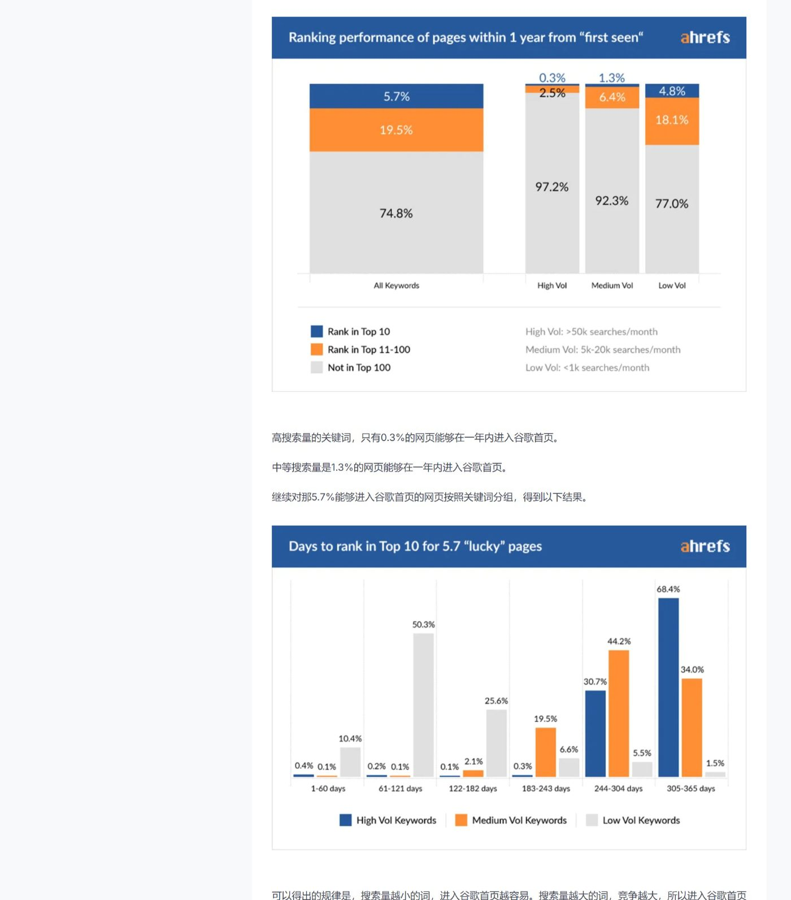

> 本文由 [简悦 SimpRead](http://ksria.com/simpread/) 转码， 原文地址 [coderliang.com](https://coderliang.com/community/articles/reading-english-seo-sources-e6a9c9c0-4)

> 代码改变世界。专注全栈开发、AI 工程与安全研究，分享技术洞察与实战经验。

# 读英文 SEO 资料必须对照原文的三个核对点

有个现象大概每个做独立站的人都遇见过：同一篇 SEO 文章，两个人读完得出完全相反的行动结论。一个说新站没机会，老页面把首页占满了；另一个说照着做就行，一年内能上首页。文章没变，变的是各自补进去的那部分——你原有的经验、你急着想验证的判断，会自动填进原文没说清的空白里。

这种走形在中文转述里会再放大一层。转述者要压缩，压缩就要删；删掉的通常不是数字，而是数字前面那句限定条件。数字好抄，限定条件难抄，因为它往往藏在上一段的从句里。

## 翻译插件能给你大意，丢掉的是限定条件

沉浸式翻译这类插件确实好用，读一篇几千词的英文博客，十分钟能过一遍。但它有几个固定的失效位置，值得记住：

图表里的文字不翻译。SEO 服务商的博客大量依赖图表，横轴的分档说明、图注下面那行小字（通常写着样本范围和统计时间）都是图片里的像素，插件看不见你也看不见。

从句层级会被拍平。英文原文常写成 "of the pages that ever ranked in the top 10, X% did so within a year" 这种结构，翻译成中文很容易变成「X% 的页面在一年内进入首页」，主语范围偷偷换了一次。这一句之差，结论完全不同。

术语被译成同一个词。position、ranking、visibility 在工具语境里指的不是一回事，中译经常都是「排名」。

所以我的做法是：插件用来决定这篇要不要细读，决定读之后关掉插件，回到英文读三个地方。

## 第一个核对点：比例的分母是谁

看到任何百分比，先别记数字，先问一句：这个百分比是从哪个池子里算出来的。

举个具体例子。Ahrefs 有一篇讲新页面多久能排上首页的老文章，中文圈转述得很多。我手上一份中文解读记录的是：样本为随机抽取的 200 万个关键词和 200 万个页面，其中约 5.7%（大约 11.4 万个页面）在一年内进入过谷歌首页。同一份笔记还特别标注，原文强调过一点——后面讨论「多快上首页」的那些分档比例，分母是这 11.4 万，不是最初的 200 万。

这个提醒本身就说明问题：连原作者都预判到读者会在这里读错。如果你转手拿到的是二手版本，那句提醒极可能已经被删了。于是「5.7% 的页面能上首页」和「上了首页的页面里有 X% 是一年内做到的」被混成一句话，你据此估算自己站点的预期，误差是数量级的。

可操作的检查：在原文里搜 methodology、we analyzed、sample、of these 这几个词，把样本定义那一段单独复制出来。然后对每个你打算引用的比例，写一行分母是什么。写不出来的，就先别拿去做决策。

还有一层要提醒：这类数据出自服务商自家爬虫的索引，不是 Google 官方数据。它反映的是「Ahrefs 索引里看到的世界」，抽样年份、覆盖语言、什么样的页面会被收进索引，都会影响结果。跨年份、跨工具的数字直接放在一起对比，基本没意义。

## 第二个核对点：图表里的数字，正文有没有兜住

同一份笔记里还记了另一组数据：谷歌前十的页面按建立时间分布，一年内的占 22%，一到两年的约 18%，三年以上的约 58%。加起来 98%，剩下那 2% 归到哪里去了，笔记里注明原文没说。

这不是笔记做得差，恰恰是做得好——它把「我核不了」标出来了。这就是第二个核对点该干的事：把图表里的每个数值抄下来，逐个去正文里找有没有对应的文字表述。找不到的，标记成「仅见于图表」。

为什么要这么麻烦。图表是设计过的东西，纵轴可能不从零开始，分档区间可能宽窄不一，配色会让某一档看着更醒目。正文里作者愿意用文字写出来的数字，是他敢负责的部分；只在图里出现的，往往是趋势示意。你要引用、要拿去说服合作方、要作为投入依据的，只该用前一种。

顺手做的事：图表如果是图片，用截图工具存下来，连图注一起。半年后再回看，你会需要它。

## 第三个核对点：被截断的论证要回原文补

从 PDF 或者微信文章里复制内容，最容易出的问题是句子断在半截。我看过的一份笔记里就留着「1 万个网页竞争……」和「到正反馈，那么建议……」这样的残句。

这些位置恰恰是论证的关键处。比如「一万个页面在竞争同一个词」这个说法，接下来一定有个转折：名义竞争者很多，但实际上你只需要比得过前十或前二十个结果。前半句让人退缩，后半句才是可执行的结论。断在中间，读者拿走的是错的那一半。

处理办法很直接：整理任何二手材料时，凡是断句、凡是有省略号、凡是逻辑上「后面应该还有话」的地方，都标一个待补，然后开原文用关键词定位那一段完整读完。这一步花的时间不多，但它防的是最贵的那类错误——照着半句话去做决策。

## 把服务商博客当成常读源，也得知道它们在卖什么

Ahrefs 和 Semrush 的博客都值得长期订阅，但内容气质不太一样。我的观察是，Ahrefs 更爱做大样本统计研究，产出的是「行业整体长什么样」这类结论，方法论段落写得相对细，适合用来校正自己的预期；Semrush 的内容里操作教程和功能引导的比重更高，跟着做能快速上手，但你会更频繁地被引导到某个具体功能页。

第三方测评对两者工具端的差异也有些常见说法：Semrush 的词库量和语言筛选更细，外链数据 Ahrefs 的深度更被认可，两家的关键词难度（KD）算法口径不同因此数值不能互换。这些是使用者的体验总结，不是官方指标，而且产品在持续改版，看到时先确认测评的日期。

真正需要记住的是：这些博客是内容营销资产。文章的结论不会假造，但选题会挑那些顺便证明「你需要一个这样的工具」的角度。所以读它们的数据研究可以，读它们对某个动作「有多重要」的判断，打个折。

## 先中文后英文，收益在哪

我不主张跳过中文解读直接啃原文。中文解读的价值是给你一张地图：这篇讲什么、有几个结论、争议点在哪。带着地图去读原文，注意力能落在该落的地方。

具体的时间分配大概是这样：中文解读五到十分钟通读一遍，把里面所有数字和结论列成清单；然后开原文，只精读三处——方法与样本那一段、每张图表前后各一段、最后结论前的转折句（英文里通常由 However、That said 这类词引出，转折句里装的正是限定条件）。全文顺读放到最后，有时间就读，没时间就跳过。

再补一个习惯：存链接的时候连日期一起存。SEO 服务商会重写旧文章，同一个 URL 三年后的内容可能已经换了数据。你半年后回头找那个 5.7%，发现页面上写的是另一个数字，那不是记错，是文章更新了。手上有日期，才判断得出该信哪一版。