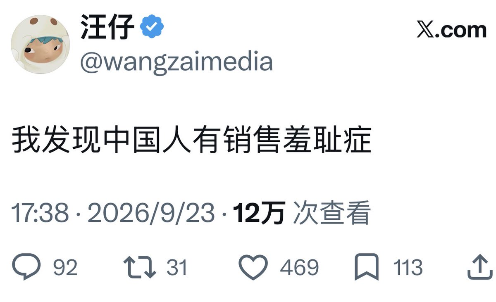

# 销售羞耻症克服指南

我最近发了一条关于销售的内容，没想到有十几万的观看。

这说明很多人真的对销售很苦恼。

他们的专业能力很强，也有不少粉丝，但不好意思收钱，不好意思介绍自己的服务，也没有把自己产品化。总想着只要我足够专业、提供了足够多的价值，总有一天能赚到钱。

不好意思，这真的是一种臆想。这样做只会吸引源源不断的白嫖党，把你吃干抹净。

我辞职当天赚到第一笔 1000 块，辞职三周赚到过去三个月的工资。这篇文章给大家分享一下我能成交客户的销售心法～

## 一、销售就是把信息告诉别人

你是谁；

你现在在做什么；

你能提供什么服务；

你解决过什么问题；

你有什么经验和案例；

你的服务怎么收费。

这些信息可以出现在公开内容、朋友圈、微信群和日常聊天里。

你不告诉别人你能解决什么问题，别人就不会知道什么时候应该找你。

我刚开始创业时有一个误解，以为销售应该非常正式：拍职业照、做产品介绍、明码标价，再弄一个商务感很强的页面。

后来发现，这种方式很多时候会增加距离感。对方还没有认识你，就已经感受到你在成交，他们会心生防备。

于是我就去添加一些市面上的 IP，看他们是如何销售的。我发现有些人真的完全没有销售痕迹，加了微信以后就是像朋友一样聊天，真的会让人更加信任～

所谓的「活人感销售」，通常是把生活和工作放在一起。你发自分享自己正在做什么、研究什么、帮谁解决了什么问题。别人先认识你，再认识你的服务。

如果你发自内心享受和热爱自己的事业，真心想要帮他们解决问题，客户是完全能感受到的。

专业价值拉满，本身就是最好的销售。

## 二、成交需要三件事

第一是信任。

高客单服务不可能靠刚认识时的几句话成交。对方要知道你的背景、经历和做事方式，确认你不会骗他，也不会收钱以后消失。

第二是专业能力。

信任只能让对方愿意了解你，最后能不能成交，还要看你是否真的能解决问题。

第三是对你这个人的认同。

我之前有一个客户，是高校老师。我在线下培训时问她为什么会找我，答案出乎我的意料，她说是因为我之前发的一条纪念东野圭吾的视频。

那条视频没有任何商业目的。我本身是个推理小说爱好者，听到东野圭吾去世时一下子非常受冲击，就发了一条内容悼念。

她可能通过这些生活细节，觉得我是一个比较真诚、纯粹，有自己的兴趣爱好以及梦想和追求的人。后来她先约了我一对一咨询，我帮她梳理出需要补足的知识，最后成交了线下培训。

Sell yourself.

## 三、定价定生死

价格不等于价值，但价格会影响客户如何判断价值。

同样的服务，定价 500、1000 或 5000，客户的重视程度是完全不同的。

高价是对客户的筛选。愿意为服务付高价的人，通常也更愿意投入时间执行。

收费还会建立边界。

很多人被白嫖，是因为没有分清楚什么可以免费，什么应该收费，免费交付到什么程度，收费服务具体包含什么。

免费会吸引一部分喜欢占便宜的人。

他们希望用很少的钱解决很大的问题，得到的越多，要求越多，而且很难满足。

那些自己做过事情、时间成本也很高的人，反而更懂得尊重别人的时间和精力。

所以商业也是一种筛选。你不需要让所有人都满意，也不需要把所有人都变成客户。

## 四、价格不是固定答案

很多服务没有统一的市场价。

对方的问题有多急，你们之间有多少信任，你能创造多大的结果，对方能提供什么资源，都会影响最后的价格。

有时候我会收钱，有时候我不会。因为有些人能提供对等的资源、经验、客户或合作机会。

但不收费不等于没有交换。只要是交换，就要把交换的内容讲清楚，否则它很容易变成无限的免费帮忙。

商业谈判就是在这个过程中确认双方愿意交换什么。

最后，销售羞耻其实是刻在我们文化基因里的。

它与我们的面子、自我价值感息息相关，赚别人的钱好像是一件不体面又不道德的事情。

这篇文章呢，希望大家都能够克服销售羞耻，早早出来卖～