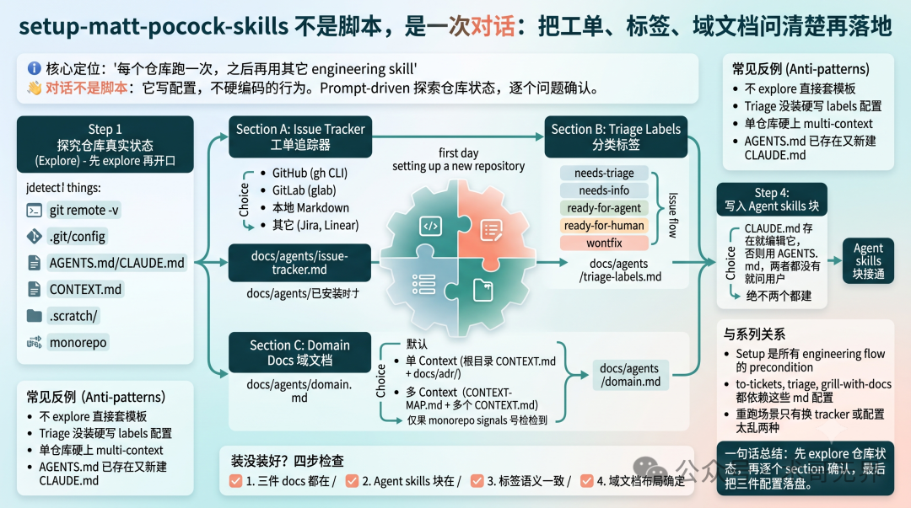
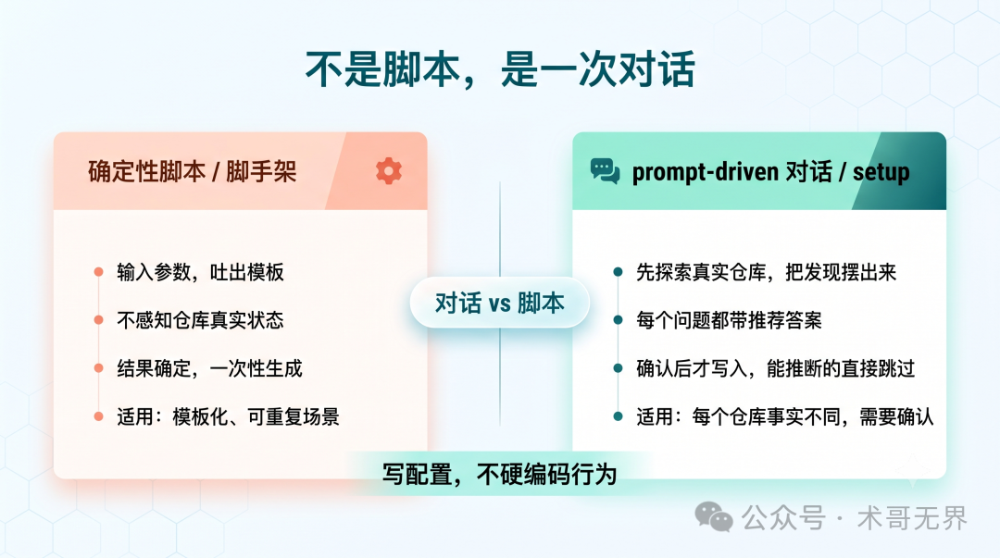
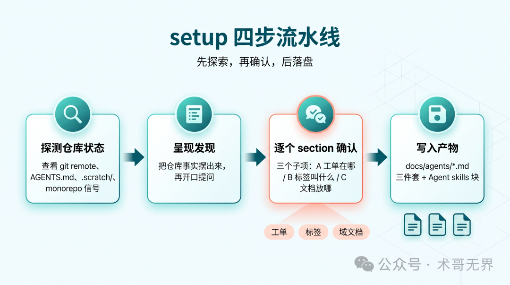
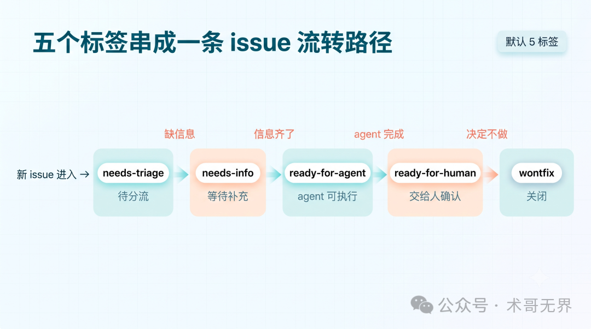

# setup-matt-pocock-skills 不是脚本，是一次对话：把工单、标签、域文档问清楚再落地

> 深入拆解 Matt Pocock Skills 体系中 `setup-matt-pocock-skills` 的设计哲学与执行流程——它不是脚手架，而是一次 prompt-driven 的对话，通过先 explore 再提问的方式，把「工单在哪、标签叫什么、文档放哪」三个配置决策一次性落地。

<!-- more -->

## 核心设计理念

`setup-matt-pocock-skills` 官方定位：Run once per repo before using the other engineering skills。它不教怎么写 issue、怎么 triage，只做一件事：把三个配置决策一次性落地，让后面的 skill 有确定的读写位置。

关键区别：**脚手架是确定性的，输入参数吐出模板；setup 是 prompt-driven 的，先 explore 真实仓库状态，把发现摆给你看，你确认后它才写入。**

## 完整执行流程

### 第一步：先 explore，再开口

Agent 先做一轮仓库侦察，探测：
- `git remote -v` → 判断 issue tracker 候选
- `AGENTS.md` / `CLAUDE.md` 是否存在
- `CONTEXT.md` / `.scratch/` 目录 → 本地 markdown issue tracker 信号
- `pnpm-workspace.yaml` / `packages/` → monorepo 信号

### 第二步：Section A — Issue Tracker 四选一

如果 `git remote` 指向 GitHub，直接提议 GitHub Issues（通过 `gh` CLI）。否则有三个分支：
- **GitLab**：用 `glab` CLI
- **本地 markdown**：写到 `.scratch/<feature>/`
- **其它**：Jira、Linear 等自由描述

产物：`docs/agents/issue-tracker.md`

### 第三步：Section B — Triage Labels

**仅当 `triage` skill 已安装时才运行**。默认 5 个 canonical 标签：
- `needs-triage` → `needs-info` → `ready-for-agent` → `ready-for-human` → `wontfix`

用户可 override 标签命名，关键是语义对齐。

产物：`docs/agents/triage-labels.md`

### 第四步：Section C — Domain Docs

默认 single-context 布局（根 `CONTEXT.md` + `docs/adr/`），直接写不询问。仅当探测到 monorepo 信号时才 offer multi-context 布局（`CONTEXT-MAP.md` + 每 context 一份 `CONTEXT.md`）。

产物：`docs/agents/domain.md`

### 第五步：写入 Agent Skills 块

在 `CLAUDE.md`（优先）或 `AGENTS.md` 中追加 `## Agent skills` 块，指向上面三个文件。规则：先看哪个已存在，编辑它，绝不两个都建。

## 三 Section 对比

| Section | 默认 | 分支 | 产物 |
|---------|------|------|------|
| Issue tracker | GitHub（gh CLI） | GitLab / 本地 markdown / 其它 | `docs/agents/issue-tracker.md` |
| Triage labels | 仅 triage 已装时运行；5 默认标签 | 用户 override | `docs/agents/triage-labels.md` |
| Domain docs | single-context 直接写 | monorepo 时 multi-context | `docs/agents/domain.md` |

## 验收清单（30 秒验证）

1. 三件 docs 都在：`docs/agents/issue-tracker.md`、`docs/agents/domain.md` 存在；triage 装了的仓库还要有 `docs/agents/triage-labels.md`
2. Agent skills 块在：`CLAUDE.md` 或 `AGENTS.md` 里有 `## Agent skills` 且指向上面三个文件
3. 标签语义一致：仓库实际标签与配置对得上
4. 域文档布局确定：`CONTEXT.md` 和 `docs/adr/` 位置已约定

## 四个反例

1. **不 explore 直接套模板**：仓库没接 GitHub Issues 却配了 gh，导致 to-tickets 建不出 issue
2. **triage 没装硬写 labels 配置**：没人读的配置，等真装了 triage 又可能打架
3. **单仓库硬上 multi-context**：维护成本翻倍，agent 反而不知道该读哪份
4. **AGENTS.md 已存在又新建 CLAUDE.md**：两份文件并存，agent 约定分裂

## 与系列其它 skill 的关系

setup 是所有 engineering flow 的 precondition。`to-tickets`、`triage`、`grill-with-docs` 全部依赖 `docs/agents/*.md` 里的配置。这些 skill 是「读配置执行」的，不是「自带配置」的。

重跑 setup 只在两种场景有必要：团队换了 issue tracker；配置乱到想推倒重来。日常微调直接编辑 `docs/agents/*.md` 即可。

## 边界与批评

- setup 只把「工单在哪、标签叫什么、文档放哪」三个事实写对，不解决代码质量和需求清晰度
- 多仓库场景下有点重复劳动——没有全局继承机制，每个仓库都得跑一遍