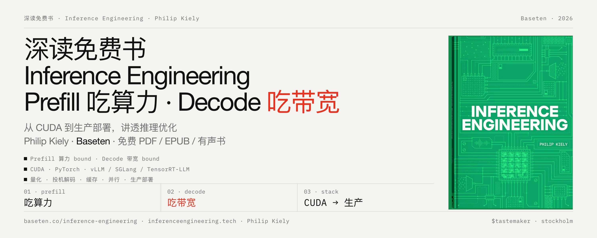

# 深读免费书「Inference Engineering」：Prefill 吃算力、Decode 吃带宽，讲透从 CUDA 到生产部署的推理优化

# Inference Engineering

Baseten 出版的一本系统化讲授「如何把 AI 模型在生产环境中跑得快、跑得省、跑得稳」的工程书籍，作者 [@philipkiely](https://x.com/@philipkiely)，支持在线免费阅读。它覆盖从 CUDA 内核到 Kubernetes 的完整技术栈，面向需要自托管开源模型（DeepSeek、Qwen、Kimi、Llama 等）的工程师和技术决策者。写作背景是：自 DeepSeek V3/R1 之后，开源与闭源模型的能力差距基本抹平，而自建推理可带来 80%+ 的成本节省和四个九的可用性；但代价是，你必须理解从硬件到生产的每一层。

https://www.baseten.co/inference-engineering/book/

# 全书骨架：三层推理栈

第 0 章给出的框架贯穿全书，做好推理需要三层协同：

1. 运行时层（单个模型实例跑多快）：CUDA → PyTorch → 推理引擎，加上量化、批处理、缓存、投机解码、并行、分离部署六大技术；
2. 基础设施层（规模上去后怎么办）：自动扩缩容 → 容量规划 → 多区域多云统一资源池；
3. 工具层（用什么抽象开发）：在「黑盒 API」与「裸 primitives」之间找中间点。

章节顺序即此逻辑的展开：先定义目标（第 1 章）→ 理解模型（第 2 章）→ 理解硬件（第 3 章）→ 理解软件栈（第 4 章）→ 应用优化技术（第 5 章）→ 扩展到非文本模态（第 6 章）→ 落地生产（第 7 章）。

# 逐章解读

## 第 1 章 前提条件：先定义「更好」，再谈优化

核心论点是优化即权衡管理。作者用了一个贴切的类比：NFL 球员不是最大的、最快的或最强的，是针对特定位置做过特化的运动员；推理系统同理，约束越多，可达性能越高。动手前必须回答五个问题：用什么模型、应用接口形态、延迟预算、单位经济性、流量模式。

几个值得记住的实操结论：

- 共享 API 转 dedicated 部署的三个触发条件：用量大到按 GPU 计费更划算、需要微调或特定 SLA、多模型流水线需要压缩网络开销。不满足就继续用 API。
- 选模型是最大的性能决策：同等优化下小模型永远更快更便宜。书中 text-to-SQL 案例很有说服力——SQL 是受限语言，几十亿参数的微调模型可达到数千亿参数通用模型的效果。
- 指标体系：TTFT（由算力受限的 prefill 决定）和 TPS（由带宽受限的 decode 决定）是两大核心指标，且必须区分单用户「感知 TPS」与系统「总 TPS」；LLM 延迟呈右偏分布，均值会骗人，必须盯 P90/P99 尾部。诊断法则：纯推理快而端到端慢，问题在基础设施，不在模型。

## 第 2 章 模型：一切优化从理解计算机制开始

两种生成范式覆盖所有模态：自回归 token 生成（LLM、VLM、嵌入、ASR、TTS）与迭代去噪（图像/视频扩散模型）。本章的技术含金量集中在两处：

瓶颈分析框架（全书最重要的分析工具）：GPU 两大资源是算力（ops/s）与显存带宽（bytes/s），H100 的 ops:byte 比约为 295；每读 1 字节要做 295 次运算才算「完美平衡」。算术强度（总计算量 ÷ 总访存量）高于此值为算力受限，低于则为带宽受限。由此得到三大铁律：prefill 算力受限、decode 带宽受限、图像/视频生成算力受限。这一条判断决定了后续所有优化手段和硬件选型的方向。

注意力优化：注意力随序列长度二次增长，decode 靠 KV cache 降为线性但仍昂贵。两条路线：无损的实现优化（FlashAttention 消除冗余读写、PagedAttention 解决显存碎片，不改复杂度）与有损的算法优化（滑动窗口、线性/压缩注意力、MLA，突破二次墙但牺牲质量）。

另外一个容易被忽视的细节：MoE 模型（如 Qwen3-235B-A22B，每 token 激活 22B/总 235B）单请求很省，但批量服务时不同请求激活不同专家，几乎全部参数都会被读一遍；稀疏性红利在生产中会打折扣，需要专家并行来挽回。

## 第 3 章 硬件：选卡先问瓶颈在哪

围绕上述铁律展开：prefill/视频生成选高 FLOPS，decode 选高带宽。H100（80GB/3.35TB/s）与 H200（141GB/4.8TB/s）算力相同，decode 密集型负载 H200 明显更优。精度是算力杠杆，每减半精度 FLOPS 翻倍，对比 GPU 必须用相同精度、非稀疏的数字。

实操要点：显存须容纳权重 + 至少 50% 余量给 KV cache；互连决定并行上限（NVLink 900–1800 GB/s ≫ InfiniBand ≫ 以太网）；小模型（约 2B 以下）用 MIG 硬件切分（H100 最多切 7 份）避免浪费整卡；NVIDIA 的真正护城河不是硬件是 CUDA 软件栈，竞争者（AMD、TPU、Cerebras、Groq）的路径是内存带宽、能效或平台整合，但都受制于软件生态。

## 第 4 章 软件：抽象层次决定杠杆，极致性能要求下潜

软件栈自底向上：CUDA 内核（cuBLAS/CUTLASS/FlashInfer，内核选择比编写更重要，内核融合是 decode 提速关键）→ PyTorch（torch.compile，但无法融合 FlashAttention 类插件内核）→ 推理引擎 → Dynamo。

三大引擎选型是本章的实用核心：

- vLLM：默认之选，硬件覆盖最广、day-zero 模型支持最全、易用性最好；
- SGLang：随 DeepSeek/Qwen 等中国开源模型生态崛起，重注大规模 MoE 多节点部署（GB200 NVL72），可深度定制，xAI 首选；
- TensorRT-LLM：性能上限最高，代价是仅限 NVIDIA、配置复杂；V1 版已基于 PyTorch 独立运行，易用性接近对手。

Dynamo 不取代引擎，是在其上做大规模编排：跨节点 KV cache 复用路由、prefill/decode 分离、多节点专家并行。最后强调基准测试方法论：金标准是影子流量（复制真实生产请求压测），一次只改一个变量，基准测「表现如何」、profiling 测「为何如此」。

## 第 5 章 技术：五大加速手段及其交互

这是全书的技术核心，五节各自可独立成篇，但真正有价值的是交互关系：

- 量化：prefill 端低精度算力翻倍、decode 端等效带宽翻倍，实际 16→8bit 提速 30–50%。生产坚持浮点格式（FP8/MXFP8 是甜点），敏感度排序：线性权重 < 激活 < KV cache < attention（softmax 几乎总保原精度）。验收标准是「零可感知损失」。
- 投机解码：用闲置算力让每次前向产出 N+1 个 token（草稿 + 验证）。只提升 TPS 不改善 TTFT；大 batch 算力饱和时必须动态关闭。变体中 EAGLE（专职草稿头，单 pass 最多 8 个草稿 token）是通用首选，而 n-gram 查找在代码补全这类输出复现输入的场景能轻松胜过 EAGLE。
- 缓存：前缀缓存的硬限制是前缀在第一个不同的 token 处截断，这直接催生了「上下文工程」：让易变内容尽量晚出现在上下文里。存储分四层（显存→主机内存→本地 SSD→网络 SSD），Dynamo 的 KVBM 提供跨层迁移。
- 并行：显存数学（FP8 下约 1GB/10 亿参数）决定最小配卡；TP 提升单用户 TPS 但吃 NVLink，EP（专家并行）提升总吞吐且可跨节点，PP 仅作多节点兜底。
- 分离部署：prefill 与 decode 拆到独立引擎各自调优（如 prefill 端可用更低的并行度），Dynamo 提供生产级实现（xPyD 配比动态调整）。使用门槛极高：日 token 量 1–10 亿 + 模型 ≥1000 亿参数 + prefill 重的流量，三者缺一即浪费硬件。

贯穿性的元原则：约束换性能、流量决定优化深度、技术必须按组合评估。Baseten 工程师为单个客户模型试了 77 种配置才把 TPS 翻倍，调优是持续的实证过程，不是一次性设置。

## 第 6 章 模态：两大架构原型的延伸与分别

VLM、嵌入、ASR、TTS 本质上都是 LLM 技术栈的变体（TTS 甚至就是微调的 Llama，扩展音频 token 词表），大部分优化直接迁移；图像/视频扩散模型则走另一条路：无 KV cache、无自回归、算力受限而非带宽受限，优化对象从内存带宽转向 FLOPS 与 attention 本身。

各模态有独特的工程要点：VLM 一张高清图约值 1000 token，降采样是特有的质量-速度旋钮；嵌入模型无 decode，前缀缓存与分离部署无意义，靠超大 batch + 水平扩展；Whisper 长文件转写可做到 RTF 1000 倍（1 小时音频 4 秒转完），代价是失去前缀连续性后需做幻觉检测；TTS 实时只需每秒 80–100 token，再快无益，因此全部优化转向单 GPU 并发流数；视频生成是算力之最（attention 占 70–80%，整节点 8 卡 batch 1），优化靠按步/按层选择性量化 + Context Parallelism（而非 TP）+ ring attention。

## 第 7 章 生产：价值兑现处，也是新问题爆发处

单实例再快也会被流量淹没，这是基础设施问题，不是 PyTorch 或 CUDA 问题。本章的关键贡献是把「延迟」拆成全栈账本：容器镜像体积、冷启动四段（GPU 采购、镜像加载、权重加载、引擎编译，TensorRT-LLM 编译可耗时数分钟）、跨集群 10ms vs 50ms 的差距、甚至客户端 TLS 握手就吃掉 300ms P95 预算的 10%。

生产化的几条硬数据与硬结论：Llama 3 训练数据显示约每 5 万 GPU 小时一次硬件故障，故障是常态，需 active-active 与自愈调度；灰度部署配合自动扩缩容在规模下几乎零额外成本（旧版自动缩容），蓝绿则需双倍 GPU；采购用「低成本预留打底 + 按需/Spot 扛峰值」；成本核算不要从 GPU 花费反推 token 单价，要正向对比总账，并把自建工程时间计入 TCO。

## 提炼：全书的基本原则

1. 先判瓶颈，再选手段：算力受限还是带宽受限，这一条判断贯穿硬件选型、内核优化、并行策略、分离部署的所有决策。
2. 约束与流量是性能的朋友：垂直应用应该主动加约束；高流量才解锁高阶优化（分离部署、KV 感知路由、多节点并行），很多技术在低流量下是负收益。
3. 技术按组合评估，而非孤立评分：量化是赋能者（省下的带宽让分离部署和缓存更有效），投机解码与大 batch 互斥，调优是持续实证过程。
4. 延迟是端到端、全栈的：从内核融合到客户端连接复用，每一毫秒都要记账；均值会骗人，盯百分位数。
5. 故障是常态，生产化是价值兑现点：所有单点优化，过不了基础设施这一关就没有意义。
