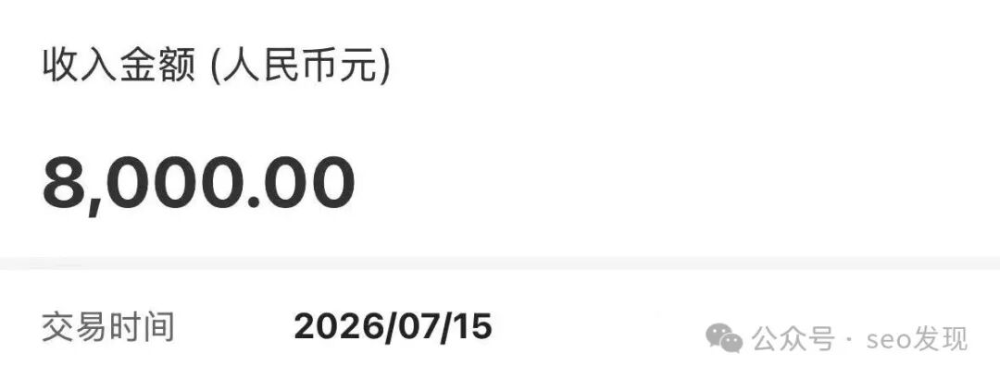

# 下载站又出8000！一定要掌握小站模式规律！

> 王杨再次以 8000 元出站，分享其总结的"小站模式"五大要点：选下载行业、用 COM 域名、首页收录是前提、外链接要多、注重出站价值。

<!-- more -->

## 系统特点

王杨游戏养站系统基于海量数据来支撑每个网站，站长不需要管理更新文章，只需保证服务器和域名正常，其他自动实现。

> 网站做小即可，又是 8000！

## 小站模式五大要点

### 1. 行业选择

只选择**下载行业**，其他行业暂不考虑。理由在前文中曾多次提及（下载行业数据量大、需求稳定）。

### 2. 域名后缀价值

**COM 高于 CN**，其他非主流后缀可不用考虑。

### 3. 首页收录是前提

必须要让网站首页收录，想尽办法让首页收录。首页收录了网站才有一定价值，不管是否备案，这个节点必须要有。

### 4. 外连接要多

建议外链接多，自己想办法。

### 5. 出站价值

重点看历史。对于收录少的看历史，有看历史的玩法。建站中或出站多了，自然会悟出很多道理。

---

> **风险提示**：本文为个人创业、副业经验与思路交流，不构成任何投资建议或收益承诺。请理性看待收益，谨慎尝试。

## 关联文章

- [游戏下载站养站30个网站成本核算明细分享](./game-station-cost-breakdown.md) — 王杨，2026-07-16
- [1篇文章带你入门游戏下载行业！学会不用求人！](./game-download-industry-entry.md) — 王杨，2026-07-17
- [别把闲置域名当摆设！手搓几个游戏站试一下！](./idle-domain-game-site.md) — 王杨，2026-08-09
- [40块1个站点游戏下载站模板+SEO功能游戏养站系统](./game-seo-system.md) — 王杨，2026-08-10