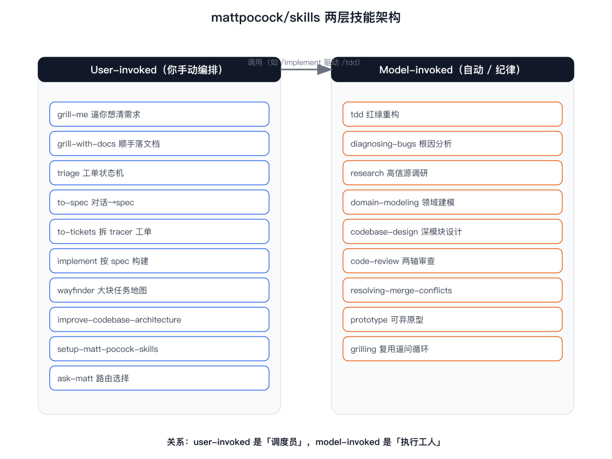
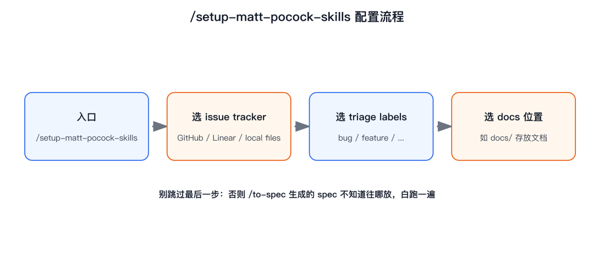
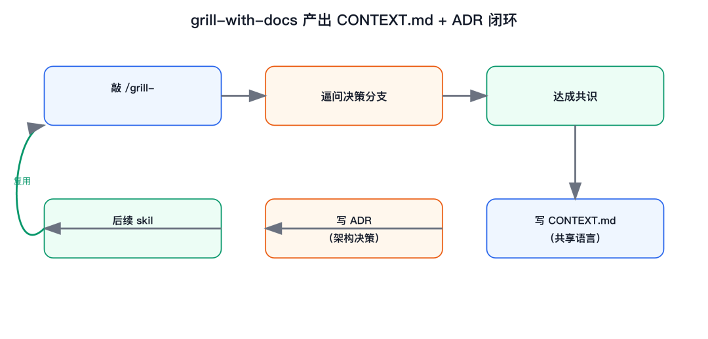
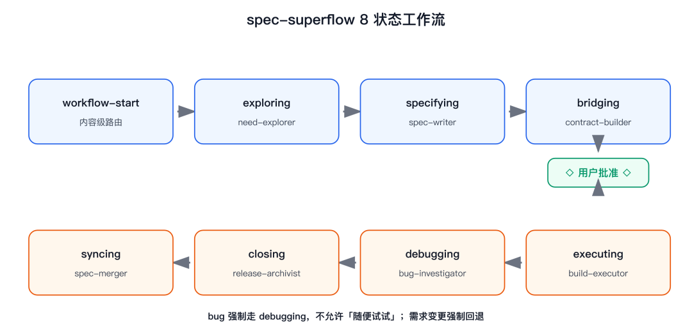
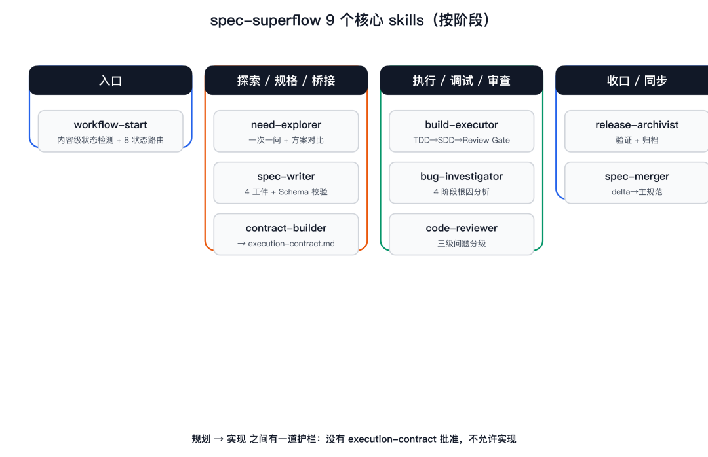
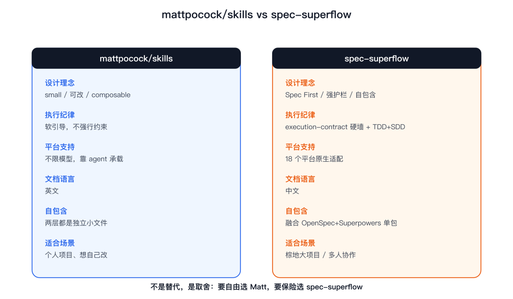

> **精读摘要**：文章对比了 Matt Pocock 开源的 agent skills 和国产 spec-superflow 两套 AI 编程工作流。Matt 的 skills 以 small/composable 为核心，提供 /grill-me、/tdd、/implement 等独立 skill 让开发者自由编排，适合个人项目和英文生态；spec-superflow 则通过 8 状态路由和 execution-contract 硬约束强制「想清楚再写」，适合中文团队和大项目。作者用「加权限控制」的真实需求演示了两套流程，并给出小需求用 Matt、大功能用 spec-superflow 的分工建议。
>
> **关键洞见**：「AI agent 写不出好代码，根因往往不是模型笨，是我们没把需求讲清楚。」——Matt 帮你理清需求，spec-superflow 帮你锁死执行。

你好，我是码哥

上周我让 Claude Code 给项目加个订单改单幂等支持改造，它啪一下甩出 200 行代码，跑起来直接 500。我盯着报错看了三分钟，才意识到问题不在模型，是我没跟它讲清楚「权限」到底指什么。

这个场景你熟不熟。AI 编程 agent 写不出好代码，根因往往不是模型笨，是我们没把需求讲清楚。TypeScript 大神 Matt Pocock，Total TypeScript 作者，6 万开发者订阅的 newsletter 主理人，把他每天在用的 agent skills 开源了。今天我就用「加权限控制」这个真实需求，带你把这套东西跑通，顺便聊聊我最近转到的一个更狠的国产替代品。

大家可以点 star 支持下

- [mattpocock/skills 官方仓库](https://github.com/mattpocock/skills)
- [spec-superflow 官方仓库](https://github.com/MageByte-Zero/spec-superflow)

## 先说清楚，mattpocock/skills 到底是个啥

Matt 对自己的 skills 定位就一句话，small、easy to adapt、composable，能跟任何模型配合。他明确反对vibe coding，也看不上 GSD、BMAD、Spec-Kit 那种「把你的控制权拿走」的重型框架。

怎么理解 small / composable。它不是一个大而全的 prompt 模板，而是一堆可以单独拿出来改的小技能。你 clone 到项目里，哪个不顺手就改哪个。这点对国内团队很关键，因为英文社区那套默认假设你用 GitHub、用 Linear，到了咱们这环境经常水土不服。换成大白话，composable 的意思是，你可以只挑/tdd用，完全不碰/triage，两个 skill 之间不耦合。

Matt 把 AI 写代码跑偏归纳成 4 个失败模式，每个都有对应解法。

第一，agent 没按你想的做。根因是你脑子里的决策分支没讲清，解法是/grill-me、/grill-with-docs。

第二，太啰嗦。同一个概念每次换个说法，模型越聊越乱，解法是建一套共享语言写进CONTEXT.md。

第三，代码跑不通。缺反馈环，解法是/tdd加/diagnosing-bugs。

第四，写成一团浆糊。架构没设计就开写，解法是/codebase-design、/improve-codebase-architecture。

两层分类是这套设计的核心。Matt 把 skill 分成 user-invoked 和 model-invoked。前者是你手动敲/xxx来编排流程的，比如grill-me、grill-with-docs、triage、to-spec、to-tickets、implement、wayfinder、improve-codebase-architecture、setup-matt-pocock-skills、ask-matt。后者是 agent 自动调用或你主动调用的，持有可复用纪律，比如tdd、diagnosing-bugs、research、domain-modeling、code-review、resolving-merge-conflicts、prototype、grilling。

我得强调一个关系。user-invoked 负责「编排」，它会去调用 model-invoked 的纪律。比如你跑/implement，它内部会驱动/tdd，提交前再拉/code-review。所以两层不是并列摆设，是「调度员」加「执行工人」。社区里最火的两个是/grill-me和/grill-with-docs，前者逼你想清，后者还顺手把共识落成文档。

一句话记住。user-invoked 负责「想清楚、排好队」，model-invoked 负责「动手做、做漂亮」。

## 三步装好，5 分钟跑起来

安装有两种姿势，取决于你想不想改源码。

第一种，直接 copy 进项目可改。skills.sh这套会把 skills 原样拷进你的仓库，你后续随便 hack。

跑完你会看到项目里多了一个 skills 目录，里面每个技能都是独立文件夹，各自带一份SKILL.md，改起来零成本。我试了，从敲命令到看到目录生成，不到 20 秒。这种方式的代价是你得自己追作者更新，但换来的是完全的控制权。

第二种，Claude Code 插件市场，只读随作者更新。你不想改源码、只想用最新版，就走这个。

区别在哪儿。第一种你拥有副本能改，第二种作者一更新你就自动跟上，但动不了源码。说实话，个人项目用第一种，公司项目用第二种省心，毕竟没人想每次 upstream 改了都得手动 merge。

装完还不是终点，**真正让它生效的是/setup-matt-pocock-skills**。这条命令会连问你三个问题，把工作流跟你团队的实际工具对齐。

它会问，用哪个 issue tracker，选项有 GitHub、Linear、local files。再问，triage 阶段用什么 labels 来分类，比如bug和feature。最后问，/triage生成的 docs 存到项目哪个位置，常见是docs/。这三个答案定下来，整套 skill 才算真正接进你的研发流。我第一回跳过了这步，结果/to-spec生成的 spec 不知道往哪放，白跑一遍。所以这条命令别省。装完顺手ls skills看一眼，确认每个 SKILL.md 都躺在那，后面调用才不会报找不到。

## 实战，用 /grill-me 把「加权限」逼问清楚

现在拿开头那个真实需求串一遍，「帮我在项目里加一个权限控制」。

你以为这句话够了，其实不够。敲/grill-me，agent 会像审犯人一样，把「权限」背后的每个决策分支都问出来。是基于角色的 RBAC，还是基于属性的 ABAC。管理员能删别人数据吗。没登录的人看到什么。我那次被问了 11 轮，才发现自己根本没想清楚「游客能不能看预览」。

**更狠的是/grill-with-docs**。它不只是问，还会把你们达成共识的共享语言写进CONTEXT.md，把关键架构决策写进ADR（Architecture Decision Record）。这俩文件后续所有 skill 都会读，等于给团队和 agent 建了本「通用词典」。

拿我那个权限需求举例，CONTEXT.md里会记一句，「权限在本项目指 RBAC，角色含 guest/admin，guest 仅可读预览」。以后不管哪个 skill 上手，都不会再把 guest 当匿名处理。这种共享语言才是/grill-with-docs比/grill-me多出来的价值，从「想清楚」升级到「记下来」。

有了共享语言，下一步/tdd。它强制红绿重构，一个 feature、一个 bug 都按垂直切片来，先写挂的测试，再写能过的实现。我那个权限接口，就是先写了「未授权访问返回 403」的测试，才动手写中间件，结果一次跑通没踩坑。

需求聊透了怎么办。用/to-spec把当前对话直接合成一份 spec 发到你的 issue tracker，不用再开会对齐。/implement则按 spec 或 tickets 去构建，过程中驱动/tdd，提交前还会跑/code-review做 Standards 和 Spec 两轴检查。

这套流程跑下来，开头那个 500 报错的问题从源头就消失了。不是模型变聪明了，是你终于把话说清楚了。

## 用了一周，Matt 这套的留白我得讲清楚

我客观说，Matt 这套真不错，但用了一周有两个留白必须讲，不然就是盲目吹。

第一个，偏西方开发者默认。issue tracker 默认 GitHub、Linear，文档全是英文。国内团队用起来要改不少地方，triage labels 那套也得自己接飞书、接 TAPD。我司用飞书，光是把/triage的落点从 GitHub issues 改到飞书多维表，就调了大半天，官方文档里压根没这种例子。

第二个，它不强行把执行钉死。Matt 的设计哲学是「给你工具，不替你做主」。规划阶段你用/to-spec想得很清楚，但到了/implement执行期，agent 仍可能跑偏，因为中间没有一道硬墙拦着它。

这对个人小项目无所谓，但棕地大项目、多人协作、要长期维护的场景，跑偏一次的代价就很高。我一个同事就遇到过，spec 写得好好的，实现时 agent 自作主张改了数据模型，code review 才抓出来，返工大半天。你品，这种「规划严、执行松」的断层，恰恰是多人协作最怕的。

这俩留白，正好是国产的spec-superflow补上的地方。顺着这个话头，重磅来了。

更隐蔽的是，Matt 的 skill 之间靠你手动串联。/to-spec出了 spec，/implement要不要严格照做全看你 prompt 怎么写，没有任何机制校验实现和 spec 对得上。这层信任成本，项目一大就压不住，也是「规划严、执行松」最让人头疼的地方。这两个坑单看都不致命，叠在多人长期项目上就成了慢性失血，每次返工都在吞进度，你还没察觉。

## 重磅，spec-superflow 把纪律焊死了

MageByte-Zero/spec-superflow，当前版本 v0.10.0，MIT 协议。它源码级融合了OpenSpec规划引擎和Superpowers执行纪律，还自己写了个contract-builder桥接层，独创 8 状态路由。最关键的一点，它自包含，你不用单独装 OpenSpec 或 Superpowers 运行时，一个包全搞定。

启动就一句话，「用 workflow-start 开始」。它做的是内容级状态检测，比对你当前 proposal 的范围和契约意图锁，自动路由到正确的下一个 skill。你中间卡住了，喊一句「帮我看看现在该干什么」，它也能接上。完整路径长这样，你说「帮我加一个权限控制」，它走 workflow-start → exploring（need-explorer 问你是 RBAC 还是 ABAC）→ specifying（spec-writer 出四份工件加 Schema 校验）→ bridging（contract-builder 压成 execution-contract.md）→ 你批准 → executing（build-executor 跑 TDD 到 SDD 到 Review Gate）→ 收口 → 同步。

9 个核心 skill 覆盖完整生命周期。

workflow-start是入口，做内容级状态检测加 8 状态路由，还会阻止非法跳转。need-explorer探索需求，一次一问加方案对比。spec-writer出 proposal、specs、design、tasks 四份工件，Schema 引擎实时校验。contract-builder把四份工件压缩成execution-contract.md。build-executor执行，TDD 铁律加 SDD 子代理驱动加 Review Gate。bug-investigator调试，4 阶段根因分析，连错 3 次以上直接质疑架构。code-reviewer审查，三级问题分级。release-archivist收口，spec-merger同步。

它背后的设计原则写得很直白，Spec First、Guarded Handoff、Strong Guardrails、Schema Validated、Execute Disciplined、Self-Contained。前五个合起来就是一句话，规划和实现之间有一道护栏，不是建议，是强制。

硬约束才是它和 Matt 最大的区别。没有execution-contract.md或没被批准，不允许实现。full 或 hotfix 没有 current execution plan，或者任一 wave 缺 pass review receipt，不允许推进。需求变了强制回退，遇 bug 强制走 debugging，不允许「随便试试」。

这道墙，Matt 那套是没有的。

平台覆盖也猛。18 个平台都支持，Claude Code、Cursor、OpenAI Codex、GitHub Copilot、Gemini CLI、Cline、Kiro、Windsurf、Qwen Code、Amazon Q、Roo Code、Continue、Pi、Qoder、OpenCode、WorkBuddy、Trae，而且全程中文文档。

## 装 spec-superflow，一句话启动

按你用的工具挑一条命令。

WorkBuddy 用户，一行搞定。

这条命令会把 9 个 skill 直接放进 WorkBuddy 的 skills 目录，装完重开对话就能用「用 workflow-start 开始」唤醒。

Cursor 用户，两种都行。

Claude Code 用户，走插件市场。

装完，打开对话输入「用 workflow-start 开始」，它会自动检测你当前在流程的哪一步。我第一次启动，它直接识别出我已有的 proposal，跳到 bridging 阶段，省了我重新走一遍探索。

**还有个全局 CLIssf**，装完能直接npm install -g spec-superflow拿到。常用几条。

我常用ssf doctor排查为什么某个 skill 没出现，基本 10 秒定位到是插件没激活。顺手给你看两个真实输出体感。

看到这两段，你就知道环境是健康的。如果 validate 报红，它还会告诉你是哪份工件缺字段，不至于盲改。

除了 list 和 validate，我推荐新人先跑一次ssf doctor，它会检查插件市场有没有装全、SKILL.md 是否就位，漏了哪步直接报出来。还有个冷门但好用的`ssf execution recommend <dir>`，给它一个目录，它根据改动文件数推荐你走 full、hotfix 还是 tweak 快速路径，省得自己判断。另外启动后除了「用 workflow-start 开始」，你还能喊「继续上次的工作流」或「帮我看看现在该干什么」，断点续跑不用重来。我一般新机器装完先ssf doctor跑一遍，确认 9 个 skill 全亮，再开 workflow-start，避免用到一半发现某个 skill 没加载。mac 和 Linux 一条命令通吃，Windows 用 PowerShell 跑同样的 npx 即可，路径差异它自己处理，不用你手动配环境变量。

## 一张表看清，Matt 和 spec-superflow 谁适合你

公平说，两套不是替代关系，是不同取舍。Matt 给你的自由度高，spec-superflow 给你的约束力强，选哪个看你怕什么。

维度mattpocock/skillsspec-superflow设计理念small、可改、composableSpec First、强护栏、自包含执行纪律软引导，不强行约束execution-contract 硬墙，TDD+SDD+Review Gate平台支持不限模型，靠 agent 承载18 个平台原生适配文档语言英文中文自包含两层都是独立小文件融合 OpenSpec+Superpowers，单包适合场景个人项目、想自己改棕地大项目、多人协作、长期维护

维度

mattpocock/skills

spec-superflow

设计理念

small、可改、composable

Spec First、强护栏、自包含

执行纪律

软引导，不强行约束

execution-contract 硬墙，TDD+SDD+Review Gate

平台支持

不限模型，靠 agent 承载

18 个平台原生适配

文档语言

英文

中文

自包含

两层都是独立小文件

融合 OpenSpec+Superpowers，单包

适合场景

个人项目、想自己改

棕地大项目、多人协作、长期维护

我解释下这张表背后的权衡。Matt 那列「软引导」不是缺点，是设计选择，他信不过「替你做主」的框架，所以把控制权留给你。spec-superflow 那列「硬墙」也不是笨重，它只对规划到实现的接缝处强制，日常写代码照样灵活。所以别看成一个高级一个低级，是「要自由」还是「要保险」的区别。

我的判断。想要轻量、能随便改、泡在英文生态里，Matt 这套很舒服。想要「想清楚再写、写完不跑偏」的硬纪律，尤其中文团队、大项目，spec-superflow 是更稳的选择。

举个具体例子，你一个人写 side project，需求天天变，Matt 的轻量 skill 让你随时改方向不费劲。但你是五人团队维护一个跑了三年的老系统，每次合主干都怕 agent 偷偷改结构，那道 execution-contract 硬墙就是你的保险丝。所以别被「高级」二字带偏，选哪个只看你怕自由还是怕跑偏。

## 说结论，中文开发者直接上 spec-superflow

省流。如果你是中文开发者，做需要长期维护的功能，要的就是「想清楚再写、写完不跑偏」，别犹豫，直接装 spec-superflow。

我为什么这么笃定。国内团队三个现实痛点，它正好全中，中文文档不用翻，18 个平台不用挑边站，自包含不用先折腾上游运行时。对比 Matt 那套，你还得自己把 GitHub 默认改成飞书、把英文文档读顺，这些隐性成本对项目进度是实打实的损耗。

它把 OpenSpec 的规划严谨和 Superpowers 的执行纪律焊成一道墙，这些对国内团队是省心的。GitHub 在这，https://github.com/MageByte-Zero/spec-superflow，一条命令就能起步，比如npx spec-superflow@latest install-workbuddy，装完输入「用 workflow-start 开始」就能看见它帮你把需求拆开。

小需求你仍可以用 Matt 的轻量 skill 快速过，要进主干的大功能，交给 spec-superflow 的 execution-contract，这一步我替你踩过坑，值得。

真要二选一也不冲突，我前面说的分工就是答案，小活儿 Matt，大活儿 spec-superflow，两边命令都贴在上面了，复制粘贴就能跑。别再让 agent 替你把需求「猜」出来，那才是开头那个 500 报错的根源，想清楚再写，比写快更重要。把这篇文章收进你的 AI 编程文件夹，下次开工前先问自己一句，需求讲清楚了吗，没讲清楚就先 grill，再上 contract，顺序别反。我不是站队国产才这么讲，是同样的需求在 Matt 那套里我得自己盯实现，在 spec-superflow 里合约替我盯，省下的精力够我多 review 两个 PR。

## 常见问题

spec-superflow 和 OpenSpec、Superpowers 是什么关系，我还要单独装吗。源码级融合，不是并列拼装。它把 OpenSpec 的规划引擎和 Superpowers 的执行纪律直接编进自己包里，你不需要单独装任何一个运行时，这也是它「自包含」的含义。

我已经在用 OpenSpec，能共存吗。能。建议在不同会话里混用，你现有的 OpenSpec 工件可以直接被 spec-superflow 的contract-builder接管，不用重写。

execution-contract 什么时候算过期。看内容，不看时间戳。spec-superflow 做内容级状态检测，比对 proposal 范围和契约意图锁，内容没变就不过期，变了就强制回退重走。

SDD 具体怎么工作。build-executor里，SDD 子代理先 recommend，你 confirm 之后才 plan。每个 wave 先出 review report，你给 pass 或 fail，拿到 pass receipt 才允许推进下一 wave。

一次性脚本或小需求适合用吗。不适合。spec-superflow 明确不服务一次性脚本或纯咨询场景，这种用 Matt 的轻量 skill 反而更快。hotfix（≤2 文件）和 tweak（≤4 文件）它有快速路径走。

## 参考资料

mattpocock/skills 官方仓库：https://github.com/mattpocock/skills

spec-superflow 官方仓库：https://github.com/MageByte-Zero/spec-superflow

Total TypeScript（Matt Pocock）：https://www.totaltypescript.com

说到底，工具只是把「你想清楚」这件事外包不出去。Matt 给你一套好用的思考脚手架，spec-superflow 在此基础上加了一道不让 agent 跑偏的硬墙。我现在的习惯，小需求用 Matt 的轻量 skill 快速过，要进主干的大功能一律走 spec-superflow 的 execution-contract。下篇我打算拆 spec-superflow 的 8 状态路由怎么判定该跳哪一步，想看的朋友点个星标，顺手甩给那个总被 AI 写崩代码的同事。
