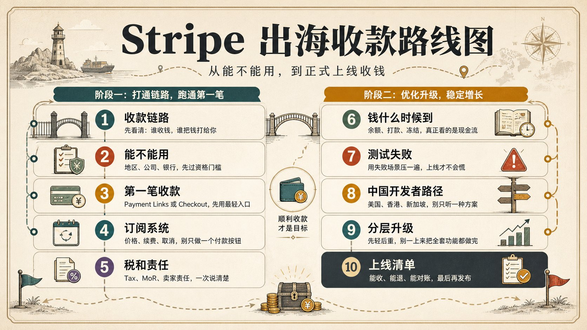
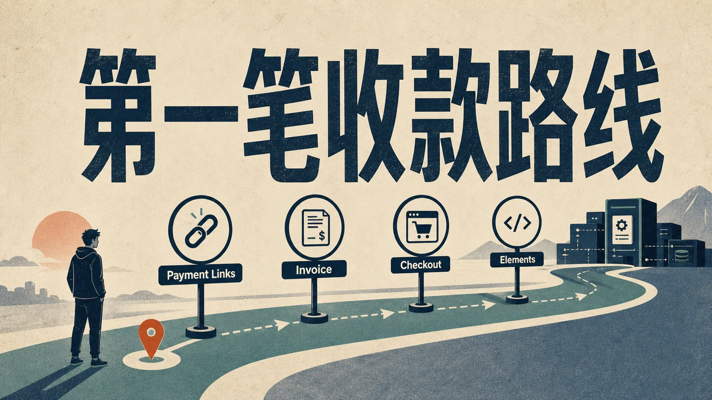
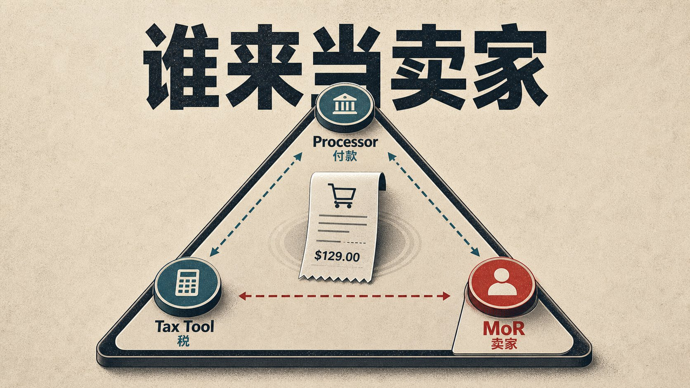
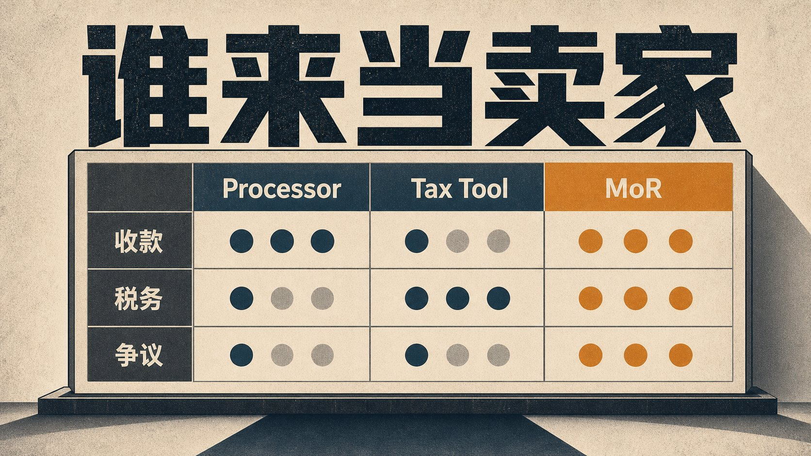
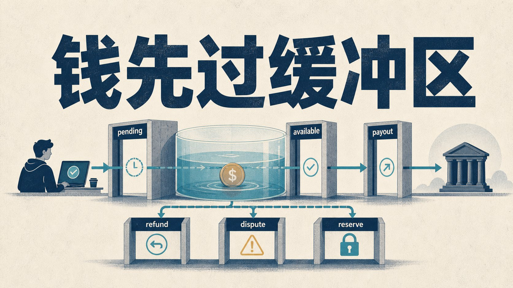
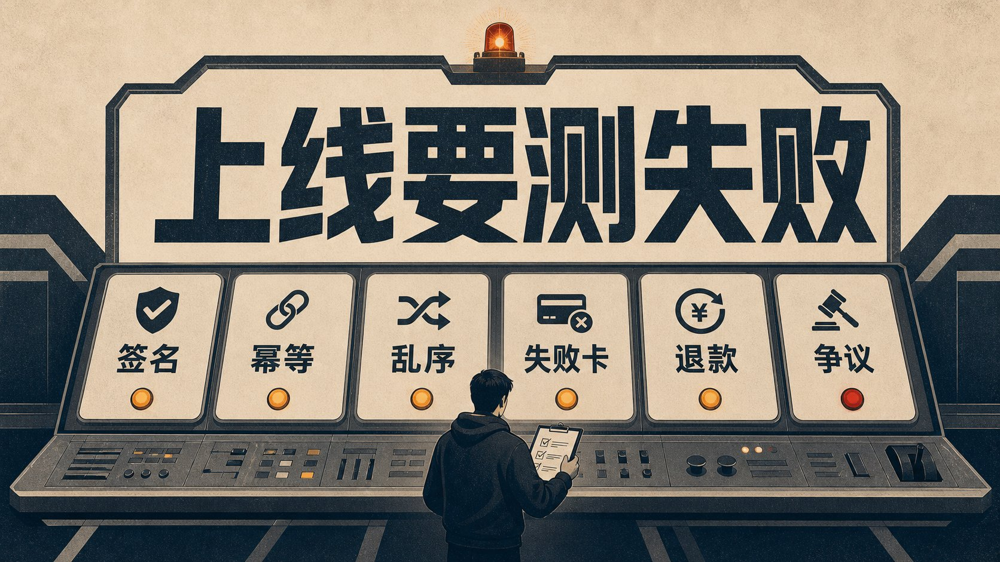

# Stripe 全网最全使用指南：从入门到榨干

想做出海产品赚美元，第一个卡点就冒出来：Stripe 到底怎么用？能不能直接注册？个人还是公司？美国、香港、新加坡怎么选？Payment Links、Checkout、Billing 先用哪个？钱进了 Stripe，什么时候到银行？退款、争议、税，最后算谁的？

这篇就从这个卡点开始，先把 Stripe 当成一张出海收款路线图：判断你能不能用，选择最轻的收款入口，再处理订阅、到账、税务、Webhook 和上线前的失败测试。

读完后，你能判断自己现在适合 Payment Links、Checkout、Billing、Tax、MoR，还是先别急着接；也能知道哪些问题要上线前补，哪些功能可以等产品真的跑起来再碰。

## 目录（历史榨干系列在文章尾部）



## 一、先搞懂 Stripe：它处理的是一整条收款链路

如果只看表面，Stripe 很像一个让用户刷卡的工具。你创建商品，生成付款页，客户输入卡号，钱进账户。但上线后你会很快发现，付款只是第一秒发生的事，后面还有更麻烦的一串问题：客户付款成功后要不要自动开通权限，客户下个月续费失败要不要自动重试，客户说没收到服务并申请 chargeback 时谁来提交证据，客户来自德国、英国、澳洲、美国不同州时税怎么处理，你收的是美元但银行账户是港币或新币路径时汇兑和结算怎么发生，你卖的东西被判定为限制行业时已经收的钱怎么办。

这些问题都不属于“支付按钮”本身，但它们都属于收款系统。

Stripe 的强项，是它把这些模块拆成一组产品：先收一笔钱，可以用 Payment Links 或 Invoice；有网站或 SaaS，可以用 Checkout；需要完全控制付款 UI，可以用 Elements 和 PaymentIntents；做订阅，要看 Billing、Customer Portal、Smart Retries 和订阅 Webhook；做平台或市场，要看 Connect；卖数字产品到全球，要理解 Stripe Tax、Managed Payments 和 Merchant of Record 的差别；有线下门店、快闪、POS 或线下服务，才轮到 Terminal。

这也是新手最容易误解 Stripe 的地方。

你以为自己在选择一个收款工具，其实你在选择一套商业责任的分配方式。

普通独立开发者最好的入门顺序，是先回答四个问题，再去读 API 文档：

```
| 问题 | 为什么重要 |
| --- | --- |
| 我是谁 | 个人、公司、平台、市场，责任完全不同 |
| 我在哪 | Stripe 支持的账户国家/地区有限，business origin country 很关键 |
| 我卖什么 | 限制行业、数字产品、订阅、平台分账，规则不同 |
| 我想省什么 | 省代码、省税务运维、省争议处理、省平台分账，选的产品不同 |
```

你把这四个问题写清楚，再去看 Stripe，很多功能会突然归位。

Payment Links 适合验证期，不能简单看成“低级版 Stripe”。Checkout 是大多数产品的合理默认，不等于偷懒。Billing 管续费、失败扣款、客户自助管理和账单生命周期，范围远大于订阅按钮。Connect 处理平台责任、KYC、payout 和税务报告，不只是把钱转给别人。Managed Payments 属于 Merchant of Record 模式的一部分，也不能当成更贵的 Checkout。

你越早把这些分清楚，后面越少重构。

## 二、先判断你能不能用 Stripe


图注：用 Stripe 前先过四道门：地区是否支持、业务是否合规、信息是否一致、客户能不能认出你。

中文开发者最常见的真实问题，很少是 “How to integrate Stripe” 这么干净的一句。

```
境外收款有没有人能讲明白？
Stripe 需要先注册企业账号吗？
美国、香港、新加坡怎么选？
维护一个美国公司一年费用大概多少？
个人的话是不是只能走第三方？
```

这类问题说明，Stripe 的第一道门不在代码里，而在账户资格、主体和业务模型里。

先看地区。

Stripe 官方 global availability 页面列的是支持开户的国家/地区。常见可见地区包括美国、英国、香港、新加坡、日本、马来西亚、泰国、阿联酋等。公开列表里没有中国大陆作为直接开户地区。

这句话很关键。

它不等于“中国用户不能收海外的钱”。它的意思是：你要看自己的合法商家主体在哪里。Stripe 账户绑定的是某个支持地区的 business origin country。官方文档也说明，live account 激活后不能修改 business origin country；如果主业务所在地要换到另一个支持国家/地区，需要创建新账户。

所以，不要先问“我人在中国能不能用 Stripe”。

更准确的问法是：

我有没有 Stripe 支持地区的合法主体？

这个主体的实际经营信息、受益人、地址、银行账户和业务描述能不能经得起 KYC？

我卖的产品或服务能不能被 Stripe 支持？

接着看业务类型。

Stripe 的 prohibited and restricted businesses 列表很长，覆盖非法产品、成人服务、赌博、部分金融服务、部分旅行服务、欺骗性营销、部分内容平台、众筹、dating、crypto、telemedicine、stored value、third-party agents 等。AI 生成的成人内容也会落入成人内容相关限制。

新手最危险的想法是：先收起来再说，出问题再解释。

支付平台和普通工具网站不同。你一旦开始收真实付款，后面牵涉客户、银行、卡组织、监管、退款、争议和潜在欺诈。你的业务如果本来就靠近高风险类别，Stripe 可能并不合适。

再看身份信息。

官方文档明确提到，Stripe 有 KYC 义务，会收集并维护用户和业务信息，以防金融系统被滥用。你要提供业务、产品、你与业务的关系等信息。随着你使用更多 Stripe 服务，Stripe 可能继续要求你补充或验证更多资料。

这也是为什么不要碰借壳、买号、虚假地址、虚假业务描述。

这里要把红线说清楚：不能教规避风控，不能教账号交易，不能教假主体。短期看，这类路径像捷径；长期看，它把账户风险、资金风险和法律风险叠在一起。

最后看客户能不能认出你。

Stripe 账户设置里有 public business information：业务名称、网站 URL、客服邮箱、客服电话、地址、support site URL、statement descriptor。Stripe 文档提醒，如果客户在卡账单上认不出这笔付款，可能会发起 dispute。

很多小团队不重视这个。

有个产品叫 TinyAIKit，账单上显示一个陌生公司名；用户回忆不起自己买过什么，一键 dispute。你觉得是客户不讲理，支付系统看的是争议。

所以，能不能用 Stripe，不只看能不能注册成功。至少要过四道自查：

1. 支持地区：你的合法主体是否在 Stripe 支持地区。
2. 业务类型：你的产品是否触碰 prohibited / restricted businesses。
3. 信息一致：主体、受益人、地址、网站、业务描述、银行账户是否真实一致。
4. 客户可识别：账单描述符、客服邮箱、退款政策、网站信息是否让客户认得出你。

过不了这四道，先别写代码。

## 三、第一笔收款怎么搭：Payment Links、Invoice、Checkout 怎么选



图注：Payment Links 是免代码收款链接；Invoice 是给特定客户发账单；Checkout 是接进网站的托管付款页；Elements 是高度自定义支付组件。

新手做 Stripe，经常一上来就想接 API。

第一笔收款的路径可以很轻。

你不需要一开始做账户系统、订阅系统、后台管理、Webhook 队列和复杂权限。很多产品在验证期，只需要证明一件事：用户愿不愿意为这个东西付钱。

这时先看 Payment Links。

Payment Links 是 Stripe 的 no-code 收款入口。你可以创建一个 Stripe-hosted payment page，把链接发给客户，或者生成二维码，或者嵌到网站按钮里。官方文档里它支持卖产品、订阅或接受 donation，有自动收据、有限品牌定制、动态显示多种付款方式。

它最适合几种场景：

- 你在 X、Discord、Reddit、邮件列表里预售一个数字产品。
- 你卖一个固定价格模板、资料包、课程、咨询名额。
- 你还没有完整网站，但想验证海外用户付费意愿。
- 你不想为了第一笔钱就搭一套后端。

Payment Links 的缺点也明显。

它的页面和流程由 Stripe 托管，定制有限。你可以改 logo、颜色、字体、圆角之类，但不能把它变成完全自定义的购买体验。如果你的产品需要复杂购物车、账号绑定、权限开通、库存、发货或多步骤 onboarding，Payment Links 很快会不够。

Invoice 适合另一类收款。

官方对比里，Invoice 更适合向特定个人或企业收一笔或 recurring payment。比如你给一个客户做设计、开发、咨询、企业服务，要发账单、设置付款期限、自动催收、发送 PDF 或 invoice link。

Payment Links 是“任何拿到链接的人都能买”。

Invoice 是“我向这个客户收这笔钱”。

如果你是自由职业者、顾问、小工作室，Invoice 往往比 Payment Links 更像正式商业沟通；如果你卖标准化产品，Payment Links 更像轻量购买入口。

再往上是 Checkout。

Checkout 是大多数独立产品的合理默认。它比 Payment Links 更适合接进你自己的网站和产品流程，但又比完全自定义 Elements 轻很多。

Stripe Checkout 有几种形态：Stripe-hosted full page、embedded form、Elements。官方对比里，full page 复杂度低，内置 Billing、Tax、Adaptive Pricing、Managed Payments、Link、dynamic payment methods 等能力；Elements 自由度更高，但维护成本也更高。

普通开发者容易有一种技术自尊：我会写代码，所以我应该直接上 Elements。

不一定。

支付页面和普通 UI 不一样。它牵涉卡号输入、3D Secure、错误提示、各地支付方式、税、优惠券、账单地址、收据、订阅、风控和移动端体验。你自己控制越多，需要承担的边界也越多。

一个更稳的选择顺序是：

```
| 阶段 | 优先选择 | 原因 |
| --- | --- | --- |
| 验证有人愿意付钱 | Payment Links | 最快，no-code，适合小规模测试 |
| 服务单个客户或企业 | Invoice | 更像正式账单，可发给特定客户 |
| 正式网站售卖 | Checkout | 低维护，能接产品流程 |
| 强定制支付体验 | Elements / PaymentIntents | 适合有工程能力和明确需求的团队 |
```

这里有一个边界：Payment Links 和 Checkout 只能解决“收钱入口”，不会自动解决你产品内部的履约逻辑。用户付款后怎么开通账号，怎么把订单和用户关联，怎么处理付款成功但跳转失败，怎么处理 later succeeded、refund、dispute，这些问题会把你带到 Webhook。

最小收款路径不止生成一个链接。至少要包括：用户看到清楚的购买说明，能完成付款，你能确认付款状态，用户能收到收据，你能交付产品或服务，用户也知道怎么退款、怎么联系你、账单上是谁。

做到这一步，才叫能开始收款。

## 四、从一次性付款到 SaaS 订阅：Billing 才是长期收入系统

Stripe 最容易被低估的产品之一是 Billing。很多人以为订阅就是每月自动扣款，实际上 SaaS 订阅没有这么简单：你要处理试用期、月付、年付、优惠券、折扣、升级、降级、客户换卡、扣款失败、客户取消、发票、收据、税、企业客户付款方式，还要处理用户那句最伤客服时间的话：“我已经取消了，为什么还扣款？”

这些都属于 Billing。

Stripe 官方把 Billing 描述为管理 subscriptions、invoicing、custom pricing plans、billing periods、trials、renewals 的系统。它还包括 Customer Portal、Smart Retries、reminder emails、subscription webhooks 等能力。

一个小团队如果自己做订阅系统，很容易低估三个细节。

第一个是失败扣款。

客户卡过期、余额不足、银行拒绝、3DS 没完成，都可能导致扣款失败。你不能简单地把用户立刻关掉，因为很多失败是可恢复的。Billing 的 Smart Retries 和 reminder emails，就是帮你在合适时间重试并提醒客户更新付款方式。

第二个是客户自助管理。

如果你没有 Customer Portal，客户想改卡、下载发票、取消订阅、换套餐，都要发邮件找你。早期你可能觉得没关系，十几个客户手动处理就行。但订阅用户一多，客服成本会吞掉很多利润。

第三个是状态同步。

订阅生命周期远比 active 和 canceled 多。会有 trialing、past_due、unpaid、incomplete、paused、active、canceled 等状态。你的产品权限要跟这些状态同步，不能只看第一次付款成功。

这就是为什么 Billing 和 Webhook 经常绑在一起。

如果你做 SaaS，至少要认真处理这些事件：

- checkout.session.completed：用户完成 Checkout。
- invoice.paid：订阅账单付款成功。
- invoice.payment_failed：付款失败。
- customer.subscription.updated：订阅状态、套餐、周期变化。
- customer.subscription.deleted：订阅结束。
- charge.dispute.created：出现争议。

不要把 success_url 当成唯一依据。

用户付款后浏览器可能关闭，网络可能断，跳转可能失败。你的系统如果只靠跳转页面开通权限，会漏单，也会给客服制造麻烦。Webhook 才是后端确认状态的主要路径。

Billing 还有费用。

截至本次研究，Stripe Billing 美国价格页显示 pay-as-you-go 是 Billing volume 的 0.7%，月付计划从 620 美元/月起，具体随量级变化。它还会和 Payments 费用叠加。订阅系统有自己的成本，换来的是工程、客服、续费和账单运维上的省心。

这笔钱值不值，要看你的业务阶段。

如果你只是卖几个一次性模板，Billing 可能太重。

如果你做月费 SaaS，尤其是海外客户、企业客户、多个价格层、试用期、优惠券、客户自助取消，Billing 的价值会快速体现。

订阅业务要算的不只是每笔手续费，还要看用户付费失败后能不能恢复，客户能不能自助处理账单，你能不能准确开通和关闭权限，财务记录能不能长期对上。

这些问题解决不了，订阅收入看起来漂亮，后台会慢慢变成泥潭。

## 五、全球销售的难处：税和商家责任



图注：Processor 是支付处理商，Tax Tool 是税务工具，MoR 是 Merchant of Record，也就是交易里的法定卖家。

很多独立开发者第一次出海，会把最大难点想成“怎么让海外用户付款”。

等真的有人付钱，第二个问题会立刻冒出来：

who is liable for taxes?

卖数字产品、软件、SaaS、会员、下载内容，可能触发不同国家和地区的 VAT、GST、sales tax 等间接税义务。这里最容易混淆三个概念：Payment Processor、Tax Tool、Merchant of Record。

Stripe 传统意义上是 payment processor。

它帮你处理付款，但你通常仍然是卖家。你要对自己的产品、客户、退款、税务、合规负责。

Stripe Tax 是税务工具。

它可以帮助你自动计算税、管理税号/注册、监控阈值、给产品分类、生成报告。它能显著减少人工计算和报表压力，但它本身不等于 Stripe 变成了你的 legal seller。

Merchant of Record，简称 MoR，是另一种责任关系。

MoR 会作为交易中的法定卖家，通常承担更多税务收取、申报、争议、退款、发票和客户支持责任。Paddle、FastSpring、Lemon Squeezy 这类工具被独立开发者反复拿来和 Stripe 比较，核心就在这里。Stripe 自己也推出了 Managed Payments，官方把它描述为 merchant of record solution，面向 SaaS、software、digital content/downloads 等数字产品，处理 indirect tax、fraud、disputes 和 transaction-level customer support。

这三者不能混成一句“帮我收款”。

```
| 模式 | 谁更像卖家 | 适合谁 | 代价 |
| --- | --- | --- | --- |
| Stripe Payments / Checkout | 你 | 想掌控交易、品牌、价格、客户关系的商家 | 税务、争议、客服更多自己承担 |
| Stripe Tax | 你 | 已经用 Stripe，但需要税务计算和报告工具 | 仍要理解注册、申报和责任边界 |
| Managed Payments / 其他 MoR | MoR 服务商 | 想把税务、争议和部分客户支持外包的数字产品 | 费用更高，产品类别和控制权更受限 |
```



图注：这张图只看责任差异：Stripe Payments / Checkout 帮你处理收款，Stripe Tax 帮你算税，MoR 更接近“替你当卖家”的角色。

截至本次研究，Stripe pricing page 显示 Managed Payments 是 3.5% per successful Managed Payments transaction，并且是 in addition to Payments fees。这个价格主要买责任转移和全球销售运维能力。

所以选择 Tax 还是 MoR，费率只能算一部分。

看你的交易模型。

如果你一年只卖几百美元的数字产品，最重要的是低成本验证，可能先用更轻的方式测试。

如果你开始卖到多个国家，客户要求正规 invoice，退款和税务问题越来越多，就不能继续靠“等有人问再说”。

如果你是个人开发者，没有税务、会计和客服能力，MoR 的高费率可能反而买来睡眠。

如果你是公司，有财务、税务顾问和明确全球市场，直接用 Stripe + Stripe Tax 可能更有控制权。

这也是为什么社区里经常出现“Stripe vs Paddle”的争论。

它们解决的问题不完全相同。

Stripe 更像你自己搭收款基础设施。

MoR 更像你把一部分卖家责任交给别人。

本文先不做最终替代品排名，因为 Paddle、FastSpring、Lemon Squeezy、Creem、PayPal 的官方规则和地区差异还需要单独补一轮。但你可以先记住一个判断句：

如果你只是在找“更好看的付款页”，Stripe 很强。

如果你害怕的是税务、发票、争议、退款和全球客户支持，就要比较谁承担商家责任，而不只是比较付款页。

## 六、钱什么时候到手：费用、汇兑、退款、争议和 reserve



图注：pending 是待结算余额，available 是可用余额，payout 是打到银行；refund、dispute、reserve 都会影响你真正能拿到的钱。

Stripe 最容易被误读的数字，是 2.9% + 30¢。

这是美国标准 pricing page 里 domestic cards 的常见基础费率。它很重要，但只是成本的一部分。

同一笔交易，还可能叠加：

- manually entered cards 额外费用。
- international cards 额外费用。
- currency conversion 费用。
- Billing 费用。
- Connect 费用。
- Tax 或 Managed Payments 费用。
- BNPL 等本地支付方式费用。
- dispute 费用。
- Terminal 硬件或线下支付成本。

所以不要问“Stripe 费率是多少”。

更好的问法是：我的客户在哪里，用什么支付方式，付款币种是什么，结算到哪个银行账户，我有没有订阅、分账、税务、MoR、线下收款和争议风险？

举个简单例子。

你是一家美国 Stripe 账户，卖 10 美元/月的 SaaS 给美国客户，用普通卡，可能主要看基础卡费和 Billing。

你是一家香港公司，卖给欧洲客户，客户用欧洲卡，你用美元标价，最后结算到本地银行账户，你就要看国际卡、汇兑、税务、payout 和客户账单识别。

你是平台，帮创作者收钱再分给创作者，你要看 Connect、connected accounts、payout、tax reporting 和平台风险。

同样是 10 美元收入，成本结构完全不同。

再看 payout。

Stripe 文档写得很清楚：初次 live 收款后，Stripe 通常会在成功收到第一笔付款后的 7-14 天安排初次 payout；具体会受行业风险和国家影响。后续按 payout schedule 走。

这里有一个常见误解：daily payout 不等于钱当天可用。

Payout schedule 只决定“可用余额何时打到银行”。Settlement timing 决定“pending balance 什么时候变 available”。你设置 daily payout，只是每天把已经可用的钱转出，不会让刚收的钱立刻变可用。

对现金流紧的小团队，这一点很要命。

你今天收了 5000 美元，不代表今天就能拿 5000 美元去付广告费、服务器费、供应商或外包。

再看退款。

Stripe 文档说明，退款使用你的 available Stripe balance。如果可用余额不足，card refund 可能 pending；部分支付方式可能直接失败。退款只能回到原支付方式，不能退到另一张卡或另一个银行账户。退款失败也可能发生，部分流程需要更久。

这意味着你要给退款留现金流。

不要把 Stripe balance 刚一到账就全部转走，也不要把所有收入立刻花掉。尤其是数字产品、预售、课程、SaaS、跨境服务，退款和争议可能滞后发生。

再看 dispute。

Dispute，也就是 chargeback，是持卡人通过发卡行质疑交易。官方文档写得很直接：正式争议会立即 reverse payment，从 Stripe balance 扣走付款金额和 one or more network dispute fees。Stripe pricing page 显示美国 dispute 是 15 美元 per dispute received；部分稀有争议反击可能产生额外网络费用。

这类扣款先发生，解释和举证在后面。

你可以提交证据，但你不一定赢。即使赢，也会占用时间、客服和现金流。

公开社区里经常能看到几个词：

```
account closed
funds held
reserve
payout paused
why is my payout delayed
```

这些帖子不能当作统计数据，因为单个商家往往不会公开完整业务类型、争议率、客户来源、履约证据和风险历史。但它们揭示了一个真实恐惧：钱进了 Stripe，不等于你随时能拿出来。

reserve 是支付行业里常见的风险管理工具。平台可能为了覆盖未来退款、争议、欺诈或负余额风险，要求保留一部分资金。对商家来说，这就是现金流压力。

你不能控制风控结果，但可以降低风险信号。

至少做好这些事：

- 产品页面写清楚你卖什么。
- 不要夸大收益，不要模糊价格，不要隐藏订阅条件。
- 账单描述符让客户认得出。
- 退款政策明确，且用户容易找到。
- 客服邮箱真实可用。
- 保存履约证据：下载记录、登录记录、邮件记录、发货记录、服务交付记录。
- 对高风险国家、异常大额订单、可疑重复购买保持警惕。
- 及时处理投诉，不要让客户直接找银行。

Stripe 会出问题，其他支付系统也会出问题。区别在于：你上线前有没有把问题当作业务成本的一部分。

## 七、上线前要测失败：Webhook、密钥、收据和账单描述符



图注：这里的重点不是“成功付款能成功”，而是签名验证、幂等、乱序、失败卡、退款和争议这些失败路径有没有提前演练。

很多 Stripe 教程只演示成功付款。

这会让新手产生一种错觉：本地跑通 demo，就可以上线。

上线前，要测试失败。

先说 Webhook。

Webhook 是 Stripe 把事件推给你服务器的机制。官方文档强调了几个容易被忽略的事实：事件是异步的，live mode 会最多重试三天，事件不保证按生成顺序送达，同一个事件可能送达多次，Webhook endpoint 在 live mode 需要公开 HTTPS。你还应该验证 Stripe-Signature，并使用 raw body；框架如果提前修改了 body，签名验证会失败。handler 应该快速返回 2xx，把复杂逻辑放进异步队列。

这几句话决定了你的架构。

不要在 Webhook 请求里同步做一堆慢操作：发邮件、生成 PDF、调用多个外部 API、写多个表、跑 AI 任务。Stripe 等你超时，事件会失败并重试。你应该先验证签名、记录事件、做幂等检查、入队，然后快速返回。

还要做幂等。

Stripe 可能重复投递事件。你不能因为收到两次 invoice.paid 就给用户开两次权益、发两份兑换码、重复记账。至少记录 event.id，或者用 event.type + data.object.id 作为业务幂等键。

还要处理乱序。

比如订阅可能产生 customer.subscription.created、invoice.created、invoice.paid、charge.created。它们不保证按你想象的顺序来。你的系统要能在收到某个事件时，主动向 Stripe API 查最新对象，不能只相信本地状态。

再说 API keys。

Stripe 现在的 key 体系里，有 publishable key、restricted API key、secret key、organization key。官方文档建议多数新场景使用 restricted API keys，因为 secret key 权限太大。Webhook signing secret 和 API key 不同，它是每个 Webhook endpoint 独立用于验证来源的 secret。

新手最常犯的错误，是把 sk_live_... 写进前端、GitHub、截图、聊天记录或环境文件。

上线前至少做到：

- 前端只放 publishable key。
- 后端用 restricted key，权限按功能最小化。
- key 放 secrets vault 或环境变量，不写进代码。
- live key 和 test key 分开。
- 给 live key 开 IP restrictions，如果架构支持。
- 团队成员离开时 rotate key。
- 不通过邮件、聊天软件、截图分享 key。
- 账户开启 2FA，优先 passkey 或硬件安全 key。

再说 test mode。

Test mode 的价值在于模拟失败、争议、退款、3DS、Radar、payout、Webhook 重试和银行账户失败。不要把它用成“成功付款可以成功”的演示。Stripe 官方 testing 文档里有大量测试卡和测试账号。你至少应该测：

- 成功卡付款。
- 卡被拒。
- 需要 3D Secure。
- 风险较高或被 Radar 拦截。
- 退款成功和 pending。
- dispute 创建。
- Webhook 重复投递。
- Webhook 乱序。
- 订阅付款失败。
- 订阅取消。

再说 receipt 和 descriptor。

Stripe 可以自动或手动发送收据。收据链接有过期机制。订阅和 invoice payment 的收据会包含 line items、discounts 和 taxes。客户收到收据时，应该能看懂自己买了什么。

账单描述符也很关键。

很多 dispute 起点很小：客户看到账单上出现一个不认识的名字，以为被盗刷。尤其是独立开发者，公司名、产品名、网站名、收据名、客服邮箱可能不一致。

上线前用一个外部视角检查：

客户付款页能看懂吗？

客户收到邮件能看懂吗？

银行卡账单能认出吗？

退款政策能找到吗？

客服邮箱能收到并回复吗？

最后说 restricted business 自查。

不要等上线后才发现自己业务不适合 Stripe。做内容平台、约会、成人相关、AI 成人内容、金融服务、crypto、抽奖、打赏、游戏币、预付储值、远程技术支持、课程承诺收益、流量/互动销售、转售政府服务、代收代付，都要提前查官方限制。

这是支付产品上线的基本卫生。

## 八、中国开发者怎么想路径：主体、Atlas、替代品和阶段选择

对中国大陆开发者来说，Stripe 这题很容易变成“注册教程”。

更该想清楚的是路径。

第一种路径，是你已经有 Stripe 支持地区的合法主体。

比如香港、新加坡、美国、英国等。那你要做的是按主体真实信息开户，准备网站、业务描述、银行账户、受益人信息、客服信息、退款政策和合规材料。

第二种路径，是用 Stripe Atlas 建美国公司。

Stripe Atlas 官方文档写明，它可以帮你在 Delaware 设立公司、获取 EIN、处理创始人股权、自动 file 83(b) election，并给第一年 registered agent。Atlas signup 文档写明费用是 500 美元，包含 incorporation、州费和第一年 registered agent；之后 registered agent 每年 100 美元。

这听起来很适合独立开发者。

但 Atlas 没有通行证效果。

官方也写得很清楚：Atlas 不提供法律、税务或会计建议，也不能保证你的业务被批准使用 Stripe Payments。设公司之后，你还有税务申报、Delaware franchise tax、registered agent、地址、银行、会计、合规、业务限制、Stripe 审核这些后续问题。

如果你的产品一年只赚几百美元，用 Atlas 可能会让维护成本超过收入。

如果你的产品已经验证付费，且目标客户主要在海外，Atlas 可能是认真出海的一条基础设施路径。

第三种路径，是先用 MoR 或其他收款工具验证。

社区里经常有人建议先看 Paddle、FastSpring、Lemon Squeezy、Creem、PayPal 等。它们的差异需要单独做官方规则对比，这一版不做最终排名。但选择逻辑可以先讲清楚。

如果你没有公司主体，不想处理税务和争议，卖的是标准数字产品，MoR 可能更适合早期。

如果你要完全控制客户关系、账单、定价、付款体验和长期金融基础设施，Stripe 更适合中长期。

如果你只是验证一个产品有没有人买，先用低成本入口，不要一开始就把公司、税务、账户和工程复杂度堆满。

这里可以用一个阶段表：

```
| 阶段 | 目标 | 更适合的思路 |
| --- | --- | --- |
| 想法验证 | 看有没有人付钱 | 轻量收款、预售、Payment Link / MoR / 简单 invoice |
| 小规模正式收费 | 稳定交付、处理退款和客服 | Checkout / Billing / 清晰退款政策 |
| 全球扩张 | 多地区客户、税务和发票压力 | Stripe Tax 或 MoR，找专业税务意见 |
| 平台化 | 多个卖家/创作者/服务商 | Connect，重新设计责任和资金流 |
| 成熟公司 | 成本优化、风控、数据、财务自动化 | 自定义费率、Radar、Sigma、Data Pipeline、专业支持 |
```

对中国开发者，最该避免两种极端。

一种是“我先随便找个号收起来”。

这会把真实身份、业务描述、银行账户、税务和资金风险全埋起来。

另一种是“我一开始就得搞完美国公司、税务、银行、Stripe、Billing、Tax、Connect”。

这会让你在产品还没被市场验证前，先背上复杂基础设施。

更稳的是先画交易模型。

我卖什么？

卖给谁？

是一次性付款还是订阅？

客单价多高？

客户在哪些国家？

是否需要发票？

退款概率高不高？

有没有高风险内容？

年收入预估能不能覆盖公司和税务成本？

有了这些答案，再选路径。

Stripe 很适合长期做全球生意的人。

但长期生意的第一步，是先把责任写清楚，再谈账号。

## 九、什么时候升级：Connect、Radar、Terminal 和 Stripe 的新边界

Stripe 的产品很多，新手容易被菜单吓到。

其实大多数独立开发者前期只需要 Payments、Payment Links、Checkout、Billing、Webhooks、Payouts 和基本安全设置。

其他产品要等业务模型需要时再上。

先说 Connect。

只要你开始替别人收钱、分账、给第三方 payout，就要认真看 Connect。

典型场景：

- 你做一个创作者平台，粉丝付款后创作者拿一部分。
- 你做 marketplace，买家付钱给多个卖家或服务商。
- 你做 SaaS 平台，让你的客户在自己的业务里收款。
- 你想从客户的交易里抽佣。

Connect 的复杂度在于：谁是商家，谁承担 refund，谁承担 chargeback，谁做 KYC，谁决定 payout timing，税务报告怎么处理，平台有没有风险敞口。

不要把 Connect 当成“自动转账 API”。

它是平台级产品。

官方 pricing 也能看出差异。Stripe handles pricing 时，平台让 Stripe 向 connected accounts 收处理费；You handle pricing 时，平台承担处理费并可自行向用户定价，价格页示例包括 monthly active account、per payout、tax reporting 等费用。

如果你只是一个普通 SaaS 卖自己的订阅，不需要 Connect。

再说 Radar。

Radar 是 Stripe 的风控产品，用 AI 和规则评估交易风险，可以做风险评级、拦截、review、3DS、lists、fraud analytics。它适合欺诈风险变成真实问题时使用。

但风控太严也会伤收入。

拦太松，欺诈和 dispute 上升。

拦太严，真实客户付款失败，收入损失。

别先问“有没有开 Radar”。先问：我的风险在哪里？可疑交易有什么特征？我能不能区分新客户、高风险国家、异常金额、重复购买、账单地址不匹配、CVC 失败、代理 IP、一次性邮箱？

再说 Terminal。

Terminal 面向线下收款。官方文档说它可以把 in-person payments 和 online payments 放进统一 Dashboard，也能和 Connect 平台集成。它适合线下门店、活动、POS、服务场景、线上线下一体化商家。

如果你只是卖 SaaS、模板、数字内容，不需要 Terminal。

最后看 Stripe 的新边界。

Stripe Sessions 2026 官方宣布了 288 个产品和功能，重点包括 Agentic Commerce、Link wallets for agents、streaming payments、Radar 防 token abuse、Treasury 扩展、digital asset accounts、Stripe Projects 等。

这说明 Stripe 正在从“在线支付”继续扩展成更大的 money stack：AI 应用怎么收费，agent 怎么付款，企业怎么管理多币种资金，稳定币和数字资产账户怎么进入金融基础设施。

但普通读者不要被这些新词带跑。

很多功能有地区、资格、preview、企业客户、使用场景限制。对独立开发者来说，先把基础收款、订阅、税务边界、Webhook、安全、退款、争议做好，比追逐每个新功能重要得多。

Stripe 的正确使用方式，往往是分层升级：先轻量收款，再正式 Checkout，再 Billing，再 Tax 或 MoR，再 Connect，最后才考虑 Radar、Terminal、Treasury、Data、Finance automation。

每升一级，问一句：这是在解决已经发生的业务问题，还是我只是被功能列表吸引？

## 附录：一页纸决策表、上线清单和术语表

## 1. Stripe 产品选择表

```
| 你要做什么 | 优先看什么 | 先别急着看什么 |
| --- | --- | --- |
| 先收第一笔海外付款 | Payment Links | Elements / Connect |
| 给单个客户发账单 | Invoice | 复杂自建后台 |
| 网站售卖产品 | Checkout | 完全自定义支付页 |
| 做 SaaS 订阅 | Billing + Customer Portal + Webhooks | 只靠一次性 Checkout |
| 完全控制支付 UI | Elements / PaymentIntents | no-code 入口 |
| 卖到多国并计算税 | Stripe Tax | 把 Tax 当成 MoR |
| 想让服务商承担更多税务和争议责任 | Managed Payments / 其他 MoR | 只比较 checkout UI |
| 给第三方卖家/创作者分账 | Connect | 普通 Transfers 思维 |
| 线下收款 | Terminal | 纯线上支付方案 |
| 欺诈和争议变多 | Radar / 3DS / 规则 / evidence | 只怪支付平台 |
```

## 2. 费用自查表

写 Stripe 成本时，2.9% + 30¢ 只是一行。成本表至少要列这些项：

```
| 成本项 | 什么时候出现 |
| --- | --- |
| 基础支付处理费 | 每笔成功付款 |
| 国际卡附加费 | 客户卡片来自其他国家/地区 |
| 汇兑费 | presentment currency 和 settlement currency 不同 |
| Billing 费 | 使用订阅、发票等 Billing volume |
| Tax 费 | 使用 Stripe Tax 相关功能 |
| Managed Payments 费 | 使用 Stripe MoR 方案，且叠加 Payments fees |
| Connect 费 | 平台/市场、active connected accounts、payout、tax reporting |
| Dispute 费 | 客户发起 chargeback |
| Refund 成本 | 原始处理费通常不退回，还会占用现金流 |
| 公司维护成本 | Atlas、registered agent、税务申报、会计、地址、银行 |
```

## 3. Go-live 清单

上线前至少检查：

- 账户国家/地区和业务主体真实一致。
- 业务不在 prohibited / restricted businesses 红线内，或已获得需要的批准。
- 网站有清楚的产品说明、价格、退款政策、隐私政策、服务条款。
- Public business information 完整：业务名、网站、客服邮箱、support URL、statement descriptor。
- 客户能在付款页、收据、账单上认出你。
- 已开启 2FA，优先 passkey 或硬件安全 key。
- 团队成员使用角色权限，不共用主账号。
- 前端只放 publishable key。
- 后端使用 restricted key 或最小权限 key。
- live key 不在代码、GitHub、截图、聊天记录里。
- Webhook endpoint 使用 HTTPS。
- Webhook 验证签名，使用 raw body。
- Webhook 做幂等、队列、重试观察、乱序处理。
- 成功、失败、3DS、refund、dispute、subscription cancel、payment failed 都测过。
- 有客服流程和争议证据保存流程。
- 现金流里预留 refund、dispute、reserve、payout delay 的缓冲。

## 4. Webhook 最小设计

一个稳一点的 Webhook 处理顺序：

1. 接收请求。
2. 保留 raw body。
3. 用 Stripe-Signature 和 endpoint secret 验证来源。
4. 解析事件。
5. 检查 event id 是否处理过。
6. 写入事件日志。
7. 把复杂业务丢进队列。
8. 快速返回 2xx。
9. worker 里按对象最新状态处理业务。
10. 对关键对象做幂等更新。

不要在 Webhook 请求里同步做所有事。

## 5. 争议证据清单

如果你卖数字产品或 SaaS，平时就要保存：

- 用户注册邮箱和登录记录。
- 付款时间、IP、设备、国家/地区。
- 下载记录、激活记录、使用记录。
- 服务交付邮件。
- 客户同意的价格、订阅周期、退款政策。
- 取消订阅记录。
- 客服沟通记录。
- 发票、收据、产品页面截图。
- 退款处理记录。

发生 dispute 时再补证据，通常已经晚了。

## 6. 常见术语

```
| 术语 | 人话解释 |
| --- | --- |
| Payment processor | 帮你处理付款的支付服务商 |
| Merchant of Record | 交易里的法定卖家，通常承担更多税务、争议和客户支持责任 |
| KYC | 了解你的客户/商家，支付机构对商家身份和业务做验证 |
| Payment Link | Stripe 托管的收款链接 |
| Checkout | Stripe 托管或嵌入式付款流程，适合接进网站 |
| Elements | 更可定制的支付 UI 组件 |
| PaymentIntent | Stripe 支付流程里的核心对象，表示一次付款意图及状态 |
| Billing | 订阅、发票、续费、失败扣款、客户自助管理系统 |
| Customer Portal | 客户自助管理订阅、付款方式和发票的页面 |
| Webhook | Stripe 把付款、订阅、争议等事件推给你服务器 |
| Payout | Stripe 把可用余额打到你的银行账户 |
| Settlement timing | 付款从 pending 变成 available 的时间 |
| Presentment currency | 客户看到并支付的币种 |
| Settlement currency | 资金结算到你账户的币种 |
| Dispute / chargeback | 持卡人向发卡行质疑交易，可能导致付款被撤回 |
| Reserve | 支付平台为覆盖未来风险而保留一部分资金 |
| Restricted API Key | 权限可限制的 API key，适合多数新集成 |
| Secret key | 高权限后端密钥，泄露后风险很大 |
| Webhook signing secret | 用来验证 Webhook 确实来自 Stripe 的 endpoint secret |
```

## 资料与边界

资料更新时间：2026-06-26。

本文为工具和公开规则整理，不构成法律、税务、会计、金融、投资或平台风控建议。涉及开户地区、公司主体、KYC、税务、收款、退款、争议、reserve、payout、限制行业和 API 安全的部分，请以 Stripe 官方文档、所在地法规和专业人士意见为准。

这里也不提供规避风控、账号买卖、虚假身份、借壳开户、隐瞒真实商家或绕过平台规则的做法。Stripe 和各地规则会变，正式上线前要重新核对最新文档。

## 来源简表

- Stripe Docs：Payments、Payment Links、Checkout、Billing、Connect、Webhooks、API Keys、Payouts、Currencies、Refunds、Receipts、Disputes、Radar、Tax、Managed Payments、Terminal、Atlas。
- Stripe Pricing：Payments、Billing、Connect、Managed Payments、Disputes、currency conversion。
- Stripe Legal / Support：Restricted Businesses、Atlas signup、account setup、security。
- Stripe Newsroom / Blog：Sessions 2026 announcements。
- 社区语料扫描：Reddit r/SaaS、Reddit r/stripe、Hacker News、V2EX、[Linux.do](http://linux.do/) 关于 Stripe、MoR、账户关闭、reserve、funds held、跨境收款和独立开发者路径的讨论。

我是诺鸭船长，带你在信息的海洋里寻找陆地～

历史榨干系列合集⬇️

[Conso 全网最全使用指南：从入门到榨干](https://x.com/noahduck283/status/2069934184626549090?s=20)

[Telegram 全网最全使用指南：从入门到榨干](https://x.com/noahduck283/status/2069570117445571061?s=20)

[去AI 去味全网最全指南：从识别到榨干](https://x.com/noahduck283/status/2069030402048893317?s=20)

[爬虫工具全网最全使用指南：从入门到榨干全网](https://x.com/noahduck283/status/2068173537005932865?s=20)

[PayPal 全网最全使用指南：从注册到榨干](https://x.com/noahduck283/status/2067798972744507755?s=20)

[giffgaff 全网最全使用指南：从入门到榨干](https://x.com/noahduck283/status/2063773625535385827?s=20)

[美国紫卡PayGo 全网最全使用指南：从入坑到榨干](https://x.com/noahduck283/status/2064147050816831758?s=20)

[Wise 全网最全使用指南：从开户到榨干](https://x.com/noahduck283/status/2064860443454423341?s=20)

[Gmail 全网最全使用指南：从注册到榨干](https://x.com/noahduck283/status/2065224312039330181?s=20)

[苹果全网最全指南，从入门到榨干：选机篇](https://x.com/noahduck283/status/2065958220838093046?s=20)

[苹果全网最全指南，从入门到榨干：Apple ID 篇](https://x.com/noahduck283/status/2066310784372895813?s=20)

[苹果全网最全指南，从入门到榨干：黑科技篇](https://x.com/noahduck283/status/2067034529404207344?s=20)