# 无需公司！手把手教你注册 Stripe 个人账户，轻松搞定全球收款

出海过程中遇到的最大的门槛就是怎么收钱，毕竟每个国家税收制度都不一样，作为独立开发者去钻研会浪费很多精力，这个时候就需要我们的 Stripe 来帮助我们处理这些琐碎的事情了。

Stripe 是目前全球最成熟的线上收款方案之一。对于没有公司账户的人来说，实际上也是有途径可通过 Stripe 来实现全球收款的。

通过注册 Stripe 香港个人账户，我们可以利用已有的香港银行卡实现合规结汇。这个也是目前最简单直接，并且损耗较低的方案。

本文将手把手带你走完从账号注册、KYC 验证到优化汇损的全过程。

在开始之前，我们需要确保已准备好了以下资料：

- 身份证明：我自己使用的护照，港澳通行证理论上也可以。
- 收款账户：自己个人名下的香港银行账户（如中银香港、汇丰、众安银行等）。
- 业务载体：你自己的出海网站、或者X主页。我自己是用的X主页，顺便也能收马斯克的工资。
- 安全工具：手机端已安装 Google Authenticator 或者其他的 2FA 工具都可以。

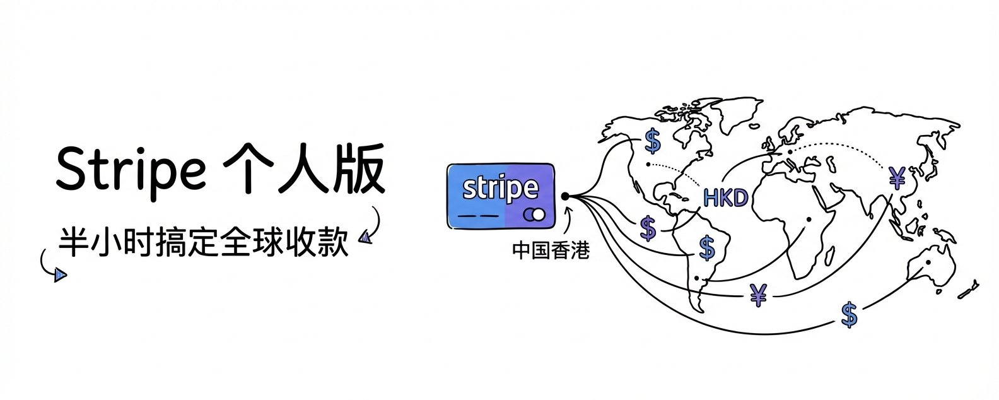

# 一、注册

访问 Stripe 官网开始注册。这是最关键的一步： 账户地区必须选择 中国香港特别行政区。因为我们是使用港卡作为提现账户，所以必须要选择香港。Stripe 的规则是“同区结算”，即香港账号只能结算至香港本地银行

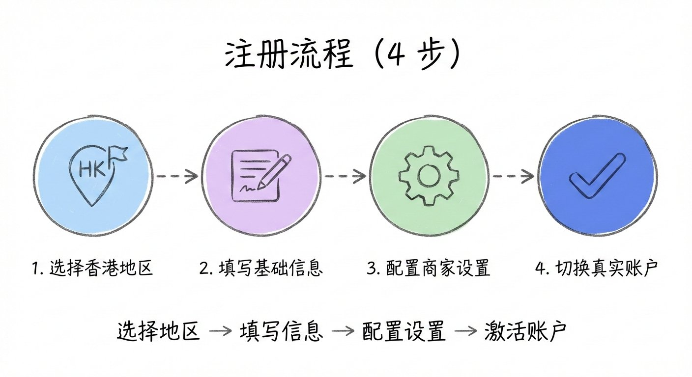

同时，需要确保填写的姓名、银行卡持有人姓名、证件姓名三者拼写完全一致，要不然后续 KYC 认证不通过的话，会很麻烦。

## 1.1 基础设置

在初始配置中，可以看到“商家设置”和“使用方式”选择，如果是为了快速搭建收款链路，这些步骤可以先点击“跳过”或默认选择。

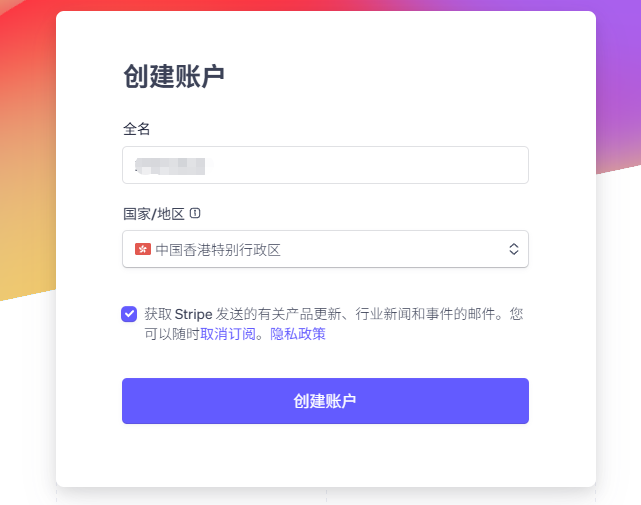

使用方式选择

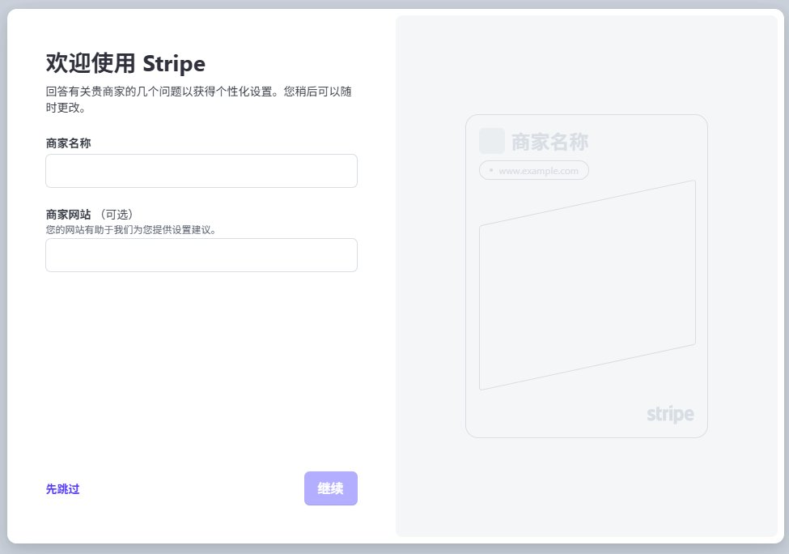

点击继续

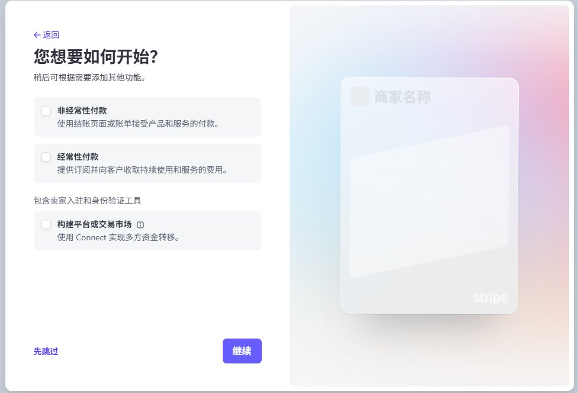

随后点击前往管理平台，系统会默认进入沙盒页面。

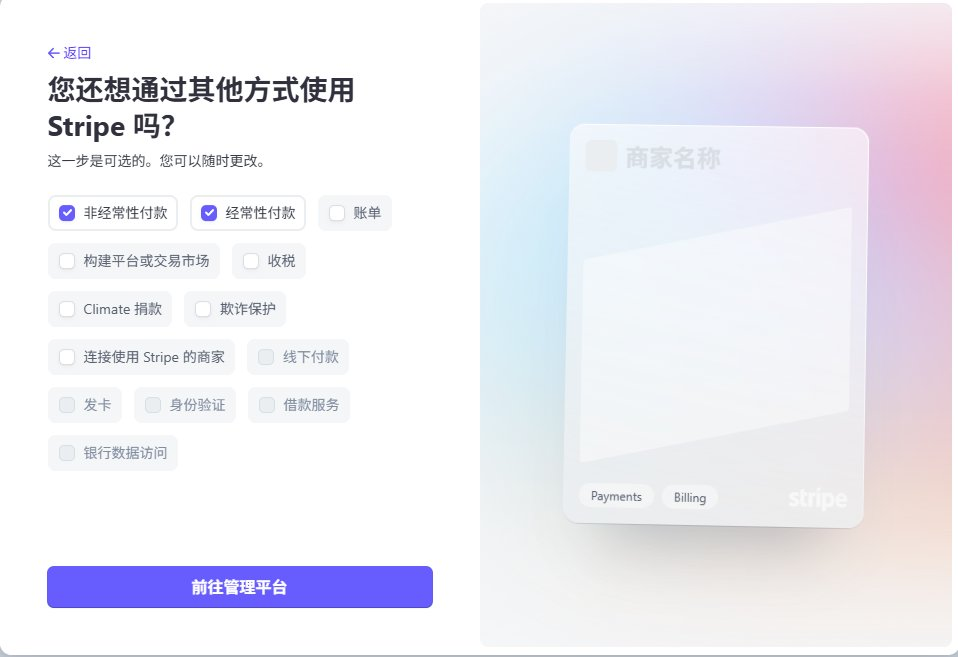

这个时候账号还没有激活，需要点击顶部的 “切换到真实账户” 正式开始激活流程。

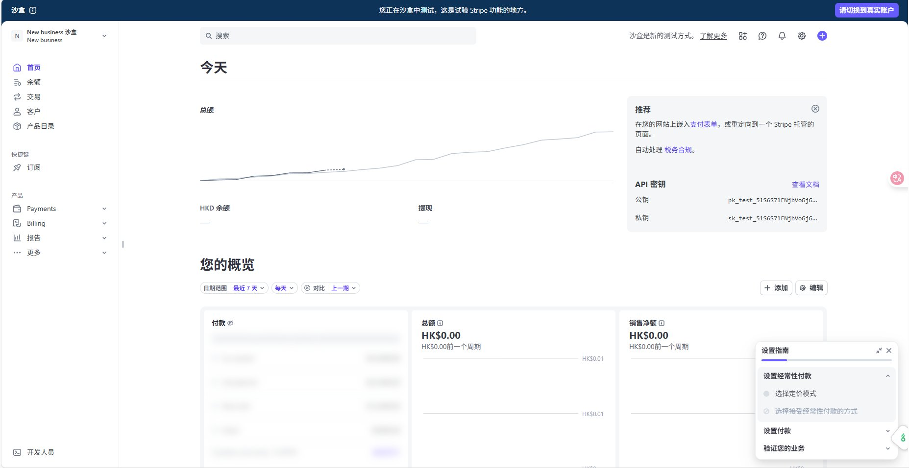

## 2.1 验证业务信

Stripe 对个人账户非常友好，但在填写时需保持信息真实有效：

商家类型选择Individual

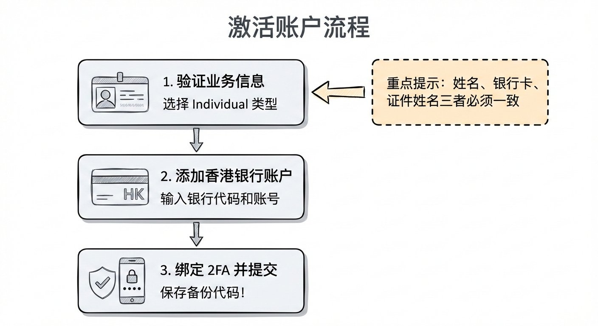

个人详情如实填写，注意香港身份证号填写护照号即可

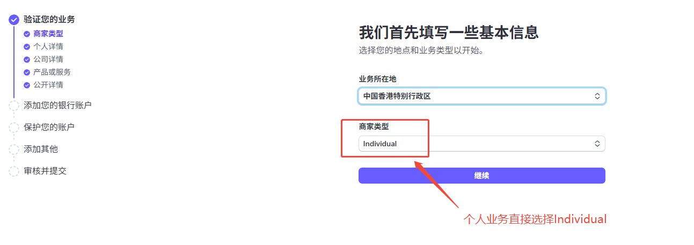

公司详情可以填写自己的网站地址，我自己是填写了自己的 X 的地址。

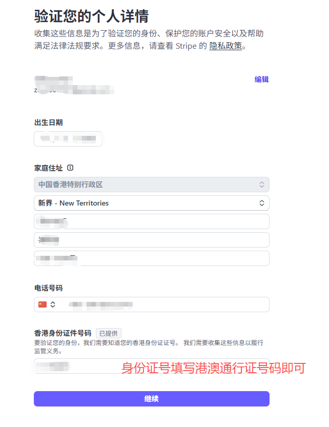

产品或服务如实填写即可，需要和自己网站是一致的。同时要注意单个业务最好是使用单个账号，以防某个业务被风控，导致其他的业务收款受到影响。

我们还需要添加公开详情，这个是作为账单和收据上需要展示的信息

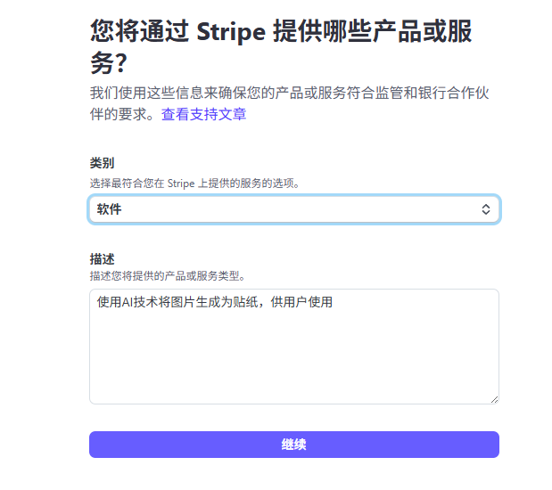

## 2.2 添加银行账户

需要输入你的香港银行代码、分支代码及账号。确保账户状态正常，能接收小额转账校验。

Stripe 涉及资金结算，安全等级极高。推荐使用 Google Authenticator 进行绑定。

绑定后，系统会生成一组备份代码。最好截图存留+物理抄写保留一下。一旦丢失密码又不记得备份代码，再想找回账号就比较麻烦了。

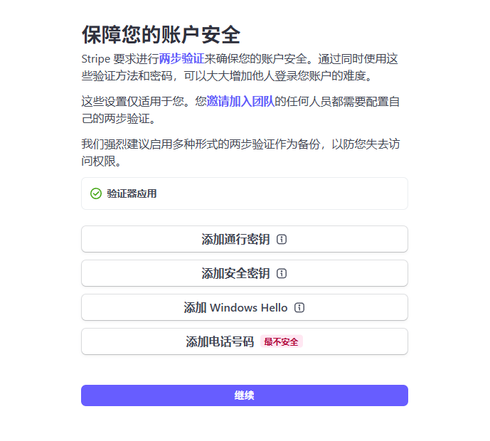

## 2.3 审核信息并提交

最后检查一遍填写的信息，核对无误以后直接提交即可。

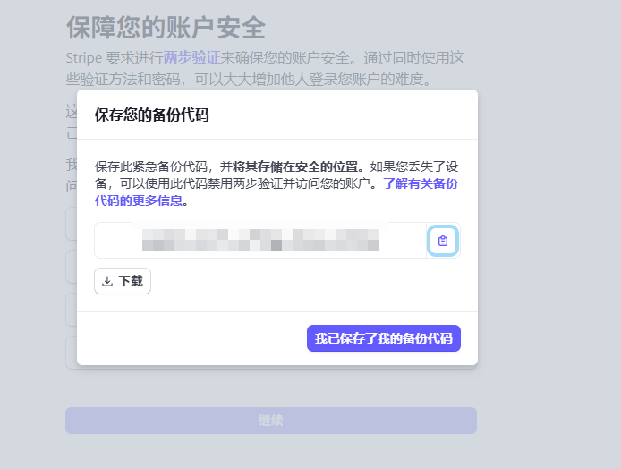

完成基础信息填写后，Stripe 会提示你进行 Identity Verification。按照系统提示，使用手机拍摄自己的护照上传即可。

提交后，审核通常在几小时到 1 个工作日内完成。

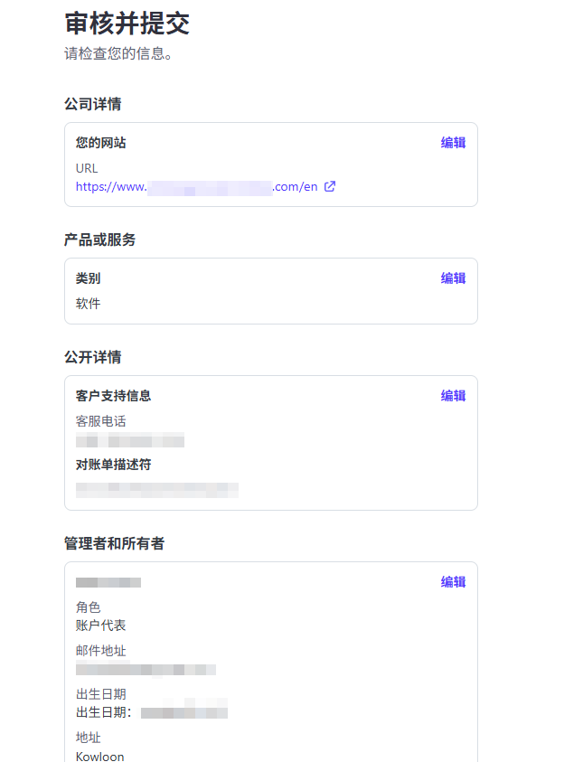

通过后，账户将正式具备收款权限，可以开始全球收款啦！

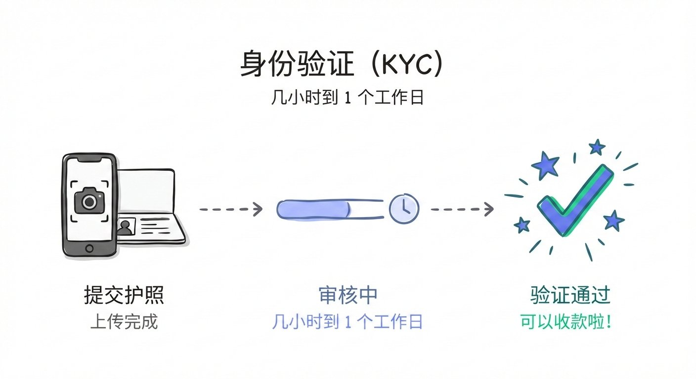

用个人的港卡做的KYC，所以说 Stripe 默认会有一个港币账户。

如果我们的业务平时收的是美元的话，它会从美元转换成港币，这个中间会有一个2%的换汇的损失，所以我们需要把默认的货币设置为美元。

在 商家 - 银行账户与货币 - 结算货币和银行账户 中新加自己的美元账户就可以了，同时还要将其设置为默认货币

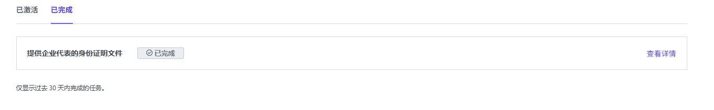

虽然美元提现通常会有约 1% 的提现费用，但相比 2% 的换汇损失，依然能节省近一半的中间手续费。

Stripe 的个人账户，给我们这种逍遥小成本试错的出海者提供了一个很方便的途径。比起动辄几千元的公司注册费用，可以说是非常划算了。

虽然注册过程在身份验证和银行绑定上存在一定门槛，但其极高的自动化程度和强大的 API 支持，能为你省下大量处理财务杂务的时间。让我们能更专注的把注意力放在业务本身上。

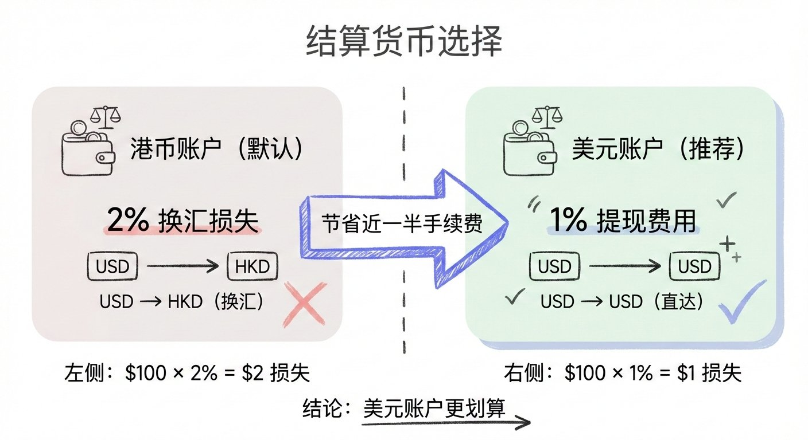

##