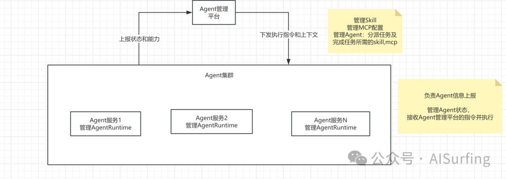

# 技术方案总挨批？五步法拆透企业Agent平台

> 技术方案的本质，就是把一个模糊问题变清晰。结构对了，评审才扛得住；结构不对，写再多也是白写。

## 一、写方案前，先把"问题"钉死

### 第一步：需求介绍——不是抄 PRD，是讲清现状痛点

需求介绍只干一件事：**把现状写痛**。以企业 Agent 管理平台为例：

- **散装 Agent 各自搭建**，缺统一底座，重复造轮子
- **Agent 自主能力放大后，权限和审计不可控**——Agent 能自己调工具了，谁批准的？出事了查得回来吗？
- **多模型多框架碎片化**，接入成本高
- **Agent 是长生命周期、有状态的运行时**，运维难规模化——起一个实例容易，养一千个带上下文的实例是另一个故事

用大白话把现状说难受，别整工业级黑话。

### 第二步：需求分析——5W1H 拉齐干系人，8C 锁约束

先用 5W1H 对齐人和流程：谁提的、谁买单、谁评审、什么时候要、核心流程是什么。

Agent 平台核心链路：用户提交任务 → 平台调度 Agent 实例 → Agent 调工具/MCP 执行 → 治理层鉴权审计 → 返回结果。

然后是 **8C**——八个约束：性能、安全、合规、成本、技术栈、兼容性、可维护性、上线时间。

每个约束标**硬/软**。安全（工具级细鉴权）和合规（审计可复现留痕）是硬约束，成本和技术栈可以谈。硬约束决定生死，软约束决定评分。

权重排序直接变成打分表：安全 0.25、合规 0.20、性能 0.15、成本 0.10、兼容性 0.10、技术栈 0.10、可维护性 0.05、上线时间 0.05。

## 二、别急着定选型，先算复杂度、再列备选

### 第三步：复杂度分析——用数据推导，不许拍脑袋

这步是把"我觉得"变成"数据显示"。AgentScope-Java 压测数据：C100 高并发下吞吐 47.7tps，是基线 4 倍；50 并发下 Java 和 Python 基本持平，瓶颈在 vLLM/GPU 推理引擎不在框架。

关键复杂度排序：
1. **治理**（权限、审计、可复现）——必须 v1 就位，生死线
2. **工具调用 QPS 和 MCP 接入**——核心路径硬指标
3. **上下文与记忆管理**——最难，也最容易被低估
4. 可扩展性——高估了，非关键复杂度

二十条不排序的复杂度，等于没分析。

### 第四步：备选方案——至少给三个，别逼评审做单选题

只给一个方案的技术方案，不叫方案，叫 PPT。

- **A 方案：自研内核**——可控，但维护成本高，大概率重复造轮子
- **B 方案：基于 LangGraph**——生态成熟，图编排灵活，但高并发场景受限
- **C 方案：AgentScope-Java 内核 + 自研平台壳**——高并发有压测背书，Skill/MCP/SubAgent/切模型原生支持，自研集中在业务 Agent、治理、模型网关和平台壳这些护城河上
- **D 方案：多框架抽象层**——听着香，过度设计风险不小

## 三、打分表一摆，谁也别吵

### 第五步：360 度环评——八维加权打分

把四个方案按第二步的权重逐项打分。结论不是拍出来的，是权重乘出来的。C 方案最高。

就算评审对某个分值有意见，争的也只是"某个维度打了几分"，而不是"你凭什么这么选"。吵的是细节，框架已经没人质疑了——这就是结构的力量。

> 技术方案不是写出来的，是推导出来的。

