# 手机、电脑无缝衔接跑任务，这才是Vibecoding的完全体

最近GPT-6 Astra重磅更新，加上Codex又多了两次额度重置，我又进入了Vibecoding上头期。

模型更强了，我交给它的任务也越来越复杂，也经常是几个任务会话同时进行，一个做网页，一个改工具，还有一个在后台跑测试。

放在之前，虽然是AI在干活，但我依然很难离开电脑。因为不知道任务什么时候完成，又会在什么时候突然停下来等你确认。

但这几天Vibecoding的小东西更多了，我在电脑前的时间反而少了。

现在我可以直接在手机打开UU远程，随时看到多个对话的任务，还能在手机让GPT修改。

远程控制工具我用的也不少，都没能让我长期用下来，大多是把电脑桌面搬到手机上。查看文件没什么问题，但用手机缩放桌面，寻找终端，再输入一大段需求，体验多少还是有点狼狈。

UU远程是我用完想一直用，想立刻推荐给身边朋友的远程工具，比较好的体验主要有这几点：

第一个是真稳定。

我用手机操控电脑，长时间连接也没有遇到掉线。连接简单，操作顺畅，手机上的反馈也很及时。

第二个是真全面。

除了用手机远程查看和操作电脑，它还针对Vibecoding用户优化了终端功能。

你可以同时创建多个终端会话，每个会话运行一个Agent或者任务，再在手机的同一个页面里统一管理。哪个任务做到哪里了，是否需要确认，有了新想法要不要调整，都可以随时查看和处理。

还有一点很实在的，UU远程是真免费。

免费但是远程画质和性能完全不缩水，很清爽没有乱七八糟的广告弹窗。

还有很多强大的功能，接下来我会用几个场景，和大家聊聊UU远程适合怎么用，有哪些很棒的体验。

# 场景一：用UU远程实现手机Vibecoding

先说我最常用的场景。

作为AI内容创作者，我经常会自己做一些网页和提效工具，所以UU远程在我这里用得最多的地方，就是辅助Vibecoding。

大家在Vibecoding时，应该都遇到过把需求发给AI以后等待结果的空窗期。

有时候我刚把任务交出去就得出门，AI可能早早把活干完了，后面的检查和调整却要等我回来才能继续。

现在一些AI工具也有自己的远程入口，用来继续发指令很方便。

但我平时做网页时，还要打开浏览器看实际效果，有时也要测试滚动，点击和扫码，或者操作电脑上的其他软件。

这个时候，只远程接入AI对话还不够，我需要同时看到终端和完整的电脑桌面。

UU远程最近升级了终端功能。

使用前最好把主控端和被控端都更新到4.39.0及以上，然后在手机里打开目标电脑，进入终端，就能看到UU远程创建和管理的会话。

首页很简洁，操作也很简单。

点击终端，然后选择创建对话，就在手机端创建了终端会话。

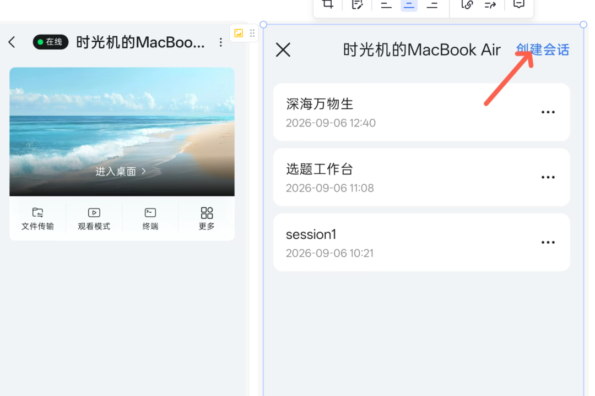

在被控Mac上打开常用终端，输入下面这行命令，就能查看当前的UU终端会话。

uuyc-cli lterm ls

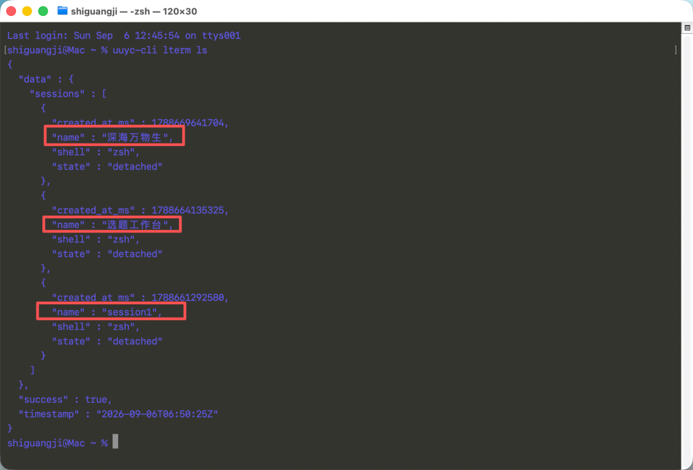

找到要继续的会话，再输入下面这行命令。

uuyc-cli lterm attach "会话名称"

这样就能在Mac上接回刚才的终端现场。

这个过程也可以反过来。先在Mac上输入下面这行命令创建会话，之后打开手机UU远程，同样能在会话列表里找到它。

uuyc-cli lterm new "会话名称"

手机到电脑，电脑到手机，两边都能接。哪台设备在手边，就从哪边继续。这种条条大路都相通的感觉真是太爽了。

我做Vibecoding一般会使用CodexCLI，因为在终端里读文件、改代码和运行检查都比较方便。

比如最近我想做一个选题工作台，用来整理我在各个平台收藏的文章和资料。

这个任务是我先在电脑端开始的。

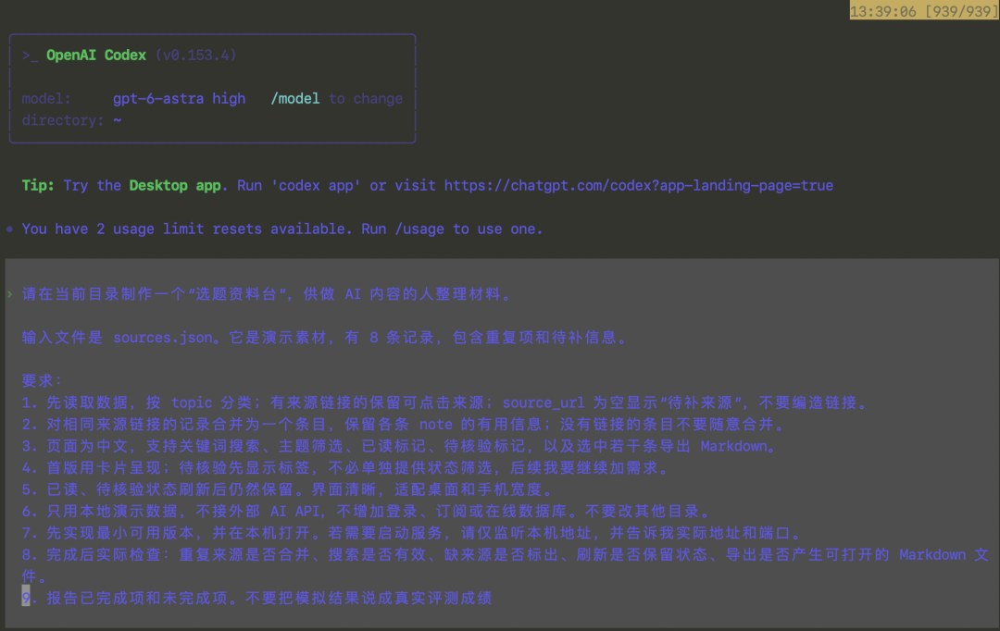

中午出去吃饭时，我在手机的终端会话里看到第一版已经跑出来了，于是切到远程桌面，直接查看网页效果。

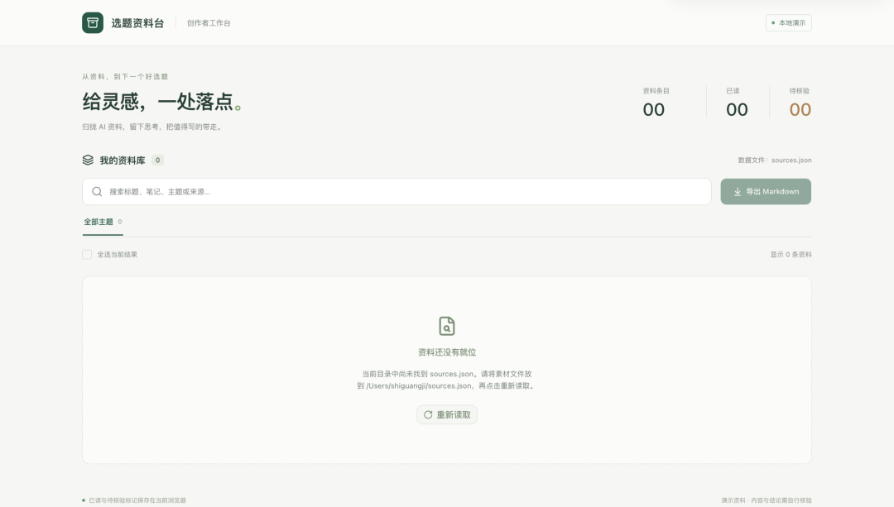

看完以后又有了新想法，我想增加几个筛选标签，用来区分已读、未读和待核验的内容。

放在以前，这一步多半要等我回到电脑前再处理。现在我打开手机终端，补一句要求就行。

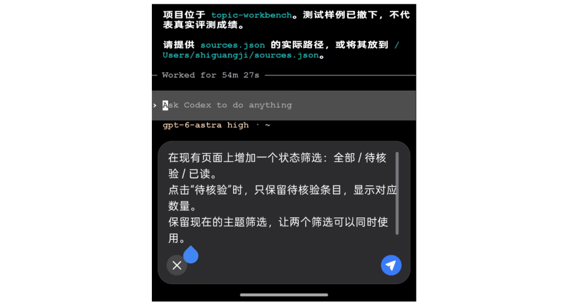

在手机上操作终端时，有一个细节特别好用，就是它提供了独立输入框。

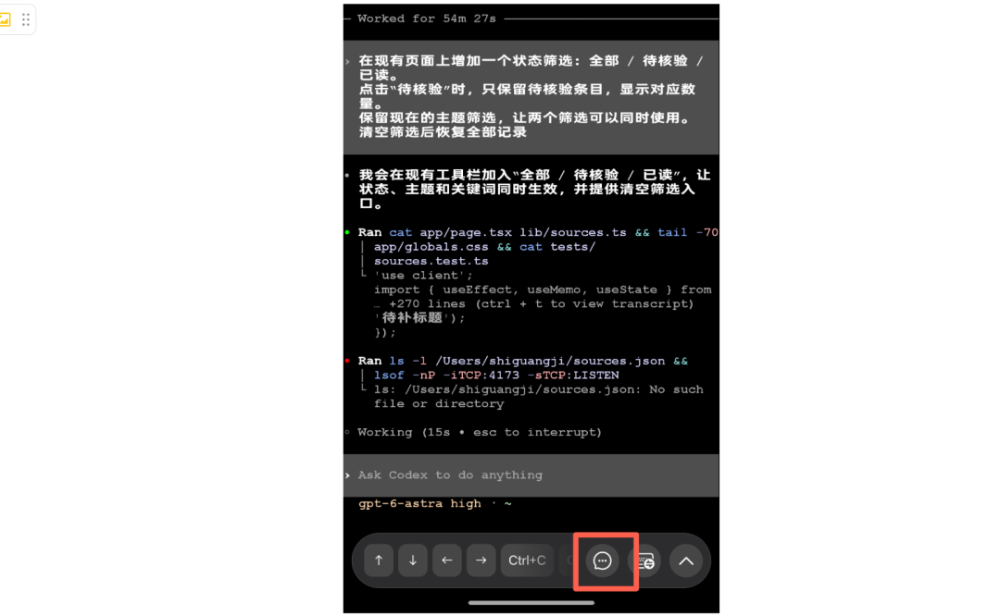

直接在传统终端里输入和修改一大段中文需求，体验通常比较费劲。UU远程可以唤起手机系统输入法，语音输入也能照常使用。整段话说完以后，可以先检查和修改，确认没问题再发送。

等我吃完饭，Codex也已经改完了。这种感觉很像把等待时间捡了回来。

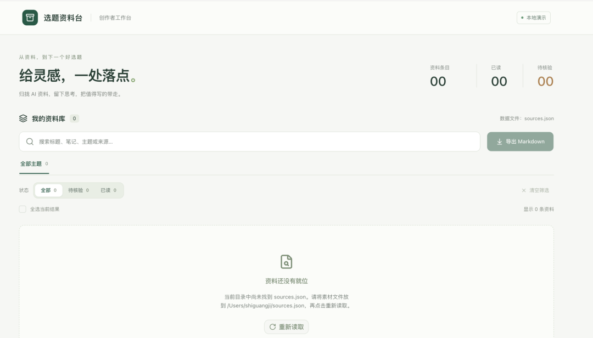

实际开发时，大家通常也不只开一个AI对话，经常是几个任务同时跑。UU远程的终端可以创建多个会话，一个页面里就能管理。

你可以随时进入不同会话查看进度，只要任务进程仍在运行，退出手机页面不会结束会话，之后还可以重新进入。

主动终止会话这段现场才会结束。

这次为了看看GPT-6 Astra处理视觉任务的效果，我同时还让它做了一个3D深海网页。

已关注关注重播分享赞关闭观看更多更多退出全屏切换到竖屏全屏退出全屏路人甲TM已关注分享视频，时长00:230/000:00/00:23切换到横屏模式继续播放进度条，百分之0播放00:00/00:2300:23倍速全屏倍速播放中0.5倍0.75倍1.0倍1.5倍2.0倍超清流畅您的浏览器不支持 video 标签继续观看手机、电脑无缝衔接跑任务，这才是Vibecoding的完全体观看更多原创,手机、电脑无缝衔接跑任务，这才是Vibecoding的完全体路人甲TM已关注分享点赞在看已同步到看一看写下你的评论视频详情

0/0

继续观看

手机、电脑无缝衔接跑任务，这才是Vibecoding的完全体

GPT-6 Astra的实力，大家应该都了解了，效果很好我就不必多说。我想重点说的是用UU远程做这个网页的过程。

做这个任务知道会跑得比较久，所以我先在电脑端开了一个UU远程会话「深海万物生」，手机会自动创建这个会话。

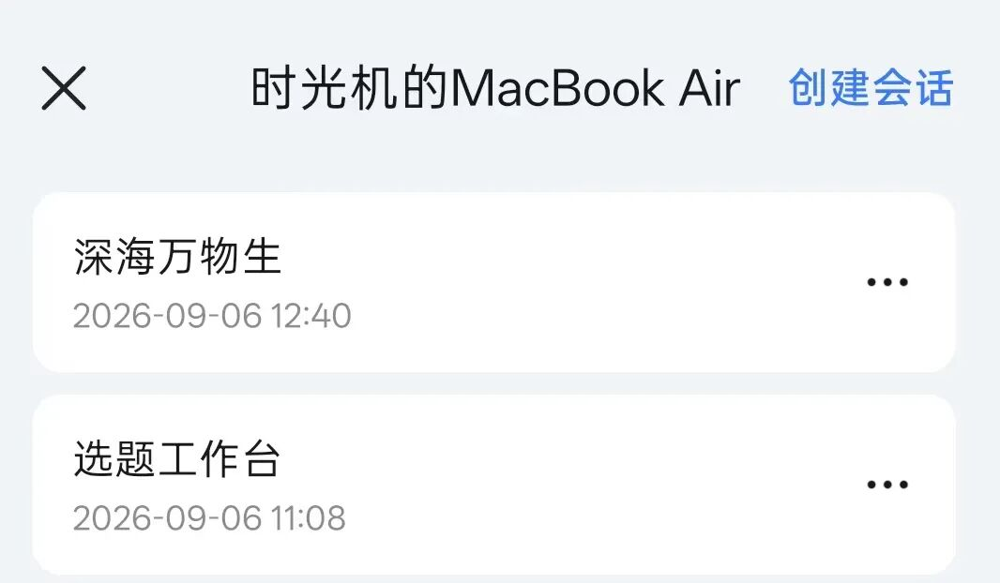

打开启动以后，我从手机进入同一个终端会话查看进度，再切到远程桌面看实际画面。需要调整时回到终端补充要求，改完再进桌面验收，整个过程完全在手机上操作也很顺。

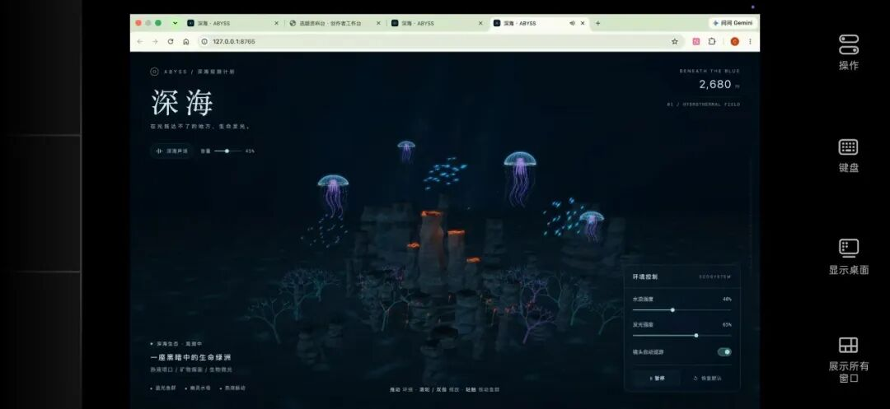

当然如果能一直在电脑前直接看是最好的，但是现在 UU 远程可以实现即使不在电脑前，只通过手机就可以掌握整个会话的进程，这个变化很重要。

真的要自己用了之后感受才更深刻，做这个案例才体会到：

手机远程Vibecoding的价值并不只在于多发几句提示词，模型最后做出来的是一个可以点击和操作的东西，能随时看到成品，发现问题以后马上改，整个过程才算真正接上了。

还有在手机上用终端管理任务，对人的眼睛真的很友好啊

终端里的信息也更集中，不用把整张电脑桌面缩到手机上，再努力分辨一排小字。

而且因为终端主要传输文本，速度也更快，更省流量。

Codex的TUI操作同样可以继续使用，输入斜杠，电脑终端里的命令，在手机上也全都有。

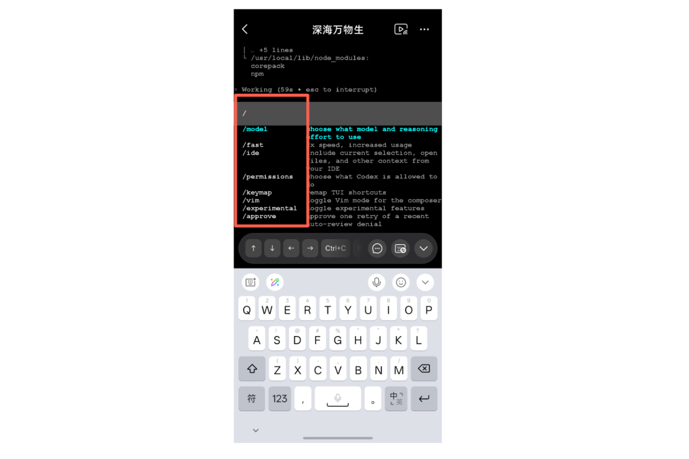

对我来说，这是一种更舒服，也更利落的手机Vibecoding方式。终于能更优雅地用手机远程操控了，不用一直坐在电脑前守着电脑。

# 场景二：办公，拯救你十万火急的下班和周末

打工人应该都遇到过这样的情况。

已经下班了，工作突然需要临时调整。又或者同事急着要某个文件，偏偏电脑没在手边。

为了这点事儿返回公司拿电脑，或者拜托同事打开自己的电脑帮忙发送，都很麻烦。有时候下班真不想背电脑，光是看见电脑包，班味就已经扑过来了。

这个时候，UU远程来拯救你。

需要处理紧急任务时，可以直接用手机远程打开电脑。如果任务适合交给AI，也可以在手机终端启动Codex CLI，让AI先把工作完成。

如果确实需要自己操作，也可以使用手机，平板或者另一台电脑，远程连接公司的电脑继续处理。

问题来了，公司的电脑没有开机怎么办？

别担心，UU远程甚至可以与远程启动电脑，处理完工作后，还能远程关机，不需要让电脑为了随时待命一直开着。

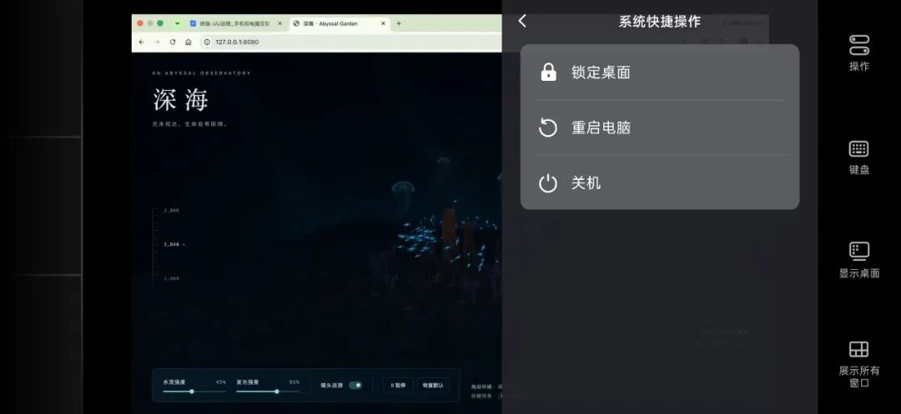

远程操作公司电脑时，隐私也是一个很现实的问题。

如果不想让路过的人看到电脑正在操作，可以开启防窥模式。控制端依然可以正常查看和操作桌面，被控电脑则会显示隐私保护画面。

说实话，办公室里一台没坐人的电脑突然自己开始操作，确实还有一点吓人。

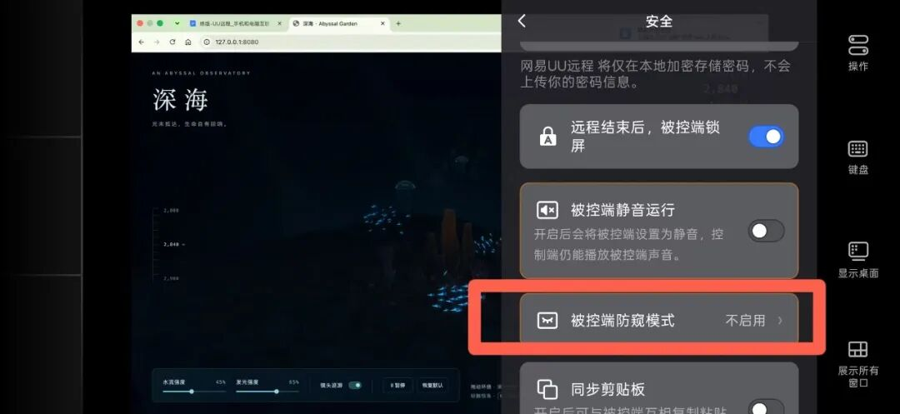

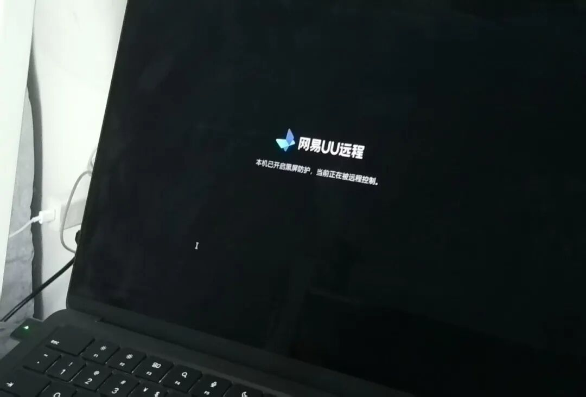

远程操作结束后，还可以开启远程结束时自动锁屏。连接，操作和退出这些环节可能出现的隐私问题，基本都考虑到了，所有产品都向这个贴心程度看齐好不好。

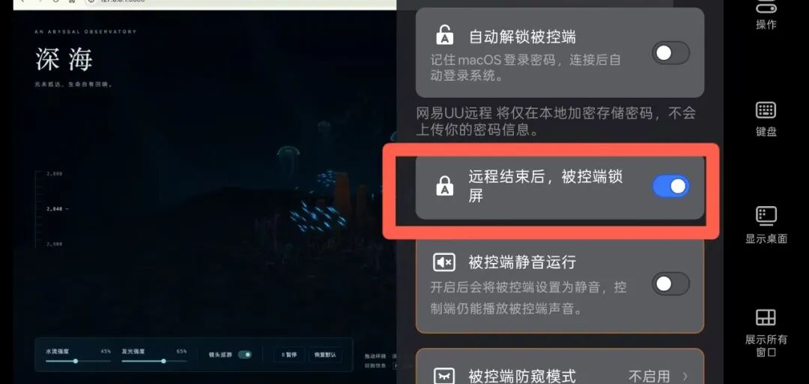

已经讲了很多好用的功能了，这个还是要给大家分享一下，UU远程的跨端文件传输也很好用啊

跨设备互联做得很好，安卓，iOS，Windows，Mac以及平板之间都可以直接传输文件，也支持整个文件夹传输。

电脑里的文件需要发给同事时，远程操作桌面有时不够方便。这个时候可以直接把文件下载到手机，再从手机发送出去。

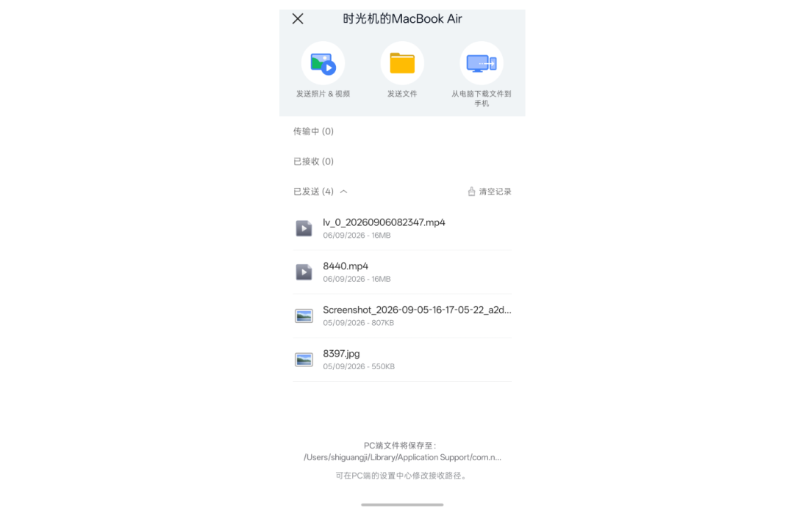

像前面用Vibecoding做出来的网页，也可以把项目文件夹或者预览图片直接传到手机，方便发给同事查看。

我还测试了把旧Windows电脑里的文件迁移到新Mac，实际传输速度大约为5MB每秒。具体速度会受到两台设备和网络环境影响，但日常文件和项目资料传起来已经很方便。

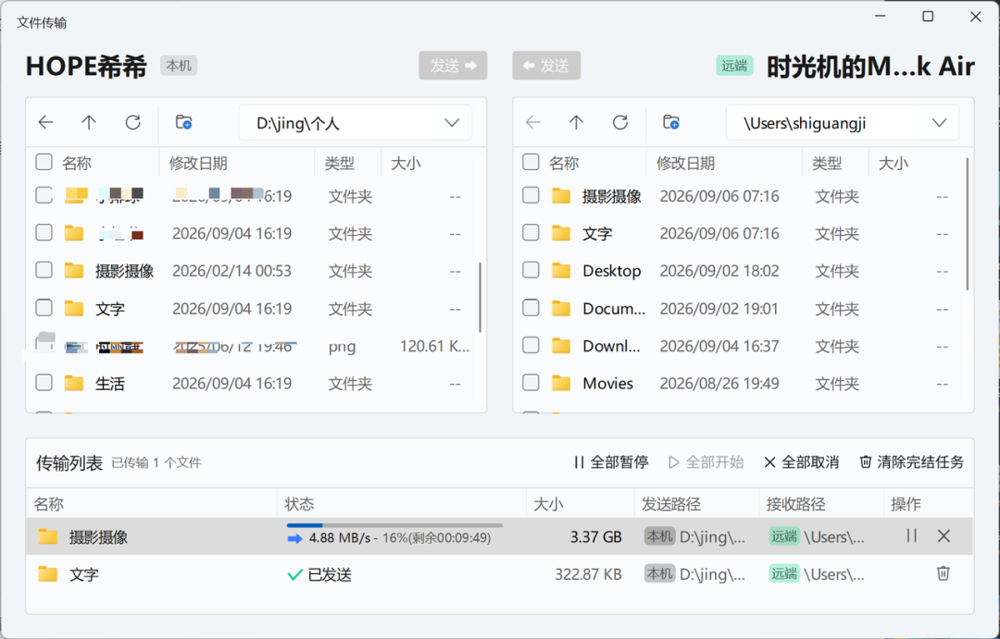

以前跨设备传文件，经常需要找一个中转站，先上传到网盘，再从另一台设备下载，文件一大，光看进度条就够熬人。

现在我的电脑，手机和平板都安装了UU远程。需要传文件时，我打开的不再是微信文件传输助手了，哈哈，直接打开UU远程就行。

# 场景三：移动端玩电脑游戏，随时随地重回4399

办公操作很难直观看出远程控制的延迟，所以我又测试了一下用平板玩电脑游戏。

UU远程的帧率和画面有多种选择，具体能开到哪一档，还要看控制端、被控端和网络条件。

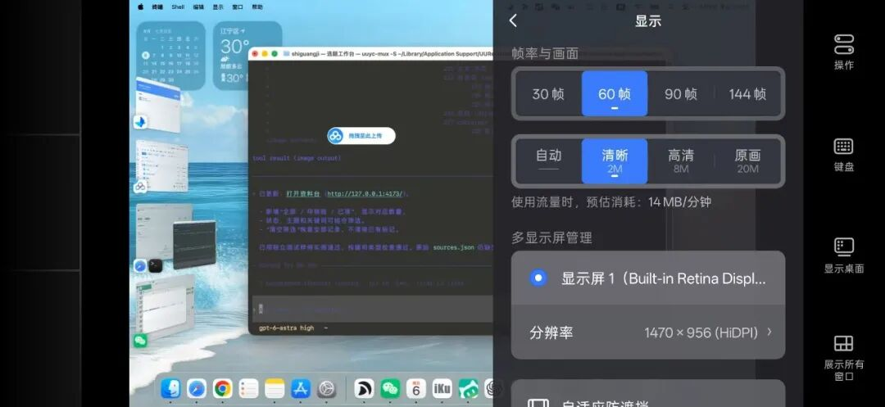

在电脑上打开4399，找了一款最近上线的小游戏，然后直接用平板玩了一把。

游戏开始前先启用按键映射，选择切换操控方案，把操控方案切换成「极速竞技」。

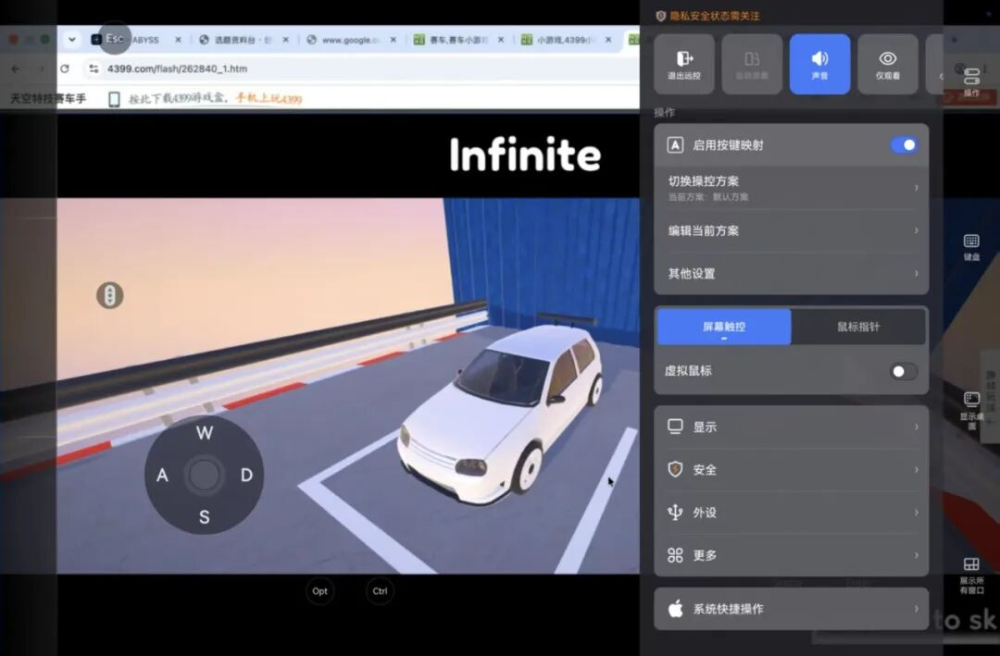

当时探索到这个功能的时候都愣住了，这也太丰富了，还有很多适配其他游戏像逆水寒，黑神，三角洲等等。

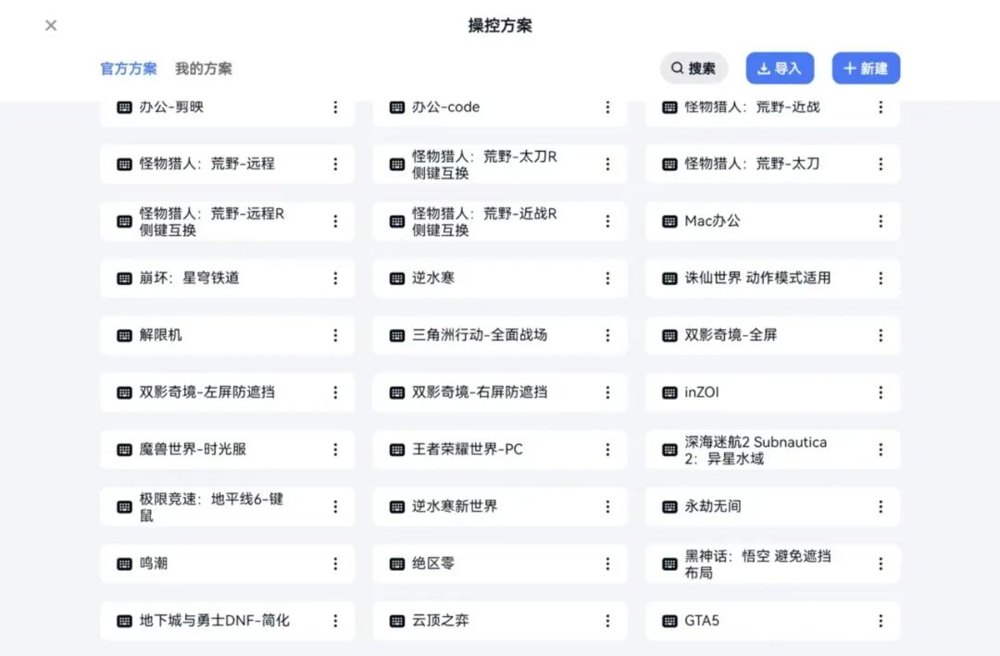

我选的是 60 帧 ，2M画面，实际体验比我预想中流畅很多，整个过程完全没有延迟和卡顿，声音和画面的同步也很好，触控操作用起来很顺手。

已关注关注重播分享赞关闭观看更多更多退出全屏切换到竖屏全屏退出全屏路人甲TM已关注分享视频，时长00:380/000:00/00:38切换到横屏模式继续播放进度条，百分之0播放00:00/00:3800:38倍速全屏倍速播放中0.5倍0.75倍1.0倍1.5倍2.0倍超清流畅您的浏览器不支持 video 标签继续观看手机、电脑无缝衔接跑任务，这才是Vibecoding的完全体观看更多原创,手机、电脑无缝衔接跑任务，这才是Vibecoding的完全体路人甲TM已关注分享点赞在看已同步到看一看写下你的评论视频详情

0/0

继续观看

手机、电脑无缝衔接跑任务，这才是Vibecoding的完全体

UU远程由网易资深团队出品，玩游戏的人对UU这块招牌应该不会陌生。

从我的实际体验来看，这种技术积累确实反映在了稳定性和操作反馈上。

远程办公时不容易察觉的细节，到了游戏这种对延迟更加敏感的场景里，感受会更明显。

一款远控工具看上去只是把电脑画面传到另一块屏幕，真正影响体验的环节却很多。画面编码，传输速度，声音同步和设备适配等等等，只要有一处跟不上，延迟和卡顿马上就会被感觉到。

更重要的是，4K，144帧，远程桌面，终端和文件传输这些功能都可以免费使用，也没有因为免费而进行明显的性能限制，我真的且用且珍惜。

# 写在最后

这几天深度用下来，我最常用也最喜欢的是手机终端触控，多会话，还有文件传输这三个功能。用了才知道，UU远程解决的都是实实在在的问题。

把整套流程连起来看，电脑端准备项目，手机临时补充需求，一个页面管理多个任务会话的进度，回到电脑后继续操作，最后检查结果，再把需要的文件传回来。

我觉得UU远程最适合的，是工作环境已经放在电脑上，又经常需要临时推进项目的人。

比如做内容，产品原型，数据整理，或者手头有几个自己的小工具，想利用零散时间查看进度和调整方向。

需要长时间写代码或者仔细调整设计时，我依然愿意坐回电脑前。

但外出时能够用手机稳定完成几次临时操作，不让任务白白停在那里，就已经非常有用了。

远程控制解决了电脑不在身边的问题，UU远程的终端，多会话和跨端接续，又进一步减少了人守在电脑前等待的时间。

AI已经在帮我们减少工作了，就别再让等待把人困在电脑前。

真正好用的远程控制，可以让电脑继续工作，也让人终于离电脑远一点，离生活近一点。

我是路人甲，前产品经理，现创业者。关注AIGC人工智能，分享实用的AI应用。让AI变成你触手可及的生产力。
