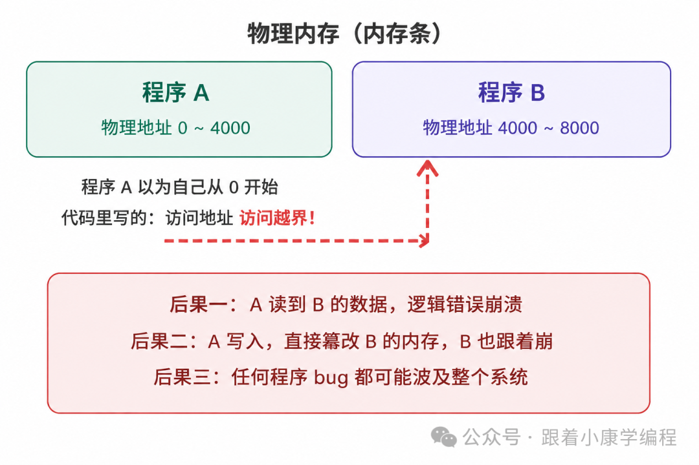
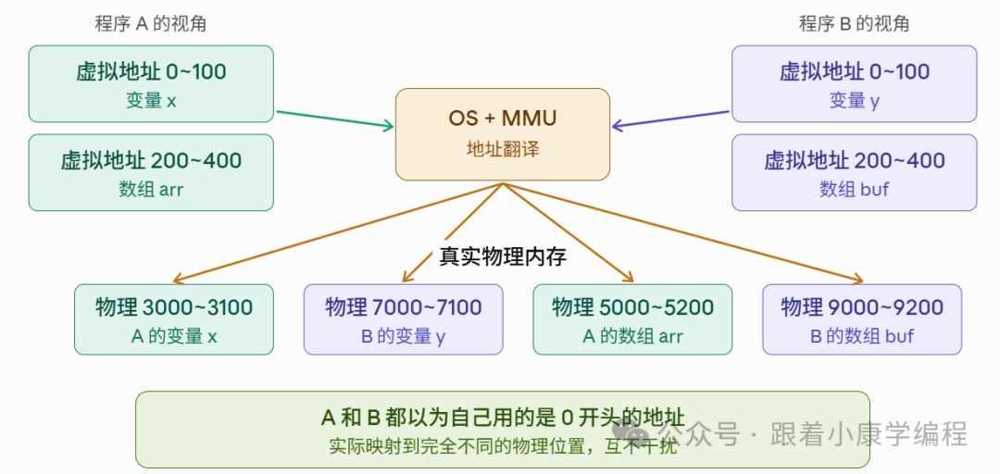
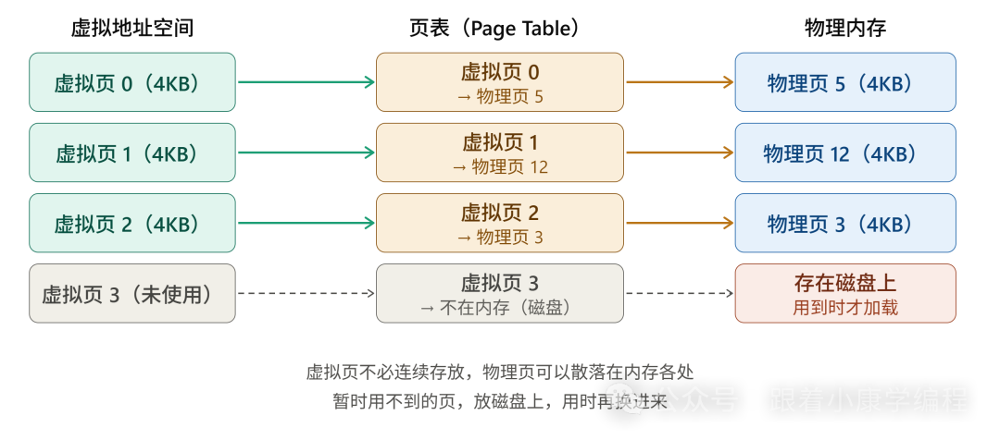
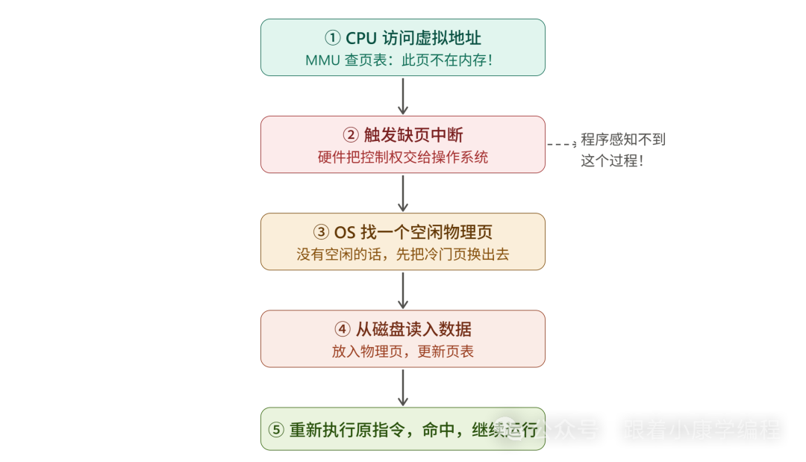
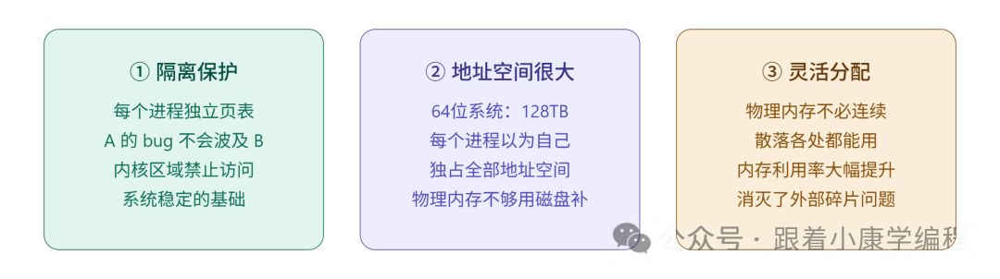

# 虚拟内存是如何一步步被发明出来的？

> 从程序直接操作物理内存的原始时代，到多程序冲突、地址重定位、覆盖技术，最终推导出虚拟内存——分页、MMU、缺页中断、TLB 的完整诞生逻辑。

<!-- more -->

## 第一步：程序直接用物理内存

早期计算机没有虚拟内存，程序直接操作内存条上的真实地址。

## 第二步：多程序冲突

多个程序同时运行时，地址冲突导致崩溃或数据篡改。

## 第三步：地址重定位（Relocation）

程序加载时操作系统帮所有地址加一个偏移量。但仍有碎片化、无隔离、内存不足等问题。

## 第四步：覆盖技术（Overlay）

程序切成块，用到哪块加载哪块，不用的放磁盘。需要程序员手动管理，极其麻烦。

## 第五步：虚拟内存核心思想

给每个程序一套假地址（虚拟地址），操作系统和硬件（MMU）在背后翻译成物理地址。

## 第六步：分页（Paging）

虚拟和物理空间都切成 4KB 大小的页，页表记录映射关系。

- 程序不需要连续内存
- 按需加载，不用的页放磁盘
- 天然隔离，进程间互不干扰

## 第七步：缺页中断（Page Fault）

访问的虚拟页不在物理内存时触发缺页中断，OS 从磁盘加载数据，更新页表，重新执行指令——整个过程对程序透明。

## 第八步：TLB（快表）

CPU 内部的高速缓存，缓存最近用过的页表条目，解决分页带来的性能损耗（每次内存访问从两次变回一次）。

## 第九步：三大好处

1. **隔离保护**：每个进程有自己的页表，互不干扰
2. **空间放大**：32 位系统每个进程以为自己有 4GB，64 位更大
3. **碎片化分配**：虚拟页可映射到散落的物理页

## 总结

三篇文章讲完内存三层：指针（地址操作）→ malloc（动态分配）→ 虚拟内存（地址来源与隔离）。想清楚这三层，指针越界、内存泄漏、段错误的排查自然有思路。