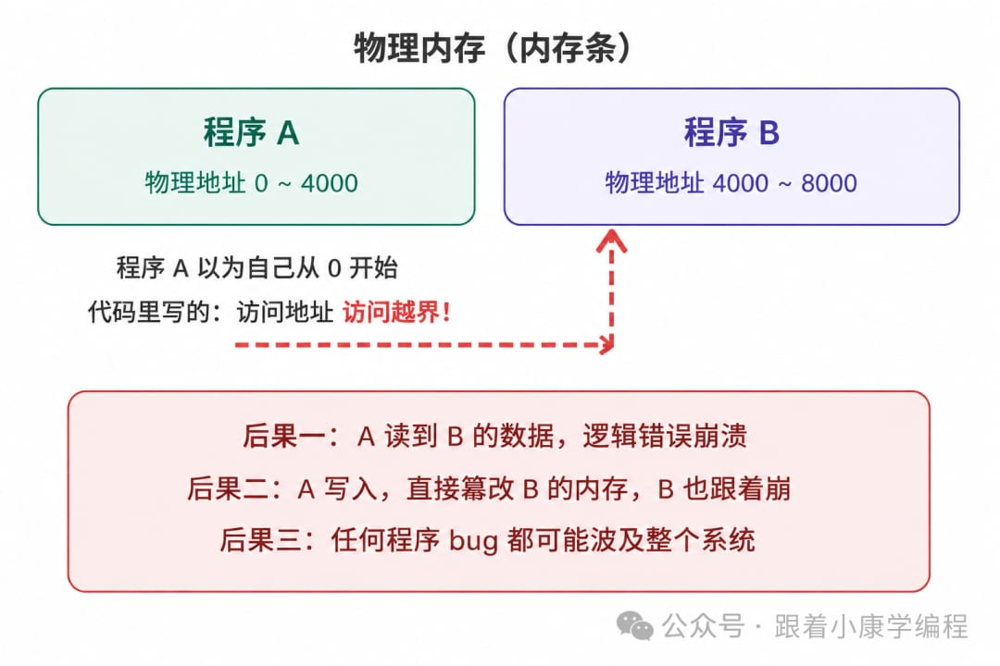

# 虚拟内存是如何一步步被发明出来的？

> 你的程序里，变量的地址动不动就是 0x7fff...；电脑只有 8GB 内存，程序里的地址却动辄几十亿；同时开着浏览器、IDE、音乐播放器，它们各自操作"自己的内存"互不干扰——这一切背后，靠的是操作系统的一个核心机制：虚拟内存。

本文一步步把虚拟内存"推导"出来，你会发现，它的诞生同样是被逼出来的。

## 第一步：最原始的方式——程序直接用物理内存

早期计算机没有虚拟内存。程序运行起来直接操作物理内存，也就是内存条上真实的地址。你说"把数据存到地址 1000"，那就真的存到内存条的第 1000 个字节。

单个程序跑，没问题。但问题很快就来了。

## 第二步：多个程序同时跑，出事了

操作系统把程序 A 加载到物理内存 0~4000 字节，把程序 B 加载到 4000~8000 字节。

但程序 A 在编译时已经把地址写死了。A 以为自己从地址 0 开始，代码里到处都是"去地址 500 取数据""跳到地址 200 执行"。可操作系统把它加载到 4000 以后，地址 500 实际上是 B 的地盘——A 一读，读出来的是 B 的数据，直接崩溃，甚至把 B 的数据篡改掉。

这还只是两个程序。程序一多，内存管理就变成噩梦。计算机科学家们意识到，根子上的问题是：**程序不应该直接接触物理地址。**

## 第三步：第一个想法——地址重定向

最早的解决方案很朴素：程序加载时，操作系统把所有地址都加一个偏移量。比如 A 被加载到物理地址 4000，那 A 里所有的地址都加 4000——原来访问 500，自动变成访问 4500。这叫**重定位（Relocation）**，用一个寄存器存偏移值，每次内存访问自动加上，硬件帮你做。

勉强能用，但问题很多：

- 程序必须连续放在内存里，内存碎片问题同 malloc 一样严重
- 程序 A 依然可以故意构造一个大地址，越界访问到 B 的区域，没有隔离保护
- 物理内存就这么大，程序多了真的放不下

## 第四步：内存不够用，怎么办？

1960 年代内存极其昂贵，一台计算机可能只有几 MB 内存，但程序越来越大。工程师们想出一个办法：把程序切成块，用到哪块就加载哪块，暂时不用的放到磁盘上。这叫**覆盖技术（Overlay）**，但要程序员自行切块、手动管理，极其麻烦。

能否自动化？能——但要自动化，就需要一个更根本的机制：让程序完全不知道自己的数据在内存还是在磁盘，操作系统偷偷帮你搞定。这就要求：**程序用的地址，和物理地址彻底分离。**

## 第五步：虚拟内存的核心思想——制造一个假象

计算机科学家提出了一个绝妙的想法：

> 给每个程序一套假地址（虚拟地址），让它以为自己独占全部内存。操作系统和硬件在背后负责把假地址翻译成真地址（物理地址）。

程序 A 用的地址从 0 开始，程序 B 用的地址也从 0 开始——互不干扰，因为都是"假"的地址，背后映射到不同的物理内存。就像两个人都叫"我家在 1 号"，一个在北京，一个在上海，实际地址完全不同。

这个"翻译"工作由硬件上专门的单元来做，叫 **MMU（Memory Management Unit，内存管理单元）**。它内置在 CPU 里，速度极快，每次内存访问都会过一遍。

## 第六步：分页——把内存切成固定大小的块

虚拟地址到物理地址怎么映射？不能一个字节一个字节地记录，太占空间。工程师们的方案是**分页（Paging）**：把虚拟地址空间和物理内存都切成固定大小的块，每块叫一页（Page），一般是 4KB。映射关系以页为单位记录：虚拟第 0 页 → 物理第 5 页，虚拟第 1 页 → 物理第 12 页……

这张映射表叫**页表（Page Table）**，存在内存里，每个进程有自己的一张。

分页解决了几个大问题：

- 程序不需要连续放在内存里，每页可以散落在物理内存各处
- 按需加载：暂时不用的页可以放磁盘，用到了再加载进来
- 天然隔离：A 和 B 有各自的页表，A 根本拿不到 B 的物理页号

## 第七步：缺页中断——磁盘当内存用的魔法

程序访问一个虚拟地址，但对应的物理页不在内存里（在磁盘上），怎么办？这时候硬件触发一个**缺页中断（Page Fault）**，把控制权交给操作系统：

1. 操作系统找一个空闲物理页（没有就把冷门页换到磁盘，腾出位置）
2. 从磁盘把需要的数据读进来，放进这个物理页
3. 更新页表，记录新的映射
4. 重新执行刚才那条指令，这次命中了，正常运行

最妙的是——整个过程对程序完全透明。程序不知道自己等了一下、数据是从磁盘来的，它只看到"访问了一个地址，拿到了数据"。

这就是"用磁盘扩展内存"的魔法——虚拟内存让程序可以使用比物理内存更大的地址空间。

## 第八步：TLB——给翻译加速

分页有一个代价：每次访问内存都要查一次页表。页表在内存里，相当于每次内存访问变成了两次（先查表，再取数据），速度直接砍半，不能接受。

解决方案：**TLB（Translation Lookaside Buffer，快表）**。它是 CPU 内部的一块超高速缓存，专门缓存最近用过的页表条目。TLB 很小（几十到几百条），但命中率极高——因为程序访问内存有局部性，反复访问那几页。有了 TLB，虚拟内存的性能损耗几乎可以忽略不计。

## 第九步：虚拟内存带来的三大好处

**① 隔离保护**

每个进程有自己的页表，A 根本拿不到 B 的物理页号。A 写了一个 bug，最多把自己的内存搞乱，影响不到 B，也影响不到内核。这是操作系统稳定运行的基础。

**② 内存空间假装很大**

32 位系统，每个进程以为自己有 4GB 内存；64 位系统大到你用不完。实际上物理内存可能只有 8GB，几十个进程分着用，靠缺页中断和换页机制支撑这个假象。

**③ 物理内存可以碎片化分配**

程序不需要连续的物理内存，虚拟页可以映射到散落各处的物理页，内存利用率大幅提升。

## 最后：串起来看

用三篇文章，把内存的三个层次讲完了：

- **指针**：程序怎么用地址操作内存
- **malloc**：堆内存怎么动态分配和回收
- **虚拟内存**：这些地址从哪来，为何每个程序都以为自己有独立的内存

三件事加在一起，才是写 C/C++ 程序时内存这件事的全貌。很多人觉得 C/C++ 内存难，其实是没有把这三层想清楚。想清楚之后，什么指针越界、内存泄漏、段错误，都只是这套机制某个环节出了岔子，排查起来自然就有思路了。

> 下一篇预告：互斥锁是如何一步步被发明出来的？——多线程为什么会出 bug，人类是怎么一步步把这个问题解决的。