# 周报 #107 - 基于 Multica 与 Impeccable 的开发/设计工作流

> 两套工具重塑 Indie 工作流：**Multica** 把本地 Coding Agent 链接成共享的"AI 员工"团队；**Impeccable** 把设计流程拆成命令化步骤（如 `/teach`、`/craft`、`/audit`），告别"为了某个页面一次性优化的代码"。

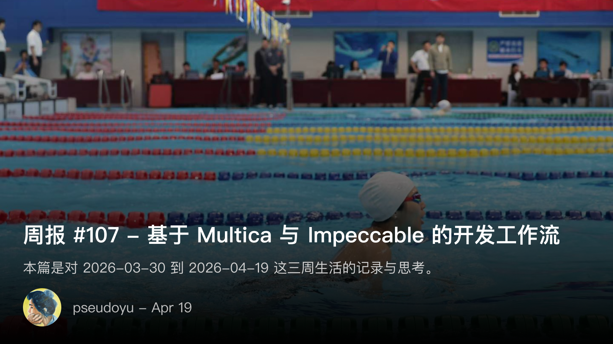

<!-- more -->

收录范围：`2026-03-30` 到 `2026-04-19` 的三周生活与思考。

## 核心两套工具

### Multica：链接本地 Coding Agent 的"AI 员工"协作平台

[Multica](https://multica.ai/) 是 Devv 创始人做的开源看板，开源第一天作者就自部署用上了。

**关键设计**：`multica` CLI 连接自部署 server，把本机设备注册为 **Runtime**，无需自己重新配置 Rules / MCP。

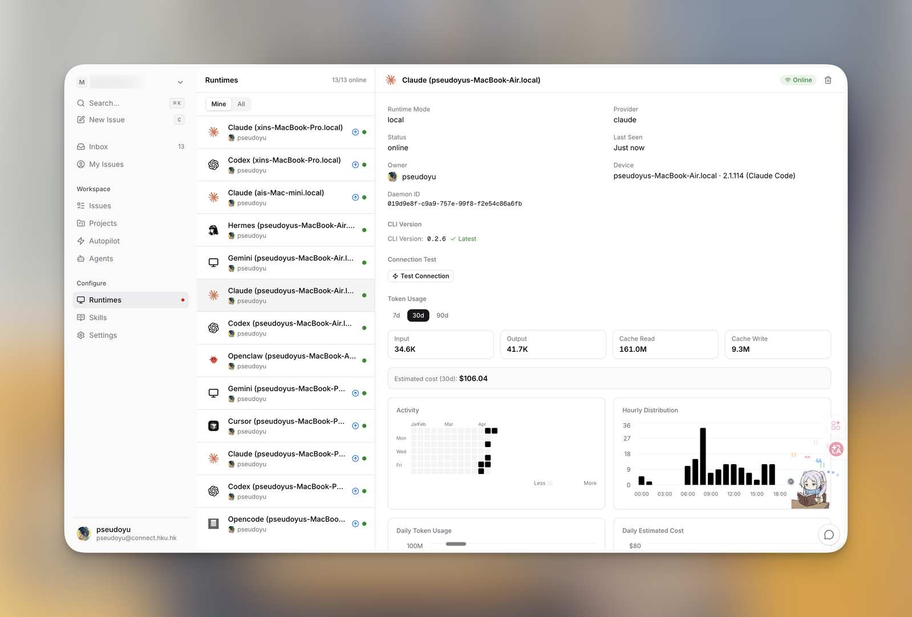

注册完 Runtime 后，可以创建 **Agent**：每个 Agent 配不同的指令、Skills、自定义参数，相当于定制一个"AI 员工"，有明确的工作职责范围与技能。

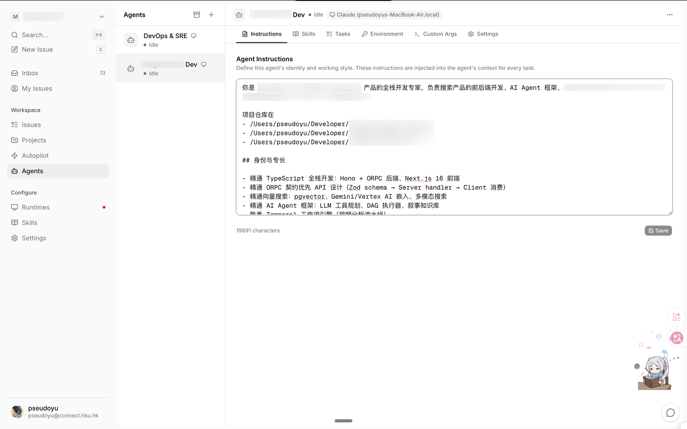

**协作魔法**：新建 Issue 时可指派给特定 Agent 员工；所有 Agent 的工作记录都在 Multica 平台统一存档，等于给不同人/不同设备的本地 Agent **装了一个共享知识库和上下文**——在关联性高的协作任务中尤其有用。

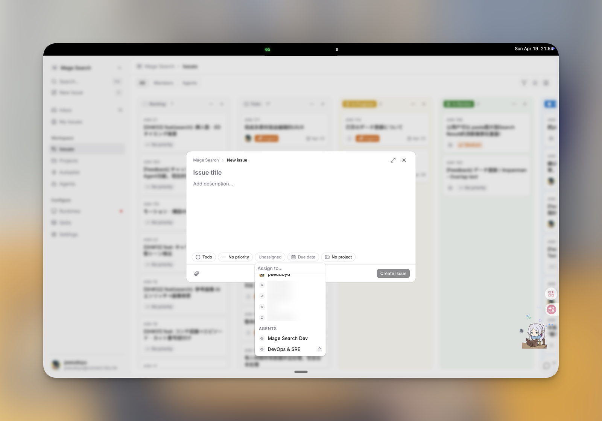

**克制之美**：早期连搜索都没做，重点放在与本地 Agent 的连接上。最近陆续补了 **Projects**（按 Workspace 区分项目）和 **Autopilot**（定时/重复任务自动化），现在还在快速迭代。

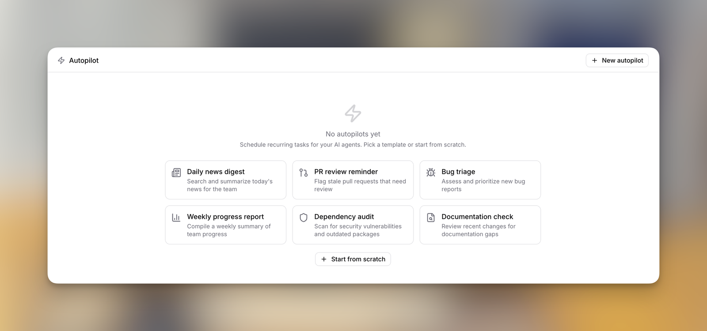

**作者的后续计划**：把更多项目实践引入 Multica，与自建的 Hermes Agent 结合，把**开发 → 测试 → 预发验证 → 正式发布**四步流程做得更完善。

> **对比联想**：和之前用过的 Luban / Linear 类似产品相比，Multica 的"Runtime + Agent 协作"形态更明确——它不是又一个 Kanban，而是**第一个把"Agent 员工"作为一等公民的协作平台**。

### Impeccable：把抽象 UI 设计拆成命令化工作流

之前用过 Frontend Design / web-design-guidelines / ui-ux-pro-max 这些 Skill，但都只是"最佳实践辅助"，没系统性地做风格设计，还是依赖 v0.dev 基础能力。

[Impeccable](https://impeccable.style/) 在 Web3Insight 项目上效果出乎意料地好：

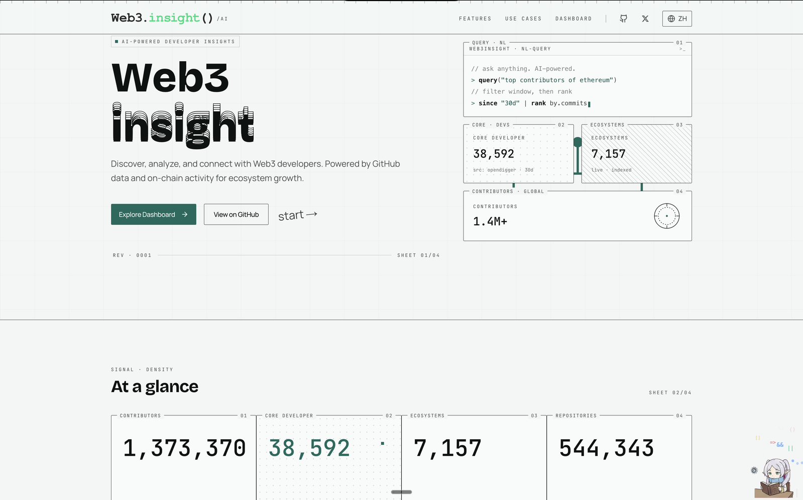
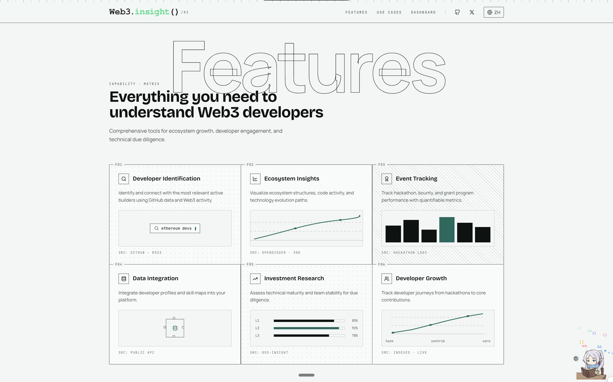
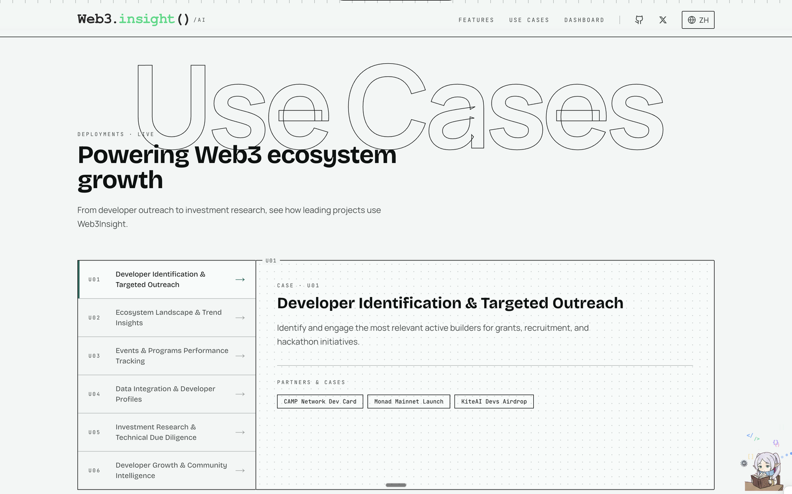
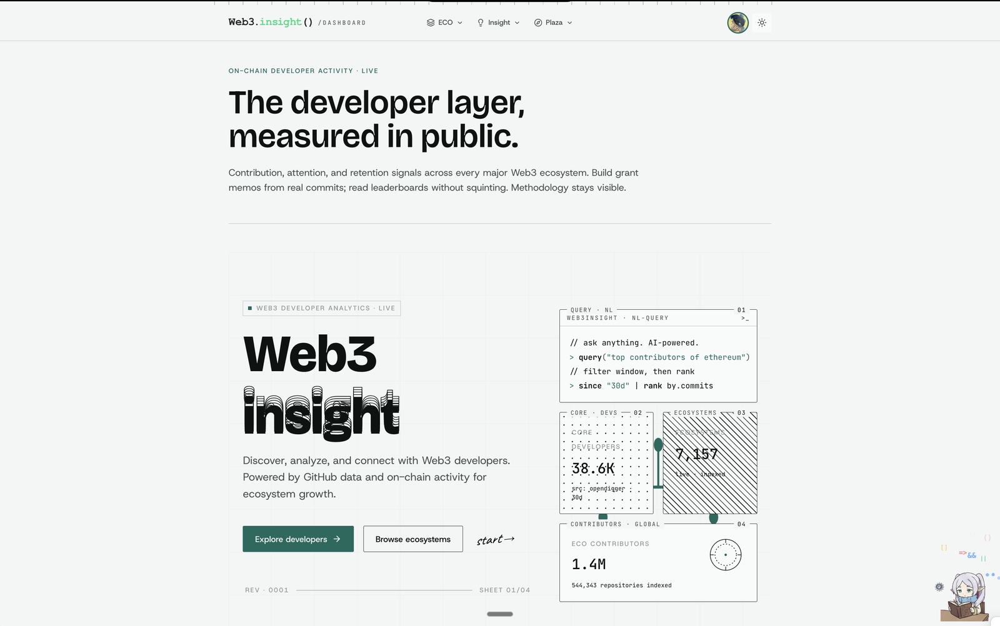
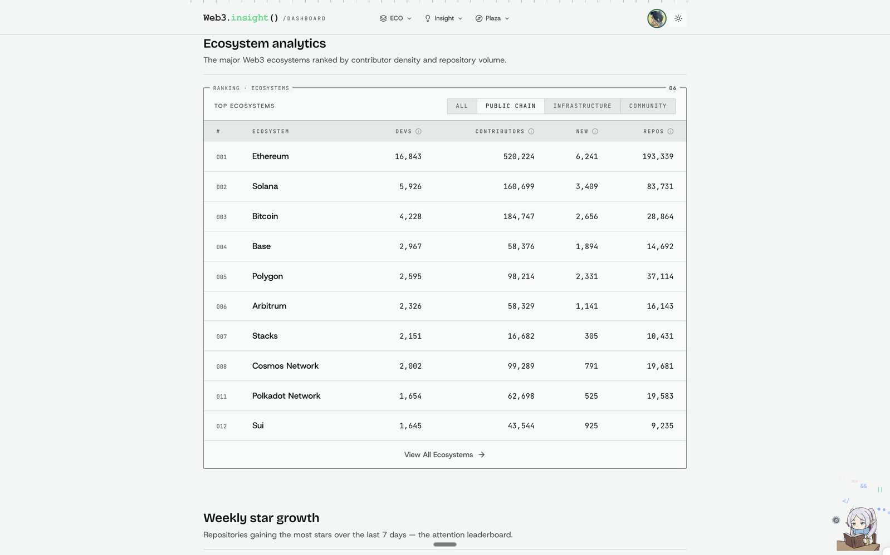

**核心思想**：把 UI 设计当成 `CLAUDE.md` / `AGENTS.md` 的"设计版"来管理——先做宏观品牌分析，沉淀为 `.impeccable.md`，所有后续设计都基于这套原则拓展，避免"为某个页面优化引入的一次性代码"。

**命令化流程**：

| 命令 | 用途 |
|------|------|
| `/impeccable teach` | 分析项目，产出 `.impeccable.md`（用户画像、习惯、品牌调性） |
| `/impeccable craft` | 基于设计原则新设计页面/组件 |
| `/critique` / `/audit` | 分析/审计当前设计的问题 |
| `/polish` / `/optimize` / `/animate` | 针对特定方向优化设计 |

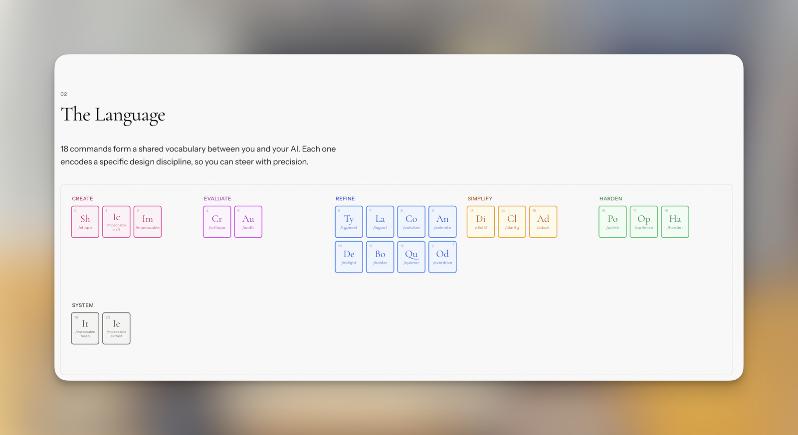

参考：[Web3Insight.ai 的 .impeccable.md](https://github.com/web3insight-ai/web3insight.ai/blob/main/.impeccable.md)

> **关键洞察**：Impeccable 不是"AI 直接画图"，而是"**用 AI 把设计流程结构化**"。原则文档化 + 命令化执行 = 可持续复用的设计体系，而不是某次 v0.dev 的即兴产物。

## Multica vs Impeccable：同一思路的两面

| 维度 | Multica | Impeccable |
|------|---------|------------|
| 适用场景 | 多 Agent 协作开发 | 单一项目设计迭代 |
| 关键抽象 | Runtime + Agent 员工 | `.impeccable.md` 设计原则文档 |
| 工作流载体 | 看板 + Issue 指派 | 命令化 Skill |
| 共享的价值 | 跨设备的 Agent 知识库 | 跨页面的设计一致性 |

**共同点**：都把"以往散落在每个工程师/设计师脑子里的隐性流程"显性化、可复用化。

## 个人片段

### 一次惊心动魄的 Payment 上线

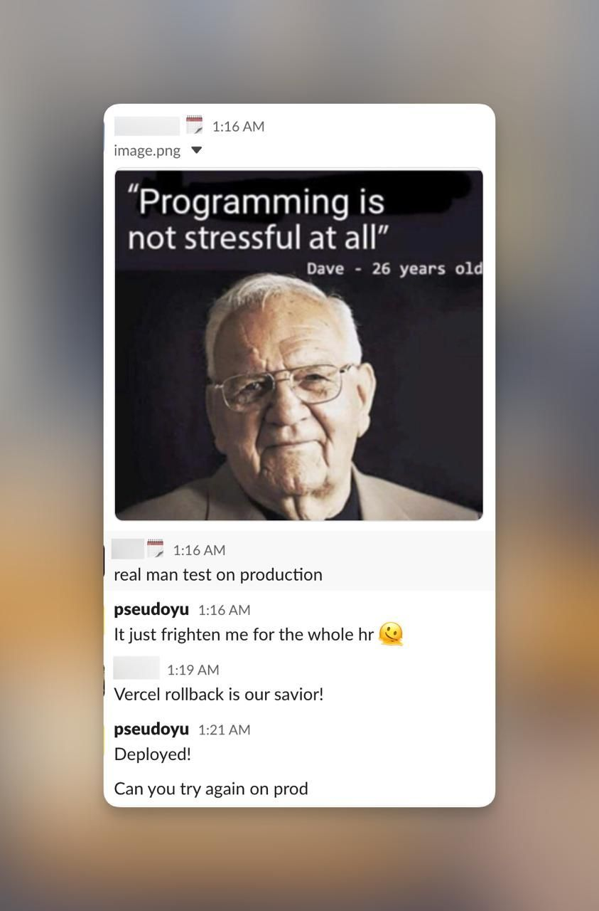

> 最近很多任务到收尾阶段，经历了一次惊魂未定的"上线 → Vercel Rollback → 二次上线"。跟所有用户 Payment 有关的大重构上生产，从 5am 肝到第二天 5am，但比起之前忙碌，这次反而不觉得累。

**洞察**：**工作成就感和热情才是最影响工作状态的因素**——再爆肝，做想做的事就不累。

### 陪学姐去江阴游泳比赛

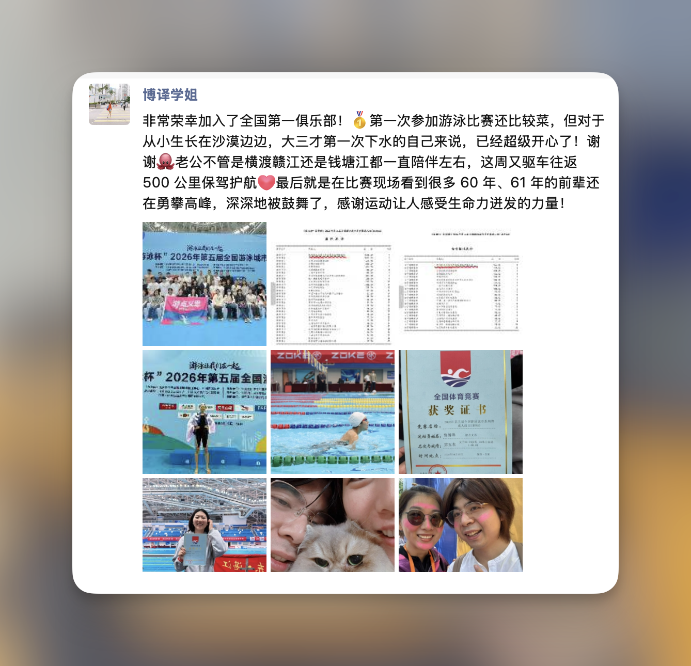

> 周末护送学姐去江阴参加游泳比赛，两天密集行程有些累，学姐得第五名。有种家长带小孩参加兴趣班比赛的成就感。

活动本身：自己不算是游泳爱好者，但被现场活力感染，**下决心开始规律运动**。

## 收藏夹精选（值得看的输入）

### 文章 / 项目

- [用開源專案建立職涯](https://st0012.dev/zh-tw/building-a-career-with-open-source/) —— "AI 时代开源更加容易却也更加可贵了"
- [Tape x Topic：智能体上下文的组织方式](https://blog.scnace.me/post/tapextopic/) —— 也在研究怎么把 Tape Systems 接到团队级场景
- [Agent Interaction Guidelines (AIG) – Linear Developers](https://linear.app/developers/aig) —— Linear 制定这个 Guideline 很有信服力
- [Multica GitHub](https://github.com/multica-ai/multica) —— 很适合小团队实践
- [Supabase docs over SSH](https://supabase.com/blog/supabase-docs-over-ssh) —— 新奇的文档方式
- [Vibe Island - Dynamic Island for AI Agents](https://vibeisland.app/) —— "这个时代最有付费意愿的是好看 & 有趣的软件"

### 文章 / 视频

- [我们为什么要重写 bub? - Frost's Blog](https://frostming.com/posts/2026/why-rewrite-bub/) —— 没自己部署，但 Agent 理念和设计模式都在学 bub 和 tape.systems

## 关键洞察

1. **Multica 的"Runtime + Agent 员工"是把协作平台从"人类组织"扩展到"AI 一等公民"**——以后每台设备的 Coding Agent 不再是孤岛
2. **Impeccable 的本质是"设计流程文档化"**——类似 Claude Code 用 CLAUDE.md 沉淀工程原则，Impeccable 用 .impeccable.md 沉淀设计原则
3. **可复用 > 一次性**：两个工具都在抵抗"为某个页面引入的一次性代码"——这是 AI Coding 时代最易踩的坑
4. **KPI 是"工作成就感"**：做自己想做的事，肝到 5am 也不觉得累
5. **Indie 工程师的输入节奏**：博客 + Telegram 频道 + daily.pseudoyu.com 微博客 = newsletter 化的内容沉淀

## 关联概念

- [[concept-indie-site-builder-skill-stack]] — Indie 工程能力栈
- [[agent-autonomous]] — Agent 自主性
- [[claude-code-build-site]] — Claude Code 建站工作流
- [[vibe-coding-methodology]] — Vibe Coding 方法论
- [[agents-as-labor]] — Agent 作为劳动力（待补）
- [[design-system-as-markdown]] — 设计系统即 Markdown（Impeccable 思路）
