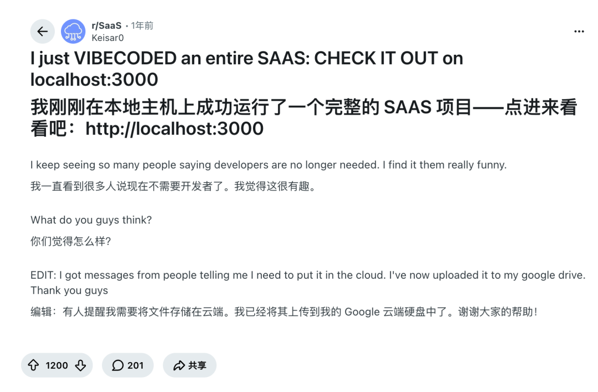
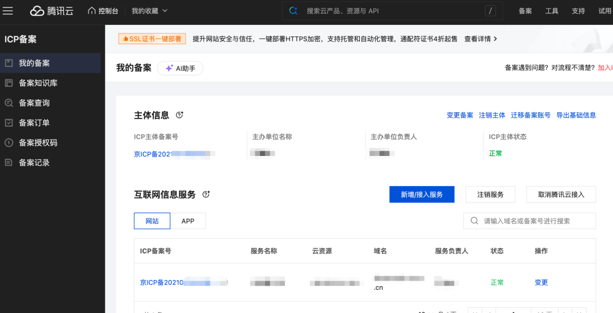

# 产品开发好了，域名怎么买？

Reddit（美版贴吧）有一个帖子，帖主说他在本机上开发了一个完整的 SaaS 项目，大家可以点击 `https://localhost:3000` 来体验。

如果你开发过网站类的项目，你一定能看得懂这个笑话；如果你看不懂这个笑话，那你一定要看这篇文章。

解释一下这个笑点：`localhost` 这个域名只能在个人本地电脑上访问，项目开发和本地测试的时候用的比较多，其他人是没有办法使用的。

这其实是现在很多有志于借助 AI 开发产品的小白用户的一个现状。有了 AI 之后，开发产品越来越容易，甚至只需要一句话，就能开发一个看上去像模像样的产品。本地能跑能用，但没办法发布到互联网上给其他人用，只能自娱自乐。

所以我打算写一个系列文章，讲一下如何开发一个线上可用的产品。这是第一篇，从介绍域名怎么买开始。

## 域名是什么？

域名，通俗理解就是网址，是一个网站的访问地址。有了它，你的产品在互联网上就有了一个独一无二的标记。

## 有哪些购买域名的网站

能买域名的地方有很多，国内主要是一些云厂商，国外主要是一些专门的域名注册商。

下面列了常见的一些域名服务商以及支持的支付方式。

| 分类 | 注册商名称 | 支持支付方式 | 简要说明 |
|------|-----------|-------------|---------|
| 国内注册商 | 阿里云（万网） | 支付宝、微信支付、银联、网银、对公转账、账户余额 | 国内常用注册商，域名及 ICP 备案体系成熟 |
| 国内注册商 | 腾讯云 | 微信支付、网银、账户余额等 | 腾讯生态整合方便，适合国内网站、微信和小程序业务 |
| 国内注册商 | 华为云 | 支付宝、微信支付、银联、网银、Huawei Pay、对公转账、账户余额等 | 企业、政企场景较常见。支付渠道与账号签约主体有关 |
| 海外注册商 | Porkbun | 支付宝、PayPal、信用卡、Apple Pay、Google Pay、Amazon Pay、USDC、美国银行 ACH | 对中国大陆用户很友好，原生支持支付宝 |
| 海外注册商 | Dynadot | 支付宝、银联、PayPal、信用卡、Apple Pay、Google Pay、Wise、Payoneer、加密货币等 | 支付方式非常丰富，对国内用户尤其友好；官网明确支持支付宝和银联 |
| 海外注册商 | Namecheap | 银行卡、PayPal、加密货币、账户余额 | 老牌注册商；没有原生支付宝，但支持 UnionPay 银联卡 |

> （不建议在 Cloudflare 上购买域名。后面一些服务会用到 Cloudflare，避免把鸡蛋都放在一个篮子里。）

不同域名的价格差异极大，从免费的到成千上万的都有。主要看域名里关键词的稀缺性。对于普通站点而言，域名开销每年几十到几百比较合理。

还有一点，由于监管要求公示实名主体，在国内云平台购买域名很难隐藏注册人信息。如果比较看重隐私，并且主要业务在海外，或者域名不是必须备案，可以在国外的域名注册平台上购买。

## 域名是否需要备案

法律层面，需不需要备案只看一件事：**有没有接入中国大陆境内网络接入资源**（国内服务器、国内 CDN、国内云托管）。

- 域名解析到中国大陆服务器 / 国内 CDN 节点 → **必须 ICP 备案**
- 域名解析到中国香港、新加坡、美国等境外服务器 → **不需要在中国做 ICP 备案**

隐形层面，如果对接微信支付、支付宝商户、小程序、公众号 H5、国内短信、国内广告联盟等，大多强制要求域名完成 ICP 备案，没备案不给接入接口。也就是说，如果你的用户主要在国内，并且需要和国内的网络服务打交道，那这个域名就需要备案。

备案比较简单，你在哪个平台上购买域名，就在哪里备案就行。比如我之前在腾讯云上备案过一个域名，就在控制台里面搜 ICP 备案，按要求提供基本信息，申请备案即可。

备案过程中，会有相关人员电话对你的网站提供的服务业务范围进行确认，如实回答即可。一般备案过程 7~15 个工作日，最多 20 个工作日。

补充一点，虽然备案只看是否使用了国内的网络接入资源，不关心域名在哪儿买的，但国外的域名平台无法提交备案，所以得把域名转移到国内平台上。各平台的域名转移入口都比较隐蔽，想转移的话直接联系平台客服问就行。

## 域名后缀怎么选

域名后缀就是常见的 `.cn`、`.com`、`.org`、`.net`、`.ai` 这些，这些后缀都是什么意思？该怎么选呢？

### 大类划分

| 大类 | 典型后缀 | 示例 | 注册局运营主体性质 | 运营方 | 例子 | 补充备注 |
|------|---------|------|-------------------|--------|------|---------|
| 老牌通用顶级域名 | .com、.net | .com / .net | 商业上市公司 | Verisign | .com / .net | 互联网最早一批通用后缀，商业运营 |
| 非营利通用域名 | .org | .org | 非营利公益组织 | Public Interest Registry（PIR） | .org | 初衷面向社团、开源、公益项目，现在商业也可注册 |
| 受限专用域名 | .edu、.gov、.mil、.int | .edu、.gov | 官方 / 国际组织 | - | .edu（美国教育机构）、.gov（美国政府） | 个人、普通企业不能注册，专门机构使用 |
| 新通用垂直行业 | .store、.tech、.online、.shop、.site、.ltd、.xyz | .store、.tech | 私营商业公司为主 | Radix / GMO 等 | .store / .tech | 2012 年后企业花钱向 ICANN 申请，面向行业场景；部分省份 ICP 备案不支持 |
| 品牌专属 | .google、.baidu、.apple | .google | 企业自有运营 | 品牌方 | .google | 仅品牌内部使用，不对外售卖 |
| 国家/地区顶级域名 | .cn、.hk、.us、.jp、.io、.ai、.tv | .cn、.io | 各国/地区授权官方机构 | CNNIC / 属地机构 | .cn→CNNIC | .io/.ai 本是小国域名，被技术行业通用；规则由属地自行制定 |
| 中文通用顶级域名 | .中国、.公司、.网络 | .中国 | 国内持证机构 | 中国互联网络信息中心等 | .中国 | 面向中文用户，海外兼容性差；国内强制实名 |

域名后缀分配的管理机构是 ICANN（互联网名称与数字地址分配机构），不定期开放申请。任何法人主体（公司、机构、政府等）都可以申请，评估费 22.7 万美元，加上法务、技术、服务器运维、保证金等，落地大几百万美元。最新一期的申请截止时间是 2026-08-12 23:59，缴费截止 2026-08-19 23:59，已经无法申请。都怪我文章写晚了，耽误大佬们申请一个心仪的后缀域名。

### 独立开发者选什么后缀？

切回正题，对于独立开发者，这些后缀应该怎么选呢？

| 后缀 | 适用场景 | 通用场景 | 备注 |
|------|---------|---------|------|
| .com | 全场景通用 | 商业官网、产品主站、各类对外服务首选 | 全球认可度最高；多数省份支持 ICP 备案，兼容性最好 |
| .net | SaaS 服务、网络技术类项目 | 作为 .com 备选 | 多数省份支持 ICP 备案 |
| .io | 技术项目、API 服务、开源项目、开发者工具 | 绝大多数省份无法办理 ICP 备案 | 技术圈流行，适合海外优先的产品 |
| .ai | 人工智能产品、智能应用、AIGC 相关服务 | 绝大多数省份无法办理 ICP 备案 | 价格较贵（五六百起/两年） |
| .dev | 开发者文档、开发手册、技术资料站点 | 强制 HTTPS | 绝大多数省份无法办理 ICP 备案 |

#### 关于 .ai 域名后缀的趣事

随着人工智能 AI 的兴起，`.ai` 后缀的域名价格大幅上升。一个 `.ai` 后缀的域名最少也要五六百，并且两年起买。但其实 `.ai` 这个域名和人工智能没有任何关系。它其实是一个国家域名，被分配给了安圭拉，一个英国在加勒比海的海外领地。

ChatGPT 引爆了 AI 创业浪潮之后，`.ai` 域名注册量暴涨。因 `.ai` 管理权归属安圭拉政府，`.ai` 域名相关收入占安圭拉政府经常性收入接近 **40%～47%**。

妥妥的天上掉馅饼。

## 总结

最后在产品开发和上线这个过程中，域名购买其实是比较简单的一个环节，但是确实也有一些坑。我之前就在阿里云上买过一个域名，然后买了服务器准备部署网站，结果到最后一刻才发现域名需要备案才能对外访问。

希望这篇文章对你有点帮助。
